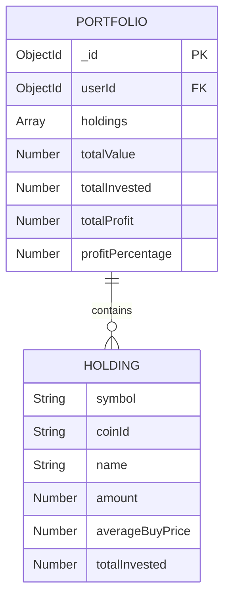
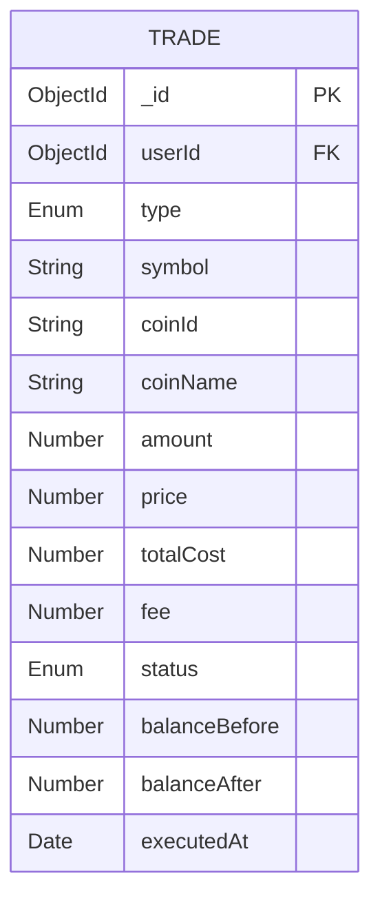
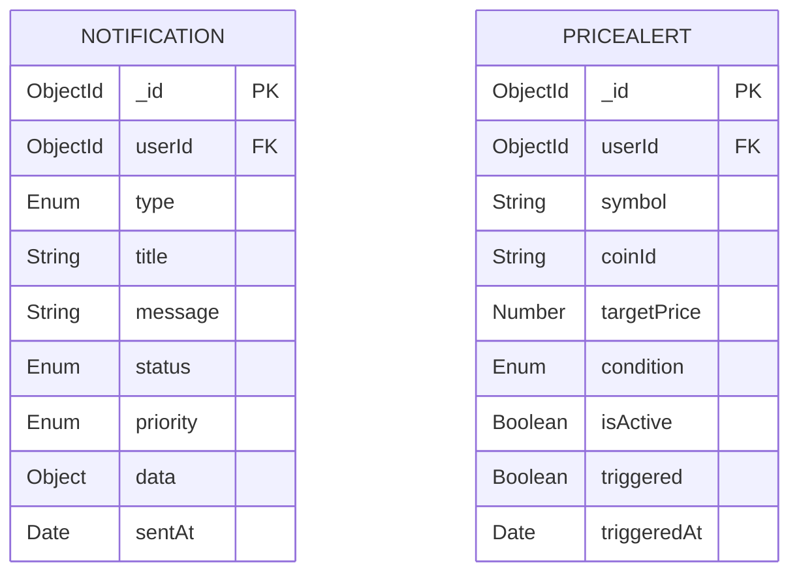
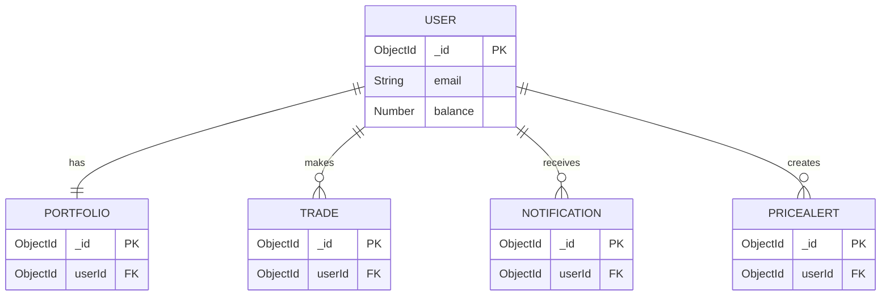

# BÁO CÁO MÔN HỌC
# KIẾN TRÚC HƯỚNG DỊCH VỤ (SOA)

## ĐỀ TÀI: HỆ THỐNG GIAO DỊCH TIỀN ĐIỆN TỬ (CryptoTrading)

---

**Sinh viên thực hiện:** [Họ tên sinh viên]  
**MSSV:** [Mã số sinh viên]  
**Lớp:** [Tên lớp]  
**Giảng viên hướng dẫn:** [Tên giảng viên]

---

# MỤC LỤC

1. [Bài toán](#1-bài-toán)
2. [Phân tích chức năng của hệ thống](#2-phân-tích-chức-năng-của-hệ-thống)
3. [Phân rã chức năng con (dịch vụ)](#3-phân-rã-chức-năng-con-dịch-vụ)
4. [Phân tích và thiết kế dữ liệu](#4-phân-tích-và-thiết-kế-dữ-liệu)
5. [Giao diện của hệ thống](#5-giao-diện-của-hệ-thống)
6. [Kết luận](#6-kết-luận)

---

# 1. BÀI TOÁN

## 1.1. Phát biểu bài toán

Trong bối cảnh thị trường tiền điện tử (cryptocurrency) ngày càng phát triển mạnh mẽ trên toàn cầu, nhu cầu về các nền tảng giao dịch tiền điện tử an toàn, nhanh chóng và dễ sử dụng ngày càng tăng cao. Tuy nhiên, các nền tảng giao dịch hiện tại gặp phải một số vấn đề:

**Các vấn đề hiện tại:**

1. **Hệ thống monolithic khó mở rộng:** Các hệ thống giao dịch truyền thống thường được xây dựng theo kiến trúc monolithic, khiến việc mở rộng quy mô khi lượng người dùng tăng cao trở nên khó khăn và tốn kém.

2. **Khó khăn trong bảo trì và cập nhật:** Khi toàn bộ logic nghiệp vụ nằm trong một ứng dụng duy nhất, việc sửa lỗi hoặc thêm tính năng mới có thể ảnh hưởng đến toàn bộ hệ thống.

3. **Single point of failure:** Nếu một phần của hệ thống gặp sự cố, toàn bộ ứng dụng có thể ngừng hoạt động.

4. **Khó tích hợp với các dịch vụ bên thứ ba:** Việc kết nối với các API cung cấp giá coin, dịch vụ thanh toán, hoặc hệ thống thông báo trở nên phức tạp.

**Giải pháp đề xuất:**

Xây dựng một hệ thống giao dịch tiền điện tử mô phỏng (paper trading) theo **kiến trúc hướng dịch vụ (SOA - Service-Oriented Architecture)**, trong đó:

- Hệ thống được chia thành các dịch vụ độc lập (services), mỗi dịch vụ đảm nhiệm một chức năng nghiệp vụ cụ thể.
- Các dịch vụ giao tiếp với nhau thông qua API Gateway.
- Hệ thống có khả năng mở rộng linh hoạt, dễ bảo trì và có tính sẵn sàng cao.

**Phạm vi bài toán:**

- Hệ thống cho phép người dùng đăng ký, đăng nhập và quản lý tài khoản.
- Người dùng được cấp số dư ảo (1000 USDT) để thực hiện giao dịch mua/bán coin.
- Hệ thống hiển thị giá coin real-time từ API bên ngoài (CoinGecko).
- Người dùng có thể xem danh mục đầu tư, lịch sử giao dịch và lãi/lỗ.
- Hệ thống hỗ trợ thông báo và cảnh báo giá.
- Có chức năng quản trị viên (Admin) để quản lý người dùng.

---

# 2. PHÂN TÍCH CHỨC NĂNG CỦA HỆ THỐNG

## 2.1. Xác định mục tiêu của hệ thống

### Mục tiêu tổng quát:

Xây dựng một nền tảng giao dịch tiền điện tử mô phỏng theo kiến trúc hướng dịch vụ, cho phép người dùng trải nghiệm việc mua bán coin mà không cần sử dụng tiền thật.

### Mục tiêu cụ thể:

| STT | Mục tiêu | Mô tả |
|-----|----------|-------|
| 1 | **Quản lý người dùng** | Cho phép đăng ký, đăng nhập, quản lý profile và số dư ảo |
| 2 | **Cung cấp dữ liệu thị trường** | Hiển thị giá coin real-time, biểu đồ lịch sử giá |
| 3 | **Thực hiện giao dịch** | Cho phép mua/bán coin với giá thực tế từ thị trường |
| 4 | **Quản lý danh mục đầu tư** | Theo dõi holdings, tính toán lãi/lỗ theo thời gian thực |
| 5 | **Ghi nhận lịch sử** | Lưu trữ và hiển thị lịch sử tất cả giao dịch |
| 6 | **Thông báo người dùng** | Gửi thông báo giao dịch, cảnh báo giá |
| 7 | **Quản trị hệ thống** | Cho phép admin quản lý users, xem thống kê |

## 2.2. Yêu cầu chức năng và phi chức năng

### 2.2.1. Yêu cầu chức năng (Functional Requirements)

**A. Chức năng xác thực và người dùng:**

| ID | Chức năng | Mô tả chi tiết |
|----|-----------|----------------|
| FR01 | Đăng ký tài khoản | Người dùng có thể tạo tài khoản với email, mật khẩu và họ tên |
| FR02 | Đăng nhập | Xác thực bằng email và mật khẩu, nhận JWT token |
| FR03 | Xem profile | Hiển thị thông tin cá nhân và số dư hiện tại |
| FR04 | Cập nhật profile | Cho phép thay đổi họ tên |
| FR05 | Xem lịch sử số dư | Hiển thị biến động số dư theo thời gian |

**B. Chức năng thị trường:**

| ID | Chức năng | Mô tả chi tiết |
|----|-----------|----------------|
| FR06 | Xem giá tất cả coins | Hiển thị danh sách coin với giá hiện tại và biến động 24h |
| FR07 | Xem chi tiết coin | Hiển thị thông tin chi tiết và biểu đồ giá của một coin |
| FR08 | Xem biểu đồ lịch sử | Hiển thị chart giá 7 ngày gần nhất |

**C. Chức năng giao dịch:**

| ID | Chức năng | Mô tả chi tiết |
|----|-----------|----------------|
| FR09 | Mua coin | Mua coin với số lượng chỉ định, trừ số dư, cộng holdings |
| FR10 | Bán coin | Bán coin đang sở hữu, cộng số dư, giảm holdings |
| FR11 | Xem lịch sử giao dịch | Hiển thị danh sách giao dịch với bộ lọc và phân trang |

**D. Chức năng danh mục đầu tư:**

| ID | Chức năng | Mô tả chi tiết |
|----|-----------|----------------|
| FR12 | Xem portfolio | Hiển thị holdings với giá hiện tại và P&L |
| FR13 | Tính toán lãi/lỗ | Tự động tính profit dựa trên giá mua trung bình và giá hiện tại |

**E. Chức năng thông báo:**

| ID | Chức năng | Mô tả chi tiết |
|----|-----------|----------------|
| FR14 | Xem thông báo | Hiển thị danh sách thông báo |
| FR15 | Đánh dấu đã đọc | Đánh dấu một hoặc tất cả thông báo đã đọc |
| FR16 | Xóa thông báo | Xóa thông báo không cần thiết |
| FR17 | Tạo cảnh báo giá | Đặt alert khi coin đạt giá mục tiêu |
| FR18 | Quản lý cảnh báo | Xem và xóa các cảnh báo giá đã tạo |

**F. Chức năng quản trị:**

| ID | Chức năng | Mô tả chi tiết |
|----|-----------|----------------|
| FR19 | Xem danh sách user | Admin xem tất cả người dùng |
| FR20 | Khóa/Mở khóa user | Toggle trạng thái active của user |
| FR21 | Reset số dư user | Set lại số dư về 1000 USDT |
| FR22 | Xóa user | Xóa tài khoản người dùng |
| FR23 | Xem thống kê hệ thống | Xem tổng user, tổng số dư, v.v. |

### 2.2.2. Yêu cầu phi chức năng (Non-Functional Requirements)

| ID | Loại | Yêu cầu | Mô tả |
|----|------|---------|-------|
| NFR01 | **Hiệu năng** | Response time < 2s | Thời gian phản hồi API dưới 2 giây |
| NFR02 | **Hiệu năng** | Concurrent users | Hỗ trợ tối thiểu 100 người dùng đồng thời |
| NFR03 | **Bảo mật** | JWT Authentication | Xác thực người dùng bằng JSON Web Token |
| NFR04 | **Bảo mật** | Password hashing | Mã hóa mật khẩu bằng bcrypt |
| NFR05 | **Bảo mật** | Rate limiting | Giới hạn request để chống DDoS |
| NFR06 | **Khả dụng** | 99% uptime | Hệ thống hoạt động ổn định |
| NFR07 | **Khả dụng** | Circuit Breaker | Tự động ngắt kết nối khi service lỗi |
| NFR08 | **Mở rộng** | Horizontal scaling | Có thể mở rộng từng service độc lập |
| NFR09 | **Bảo trì** | Loose coupling | Các service ít phụ thuộc lẫn nhau |
| NFR10 | **Real-time** | WebSocket | Cập nhật dữ liệu real-time |

## 2.3. Biểu đồ chức năng

**Biểu đồ Use Case tổng quan hệ thống:**

```mermaid
flowchart LR
    User((👤 User))
    Admin((👑 Admin))

    User --> A[Xác thực<br/>Đăng ký/Đăng nhập]
    User --> B[Thị trường<br/>Giá coin, Biểu đồ]
    User --> C[Giao dịch<br/>Mua/Bán coin]
    User --> D[Portfolio<br/>Danh mục đầu tư]
    User --> E[Thông báo<br/>Cảnh báo giá]

    Admin -.->|extends| User
    Admin --> F[Quản trị Users<br/>Xem, Khóa, Xóa]
    Admin --> G[Quản trị Balance<br/>Điều chỉnh số dư]
    Admin --> H[Thống kê<br/>Xem stats hệ thống]
```



**Chú thích:**
- **User**: Người dùng thông thường
- **Admin**: Kế thừa tất cả quyền của User (mũi tên đứt `extends`) + có thêm các chức năng quản trị
- Admin có thể: trade, xem portfolio, thông báo... như User + quản lý users, điều chỉnh balance

**Chi tiết các nhóm Use Case:**

| Nhóm | Use Cases | Service | Actor |
|------|-----------|---------|-------|
| **Xác thực** | Đăng ký, Đăng nhập, Profile, Số dư | User Service | User, Admin |
| **Thị trường** | Giá coins, Chi tiết coin, Biểu đồ | Market Service | User, Admin |
| **Giao dịch** | Mua coin, Bán coin, Lịch sử | Trade Orchestration | User, Admin |
| **Portfolio** | Xem holdings, Tính P&L | Portfolio Service | User, Admin |
| **Thông báo** | Xem/Xóa thông báo, Cảnh báo giá | Notification Service | User, Admin |
| **Quản trị Users** | Xem danh sách, Khóa/Mở khóa, Xóa | User Service | **Admin only** |
| **Quản trị Balance** | Điều chỉnh số dư user | User Service | **Admin only** |
| **Thống kê** | Xem thống kê hệ thống | User Service | **Admin only** |

---

# 3. PHÂN RÃ CHỨC NĂNG CON (DỊCH VỤ)

## 3.1. Nguyên tắc phân rã

Hệ thống được phân rã theo nguyên tắc **Single Responsibility Principle (SRP)** - mỗi dịch vụ chỉ đảm nhiệm một trách nhiệm nghiệp vụ duy nhất.

**Các dịch vụ được phân rã:**

| STT | Dịch vụ | Port | Trách nhiệm chính |
|-----|---------|------|-------------------|
| 0 | **API Gateway** | 3000 | Định tuyến, xác thực, orchestration |
| 1 | **User Service** | 3001 | Xác thực, quản lý người dùng, số dư |
| 2 | **Market Service** | 3002 | Dữ liệu giá coin từ API bên ngoài |
| 3 | **Portfolio Service** | 3003 | Quản lý danh mục đầu tư |
| 4 | **Trade Service** | 3004 | Ghi nhận lịch sử giao dịch |
| 5 | **Notification Service** | 3005 | Thông báo và cảnh báo giá |

**Sơ đồ kiến trúc hệ thống SOA:**

```mermaid
flowchart TB
    subgraph Client["🖥️ Client Layer"]
        FE[React Frontend<br/>Port 5173]
    end

    subgraph Gateway["🚪 API Gateway Layer"]
        GW[API Gateway<br/>Port 3000<br/>Routing, Auth, Rate Limiting]
    end

    subgraph Services["⚙️ Service Layer"]
        US[User Service<br/>Port 3001]
        MS[Market Service<br/>Port 3002]
        PS[Portfolio Service<br/>Port 3003]
        TS[Trade Service<br/>Port 3004]
        NS[Notification Service<br/>Port 3005]
    end

    subgraph External["🌐 External"]
        CG[CoinGecko API]
    end

    subgraph Data["💾 Shared Database"]
        DB[(MongoDB<br/>Shared Database)]
    end

    subgraph Discovery["🔍 Service Discovery"]
        CS[Consul]
    end

    FE <-->|HTTP/WebSocket| GW
    GW <--> US
    GW <--> MS
    GW <--> PS
    GW <--> TS
    GW <--> NS
    
    MS <-->|API Call| CG
    
    US --> DB
    PS --> DB
    TS --> DB
    NS --> DB

    US -.->|Register| CS
    MS -.->|Register| CS
    PS -.->|Register| CS
    TS -.->|Register| CS
    NS -.->|Register| CS
    GW -.->|Discover| CS
```



**Đặc điểm kiến trúc SOA:**

| Đặc điểm | Mô tả |
|----------|-------|
| **Shared Database** | Tất cả services kết nối cùng một MongoDB instance |
| **Service Discovery** | Consul quản lý đăng ký và khám phá services |
| **API Gateway** | Single entry point, xử lý routing và authentication |
| **Loose Coupling** | Services giao tiếp qua HTTP REST APIs |
| **Orchestration** | API Gateway điều phối giao dịch Buy/Sell |

## 3.2. Mô tả chi tiết từng dịch vụ

### 3.2.1. API Gateway

**Mục đích:** Là điểm vào duy nhất (single entry point) cho tất cả các request từ client.

**Chức năng chính:**

| Chức năng | Mô tả |
|-----------|-------|
| **Routing** | Định tuyến request đến đúng service |
| **Authentication** | Xác thực JWT token |
| **Rate Limiting** | Giới hạn số request (1000/15 phút) |
| **Orchestration** | Điều phối các service cho giao dịch buy/sell |
| **WebSocket** | Quản lý kết nối real-time |

**Công nghệ:** Express.js, http-proxy-middleware, Socket.IO

---

### 3.2.2. User Service

**Mục đích:** Quản lý toàn bộ thông tin người dùng và xác thực.

**Endpoints:**

| Method | Endpoint | Mô tả |
|--------|----------|-------|
| POST | /register | Đăng ký tài khoản mới |
| POST | /login | Đăng nhập, nhận JWT token |
| GET | /profile | Lấy thông tin profile |
| PUT | /profile | Cập nhật profile |
| GET | /balance | Lấy số dư hiện tại |
| PUT | /balance | Cập nhật số dư (internal) |
| GET | /admin/users | [Admin] Danh sách users |
| GET | /admin/stats | [Admin] Thống kê hệ thống |
| PUT | /admin/users/:id/toggle | [Admin] Khóa/Mở khóa user |
| PUT | /admin/users/:id/balance | [Admin] Reset số dư |
| DELETE | /admin/users/:id | [Admin] Xóa user |

**Database:** MongoDB - Collection `users`

**Công nghệ:** Express.js, bcryptjs, jsonwebtoken, Mongoose

---

### 3.2.3. Market Service

**Mục đích:** Cung cấp dữ liệu giá coin real-time từ API bên ngoài.

**Endpoints:**

| Method | Endpoint | Mô tả |
|--------|----------|-------|
| GET | /prices | Giá tất cả coins hỗ trợ |
| GET | /price/:coinId | Giá chi tiết một coin |
| GET | /chart/:coinId | Dữ liệu biểu đồ 7 ngày |

**Nguồn dữ liệu:** CoinGecko API (Primary), CoinPaprika API (Fallback)

**Caching:** NodeCache với TTL 2 phút để giảm API calls

**Công nghệ:** Express.js, axios, node-cache

---

### 3.2.4. Portfolio Service

**Mục đích:** Quản lý danh mục đầu tư của người dùng.

**Endpoints:**

| Method | Endpoint | Mô tả |
|--------|----------|-------|
| GET | / | Lấy portfolio của user |
| POST | /holding | Thêm coin vào portfolio (internal) |
| PUT | /holding | Giảm/Xóa coin khỏi portfolio (internal) |

**Logic nghiệp vụ:**

- **DCA (Dollar Cost Averaging):** Khi mua thêm coin đã có, tính lại giá mua trung bình
  ```
  averageBuyPrice = totalInvested / totalAmount
  ```

- **Profit Calculation:**
  ```
  profit = currentValue - totalInvested
  profitPercentage = (profit / totalInvested) × 100
  ```

**Database:** MongoDB - Collection `portfolios`

**Công nghệ:** Express.js, Mongoose

---

### 3.2.5. Trade Service

**Mục đích:** Ghi nhận lịch sử tất cả giao dịch.

**Endpoints:**

| Method | Endpoint | Mô tả |
|--------|----------|-------|
| POST | / | Tạo record giao dịch mới |
| GET | /history | Lịch sử giao dịch với filter |

**Lưu ý:** Trade Service KHÔNG thực hiện logic mua/bán. Logic đó được xử lý bởi **Trade Orchestration** ở API Gateway.

**Database:** MongoDB - Collection `trades`

**Công nghệ:** Express.js, Mongoose

---

### 3.2.6. Notification Service

**Mục đích:** Quản lý thông báo và cảnh báo giá.

**Endpoints:**

| Method | Endpoint | Mô tả |
|--------|----------|-------|
| GET | / | Danh sách thông báo |
| GET | /unread-count | Số thông báo chưa đọc |
| POST | /send | Gửi thông báo (internal) |
| PUT | /:id/read | Đánh dấu đã đọc |
| PUT | /read-all | Đánh dấu tất cả đã đọc |
| DELETE | /:id | Xóa thông báo |
| POST | /alert | Tạo cảnh báo giá |
| GET | /alerts | Danh sách cảnh báo |
| DELETE | /alert/:id | Xóa cảnh báo |

**Cron Job:** Kiểm tra giá mỗi 1 phút, trigger alert khi đạt điều kiện

**Database:** MongoDB - Collections `notifications`, `pricealerts`

**Công nghệ:** Express.js, Mongoose, node-cron

---

## 3.3. Trade Orchestration (Chi tiết)

**Mục đích:** Điều phối nhiều services để thực hiện một giao dịch hoàn chỉnh.

### 3.3.1. Luồng mua coin (Buy Flow)

```
BƯỚC 1: Lấy giá hiện tại từ Market Service
        → Tính toán: totalCost = amount × price
        → Tính phí: fee = totalCost × 0.1%
        → finalCost = totalCost + fee

BƯỚC 2: Kiểm tra số dư từ User Service
        → Nếu balance < finalCost → Báo lỗi

BƯỚC 3: Trừ số dư (User Service)
        → balance = balance - finalCost
        → Lưu transactionState.balanceDeducted = true

BƯỚC 4: Thêm vào portfolio (Portfolio Service)
        → Nếu đã có coin: tính DCA
        → Nếu chưa có: tạo mới
        → Lưu transactionState.holdingAdded = true

BƯỚC 5: Ghi lịch sử (Trade Service)
        → Tạo trade record

BƯỚC 6: Gửi thông báo (Notification Service)
        → Tạo notification "Mua thành công"

BƯỚC 7: Phát WebSocket event
        → Emit 'trade_confirmation' cho user

NẾU LỖI: ROLLBACK
        → Nếu holdingAdded: Xóa holding
        → Nếu balanceDeducted: Hoàn tiền
```

**Sequence Diagram - Buy Flow:**


### 3.3.2. Luồng bán coin (Sell Flow)

```
BƯỚC 1: Kiểm tra portfolio (Portfolio Service)
        → Nếu không đủ coin → Báo lỗi

BƯỚC 2: Lấy giá hiện tại từ Market Service
        → Tính toán: totalValue = amount × price
        → Tính phí: fee = totalValue × 0.1%
        → finalProceeds = totalValue - fee

BƯỚC 3: Lấy số dư hiện tại (User Service)

BƯỚC 4: Cộng số dư (User Service)
        → balance = balance + finalProceeds
        → Lưu transactionState.balanceAdded = true

BƯỚC 5: Giảm holdings (Portfolio Service)
        → Nếu bán hết: xóa holding
        → Nếu bán một phần: giảm amount
        → Lưu transactionState.holdingReduced = true

BƯỚC 6: Ghi lịch sử (Trade Service)

BƯỚC 7: Gửi thông báo + WebSocket

NẾU LỖI: ROLLBACK
        → Nếu holdingReduced: Hoàn lại holding
        → Nếu balanceAdded: Trừ số dư
```

**Sequence Diagram - Sell Flow:**

```mermaid
sequenceDiagram
    participant C as Client
    participant GW as API Gateway
    participant PS as Portfolio Service
    participant MS as Market Service
    participant US as User Service
    participant TS as Trade Service
    participant NS as Notification Service

    C->>GW: POST /trade/sell {symbol, amount}
    GW->>PS: GET / (kiểm tra holdings)
    PS-->>GW: {holdings}
    
    alt Không đủ coin
        GW-->>C: ❌ Không đủ coin để bán
    else Đủ coin
        GW->>MS: GET /price/:coinId
        MS-->>GW: {price}
        
        Note over GW: Tính: totalValue = amount × price<br/>fee = 0.1%, finalProceeds = totalValue - fee

        GW->>US: PUT /balance (cộng tiền)
        US-->>GW: ✓ Balance updated
        
        GW->>PS: PUT /holding (giảm coin)
        PS-->>GW: ✓ Holding reduced
        
        GW->>TS: POST / (ghi lịch sử)
        TS-->>GW: ✓ Trade recorded
        
        GW->>NS: POST /send (thông báo)
        NS-->>GW: ✓ Notification sent
        
        GW-->>C: ✅ Bán thành công
    end
```



---

## 3.4. Biểu đồ luồng dữ liệu

### 3.4.1. Luồng xác thực (Authentication Flow)

```
┌─────────┐         ┌─────────────┐         ┌──────────────┐
│ Client  │ ──1──▶  │ API Gateway │ ──2──▶  │ User Service │
│         │         │             │         │              │
│         │ ◀──4──  │             │ ◀──3──  │              │
└─────────┘         └─────────────┘         └──────────────┘

1. POST /login {email, password}
2. Forward to User Service
3. Verify password, generate JWT
4. Return {token, user}
```

**DFD Level 0 - Authentication:**

```mermaid
flowchart LR
    U((User)) -->|email, password| P1[1.0<br/>Xác thực]
    P1 -->|query| D1[(users)]
    D1 -->|user data| P1
    P1 -->|JWT token + user info| U
```



### 3.4.2. Luồng xem portfolio (Portfolio Flow)

```
┌─────────┐         ┌─────────────┐         ┌───────────────────┐
│ Client  │ ──1──▶  │ API Gateway │ ──2──▶  │ Portfolio Service │
│         │         │ (Orchestr.) │         │                   │
│         │         │      │      │ ◀──3──  │                   │
│         │         │      │      │         └───────────────────┘
│         │         │      │      │
│         │         │      ▼      │         ┌────────────────┐
│         │         │    ──4──────│──────▶  │ Market Service │
│         │         │      │      │         │                │
│         │         │      │ ◀──5─│─────────│                │
│         │ ◀──6──  │      ▼      │         └────────────────┘
└─────────┘         └─────────────┘

1. GET /portfolio
2. Get holdings from Portfolio Service
3. Return holdings list
4. Get current prices for each coin
5. Return prices
6. Return enriched portfolio with P&L
```

**DFD Level 0 - Portfolio:**

```mermaid
flowchart LR
    U((User)) -->|request| P1[1.0<br/>Lấy Portfolio]
    P1 -->|query holdings| D1[(portfolios)]
    D1 -->|holdings| P1
    P1 -->|get prices| P2[2.0<br/>Lấy giá]
    P2 -->|API call| E1[CoinGecko]
    E1 -->|prices| P2
    P2 -->|prices| P1
    P1 -->|portfolio + P&L| U
```



### 3.4.3. Luồng giao dịch (Trade Flow)

**DFD Level 1 - Trade Flow (Buy):**


---

# 4. PHÂN TÍCH VÀ THIẾT KẾ DỮ LIỆU

## 4.1. Mô hình thực thể liên kết (ERD)

### 4.1.1. User Service - Entity: User


**Thuộc tính:**

| Thuộc tính | Kiểu | Ràng buộc | Mô tả |
|------------|------|-----------|-------|
| _id | ObjectId | PK | Khóa chính |
| email | String | Unique, Required | Email đăng nhập |
| password | String | Required | Mật khẩu đã mã hóa |
| fullName | String | Required | Họ tên đầy đủ |
| role | Enum | Default: 'user' | Vai trò: user/admin |
| balance | Number | Default: 1000 | Số dư USDT |
| isActive | Boolean | Default: true | Trạng thái tài khoản |
| balanceHistory | Array | - | Lịch sử biến động số dư |
| createdAt | Date | Auto | Ngày tạo |
| updatedAt | Date | Auto | Ngày cập nhật |

---

### 4.1.2. Portfolio Service - Entity: Portfolio



**Thuộc tính:**

| Thuộc tính | Kiểu | Ràng buộc | Mô tả |
|------------|------|-----------|-------|
| _id | ObjectId | PK | Khóa chính |
| userId | ObjectId | FK, Unique | Liên kết đến User |
| holdings | Array | - | Danh sách coin sở hữu |
| totalValue | Number | Default: 0 | Tổng giá trị portfolio |
| totalInvested | Number | Default: 0 | Tổng chi phí đầu tư |
| totalProfit | Number | Default: 0 | Tổng lãi/lỗ |
| profitPercentage | Number | Default: 0 | Phần trăm lãi/lỗ |

**Cấu trúc Holding:**

| Thuộc tính | Kiểu | Mô tả |
|------------|------|-------|
| symbol | String | Ký hiệu coin (BTC, ETH) |
| coinId | String | ID coin (bitcoin, ethereum) |
| name | String | Tên đầy đủ |
| amount | Number | Số lượng coin |
| averageBuyPrice | Number | Giá mua trung bình |
| totalInvested | Number | Tổng chi phí |

---

### 4.1.3. Trade Service - Entity: Trade



**Thuộc tính:**

| Thuộc tính | Kiểu | Ràng buộc | Mô tả |
|------------|------|-----------|-------|
| _id | ObjectId | PK | Khóa chính |
| userId | ObjectId | FK, Required | Liên kết đến User |
| type | Enum | Required | Loại: buy/sell |
| symbol | String | Required | Ký hiệu coin |
| coinId | String | Required | ID coin |
| coinName | String | Required | Tên coin |
| amount | Number | Required | Số lượng |
| price | Number | Required | Giá tại thời điểm giao dịch |
| totalCost | Number | Required | Tổng giá trị |
| fee | Number | Default: 0 | Phí giao dịch |
| feePercentage | Number | Default: 0.1 | Phần trăm phí |
| status | Enum | Default: 'completed' | Trạng thái |
| balanceBefore | Number | Required | Số dư trước giao dịch |
| balanceAfter | Number | Required | Số dư sau giao dịch |
| executedAt | Date | Default: now | Thời điểm thực hiện |

---

### 4.1.4. Notification Service - Entities



**Entity 1: Notification**

| Thuộc tính | Kiểu | Mô tả |
|------------|------|-------|
| _id | ObjectId | Khóa chính |
| userId | ObjectId | Liên kết đến User |
| type | Enum | trade/price_alert/system/warning |
| title | String | Tiêu đề thông báo |
| message | String | Nội dung |
| status | Enum | unread/read/archived |
| priority | Enum | low/medium/high/urgent |
| data | Object | Dữ liệu bổ sung |
| sentAt | Date | Thời điểm gửi |

**Entity 2: PriceAlert**

| Thuộc tính | Kiểu | Mô tả |
|------------|------|-------|
| _id | ObjectId | Khóa chính |
| userId | ObjectId | Liên kết đến User |
| symbol | String | Ký hiệu coin |
| coinId | String | ID coin |
| targetPrice | Number | Giá mục tiêu |
| condition | Enum | above/below |
| isActive | Boolean | Còn hoạt động không |
| triggered | Boolean | Đã trigger chưa |
| triggeredAt | Date | Thời điểm trigger |

---

## 4.2. Mô hình quan hệ

**Sơ đồ quan hệ giữa các collections:**



**Mô tả quan hệ:**

```
┌──────────────────┐
│      users       │
│   (User Service) │
└────────┬─────────┘
         │
         │ 1:1
         ▼
┌──────────────────┐
│   portfolios     │
│(Portfolio Service)│
└──────────────────┘
         │
         │ 1:N
         ▼
┌──────────────────┐     ┌──────────────────┐
│     trades       │     │  notifications   │
│ (Trade Service)  │     │(Notif. Service)  │
└──────────────────┘     └──────────────────┘
                                  │
                                  │ 1:N
                                  ▼
                         ┌──────────────────┐
                         │   pricealerts    │
                         │(Notif. Service)  │
                         └──────────────────┘
```

| Quan hệ | Mô tả |
|---------|-------|
| User → Portfolio | 1:1 - Mỗi user có đúng 1 portfolio |
| User → Trades | 1:N - Mỗi user có nhiều giao dịch |
| User → Notifications | 1:N - Mỗi user có nhiều thông báo |
| User → PriceAlerts | 1:N - Mỗi user có nhiều cảnh báo |

---

## 4.3. Bảng dữ liệu (Sample Data)

### Bảng users

| _id | email | fullName | role | balance | isActive |
|-----|-------|----------|------|---------|----------|
| 64a1b2c3d4e5f6a7b8c9d0e1 | user@example.com | Nguyễn Văn A | user | 850.50 | true |
| 64a1b2c3d4e5f6a7b8c9d0e2 | admin@example.com | Admin | admin | 1000.00 | true |

### Bảng portfolios

| _id | userId | holdings | totalValue | totalInvested | totalProfit |
|-----|--------|----------|------------|---------------|-------------|
| 64a... | 64a1b2...d0e1 | [{symbol: "BTC", amount: 0.001, averageBuyPrice: 75000}] | 76.50 | 75.00 | 1.50 |

### Bảng trades

| _id | userId | type | symbol | amount | price | totalCost | executedAt |
|-----|--------|------|--------|--------|-------|-----------|------------|
| 64a... | 64a1b2...d0e1 | buy | BTC | 0.001 | 75000 | 75.075 | 2024-01-01 10:30:00 |
| 64a... | 64a1b2...d0e1 | sell | ETH | 0.5 | 4200 | 2100 | 2024-01-02 14:15:00 |

---

# 5. GIAO DIỆN CỦA HỆ THỐNG

## 5.1. Giao diện API cho từng dịch vụ

### 5.1.1. Chuẩn API Response

**Success Response:**
```json
{
  "success": true,
  "data": { ... },
  "message": "Thao tác thành công"
}
```

**Error Response:**
```json
{
  "success": false,
  "message": "Mô tả lỗi",
  "error": "Chi tiết lỗi (nếu có)"
}
```

### 5.1.2. Authentication Header

```
Authorization: Bearer <JWT_TOKEN>
```

### 5.1.3. Danh sách API Endpoints

**BASE URL:** `http://localhost:3000/api`

| Service | Method | Endpoint | Auth | Mô tả |
|---------|--------|----------|------|-------|
| **User** | POST | /users/register | ❌ | Đăng ký |
| | POST | /users/login | ❌ | Đăng nhập |
| | GET | /users/profile | ✅ | Lấy profile |
| | PUT | /users/profile | ✅ | Cập nhật profile |
| | GET | /users/balance | ✅ | Lấy số dư |
| **Market** | GET | /market/prices | ✅ | Giá tất cả coins |
| | GET | /market/price/:coinId | ✅ | Giá một coin |
| | GET | /market/chart/:coinId | ✅ | Dữ liệu chart |
| **Trade** | POST | /trade/buy | ✅ | Mua coin |
| | POST | /trade/sell | ✅ | Bán coin |
| | GET | /trade/history | ✅ | Lịch sử giao dịch |
| **Portfolio** | GET | /portfolio | ✅ | Xem portfolio |
| **Notification** | GET | /notifications | ✅ | Danh sách thông báo |
| | PUT | /notifications/:id/read | ✅ | Đánh dấu đã đọc |
| | POST | /notifications/alert | ✅ | Tạo cảnh báo giá |
| **Admin** | GET | /users/admin/users | ✅ Admin | Danh sách users |
| | PUT | /users/admin/users/:id/toggle | ✅ Admin | Khóa/Mở user |

### 5.1.4. Chi tiết API Request/Response

**POST /users/login**

Request:
```json
{
  "email": "user@example.com",
  "password": "123456"
}
```

Response (200):
```json
{
  "success": true,
  "data": {
    "user": {
      "_id": "64a1b2c3d4e5f6a7b8c9d0e1",
      "email": "user@example.com",
      "fullName": "Nguyễn Văn A",
      "balance": 1000,
      "role": "user"
    },
    "token": "eyJhbGciOiJIUzI1NiIsInR5cCI6IkpXVCJ9..."
  }
}
```

**POST /trade/buy**

Request:
```json
{
  "symbol": "BTC",
  "coinId": "bitcoin",
  "amount": 0.001
}
```

Response (200):
```json
{
  "success": true,
  "data": {
    "trade": {
      "_id": "64a...",
      "type": "buy",
      "symbol": "BTC",
      "amount": 0.001,
      "price": 75000,
      "totalCost": 75.075,
      "fee": 0.075,
      "status": "completed"
    },
    "newBalance": 924.925
  },
  "message": "Mua BTC thành công"
}
```

---

## 5.2. Giao diện người dùng (Web)

**Công nghệ sử dụng:**
- **Framework:** React 18 + Vite
- **Styling:** TailwindCSS
- **Charts:** Recharts
- **Icons:** Lucide React
- **HTTP Client:** Axios
- **Real-time:** Socket.IO Client

### 5.2.1. Danh sách màn hình

| STT | Trang | Route | Mô tả |
|-----|-------|-------|-------|
| 1 | Đăng nhập/Đăng ký | /auth | Form login/register |
| 2 | Dashboard | /dashboard | Tổng quan, giá coins |
| 3 | Giao dịch | /trade | Form mua/bán coin |
| 4 | Chi tiết Coin | /coin/:id | Thông tin và chart |
| 5 | Portfolio | /portfolio | Danh mục đầu tư |
| 6 | Lịch sử | /history | Lịch sử giao dịch |
| 7 | Thông báo | /notifications | Danh sách thông báo |
| 8 | Cài đặt | /settings | Profile, cảnh báo giá |
| 9 | Admin | /admin | Quản lý users (Admin) |

### 5.2.2. Wireframe/Mockup

**[CHỪA TRỐNG - Chèn screenshot hoặc mockup các màn hình]**

**Màn hình Dashboard:**
- Hiển thị số dư hiện tại
- Bảng giá coins real-time
- Tóm tắt portfolio
- Chart xu hướng giá

**Màn hình Trade:**
- Chọn coin để giao dịch
- Tab Buy/Sell
- Nhập số tiền USDT hoặc số lượng coin
- Preview tổng chi phí và phí

**Màn hình Portfolio:**
- Biểu đồ tròn phân bổ
- Bảng holdings với P&L
- Tổng lãi/lỗ

---

# 6. KẾT LUẬN

## 6.1. Kết quả đạt được

### Về mặt kiến trúc:

1. **Áp dụng thành công kiến trúc SOA:** Hệ thống được chia thành 5 services độc lập sử dụng chung database, mỗi service có trách nhiệm rõ ràng và có thể phát triển, triển khai riêng biệt.

2. **API Gateway Pattern:** Triển khai một điểm vào duy nhất giúp đơn giản hóa việc giao tiếp giữa client và các services, đồng thời tập trung xử lý cross-cutting concerns (authentication, rate limiting).

3. **Orchestration Pattern:** Sử dụng orchestrator tại API Gateway để điều phối các giao dịch phức tạp cần nhiều services, đảm bảo tính toàn vẹn dữ liệu.

4. **Circuit Breaker Pattern:** Tích hợp Opossum để ngăn chặn cascading failures khi một service gặp sự cố.

5. **Service Discovery:** Sử dụng Consul cho việc đăng ký và khám phá services động.

### Về mặt chức năng:

1. **Hoàn thành 30 REST API endpoints** phục vụ đầy đủ các chức năng nghiệp vụ.

2. **Real-time communication** với 4 WebSocket events cho giao dịch và thông báo.

3. **Giao diện người dùng** trực quan với 9 trang chức năng.

4. **Hệ thống Admin** cho phép quản lý người dùng.

## 6.2. Ưu điểm của kiến trúc SOA áp dụng

| Ưu điểm | Mô tả |
|---------|-------|
| **Loose Coupling** | Các services độc lập, thay đổi một service không ảnh hưởng đến service khác |
| **Scalability** | Có thể scale từng service riêng biệt theo nhu cầu |
| **Fault Isolation** | Lỗi ở một service không làm sập toàn hệ thống |
| **Technology Diversity** | Mỗi service có thể sử dụng công nghệ phù hợp |
| **Team Independence** | Các team có thể phát triển song song |
| **Reusability** | Services có thể tái sử dụng cho các ứng dụng khác |

## 6.3. Hạn chế và hướng phát triển

### Hạn chế:

1. **Complexity:** Kiến trúc SOA phức tạp hơn monolithic, đòi hỏi kiến thức về distributed systems.

2. **Network Latency:** Giao tiếp giữa các services qua HTTP có độ trễ cao hơn in-process calls.

3. **Data Consistency:** Với các services sử dụng chung database, cần đảm bảo tính nhất quán dữ liệu khi có nhiều transactions.

4. **Monitoring:** Cần công cụ logging và monitoring tập trung để theo dõi hệ thống.

### Hướng phát triển:

1. **Event-Driven Architecture:** Sử dụng message queue (RabbitMQ, Kafka) thay vì HTTP calls để tăng tính resilience.

2. **Kubernetes Deployment:** Containerize services với Docker và orchestrate bằng Kubernetes.

3. **Centralized Logging:** Tích hợp ELK Stack (Elasticsearch, Logstash, Kibana) cho logging.

4. **API Documentation:** Sử dụng Swagger/OpenAPI cho documentation tự động.

5. **Testing:** Bổ sung unit tests, integration tests và contract tests.

6. **Security:** Implement OAuth 2.0, HTTPS, và API key management.

## 6.4. Bài học kinh nghiệm

1. **Design API trước:** Thiết kế API contract trước khi implement giúp các services phát triển song song.

2. **Circuit Breaker là bắt buộc:** Trong distributed system, phải có cơ chế xử lý khi service downstream fail.

3. **Logging là quan trọng:** Không có logs tập trung, debug các services rất khó khăn.

4. **Rollback mechanism:** Với các transaction liên quan nhiều services, cần có chiến lược rollback rõ ràng.

5. **Cache giúp giảm tải:** Caching ở Market Service giúp giảm đáng kể API calls đến CoinGecko.

---

# PHỤ LỤC

## A. Công nghệ sử dụng

| Layer | Công nghệ |
|-------|-----------|
| **Frontend** | React 18, Vite, TailwindCSS, Recharts, Axios, Socket.IO Client |
| **API Gateway** | Express.js, http-proxy-middleware, Socket.IO |
| **Backend Services** | Node.js, Express.js, Mongoose |
| **Database** | MongoDB |
| **Authentication** | JWT, bcryptjs |
| **External APIs** | CoinGecko, CoinPaprika |
| **Patterns** | Circuit Breaker (Opossum), Service Discovery (Consul) |

## B. Cấu trúc thư mục

```
CryptoTradingSOA/
├── frontend/
│   └── src/
│       ├── pages/          # 9 trang
│       ├── components/     # UI components
│       ├── services/       # API, WebSocket
│       └── context/        # Auth context
│
└── backend/
    ├── api-gateway/
    │   ├── server.js
    │   └── orchestration/
    ├── services/
    │   ├── user-service/
    │   ├── market-service/
    │   ├── portfolio-service/
    │   ├── trade-service/
    │   └── notification-service/
    └── shared/
        ├── config/
        ├── middleware/
        └── utils/
```

## C. Hướng dẫn cài đặt và chạy

```bash
# 1. Clone repository
git clone <repo-url>

# 2. Cài đặt dependencies
cd backend && npm install
cd ../frontend && npm install

# 3. Tạo file .env (copy từ .env.example)

# 4. Chạy MongoDB và Consul

# 5. Chạy backend
cd backend
.\start-all-services.ps1

# 6. Chạy frontend
cd frontend
npm run dev
```

---

**[HẾT BÁO CÁO]**
