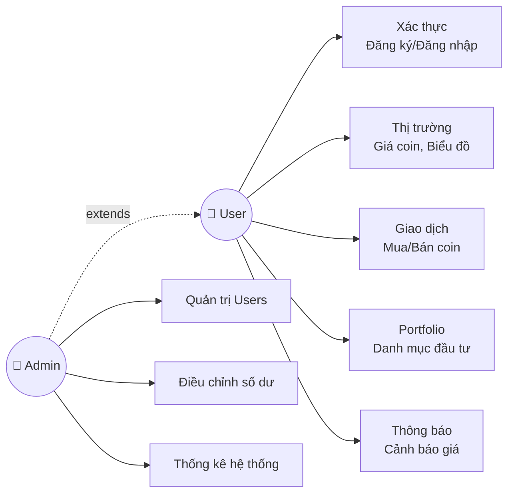
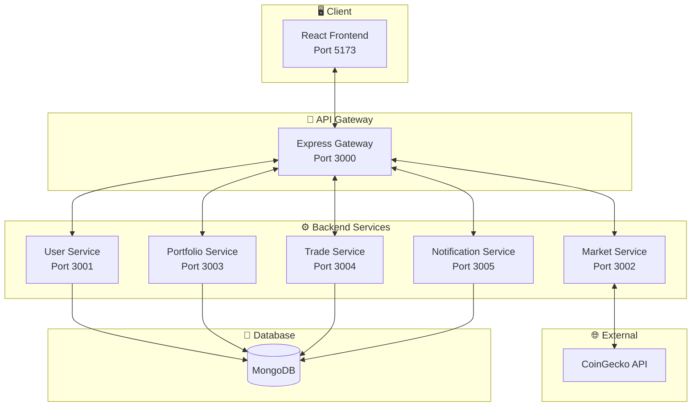
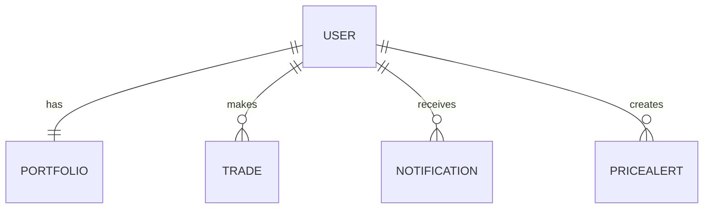
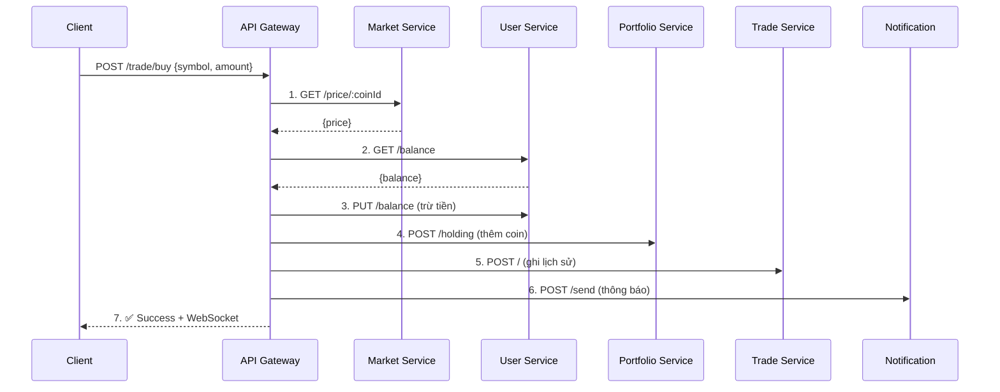

# TRƯỜNG ĐẠI HỌC QUY NHƠN
# KHOA CÔNG NGHỆ THÔNG TIN

---

# BÁO CÁO CÔNG NGHỆ WEB

## HỆ THỐNG QUẢN LÝ DANH MỤC VÀ GIAO DỊCH ẢO CRYPTO

**(Năm học 2024 – 2025)**

---

**NHÓM SINH VIÊN:**
- ĐOÀN THẾ TÍN

**NGÀNH & KHÓA:** CNTT K45

---

# BẢNG TỔNG HỢP ĐÓNG GÓP CÁ NHÂN

## Đoàn Thế Tín

| STT | Module / Chức năng đã làm | Công nghệ sử dụng | Mức độ tự làm |
|-----|---------------------------|-------------------|---------------|
| 1 | Thiết kế kiến trúc SOA và API Gateway | Node.js, Express.js, Consul | ☑ 100% |
| 2 | User Service (Auth, Profile, Admin) | Express.js, MongoDB, JWT, bcrypt | ☑ 100% |
| 3 | Market Service (Giá coin, Chart) | Express.js, CoinGecko API, node-cache | ☑ 100% |
| 4 | Portfolio Service (Danh mục đầu tư) | Express.js, MongoDB, Mongoose | ☑ 100% |
| 5 | Trade Service + Orchestration (Mua/Bán coin) | Express.js, Opossum (Circuit Breaker) | ☑ 100% |
| 6 | Notification Service (Thông báo, Cảnh báo giá) | Express.js, MongoDB, node-cron | ☑ 100% |
| 7 | Frontend (React + Vite) | React 18, Vite, Axios, Socket.IO | ☑ 100% |
| 8 | Giao diện UI/UX | TailwindCSS, Recharts, Lucide Icons | ☑ 100% |

---

## Bảng đánh giá chéo

| Thành viên | Đóng góp (%) | Nhận xét ngắn |
|------------|--------------|---------------|
| Đoàn Thế Tín | 100% | Hoàn thành toàn bộ hệ thống SOA 5 services + Frontend |

---

# MỤC LỤC

1. [Giới thiệu đề tài](#1-giới-thiệu-đề-tài)
   - 1.1. Giới thiệu chung
   - 1.2. Ứng dụng thực tế
2. [Những nội dung thực hiện](#2-những-nội-dung-thực-hiện)
   - 2.1. Trình bày bài toán
   - 2.2. Lựa chọn công nghệ, tổ chức và giải quyết bài toán
   - 2.3. Một số chức năng chính
3. [Đánh giá](#3-đánh-giá)
   - 3.1. Kết quả đạt được
   - 3.2. Hạn chế và hướng phát triển
4. [Tài liệu tham khảo](#4-tài-liệu-tham-khảo)

---

# 1. Giới thiệu đề tài

## 1.1. Giới thiệu chung

Thị trường tiền điện tử (cryptocurrency) đang phát triển mạnh mẽ với hàng triệu người tham gia giao dịch mỗi ngày. Tuy nhiên, việc giao dịch thật với tiền thật có rủi ro cao cho người mới bắt đầu.

**Đề tài** xây dựng một **hệ thống giao dịch tiền điện tử mô phỏng (paper trading)** theo **kiến trúc hướng dịch vụ (SOA)**, cho phép người dùng:
- Trải nghiệm mua/bán coin với tiền ảo (1000 USDT)
- Theo dõi giá coin real-time từ thị trường thực
- Quản lý danh mục đầu tư và xem lãi/lỗ
- Nhận thông báo và cảnh báo giá

**Lý do chọn đề tài:**
- Nhu cầu thực tế về nền tảng học giao dịch crypto an toàn
- Áp dụng kiến trúc SOA - xu hướng phát triển phần mềm hiện đại
- Kết hợp nhiều công nghệ web: React, Node.js, MongoDB, WebSocket

## 1.2. Ứng dụng thực tế

| Đối tượng | Ứng dụng |
|-----------|----------|
| **Người mới** | Học cách giao dịch crypto mà không mất tiền thật |
| **Nhà đầu tư** | Test chiến lược trading trước khi áp dụng thực tế |
| **Sinh viên** | Mô hình học tập về kiến trúc SOA và web development |
| **Doanh nghiệp** | Tham khảo để xây dựng sàn giao dịch thực |

---

# 2. Những nội dung thực hiện

## 2.1. Trình bày bài toán

### 2.1.1. Các tác nhân sử dụng

| Tác nhân | Mô tả | Chức năng chính |
|----------|-------|-----------------|
| **User** | Người dùng thông thường | Đăng ký, đăng nhập, mua/bán coin, xem portfolio |
| **Admin** | Quản trị viên | Tất cả quyền của User + quản lý users, điều chỉnh số dư |

### 2.1.2. Các chức năng theo tác nhân

**User:**
- Đăng ký / Đăng nhập tài khoản
- Xem giá coin real-time và biểu đồ
- Mua / Bán coin với tiền ảo
- Xem danh mục đầu tư và lãi/lỗ
- Xem lịch sử giao dịch
- Nhận thông báo và đặt cảnh báo giá

**Admin** (ngoài quyền User):
- Xem danh sách tất cả users
- Khóa / Mở khóa tài khoản
- Điều chỉnh số dư user (+/-)
- Xóa tài khoản user
- Xem thống kê hệ thống

### 2.1.3. Biểu đồ Use Case

---

## 2.2. Lựa chọn công nghệ, tổ chức và giải quyết bài toán

### 2.2.1. Công nghệ sử dụng

| Layer | Công nghệ | Lý do lựa chọn |
|-------|-----------|----------------|
| **Frontend** | React 18 + Vite | SPA nhanh, component-based |
| **Styling** | TailwindCSS | Utility-first, responsive dễ dàng |
| **Charts** | Recharts | Tương thích React, dễ tùy chỉnh |
| **API Gateway** | Express.js | Lightweight, middleware ecosystem |
| **Backend Services** | Node.js + Express | Non-blocking I/O, phù hợp real-time |
| **Database** | MongoDB | Document-based, flexible schema |
| **Authentication** | JWT + bcrypt | Stateless, bảo mật |
| **Real-time** | Socket.IO | WebSocket abstraction |
| **External API** | CoinGecko | Free tier, dữ liệu chính xác |
| **Service Discovery** | Consul | Dynamic service registration |
| **Circuit Breaker** | Opossum | Fault tolerance |

### 2.2.2. Kiến trúc hệ thống (SOA)

Hệ thống được thiết kế theo **kiến trúc hướng dịch vụ (SOA)** với 5 services độc lập:

| Service | Port | Trách nhiệm |
|---------|------|-------------|
| **API Gateway** | 3000 | Routing, Authentication, Orchestration |
| **User Service** | 3001 | Đăng ký, đăng nhập, profile, admin |
| **Market Service** | 3002 | Giá coin, biểu đồ (từ CoinGecko) |
| **Portfolio Service** | 3003 | Danh mục đầu tư, holdings |
| **Trade Service** | 3004 | Lịch sử giao dịch |
| **Notification Service** | 3005 | Thông báo, cảnh báo giá |

### 2.2.3. Cơ sở dữ liệu

**MongoDB Collections:**

| Collection | Mô tả | Quan hệ |
|------------|-------|---------|
| `users` | Thông tin người dùng, số dư | - |
| `portfolios` | Danh mục đầu tư | 1 User : 1 Portfolio |
| `trades` | Lịch sử giao dịch | 1 User : N Trades |
| `notifications` | Thông báo | 1 User : N Notifications |
| `pricealerts` | Cảnh báo giá | 1 User : N Alerts |

**Sơ đồ quan hệ:**

---

## 2.3. Một số chức năng chính

### 2.3.1. Đăng nhập / Đăng ký

**Mô tả:** Người dùng đăng ký tài khoản với email, mật khẩu và họ tên. Sau khi đăng ký, được cấp 1000 USDT để giao dịch.

**Thao tác:**
1. Vào trang Đăng ký
2. Nhập email, mật khẩu, họ tên
3. Bấm "Đăng ký"
4. Hệ thống tạo tài khoản và chuyển đến trang Đăng nhập
5. Nhập email, mật khẩu → Đăng nhập

**Luồng xử lý:**
- Frontend gửi `POST /api/user/register`
- User Service mã hóa password (bcrypt), lưu DB
- User Service tạo JWT token (7 ngày)
- Trả về token + thông tin user

---

### 2.3.2. Xem giá coin và biểu đồ

**Mô tả:** Hiển thị danh sách 10 coin phổ biến với giá real-time, biến động 24h, và biểu đồ giá 7 ngày.

**Thao tác:**
1. Vào trang Dashboard
2. Xem bảng giá tất cả coins
3. Click vào một coin → Xem chi tiết và biểu đồ

**Luồng xử lý:**
- Frontend gọi `GET /api/market/prices`
- API Gateway → Market Service
- Market Service kiểm tra cache (2 phút)
- Nếu miss cache → Gọi CoinGecko API
- Trả về danh sách giá

**Coins hỗ trợ:** BTC, ETH, BNB, SOL, XRP, ADA, DOGE, DOT (8 coins)

---

### 2.3.3. Mua / Bán coin

**Mô tả:** User mua coin bằng số dư USDT hoặc bán coin đang sở hữu.

**Thao tác (Mua):**
1. Vào trang Trade
2. Chọn coin và nhập số lượng
3. Xem tổng tiền và phí (0.1%)
4. Bấm "Mua"

**Luồng xử lý (Orchestration Pattern - 7 bước):**

**Rollback:** Nếu bất kỳ bước nào lỗi, hệ thống tự động hoàn tiền và xóa holding.

---

### 2.3.4. Xem danh mục đầu tư (Portfolio)

**Mô tả:** Hiển thị tất cả coin đang sở hữu với giá hiện tại, lãi/lỗ.

**Thao tác:**
1. Vào trang Portfolio
2. Xem danh sách holdings
3. Xem biểu đồ phân bổ (Pie Chart)
4. Xem tổng lãi/lỗ

**Tính toán:**
- `profit = currentValue - totalInvested`
- `profitPercentage = (profit / totalInvested) × 100`

---

### 2.3.5. Cảnh báo giá

**Mô tả:** User đặt cảnh báo khi coin đạt giá mục tiêu.

**Thao tác:**
1. Vào trang Cài đặt
2. Chọn coin, điều kiện (vượt/xuống), nhập giá
3. Bấm "Tạo cảnh báo"
4. Hệ thống check giá mỗi phút
5. Khi đạt điều kiện → Gửi thông báo + WebSocket

---

### 2.3.6. Admin - Quản lý Users

**Mô tả:** Admin xem, khóa/mở, điều chỉnh số dư, xóa user.

**Thao tác:**
1. Đăng nhập với tài khoản Admin
2. Vào trang Admin Panel
3. Xem thống kê: Tổng users, Active, Blocked, Tổng balance
4. Tìm kiếm user theo email/tên
5. Thực hiện các thao tác: Block, Update Balance, Delete

---

# 3. Đánh giá

## 3.1. Kết quả đạt được

### Về kiến trúc:
- ✅ Áp dụng thành công **kiến trúc SOA** với 5 services độc lập
- ✅ Triển khai **API Gateway Pattern** làm single entry point
- ✅ Áp dụng **Orchestration Pattern** cho giao dịch phức tạp
- ✅ Tích hợp **Circuit Breaker** để fault tolerance
- ✅ Sử dụng **Service Discovery** với Consul

### Về chức năng:
- ✅ **30 REST API endpoints** (25 client-facing + 5 internal)
- ✅ **4 WebSocket events** cho real-time communication
- ✅ **9 trang giao diện** frontend với React
- ✅ Hệ thống Admin đầy đủ

### Về công nghệ:
- ✅ Frontend: React 18, Vite, TailwindCSS, Recharts
- ✅ Backend: Node.js, Express.js, MongoDB
- ✅ Security: JWT, bcrypt, Rate Limiting
- ✅ Patterns: Circuit Breaker, Fallback API, DCA Calculation

## 3.2. Hạn chế và hướng phát triển

### Hạn chế:
| Hạn chế | Mô tả |
|---------|-------|
| **Complexity** | Kiến trúc SOA phức tạp hơn monolithic |
| **Network Latency** | HTTP calls giữa services có độ trễ |
| **Price Alert Delay** | Check giá mỗi 1 phút, có thể miss biến động nhanh |
| **Single Database** | Các services dùng chung MongoDB |

### Hướng phát triển:
| Hướng | Mô tả |
|-------|-------|
| **Message Queue** | Sử dụng RabbitMQ/Kafka thay HTTP |
| **Kubernetes** | Container orchestration cho production |
| **Real-time Prices** | WebSocket từ Binance thay vì polling |
| **OAuth 2.0** | Đăng nhập bằng Google, Facebook |
| **Testing** | Unit tests, Integration tests |
| **Swagger** | API documentation tự động |

---

# 4. Tài liệu tham khảo

1. CoinGecko API - https://www.coingecko.com/en/api
2. React Documentation - https://react.dev/
3. Express.js Documentation - https://expressjs.com/
4. MongoDB Documentation - https://www.mongodb.com/docs/
5. Socket.IO Documentation - https://socket.io/
6. Consul by HashiCorp - https://www.consul.io/
7. Opossum Circuit Breaker - https://nodeshift.dev/opossum/
8. TailwindCSS - https://tailwindcss.com/
9. Recharts - https://recharts.org/

---

**Repository:** https://github.com/doanthetin193/CryptoTradingSOA
