# BÁO CÁO ĐỒ ÁN CÔNG NGHỆ PHẦN MỀM

# ĐỀ TÀI: HỆ THỐNG QUẢN LÝ DANH MỤC VÀ GIAO DỊCH ẢO CRYPTO THEO KIẾN TRÚC HƯỚNG DỊCH VỤ

Sinh viên thực hiện: Đoàn Thế Tín  
MSSV: 4551190056  
Lớp: KTPM45  
Giảng viên hướng dẫn: Trần Hoàng Việt  

Gia Lai, 2026

---

# LỜI CẢM ƠN

Trước tiên, em xin gửi lời cảm ơn chân thành đến thầy Trần Hoàng Việt, giảng viên hướng dẫn môn Đồ án Công nghệ Phần mềm, đã định hướng và hỗ trợ em trong quá trình thực hiện đề tài. Những góp ý của thầy giúp em hiểu rõ hơn cách phân tích yêu cầu, thiết kế kiến trúc và triển khai một hệ thống phần mềm theo hướng dịch vụ.

Em cũng xin cảm ơn quý thầy cô Khoa Công nghệ Thông tin, Trường Đại học Quy Nhơn đã trang bị cho em kiến thức nền tảng về lập trình, cơ sở dữ liệu, kiến trúc phần mềm và quy trình phát triển phần mềm. Đây là cơ sở quan trọng để em có thể áp dụng vào việc xây dựng hệ thống CryptoTrading SOA.

Do thời gian và kinh nghiệm còn hạn chế, đề tài khó tránh khỏi thiếu sót. Em rất mong nhận được góp ý từ thầy và các bạn để hệ thống có thể hoàn thiện hơn trong tương lai.

---

# LỜI MỞ ĐẦU

Trong bối cảnh công nghệ tài chính phát triển mạnh, thị trường tiền mã hóa trở thành một lĩnh vực thu hút nhiều người dùng mới. Tuy nhiên, crypto là thị trường có biến động lớn, rủi ro cao và đòi hỏi người tham gia phải hiểu kiến thức cơ bản về coin, ví, blockchain, tin tức thị trường, tâm lý đám đông và quản trị vốn. Vì vậy, một hệ thống mô phỏng giao dịch ảo có thể giúp người dùng luyện tập trong môi trường an toàn trước khi tiếp xúc với giao dịch thực tế.

Đề tài xây dựng hệ thống CryptoTrading SOA, một ứng dụng web cho phép người dùng đăng ký tài khoản, nhận số dư USDT ảo, theo dõi giá crypto, mua bán coin giả lập, quản lý danh mục đầu tư, nhận thông báo, đọc tin tức thị trường, xem phân tích cảm xúc tin tức và học kiến thức crypto qua các video YouTube được tổ chức thành lộ trình học.

Hệ thống được thiết kế theo kiến trúc hướng dịch vụ (Service-Oriented Architecture - SOA). Các chức năng được tách thành nhiều service độc lập, giao tiếp thông qua REST API và đi qua API Gateway. Cách thiết kế này giúp mỗi service có trách nhiệm rõ ràng, dễ bảo trì, dễ mở rộng và phù hợp với yêu cầu của một hệ thống FinTech mô phỏng.

Báo cáo gồm các nội dung chính:

- Chương 1: Tổng quan đề tài.
- Chương 2: Cơ sở lý thuyết.
- Chương 3: Phân tích và thiết kế hệ thống.
- Chương 4: Giao diện chương trình.
- Kết luận và hướng phát triển.

---

# MỤC LỤC

- [Chương 1. Tổng quan](#chương-1-tổng-quan)
- [Chương 2. Cơ sở lý thuyết](#chương-2-cơ-sở-lý-thuyết)
- [Chương 3. Phân tích và thiết kế hệ thống](#chương-3-phân-tích-và-thiết-kế-hệ-thống)
- [Chương 4. Giao diện chương trình](#chương-4-giao-diện-chương-trình)
- [Kết luận](#kết-luận)
- [Tài liệu tham khảo](#tài-liệu-tham-khảo)

---

# DANH MỤC HÌNH

- Hình 3.1: Sơ đồ Use Case tổng quan của hệ thống CryptoTrading SOA.
- Hình 3.2: Sơ đồ Use Case nhóm xác thực người dùng.
- Hình 3.3: Sơ đồ Use Case nhóm thị trường.
- Hình 3.4: Sơ đồ Use Case nhóm giao dịch.
- Hình 3.5: Sơ đồ Use Case nhóm portfolio và thông báo.
- Hình 3.6: Sơ đồ Use Case nhóm tin tức và AI Suggestion.
- Hình 3.7: Sơ đồ Use Case nhóm Academy và quản trị.
- Hình 3.8: Sơ đồ kiến trúc SOA tổng thể của hệ thống CryptoTrading.
- Hình 3.9: Sequence Diagram luồng mua coin ảo.
- Hình 3.10: Sequence Diagram luồng lấy tin tức và gắn sentiment.
- Hình 3.11: Sequence Diagram luồng AI Trade Suggestion.
- Hình 3.12: Sequence Diagram luồng học Academy và lưu tiến độ.
- Hình 3.13: Sequence Diagram luồng admin thêm khóa học Academy.
- Hình 3.14: Activity Diagram luồng đăng nhập hệ thống.
- Hình 3.15: Activity Diagram luồng giao dịch mua coin.
- Hình 3.16: Activity Diagram luồng tải tin tức và xử lý sentiment.
- Hình 3.17: Activity Diagram luồng học Academy và lưu tiến độ.
- Hình 3.18: ERD tổng quan dữ liệu của hệ thống CryptoTrading SOA.
- Hình 4.1: Sơ đồ kiến trúc frontend React của hệ thống.

---

# CHƯƠNG 1. TỔNG QUAN

## 1.1. Giới thiệu tổng quát

CryptoTrading SOA là hệ thống web mô phỏng giao dịch tiền mã hóa, cho phép người dùng thực hiện các thao tác như xem giá coin, mua bán coin bằng số dư ảo, quản lý danh mục đầu tư, xem lịch sử giao dịch và nhận thông báo. Ngoài nhóm chức năng giao dịch, hệ thống còn bổ sung các chức năng hỗ trợ người dùng trước khi ra quyết định như đọc tin tức crypto, phân tích sentiment tin tức và học kiến thức crypto theo lộ trình.

Hệ thống không kết nối với sàn giao dịch thật và không xử lý tiền thật. Toàn bộ giao dịch trong hệ thống là giao dịch ảo, phục vụ mục đích học tập, mô phỏng và trình bày kiến trúc phần mềm. Điều này giúp người dùng thử nghiệm chiến lược giao dịch mà không chịu rủi ro tài chính.

Về mặt kiến trúc, hệ thống được chia thành các service độc lập:

- API Gateway.
- User Service.
- Market Service.
- Portfolio Service.
- Trade Service.
- Notification Service.
- News Service.
- Academy Service.
- Sentiment Service.

Frontend được xây dựng bằng React/Vite. Backend gồm các service Node.js/Express, Java Spring Boot và Python FastAPI. MongoDB được dùng cho các service nghiệp vụ giao dịch, MySQL được dùng riêng cho Academy Service, trong khi News Service và Sentiment Service không lưu database riêng.

## 1.2. Mục đích đề tài

### 1.2.1. Mục tiêu chung

Xây dựng một hệ thống web mô phỏng giao dịch crypto theo kiến trúc SOA, giúp người dùng học cách theo dõi thị trường, giao dịch ảo, quản lý danh mục, đọc tin tức, tham khảo phân tích sentiment và học kiến thức nền tảng về crypto.

### 1.2.2. Mục tiêu cụ thể

- Xây dựng chức năng đăng ký, đăng nhập và quản lý tài khoản bằng JWT.
- Cấp ví ảo USDT cho người dùng để thực hiện giao dịch mô phỏng.
- Hiển thị giá crypto và dữ liệu biểu đồ từ API thị trường.
- Cho phép người dùng mua, bán coin ảo và lưu lịch sử giao dịch.
- Quản lý portfolio, tính giá trị danh mục, lãi/lỗ và tỷ lệ phân bổ.
- Tạo thông báo và cảnh báo giá, hỗ trợ realtime bằng Socket.IO.
- Cung cấp trang tin tức crypto có tìm kiếm, lọc theo coin, lọc theo sentiment và danh sách tin trending.
- Phân tích sentiment văn bản bằng mô hình FinBERT pretrained thông qua Sentiment Service.
- Cung cấp chức năng AI Trade Suggestion, kết hợp dữ liệu giá và sentiment tin tức để đưa ra tín hiệu tham khảo.
- Cung cấp trang Academy với các video YouTube được tổ chức theo learning path, đồng thời lưu tiến độ học của từng người dùng.
- Cho phép admin quản lý người dùng và quản lý khóa học Academy.
- Minh họa cách phân rã hệ thống theo SOA, dùng API Gateway, service discovery, cache, scheduler và cơ chế giao tiếp nội bộ qua Gateway.

## 1.3. Đối tượng và phạm vi nghiên cứu

### 1.3.1. Đối tượng nghiên cứu

Đối tượng sử dụng chính của hệ thống là người dùng mới quan tâm đến crypto, sinh viên học về công nghệ phần mềm, người muốn thử giao dịch giả lập và người muốn hiểu cách xây dựng hệ thống theo kiến trúc hướng dịch vụ. Đối tượng quản trị là admin, có quyền quản lý tài khoản người dùng và nội dung khóa học.

### 1.3.2. Phạm vi nghiên cứu

Phạm vi hệ thống bao gồm:

- Ứng dụng web chạy trên trình duyệt.
- Giao dịch mô phỏng bằng số dư ảo, không dùng tiền thật.
- Dữ liệu giá lấy từ API thị trường như CoinGecko/CoinPaprika.
- Dữ liệu tin tức lấy từ CryptoCompare, fallback sang NewsAPI nếu có key, và fallback cuối bằng dữ liệu mẫu.
- Sentiment phân loại thành `positive`, `negative`, `neutral`.
- AI Trade Suggestion chỉ mang tính tham khảo, không phải lời khuyên đầu tư.
- Academy quản lý video YouTube bằng `videoId` hoặc URL YouTube, không import playlist.
- Hệ thống chạy local phục vụ học tập/demo; chưa triển khai production với hạ tầng cloud hoàn chỉnh.

Hệ thống không bao gồm giao dịch thật, nạp rút tiền thật, KYC, giao dịch phái sinh, bot đặt lệnh tự động hoặc dự đoán giá chuyên sâu.

## 1.4. Phương pháp nghiên cứu

Đề tài sử dụng kết hợp các phương pháp sau:

- Phân tích yêu cầu chức năng và phi chức năng dựa trên nhu cầu của một ứng dụng giao dịch crypto mô phỏng.
- Thiết kế hệ thống theo kiến trúc SOA, phân rã chức năng thành các service độc lập.
- Mô hình hóa hệ thống bằng sơ đồ Use Case, Activity, Sequence, kiến trúc và cơ sở dữ liệu.
- Triển khai backend bằng Node.js/Express, Java Spring Boot và Python FastAPI.
- Triển khai frontend bằng React/Vite, kết nối API qua Axios.
- Sử dụng MongoDB và MySQL theo ranh giới dữ liệu của từng service.
- Kiểm thử bằng cách chạy local từng service, kiểm tra health check, API response và các thao tác trên giao diện.

## 1.5. Nội dung thực hiện

### 1.5.1. Phân tích yêu cầu

Hệ thống được chia thành ba nhóm chức năng lớn:

- Nhóm giao dịch mô phỏng: đăng nhập, xem giá, mua bán, portfolio, lịch sử, thông báo.
- Nhóm hỗ trợ phân tích thị trường: tin tức crypto, sentiment, AI suggestion.
- Nhóm học tập và quản trị: Academy, tiến độ học, admin quản lý khóa học và người dùng.

Yêu cầu phi chức năng chính:

- Bảo mật bằng JWT, phân quyền admin.
- Các service độc lập, giao tiếp qua API Gateway.
- Có cache để giảm số lần gọi API ngoài.
- Có fallback để hệ thống vẫn demo được khi API ngoài lỗi hoặc thiếu key.
- Giao diện responsive, dễ thao tác trong quá trình demo.
- Dữ liệu mỗi service được quản lý theo ranh giới trách nhiệm.

### 1.5.2. Thiết kế hệ thống

Thiết kế hệ thống tập trung vào kiến trúc hướng dịch vụ, trong đó frontend không gọi trực tiếp từng backend service mà đi qua API Gateway. API Gateway chịu trách nhiệm xác thực JWT, kiểm tra quyền admin, giới hạn request, định tuyến đến service phù hợp và thực hiện một số orchestration quan trọng như mua/bán coin và enrich portfolio.

Mỗi service đảm nhiệm một nhóm nghiệp vụ riêng. Các service nghiệp vụ không truy cập trực tiếp database của nhau và không gọi thẳng endpoint nội bộ của nhau; khi cần phối hợp dữ liệu, request đi qua API Gateway.

Về phân rã service, hệ thống gồm API Gateway và tám service nghiệp vụ:

- User Service quản lý tài khoản, JWT, role, profile và ví USDT ảo.
- Market Service cung cấp giá coin, giá chi tiết và dữ liệu biểu đồ từ API thị trường.
- Portfolio Service quản lý danh mục coin đang nắm giữ.
- Trade Service lưu lịch sử giao dịch mua/bán.
- Notification Service quản lý thông báo, price alert và realtime notification.
- News Service lấy tin tức crypto, chuẩn hóa dữ liệu, cache và gắn sentiment.
- Sentiment Service dùng FinBERT pretrained để phân tích sentiment và tạo AI Suggestion.
- Academy Service quản lý khóa học, learning path và tiến độ học trong MySQL.

Dữ liệu cũng được thiết kế theo ranh giới service. Nhóm service giao dịch dùng MongoDB theo từng collection/database nghiệp vụ; Academy Service dùng MySQL `crypto_academy`; Market, News và Sentiment không lưu database lâu dài mà dùng API ngoài, cache hoặc model inference. Sơ đồ kiến trúc tổng thể và các luồng nghiệp vụ được trình bày chi tiết ở Chương 3, đặc biệt là Hình 3.8 và các Sequence Diagram từ Hình 3.9 đến Hình 3.13.

### 1.5.3. Phát triển ứng dụng

Backend gồm:

- API Gateway và các service nghiệp vụ chính viết bằng Node.js/Express.
- News Service và Academy Service viết bằng Java Spring Boot.
- Sentiment Service viết bằng Python FastAPI, dùng HuggingFace Transformers để chạy FinBERT.

Quá trình phát triển backend tập trung vào các nhóm công việc:

- Xây dựng REST API cho từng service theo đúng ranh giới nghiệp vụ.
- Kết nối MongoDB cho User, Portfolio, Trade và Notification Service.
- Kết nối MySQL cho Academy Service bằng Spring Data JPA.
- Tích hợp API ngoài gồm CoinGecko, CoinPaprika, CryptoCompare, NewsAPI và YouTube Data API.
- Tích hợp FinBERT pretrained trong Sentiment Service để phân tích văn bản tài chính.
- Cấu hình Consul để các service đăng ký health check và API Gateway có thể discover service.

Frontend gồm các màn hình chính:

- Dashboard.
- Trade.
- Coin Detail.
- Portfolio.
- History.
- Notifications.
- Tin tức.
- Academy.
- AI Suggestion.
- Settings.
- Admin Panel.

Phía frontend được xây dựng bằng React/Vite, dùng Axios để gọi API Gateway, React Router để điều hướng, Recharts để hiển thị biểu đồ và Socket.IO client để nhận thông báo realtime. Các màn hình được tổ chức theo luồng sử dụng chính: xem tổng quan, giao dịch, quản lý danh mục, đọc tin tức, xem gợi ý AI, học Academy và quản trị.

Phần tích hợp được kiểm tra theo từng nhóm chức năng: đăng nhập/đăng ký, xem giá, mua/bán coin, portfolio, notification, news, sentiment, academy và admin CRUD khóa học. Các endpoint quan trọng đều được gọi thông qua API Gateway để đảm bảo thống nhất với kiến trúc SOA của hệ thống.

### 1.5.4. Tối ưu và cải tiến

Các kỹ thuật đã áp dụng:

- Rate limiting tại API Gateway: giới hạn chung `/api` là 1000 request/15 phút, đăng nhập là 5 request/15 phút và đăng ký là 3 request/60 phút.
- JWT authentication và admin middleware.
- Service discovery bằng Consul.
- Circuit breaker trong trade/portfolio orchestration.
- NodeCache cho Market Service.
- Guava Cache cho News Service và YouTube metadata.
- Scheduler cho News Service và price alert checking.
- Fallback API cho Market Service và News Service.
- Fallback keyword sentiment khi Sentiment Service không khả dụng.

## 1.6. Môi trường ứng dụng

Môi trường chạy local:

- Node.js 18+.
- Java 21+.
- Python 3.10+.
- MongoDB Atlas hoặc MongoDB local.
- MySQL/XAMPP với database `crypto_academy`.
- Consul tại `localhost:8500`.
- Frontend Vite tại `localhost:5173`.

Port service:

| Thành phần | Port | Công nghệ |
|---|---:|---|
| API Gateway | 3000 | Node.js/Express |
| User Service | 3001 | Node.js/Express, MongoDB |
| Market Service | 3002 | Node.js/Express, API ngoài |
| Portfolio Service | 3003 | Node.js/Express, MongoDB |
| Trade Service | 3004 | Node.js/Express, MongoDB |
| Notification Service | 3005 | Node.js/Express, MongoDB, Socket.IO |
| News Service | 3006 | Java Spring Boot |
| Academy Service | 3007 | Java Spring Boot, MySQL |
| Sentiment Service | 3008 | Python FastAPI, FinBERT |
| Frontend | 5173 | React/Vite |

## 1.7. Kết quả thực hiện

Hệ thống đã xây dựng được một ứng dụng web hoàn chỉnh phục vụ giao dịch crypto mô phỏng và học tập:

- Người dùng có thể đăng ký, đăng nhập, xem số dư và cập nhật thông tin cá nhân.
- Người dùng có thể xem giá coin, biểu đồ, mua bán coin ảo và xem lịch sử giao dịch.
- Portfolio hiển thị danh mục và tính toán lãi/lỗ.
- Hệ thống hỗ trợ thông báo và cảnh báo giá.
- Trang tin tức crypto có phân trang, tìm kiếm, lọc coin và sentiment.
- Sentiment Service phân tích tin tức bằng FinBERT pretrained.
- AI Suggestion tổng hợp dữ liệu giá và sentiment để đưa ra tín hiệu tham khảo.
- Academy hiển thị learning path, video YouTube và lưu tiến độ học.
- Admin có thể quản lý user và khóa học.
- Hệ thống thể hiện được các nguyên tắc SOA: tách trách nhiệm, giao tiếp qua API, service độc lập và khả năng mở rộng.

---

# CHƯƠNG 2. CƠ SỞ LÝ THUYẾT

## 2.1. Kiến trúc hướng dịch vụ SOA

SOA là mô hình kiến trúc trong đó hệ thống được chia thành nhiều dịch vụ độc lập. Mỗi dịch vụ đảm nhiệm một nghiệp vụ riêng, có giao diện giao tiếp rõ ràng và có thể được phát triển, triển khai, bảo trì tương đối độc lập.

Trong CryptoTrading SOA, mỗi service có nhiệm vụ riêng:

- User Service xử lý người dùng và ví ảo.
- Market Service xử lý dữ liệu giá.
- Trade Service lưu giao dịch.
- Portfolio Service quản lý danh mục.
- Notification Service xử lý thông báo.
- News Service xử lý tin tức.
- Sentiment Service xử lý AI sentiment.
- Academy Service xử lý khóa học và tiến độ học.

Lợi ích của SOA trong đề tài:

- Dễ mở rộng thêm service mới.
- Giảm phụ thuộc trực tiếp giữa các module.
- Dễ thay đổi công nghệ theo từng service.
- Dễ kiểm thử và bảo trì từng phần.

## 2.2. API Gateway

API Gateway là điểm vào chính của frontend. Thay vì frontend gọi trực tiếp từng service, mọi request đi qua Gateway tại `http://localhost:3000/api`.

Vai trò của API Gateway:

- Định tuyến request đến service phù hợp.
- Xác thực JWT.
- Kiểm tra quyền admin.
- Rate limiting.
- Gắn `X-User-Id` khi forward request đến service cần user context.
- Hỗ trợ request nội bộ qua Gateway bằng `X-Internal-Service-Key`.
- Thực hiện orchestration cho một số luồng phức tạp như mua/bán coin và portfolio enriched.

## 2.3. Service Discovery bằng Consul

Consul được dùng để đăng ký và tìm kiếm địa chỉ service. Khi Gateway cần gọi một service, nó có thể hỏi Consul để lấy địa chỉ instance đang healthy. Trong môi trường local, các service chạy ở port cố định nhưng vẫn đăng ký Consul để mô phỏng mô hình phân tán.

Quy trình demo nên bật Consul trước, sau đó chạy các backend service và frontend.

## 2.4. REST API

REST API là phương thức giao tiếp chính giữa frontend, API Gateway và các service. Các phương thức HTTP được sử dụng gồm:

- `GET`: lấy dữ liệu.
- `POST`: tạo dữ liệu mới hoặc thực hiện hành động.
- `PUT`: cập nhật dữ liệu.
- `DELETE`: xóa dữ liệu.

Response API thường có dạng JSON và thống nhất theo các trường như `success`, `message`, `data`.

## 2.5. JWT và phân quyền

JWT được dùng cho xác thực người dùng. Sau khi đăng nhập thành công, User Service trả về token. Frontend lưu token và gửi token trong header:

```http
Authorization: Bearer <token>
```

API Gateway kiểm tra token trước khi cho phép truy cập các route cần đăng nhập. Với route admin, Gateway gọi User Service để xác minh role của user là `admin`.

## 2.6. WebSocket và Socket.IO

Socket.IO được dùng cho chức năng realtime notification. Khi người dùng đăng nhập, frontend kết nối WebSocket đến API Gateway. Gateway xác thực token và đưa socket vào room riêng theo `userId`. Khi Notification Service phát hiện cảnh báo giá đạt điều kiện, hệ thống có thể gửi thông báo realtime cho đúng user.

## 2.7. Node.js, Express và MongoDB

Node.js/Express được dùng cho API Gateway và các service nghiệp vụ chính. Express phù hợp để xây dựng REST API, middleware, routing và proxy. MongoDB được dùng cho các service có dữ liệu dạng document như user, portfolio, trade và notification.

Các service Node.js sử dụng Mongoose ODM để định nghĩa schema, validation, index và các method hỗ trợ nghiệp vụ.

## 2.8. Java Spring Boot và MySQL

News Service và Academy Service được xây dựng bằng Spring Boot. Spring Boot giúp tạo REST API nhanh, cấu hình rõ ràng, hỗ trợ dependency injection, scheduler, cache và tích hợp Consul.

Academy Service dùng MySQL thông qua Spring Data JPA. MySQL phù hợp với dữ liệu khóa học có cấu trúc rõ ràng, cần phân trang, lọc và ràng buộc unique như `video_id`, `user_id + video_id`.

## 2.9. Python FastAPI, Pydantic và FinBERT

Sentiment Service dùng FastAPI vì Python có hệ sinh thái AI/NLP mạnh. Pydantic được dùng để khai báo request/response model rõ ràng. Service dùng mô hình pretrained `ProsusAI/finbert` thông qua HuggingFace Transformers.

FinBERT là mô hình ngôn ngữ được huấn luyện trước cho miền tài chính. Trong project này, hệ thống không tự train dữ liệu mà chỉ load model pretrained để inference, tức là đưa văn bản vào và nhận kết quả sentiment.

## 2.10. Cache, Scheduler và Fallback

Cache giúp giảm tải cho API ngoài và tăng tốc response. Scheduler giúp tự động làm mới dữ liệu định kỳ.

Trong hệ thống:

- Market Service dùng NodeCache.
- News Service dùng Guava Cache và scheduler refresh tin tức.
- Academy Service dùng cache cho YouTube metadata.
- Notification Service kiểm tra price alert định kỳ.
- News Service có fallback từ CryptoCompare sang NewsAPI và dữ liệu mẫu.
- SentimentAnalyzer trong News Service có fallback keyword khi Sentiment Service chưa chạy.

---

# CHƯƠNG 3. PHÂN TÍCH VÀ THIẾT KẾ HỆ THỐNG

## 3.1. Phân tích hệ thống

### 3.1.1. Tác nhân hệ thống

| Tác nhân | Mô tả |
|---|---|
| User | Người dùng thông thường, có thể giao dịch ảo, xem portfolio, đọc tin tức, học Academy và xem AI Suggestion. |
| Admin | Người quản trị, có toàn bộ quyền của user và thêm quyền quản lý user, quản lý khóa học. |
| System | Các tiến trình tự động như scheduler làm mới tin tức, kiểm tra cảnh báo giá, cache refresh. |

### 3.1.2. Yêu cầu chức năng

| Nhóm | Chức năng |
|---|---|
| Xác thực | Đăng ký, đăng nhập, xem/cập nhật profile, kiểm tra role admin. |
| Thị trường | Xem danh sách giá coin, xem giá một coin, xem dữ liệu biểu đồ. |
| Giao dịch | Mua coin, bán coin, lưu lịch sử giao dịch. |
| Portfolio | Xem danh mục, tính giá trị hiện tại, lãi/lỗ và phân bổ. |
| Thông báo | Xem thông báo, đánh dấu đã đọc, xóa thông báo, tạo/xóa price alert. |
| Tin tức | Xem tin tức crypto, tìm kiếm, lọc theo coin, lọc sentiment, xem trending. |
| AI | Phân tích sentiment văn bản, phân tích batch, gợi ý xu hướng coin. |
| Academy | Xem course, learning path, video YouTube, đánh dấu hoàn thành. |
| Admin | Quản lý user, khóa/mở tài khoản, cập nhật số dư, thêm/sửa/xóa khóa học. |

### 3.1.3. Yêu cầu phi chức năng

| Yêu cầu | Cách đáp ứng trong hệ thống |
|---|---|
| Bảo mật | JWT, bcrypt hash password, admin middleware, internal service key. |
| Mở rộng | Phân tách service theo nghiệp vụ, dùng API Gateway và Consul. |
| Hiệu năng | Cache dữ liệu thị trường, cache tin tức, cache metadata YouTube. |
| Khả dụng khi API ngoài lỗi | Fallback API và sample data. |
| Dễ bảo trì | Mỗi service có controller/service/model riêng, frontend có service API riêng. |
| Dễ demo | Script `backend/start-all-services.ps1` chạy toàn bộ backend trong các cửa sổ riêng. |

### 3.1.4. Use Case Diagram

Sơ đồ Use Case tổng quan được vẽ theo hướng gom nhóm chức năng, giúp người đọc nhìn nhanh hệ thống gồm những phân hệ nào và tác nhân nào được sử dụng các phân hệ đó. Trong hệ thống hiện tại, `User` là người dùng thông thường, `Admin` kế thừa các quyền sử dụng cơ bản của `User` và có thêm nhóm chức năng quản trị. `System` đại diện cho các tác vụ tự động như refresh tin tức và kiểm tra cảnh báo giá.

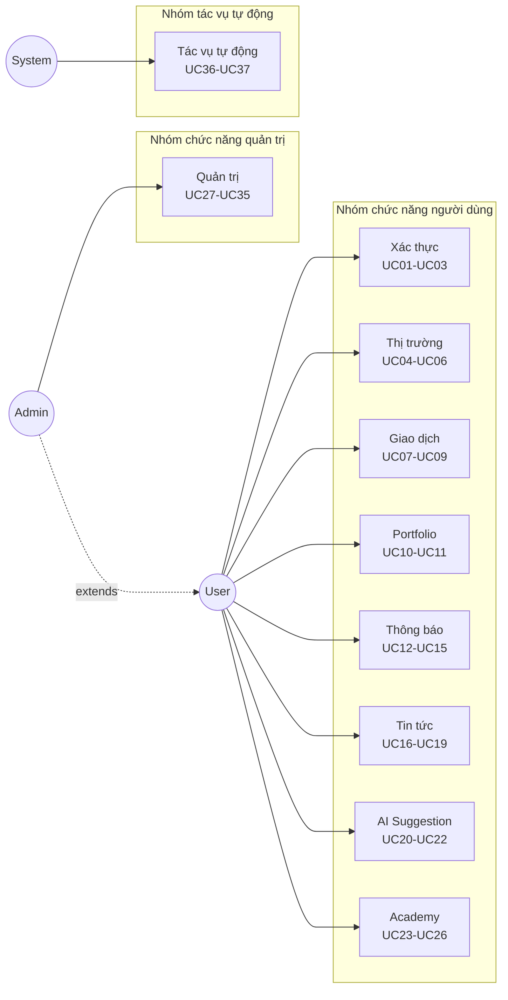
```mermaid
flowchart LR
    Admin((Admin))
    User((User))
    System((System))

    Admin -.->|extends| User

    subgraph UserCases["Nhóm chức năng người dùng"]
        direction TB
        Auth[Xác thực<br/>UC01-UC03]
        Market[Thị trường<br/>UC04-UC06]
        Trading[Giao dịch<br/>UC07-UC09]
        Portfolio[Portfolio<br/>UC10-UC11]
        Notify[Thông báo<br/>UC12-UC15]
        News[Tin tức<br/>UC16-UC19]
        AI[AI Suggestion<br/>UC20-UC22]
        Academy[Academy<br/>UC23-UC26]
    end

    subgraph AdminCases["Nhóm chức năng quản trị"]
        direction TB
        AdminPanel[Quản trị<br/>UC27-UC35]
    end

    subgraph SystemCases["Nhóm tác vụ tự động"]
        direction TB
        Jobs[Tác vụ tự động<br/>UC36-UC37]
    end

    User --> Auth
    User --> Market
    User --> Trading
    User --> Portfolio
    User --> Notify
    User --> News
    User --> AI
    User --> Academy

    Admin --> AdminPanel
    System --> Jobs
```

*Hình 3.1: Sơ đồ Use Case tổng quan của hệ thống CryptoTrading SOA.*

Chú thích:

- `User`: người dùng thông thường, có quyền sử dụng các chức năng từ UC01 đến UC26.
- `Admin`: người quản trị, kế thừa quyền của `User` và có thêm nhóm UC27 đến UC35.
- `System`: tác nhân hệ thống, thực hiện các tác vụ tự động như refresh cache tin tức và kiểm tra cảnh báo giá.
- Các nhóm Use Case được gom theo ranh giới nghiệp vụ tương ứng với các service chính.

#### Sơ đồ 1: Authentication - UC01, UC02, UC03

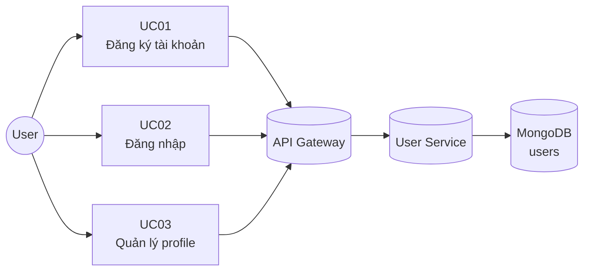
```mermaid
flowchart LR
    User((User))
    UC01[UC01<br/>Đăng ký tài khoản]
    UC02[UC02<br/>Đăng nhập]
    UC03[UC03<br/>Quản lý profile]
    GW[(API Gateway)]
    US[(User Service)]
    DB[(MongoDB<br/>users)]

    User --> UC01
    User --> UC02
    User --> UC03
    UC01 --> GW
    UC02 --> GW
    UC03 --> GW
    GW --> US
    US --> DB
```

*Hình 3.2: Sơ đồ Use Case nhóm xác thực người dùng.*

Nhóm xác thực tập trung vào User Service. Khi đăng ký, hệ thống kiểm tra dữ liệu, hash password bằng bcrypt và tạo user mới. Khi đăng nhập, User Service kiểm tra email/mật khẩu và trả JWT cho frontend. Các chức năng profile và balance cũng được xử lý trong User Service, giúp dữ liệu tài khoản không bị phân tán sang service khác.

#### Sơ đồ 2: Market - UC04, UC05, UC06

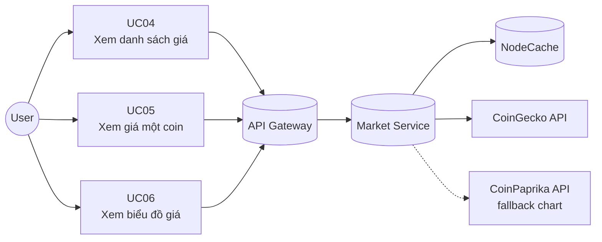
```mermaid
flowchart LR
    User((User))
    UC04[UC04<br/>Xem danh sách giá]
    UC05[UC05<br/>Xem giá một coin]
    UC06[UC06<br/>Xem biểu đồ giá]
    GW[(API Gateway)]
    MS[(Market Service)]
    CG[CoinGecko API]
    CP[CoinPaprika API<br/>fallback chart]
    Cache[(NodeCache)]

    User --> UC04
    User --> UC05
    User --> UC06
    UC04 --> GW
    UC05 --> GW
    UC06 --> GW
    GW --> MS
    MS --> Cache
    MS --> CG
    MS -.-> CP
```

*Hình 3.3: Sơ đồ Use Case nhóm thị trường.*

Market Service không lưu database riêng. Service lấy dữ liệu từ API ngoài, cache kết quả bằng NodeCache và trả về cho các màn hình Dashboard, Trade, Coin Detail. Với dữ liệu biểu đồ, hệ thống ưu tiên CoinGecko và có fallback sang CoinPaprika khi CoinGecko lỗi.

#### Sơ đồ 3: Trading - UC07, UC08, UC09

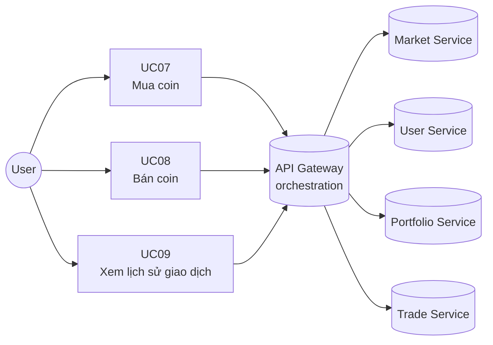
```mermaid
flowchart LR
    User((User))
    UC07[UC07<br/>Mua coin]
    UC08[UC08<br/>Bán coin]
    UC09[UC09<br/>Xem lịch sử giao dịch]
    GW[(API Gateway<br/>orchestration)]
    MS[(Market Service)]
    US[(User Service)]
    PS[(Portfolio Service)]
    TS[(Trade Service)]

    User --> UC07
    User --> UC08
    User --> UC09
    UC07 --> GW
    UC08 --> GW
    UC09 --> GW
    GW --> MS
    GW --> US
    GW --> PS
    GW --> TS
```

*Hình 3.4: Sơ đồ Use Case nhóm giao dịch.*

Luồng mua/bán không để Trade Service tự xử lý toàn bộ nghiệp vụ. API Gateway đóng vai trò orchestration: lấy giá từ Market Service, cập nhật số dư qua User Service, cập nhật holding qua Portfolio Service và cuối cùng lưu record vào Trade Service. Cách làm này giúp Trade Service giữ nhiệm vụ rõ ràng là lưu lịch sử giao dịch.

#### Sơ đồ 4: Portfolio và Notification - UC10 đến UC15

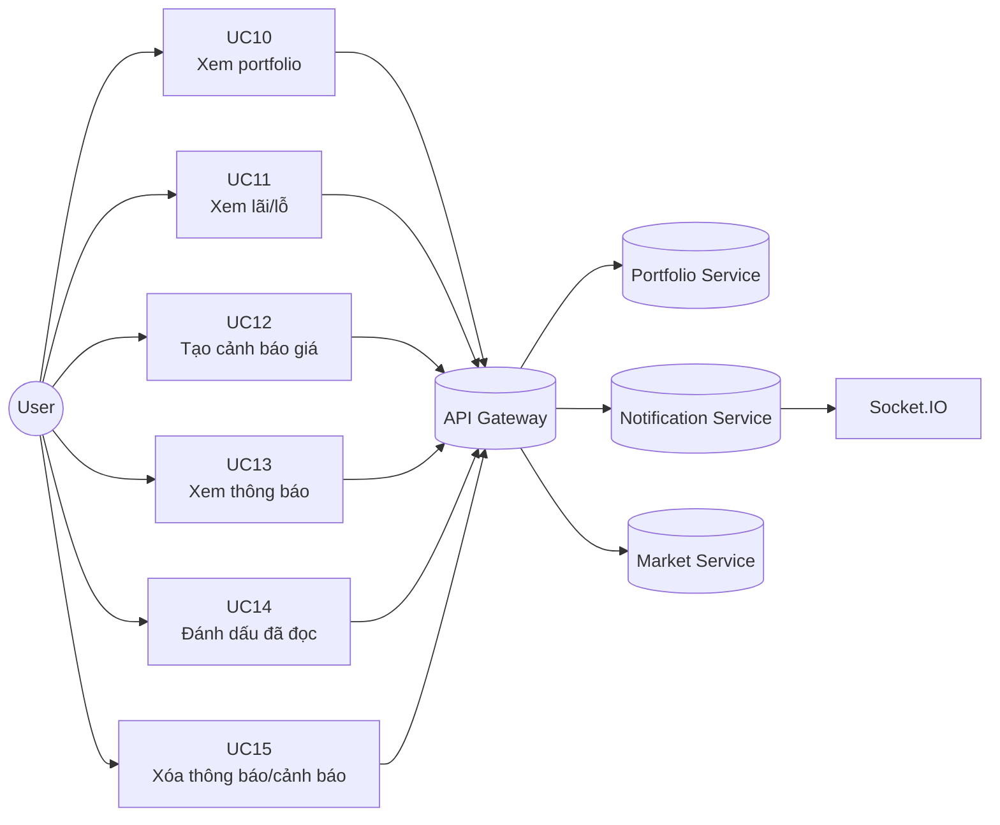
```mermaid
flowchart LR
    User((User))
    UC10[UC10<br/>Xem portfolio]
    UC11[UC11<br/>Xem lãi/lỗ]
    UC12[UC12<br/>Tạo cảnh báo giá]
    UC13[UC13<br/>Xem thông báo]
    UC14[UC14<br/>Đánh dấu đã đọc]
    UC15[UC15<br/>Xóa thông báo/cảnh báo]
    GW[(API Gateway)]
    PS[(Portfolio Service)]
    NS[(Notification Service)]
    MS[(Market Service)]
    WS[Socket.IO]

    User --> UC10
    User --> UC11
    User --> UC12
    User --> UC13
    User --> UC14
    User --> UC15
    UC10 --> GW
    UC11 --> GW
    UC12 --> GW
    UC13 --> GW
    UC14 --> GW
    UC15 --> GW
    GW --> PS
    GW --> MS
    GW --> NS
    NS --> WS
```

*Hình 3.5: Sơ đồ Use Case nhóm portfolio và thông báo.*

Portfolio Service quản lý danh mục nắm giữ, còn Notification Service quản lý thông báo và cảnh báo giá. Khi cần tính giá trị hiện tại của portfolio, API Gateway phối hợp Portfolio Service với Market Service. Khi price alert đạt điều kiện, Notification Service tạo notification và gửi realtime event qua Socket.IO.

#### Sơ đồ 5: News và AI - UC16 đến UC22

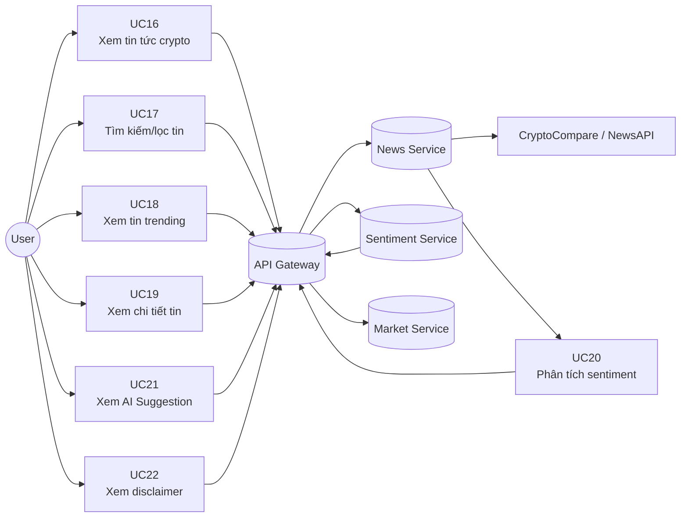
```mermaid
flowchart LR
    User((User))
    UC16[UC16<br/>Xem tin tức crypto]
    UC17[UC17<br/>Tìm kiếm/lọc tin]
    UC18[UC18<br/>Xem tin trending]
    UC19[UC19<br/>Xem chi tiết tin]
    UC20[UC20<br/>Phân tích sentiment]
    UC21[UC21<br/>Xem AI Suggestion]
    UC22[UC22<br/>Xem disclaimer]
    GW[(API Gateway)]
    NEWS[(News Service)]
    SENT[(Sentiment Service)]
    MARKET[(Market Service)]
    EXT[CryptoCompare / NewsAPI]

    User --> UC16
    User --> UC17
    User --> UC18
    User --> UC19
    User --> UC21
    User --> UC22
    UC16 --> GW
    UC17 --> GW
    UC18 --> GW
    UC19 --> GW
    UC21 --> GW
    UC22 --> GW
    GW --> NEWS
    GW --> SENT
    NEWS --> EXT
    NEWS --> UC20
    UC20 --> GW
    SENT --> GW
    GW --> MARKET
```

*Hình 3.6: Sơ đồ Use Case nhóm tin tức và AI Suggestion.*

News Service lấy tin từ API ngoài, chuẩn hóa dữ liệu, gắn coin liên quan và sentiment. Sentiment Service được dùng ở hai nơi: News Service gọi qua API Gateway để gắn nhãn tích cực/tiêu cực/trung lập cho bài viết, còn trang AI Suggestion gọi qua Gateway để tổng hợp sentiment tin tức và biến động giá 24h.

#### Sơ đồ 6: Academy và Admin - UC23 đến UC35

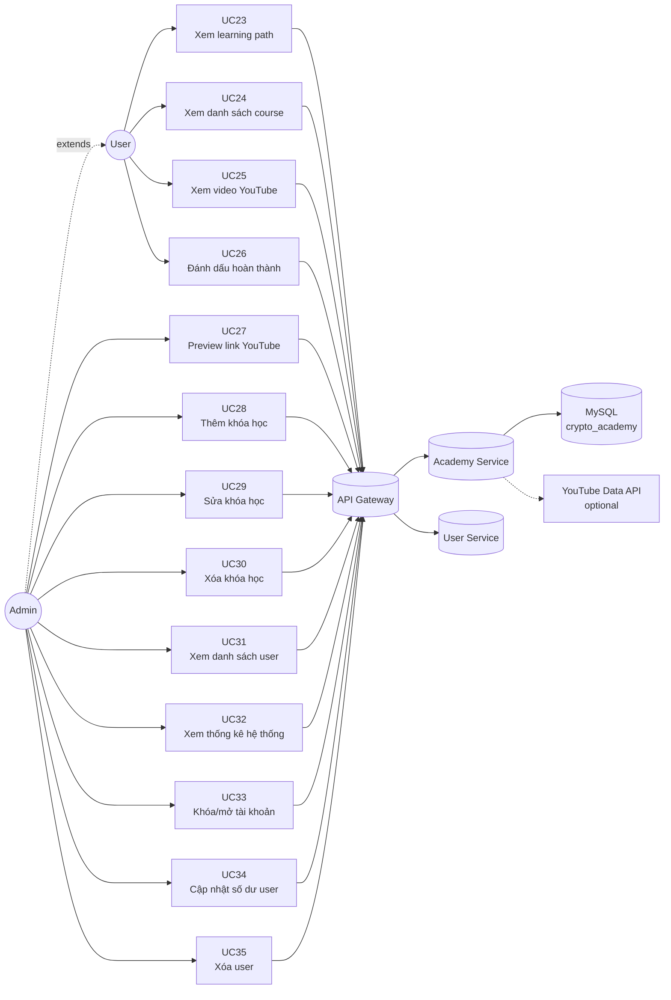
```mermaid
flowchart LR
    User((User))
    Admin((Admin))
    UC23[UC23<br/>Xem learning path]
    UC24[UC24<br/>Xem danh sách course]
    UC25[UC25<br/>Xem video YouTube]
    UC26[UC26<br/>Đánh dấu hoàn thành]
    UC27[UC27<br/>Preview link YouTube]
    UC28[UC28<br/>Thêm khóa học]
    UC29[UC29<br/>Sửa khóa học]
    UC30[UC30<br/>Xóa khóa học]
    UC31[UC31<br/>Xem danh sách user]
    UC32[UC32<br/>Xem thống kê hệ thống]
    UC33[UC33<br/>Khóa/mở tài khoản]
    UC34[UC34<br/>Cập nhật số dư user]
    UC35[UC35<br/>Xóa user]
    GW[(API Gateway)]
    AC[(Academy Service)]
    US[(User Service)]
    DB[(MySQL<br/>crypto_academy)]
    YT[YouTube Data API<br/>optional]

    Admin -.->|extends| User
    User --> UC23
    User --> UC24
    User --> UC25
    User --> UC26
    Admin --> UC27
    Admin --> UC28
    Admin --> UC29
    Admin --> UC30
    Admin --> UC31
    Admin --> UC32
    Admin --> UC33
    Admin --> UC34
    Admin --> UC35
    UC23 --> GW
    UC24 --> GW
    UC25 --> GW
    UC26 --> GW
    UC27 --> GW
    UC28 --> GW
    UC29 --> GW
    UC30 --> GW
    UC31 --> GW
    UC32 --> GW
    UC33 --> GW
    UC34 --> GW
    UC35 --> GW
    GW --> AC
    GW --> US
    AC --> DB
    AC -.-> YT
```

*Hình 3.7: Sơ đồ Use Case nhóm Academy và quản trị.*

Academy Service quản lý dữ liệu course và progress trong MySQL. Admin có thể thêm/sửa/xóa khóa học bằng link YouTube hoặc `videoId`. Các chức năng quản lý user của Admin đi qua API Gateway đến User Service. YouTube Data API chỉ là thành phần bổ trợ để lấy metadata cho một video nếu có `YOUTUBE_API_KEY`, không phải chức năng bắt buộc và không còn chức năng import playlist.

### 3.1.5. Bảng tổng hợp Use Case

| Mã | Use Case | Tác nhân | Service xử lý chính | Kết quả |
|---|---|---|---|---|
| UC01 | Đăng ký tài khoản | User | API Gateway + User Service | Tạo user mới, hash password, cấp số dư ảo ban đầu. |
| UC02 | Đăng nhập | User/Admin | API Gateway + User Service | Trả JWT và thông tin user. |
| UC03 | Quản lý profile | User/Admin | API Gateway + User Service | Xem hoặc cập nhật thông tin cá nhân. |
| UC04 | Xem danh sách giá | User/Admin | API Gateway + Market Service | Trả danh sách coin được hỗ trợ kèm giá hiện tại. |
| UC05 | Xem giá một coin | User/Admin | API Gateway + Market Service | Trả giá, biến động 24h, volume, market cap của coin. |
| UC06 | Xem biểu đồ giá | User/Admin | API Gateway + Market Service | Trả dữ liệu chart theo số ngày. |
| UC07 | Mua coin | User/Admin | API Gateway orchestration | Cập nhật balance, portfolio và lưu trade `buy`. |
| UC08 | Bán coin | User/Admin | API Gateway orchestration | Kiểm tra holding, cập nhật balance, portfolio và lưu trade `sell`. |
| UC09 | Xem lịch sử giao dịch | User/Admin | API Gateway + Trade Service | Trả danh sách giao dịch của user. |
| UC10 | Xem portfolio | User/Admin | API Gateway + Portfolio Service + Market Service | Trả danh mục đã enrich giá hiện tại. |
| UC11 | Xem lãi/lỗ | User/Admin | API Gateway + Portfolio Service | Tính tổng giá trị, tổng vốn, lãi/lỗ và phần trăm. |
| UC12 | Tạo cảnh báo giá | User/Admin | API Gateway + Notification Service | Lưu price alert vào MongoDB. |
| UC13 | Xem thông báo | User/Admin | API Gateway + Notification Service | Trả danh sách notification. |
| UC14 | Đánh dấu đã đọc | User/Admin | API Gateway + Notification Service | Cập nhật trạng thái notification thành `read`. |
| UC15 | Xóa thông báo/cảnh báo | User/Admin | API Gateway + Notification Service | Xóa notification hoặc price alert. |
| UC16 | Xem tin tức crypto | User/Admin | API Gateway + News Service | Trả danh sách tin có phân trang. |
| UC17 | Tìm kiếm/lọc tin | User/Admin | API Gateway + News Service | Lọc theo `coin`, `sentiment`, `search`. |
| UC18 | Xem tin trending | User/Admin | API Gateway + News Service | Trả tin sắp xếp theo lượt xem mô phỏng. |
| UC19 | Xem chi tiết tin | User/Admin | API Gateway + News Service | Trả một bài viết theo `id`. |
| UC20 | Phân tích sentiment | System/News Service | API Gateway + Sentiment Service | Trả nhãn `positive`, `negative`, `neutral`. |
| UC21 | Xem AI Suggestion | User/Admin | API Gateway + Sentiment Service | Trả tín hiệu BULLISH/BEARISH/NEUTRAL/CAUTION. |
| UC22 | Xem disclaimer | User/Admin | API Gateway + Sentiment Service | Hiển thị ghi chú không phải lời khuyên đầu tư. |
| UC23 | Xem learning path | User/Admin | API Gateway + Academy Service | Trả danh sách learning path và progress. |
| UC24 | Xem danh sách course | User/Admin | API Gateway + Academy Service | Trả course có phân trang/lọc. |
| UC25 | Xem video YouTube | User/Admin | API Gateway + Academy Service + Frontend | Mở embed video theo `videoId`. |
| UC26 | Đánh dấu hoàn thành | User/Admin | API Gateway + Academy Service | Upsert dữ liệu vào `course_progress`. |
| UC27 | Preview link YouTube | Admin | API Gateway + Academy Service | Tách `videoId`, lấy metadata nếu có YouTube API key. |
| UC28 | Thêm khóa học | Admin | API Gateway + Academy Service | Lưu course mới vào bảng `courses`. |
| UC29 | Sửa khóa học | Admin | API Gateway + Academy Service | Cập nhật course, xử lý đổi `videoId` nếu có. |
| UC30 | Xóa khóa học | Admin | API Gateway + Academy Service | Xóa course và progress liên quan. |
| UC31 | Xem danh sách user | Admin | API Gateway + User Service | Trả danh sách user cho Admin Panel. |
| UC32 | Xem thống kê hệ thống | Admin | API Gateway + User Service | Trả thống kê user, số dư và trạng thái tài khoản. |
| UC33 | Khóa/mở tài khoản | Admin | API Gateway + User Service | Đổi trạng thái `isActive` của user. |
| UC34 | Cập nhật số dư user | Admin | API Gateway + User Service | Điều chỉnh balance và ghi lịch sử số dư. |
| UC35 | Xóa user | Admin | API Gateway + User Service | Xóa user thường khỏi hệ thống. |
| UC36 | Refresh tin tức | System | News Service | Scheduler invalidate cache và fetch lại tin tức trong chính News Service. |
| UC37 | Kiểm tra price alert | System | Notification Service + API Gateway + Market Service | Cron kiểm tra giá qua Gateway và gửi notification khi đạt điều kiện. |

### 3.1.6. Đặc tả Use Case chi tiết

Phần này đặc tả từng Use Case theo cùng một mẫu để dễ theo dõi khi trình bày: tác nhân, mục tiêu, tiền điều kiện, hậu điều kiện, luồng chính và luồng ngoại lệ. Các endpoint được ghi theo đường dẫn frontend gọi qua API Gateway.

#### UC01 - Đăng ký tài khoản

| Thuộc tính | Mô tả |
|---|---|
| Actor | User |
| Endpoint/Service | `POST /api/users/register` - API Gateway + User Service |
| Mục tiêu | Tạo tài khoản mới để sử dụng hệ thống giao dịch crypto ảo. |
| Tiền điều kiện | Email chưa tồn tại trong hệ thống. |
| Hậu điều kiện | User được lưu trong MongoDB, mật khẩu được hash bằng bcrypt, tài khoản có balance khởi tạo theo `INITIAL_BALANCE` hoặc mặc định `1000` USDT. |

Luồng chính: User nhập họ tên, email và mật khẩu; frontend gửi request đăng ký; API Gateway áp dụng register rate limit; User Service kiểm tra dữ liệu, kiểm tra email trùng, hash password, tạo user và trả token.

Ngoại lệ: Email đã tồn tại, dữ liệu không hợp lệ hoặc request vượt giới hạn đăng ký thì hệ thống trả lỗi và không tạo user.

#### UC02 - Đăng nhập

| Thuộc tính | Mô tả |
|---|---|
| Actor | User/Admin |
| Endpoint/Service | `POST /api/users/login` - API Gateway + User Service |
| Mục tiêu | Xác thực tài khoản và lấy JWT để gọi các API cần đăng nhập. |
| Tiền điều kiện | Tài khoản đã tồn tại và chưa bị khóa. |
| Hậu điều kiện | Frontend nhận token và thông tin user, sau đó chuyển vào Dashboard. |

Luồng chính: User nhập email/mật khẩu; Gateway áp dụng login rate limit; User Service tìm user theo email, so sánh mật khẩu bằng bcrypt, kiểm tra `isActive`, tạo JWT chứa `userId` và trả response.

Ngoại lệ: Sai email/mật khẩu, tài khoản bị khóa hoặc vượt giới hạn đăng nhập thì hệ thống trả lỗi.

#### UC03 - Quản lý profile

| Thuộc tính | Mô tả |
|---|---|
| Actor | User/Admin |
| Endpoint/Service | `GET /api/users/profile`, `PUT /api/users/profile` - API Gateway + User Service |
| Mục tiêu | Xem và cập nhật thông tin cá nhân của tài khoản. |
| Tiền điều kiện | User đã đăng nhập và JWT hợp lệ. |
| Hậu điều kiện | Profile được trả về hoặc cập nhật trong MongoDB. |

Luồng chính: Frontend gửi request kèm JWT; Gateway xác thực token; User Service lấy `userId` từ header/middleware, truy vấn user và trả profile hoặc cập nhật các trường cho phép.

Ngoại lệ: Token thiếu/hết hạn, user không tồn tại hoặc dữ liệu cập nhật không hợp lệ thì hệ thống trả lỗi.

#### UC04 - Xem danh sách giá

| Thuộc tính | Mô tả |
|---|---|
| Actor | User/Admin |
| Endpoint/Service | `GET /api/market/prices` - API Gateway + Market Service |
| Mục tiêu | Xem danh sách coin được hỗ trợ kèm giá và biến động thị trường. |
| Tiền điều kiện | User có JWT hợp lệ hoặc request nội bộ có internal service key. |
| Hậu điều kiện | Frontend nhận danh sách giá để hiển thị ở Dashboard/Trade. |

Luồng chính: Frontend gọi API market; Gateway kiểm tra auth; Market Service lấy dữ liệu từ cache hoặc API ngoài; response trả về danh sách coin.

Ngoại lệ: API ngoài lỗi thì Market Service dùng cache/fallback nếu có; nếu không có dữ liệu hợp lệ thì trả lỗi.

#### UC05 - Xem giá một coin

| Thuộc tính | Mô tả |
|---|---|
| Actor | User/Admin/System |
| Endpoint/Service | `GET /api/market/price/{coinId}` - API Gateway + Market Service |
| Mục tiêu | Lấy giá chi tiết của một coin cụ thể. |
| Tiền điều kiện | `coinId` hợp lệ. |
| Hậu điều kiện | Hệ thống nhận giá hiện tại, biến động 24h, volume hoặc market cap nếu API ngoài trả về. |

Luồng chính: Client hoặc service nội bộ gửi `coinId`; Market Service kiểm tra cache; nếu cache miss thì gọi API ngoài và lưu cache.

Ngoại lệ: `coinId` không hợp lệ, API ngoài lỗi hoặc không có dữ liệu thì hệ thống trả lỗi phù hợp.

#### UC06 - Xem biểu đồ giá

| Thuộc tính | Mô tả |
|---|---|
| Actor | User/Admin |
| Endpoint/Service | `GET /api/market/chart/{coinId}` - API Gateway + Market Service |
| Mục tiêu | Lấy dữ liệu biểu đồ giá theo khoảng thời gian. |
| Tiền điều kiện | `coinId` hợp lệ và Market Service hoạt động. |
| Hậu điều kiện | Frontend nhận mảng dữ liệu chart để vẽ biểu đồ. |

Luồng chính: User mở trang chi tiết coin; frontend gọi chart API; Market Service gọi CoinGecko, nếu cần thì fallback sang CoinPaprika cho chart data.

Ngoại lệ: Không lấy được dữ liệu chart hoặc coin không được hỗ trợ thì trả lỗi.

#### UC07 - Mua coin

| Thuộc tính | Mô tả |
|---|---|
| Actor | User/Admin |
| Endpoint/Service | `POST /api/trade/buy` - API Gateway orchestration |
| Mục tiêu | Mua coin bằng số dư USDT ảo. |
| Tiền điều kiện | User đã đăng nhập, coin hợp lệ, số lượng hợp lệ và balance đủ. |
| Hậu điều kiện | Balance giảm, portfolio tăng holding, Trade Service lưu record `buy`, Notification Service có thể gửi thông báo. |

Luồng chính: User nhập coin và số lượng; Gateway kiểm tra JWT và validate payload; Gateway lấy giá từ Market Service; tính tổng tiền và phí; kiểm tra balance qua User Service; trừ balance; thêm holding qua Portfolio Service; lưu trade qua Trade Service; gửi notification không chặn luồng chính.

Ngoại lệ: Không đủ balance, Market Service không trả giá, số tiền giao dịch dưới mức tối thiểu hoặc service phụ lỗi thì Gateway trả lỗi. Nếu đã trừ balance/thêm holding mà bước sau lỗi, Gateway thực hiện rollback theo trạng thái giao dịch.

#### UC08 - Bán coin

| Thuộc tính | Mô tả |
|---|---|
| Actor | User/Admin |
| Endpoint/Service | `POST /api/trade/sell` - API Gateway orchestration |
| Mục tiêu | Bán coin đang nắm giữ trong portfolio. |
| Tiền điều kiện | User đã đăng nhập và có đủ số lượng coin trong portfolio. |
| Hậu điều kiện | Balance tăng, portfolio giảm holding, Trade Service lưu record `sell`. |

Luồng chính: User nhập coin và số lượng bán; Gateway kiểm tra portfolio để xác nhận holding; lấy giá từ Market Service; tính tiền nhận sau phí; cộng balance qua User Service; giảm holding qua Portfolio Service; lưu trade record qua Trade Service.

Ngoại lệ: Không có holding, số lượng bán vượt số lượng đang nắm giữ, không lấy được giá hoặc service phụ lỗi thì trả lỗi và rollback nếu cần.

#### UC09 - Xem lịch sử giao dịch

| Thuộc tính | Mô tả |
|---|---|
| Actor | User/Admin |
| Endpoint/Service | `GET /api/trade/history` - API Gateway + Trade Service |
| Mục tiêu | Xem danh sách giao dịch mua/bán đã thực hiện. |
| Tiền điều kiện | User đã đăng nhập. |
| Hậu điều kiện | Frontend hiển thị lịch sử giao dịch của user hiện tại. |

Luồng chính: Frontend gọi API history; Gateway xác thực JWT và forward `X-User-Id`; Trade Service truy vấn collection `trades` theo user và trả danh sách.

Ngoại lệ: Token không hợp lệ hoặc lỗi database thì trả lỗi.

#### UC10 - Xem portfolio

| Thuộc tính | Mô tả |
|---|---|
| Actor | User/Admin |
| Endpoint/Service | `GET /api/portfolio` - API Gateway + Portfolio Service + Market Service |
| Mục tiêu | Xem danh mục coin đang nắm giữ với giá trị hiện tại. |
| Tiền điều kiện | User đã đăng nhập. |
| Hậu điều kiện | Frontend nhận portfolio đã enrich giá hiện tại. |

Luồng chính: Gateway lấy portfolio từ Portfolio Service; nếu có holdings, Gateway gọi Market Service để lấy giá hiện tại từng coin; tính current value, profit/loss và trả dữ liệu đã enrich cho frontend.

Ngoại lệ: Nếu không có holding thì trả portfolio rỗng. Nếu một giá coin không lấy được, hệ thống có thể dùng `averageBuyPrice` làm giá fallback cho holding đó.

#### UC11 - Xem lãi/lỗ

| Thuộc tính | Mô tả |
|---|---|
| Actor | User/Admin |
| Endpoint/Service | `GET /api/portfolio` - Portfolio orchestration |
| Mục tiêu | Xem tổng giá trị, tổng vốn, lãi/lỗ và phần trăm lãi/lỗ. |
| Tiền điều kiện | User đã đăng nhập và có portfolio. |
| Hậu điều kiện | Frontend hiển thị số liệu tổng quan danh mục. |

Luồng chính: Sau khi portfolio được enrich giá hiện tại, Gateway/Portfolio tính total value, invested value, profit/loss và profit/loss percentage rồi trả về frontend.

Ngoại lệ: Không có holding thì các chỉ số có thể bằng 0.

#### UC12 - Tạo cảnh báo giá

| Thuộc tính | Mô tả |
|---|---|
| Actor | User/Admin |
| Endpoint/Service | `POST /api/notifications/alert` - API Gateway + Notification Service |
| Mục tiêu | Tạo cảnh báo khi giá coin vượt lên hoặc giảm xuống một ngưỡng. |
| Tiền điều kiện | User đã đăng nhập, có symbol/coinId, target price và condition hợp lệ. |
| Hậu điều kiện | Price alert được lưu vào MongoDB ở trạng thái active. |

Luồng chính: User nhập coin, giá mục tiêu và điều kiện; frontend gửi request; Notification Service lưu alert gắn với userId.

Ngoại lệ: Thiếu trường bắt buộc, condition không hợp lệ hoặc lỗi database thì alert không được tạo.

#### UC13 - Xem thông báo

| Thuộc tính | Mô tả |
|---|---|
| Actor | User/Admin |
| Endpoint/Service | `GET /api/notifications`, `GET /api/notifications/unread-count` - API Gateway + Notification Service |
| Mục tiêu | Xem danh sách thông báo và số thông báo chưa đọc. |
| Tiền điều kiện | User đã đăng nhập. |
| Hậu điều kiện | Frontend hiển thị notification list và badge unread. |

Luồng chính: Frontend gọi API thông báo; Gateway xác thực JWT; Notification Service truy vấn notifications theo userId và trả dữ liệu.

Ngoại lệ: Token không hợp lệ hoặc lỗi database thì trả lỗi.

#### UC14 - Đánh dấu đã đọc

| Thuộc tính | Mô tả |
|---|---|
| Actor | User/Admin |
| Endpoint/Service | `PUT /api/notifications/{id}/read`, `PUT /api/notifications/read-all` - API Gateway + Notification Service |
| Mục tiêu | Cập nhật trạng thái thông báo thành đã đọc. |
| Tiền điều kiện | User đã đăng nhập và notification thuộc về user. |
| Hậu điều kiện | Notification hoặc toàn bộ notifications của user được đánh dấu `read`. |

Luồng chính: User bấm đọc một thông báo hoặc đọc tất cả; frontend gửi request; Notification Service cập nhật trạng thái và trả kết quả.

Ngoại lệ: Notification không tồn tại, không thuộc user hoặc lỗi database thì trả lỗi.

#### UC15 - Xóa thông báo/cảnh báo

| Thuộc tính | Mô tả |
|---|---|
| Actor | User/Admin |
| Endpoint/Service | `DELETE /api/notifications/{id}`, `DELETE /api/notifications/alert/{id}` - API Gateway + Notification Service |
| Mục tiêu | Xóa notification hoặc price alert không còn cần thiết. |
| Tiền điều kiện | User đã đăng nhập và dữ liệu cần xóa thuộc về user. |
| Hậu điều kiện | Notification hoặc alert bị xóa khỏi MongoDB. |

Luồng chính: User bấm xóa; frontend gọi API; Notification Service kiểm tra owner và xóa bản ghi.

Ngoại lệ: Không tìm thấy dữ liệu, không có quyền hoặc lỗi database thì trả lỗi.

#### UC16 - Xem tin tức crypto

| Thuộc tính | Mô tả |
|---|---|
| Actor | User/Admin |
| Endpoint/Service | `GET /api/news` - API Gateway + News Service |
| Mục tiêu | Xem danh sách tin tức crypto có phân trang. |
| Tiền điều kiện | News Service đang chạy. Route này không bắt buộc đăng nhập. |
| Hậu điều kiện | Frontend nhận danh sách tin đã chuẩn hóa, có coin liên quan và sentiment nếu xử lý được. |

Luồng chính: Frontend gọi API news; News Service kiểm tra Guava Cache; nếu cache miss thì gọi CryptoCompare, fallback NewsAPI nếu có key, cuối cùng fallback sample data; service chuẩn hóa bài viết, gắn sentiment và trả response.

Ngoại lệ: API ngoài lỗi thì dùng fallback. Nếu Sentiment Service không khả dụng, News Service dùng keyword fallback.

#### UC17 - Tìm kiếm/lọc tin

| Thuộc tính | Mô tả |
|---|---|
| Actor | User/Admin |
| Endpoint/Service | `GET /api/news?page&limit&coin&sentiment&search` - API Gateway + News Service |
| Mục tiêu | Lọc tin theo coin, sentiment hoặc từ khóa. |
| Tiền điều kiện | News Service có dữ liệu từ cache hoặc fallback. |
| Hậu điều kiện | Frontend nhận danh sách tin phù hợp điều kiện lọc. |

Luồng chính: User nhập từ khóa hoặc chọn bộ lọc; frontend gửi query params; News Service lọc dữ liệu trong danh sách đã cache, phân trang và trả response.

Ngoại lệ: Không có tin phù hợp thì trả danh sách rỗng, không phải lỗi hệ thống.

#### UC18 - Xem tin trending

| Thuộc tính | Mô tả |
|---|---|
| Actor | User/Admin |
| Endpoint/Service | `GET /api/news/trending` - API Gateway + News Service |
| Mục tiêu | Xem tin nổi bật/trending. |
| Tiền điều kiện | News Service đang chạy. |
| Hậu điều kiện | Frontend nhận danh sách tin được sắp xếp theo độ nổi bật/lượt xem mô phỏng. |

Luồng chính: Frontend gọi trending API; News Service lấy trending cache hoặc sort danh sách tin theo views giảm dần rồi trả kết quả.

Ngoại lệ: Nếu trending cache lỗi, service fallback sang danh sách tin hiện có.

#### UC19 - Xem chi tiết tin

| Thuộc tính | Mô tả |
|---|---|
| Actor | User/Admin |
| Endpoint/Service | `GET /api/news/{id}` - API Gateway + News Service |
| Mục tiêu | Xem thông tin chi tiết của một bài tin. |
| Tiền điều kiện | `id` bài tin tồn tại trong dữ liệu đang cache. |
| Hậu điều kiện | Frontend hiển thị chi tiết tin hoặc link nguồn. |

Luồng chính: User mở một bài tin; frontend gọi API theo `id`; News Service tìm bài viết trong cache và trả dữ liệu chi tiết.

Ngoại lệ: Không tìm thấy bài viết thì trả lỗi not found.

#### UC20 - Phân tích sentiment

| Thuộc tính | Mô tả |
|---|---|
| Actor | System/News Service |
| Endpoint/Service | `POST /api/sentiment/analyze`, `POST /api/sentiment/analyze-batch` - API Gateway + Sentiment Service |
| Mục tiêu | Phân loại văn bản thành `positive`, `negative` hoặc `neutral`. |
| Tiền điều kiện | Sentiment Service đang chạy; để phân tích bằng FinBERT thì model cần load thành công. |
| Hậu điều kiện | Hệ thống nhận nhãn sentiment, score và scores. |

Luồng chính: News Service hoặc client gửi text; Sentiment Service chuẩn hóa text, đưa vào pipeline FinBERT pretrained và trả kết quả.

Ngoại lệ: Text rỗng thì Sentiment Service trả `neutral`. Nếu FinBERT chưa load, endpoint phân tích trả `503`; riêng News Service sẽ bắt lỗi này và dùng keyword fallback khi gắn sentiment cho tin tức.

#### UC21 - Xem AI Trade Suggestion

| Thuộc tính | Mô tả |
|---|---|
| Actor | User/Admin |
| Endpoint/Service | `GET /api/sentiment/suggestion?symbol=BTC` - API Gateway + Sentiment Service |
| Mục tiêu | Xem tín hiệu tham khảo cho một coin dựa trên dữ liệu giá và sentiment tin tức. |
| Tiền điều kiện | Symbol được hỗ trợ và Market Service khả dụng. |
| Hậu điều kiện | Frontend nhận suggestion gồm signal, reason, detail, sentiment distribution và disclaimer. |

Luồng chính: User chọn symbol; Sentiment Service gọi Gateway để lấy giá từ Market Service và tin liên quan từ News Service; service phân tích sentiment tiêu đề/tin, kết hợp biến động 24h và trả `BULLISH`, `BEARISH`, `CAUTION` hoặc `NEUTRAL`.

Ngoại lệ: Symbol không hỗ trợ, Market Service không trả dữ liệu hoặc News Service không có tin thì service trả lỗi hoặc suggestion trung lập tùy tình huống.

#### UC22 - Xem disclaimer

| Thuộc tính | Mô tả |
|---|---|
| Actor | User/Admin |
| Endpoint/Service | Kèm response của `GET /api/sentiment/suggestion` và hiển thị ở frontend |
| Mục tiêu | Nhắc người dùng rằng AI Suggestion không phải lời khuyên đầu tư. |
| Tiền điều kiện | User mở chức năng AI Suggestion. |
| Hậu điều kiện | Disclaimer được hiển thị cùng kết quả phân tích. |

Luồng chính: Frontend nhận response suggestion có disclaimer; giao diện hiển thị cảnh báo để user hiểu đây chỉ là tín hiệu tham khảo.

Ngoại lệ: Nếu suggestion API lỗi, frontend hiển thị lỗi thay vì kết quả/disclaimer.

#### UC23 - Xem learning path

| Thuộc tính | Mô tả |
|---|---|
| Actor | User/Admin |
| Endpoint/Service | `GET /api/academy/paths` - API Gateway + Academy Service |
| Mục tiêu | Xem các lộ trình học crypto theo nhóm kiến thức. |
| Tiền điều kiện | Academy Service và MySQL hoạt động; token là optional. |
| Hậu điều kiện | Frontend nhận danh sách learning path, số course và progress nếu user đã đăng nhập. |

Luồng chính: Frontend gọi paths API; Gateway dùng optional auth, nếu có token thì forward `X-User-Id`; Academy Service lấy courses từ MySQL, merge progress theo user và group thành learning path.

Ngoại lệ: Nếu chưa đăng nhập, service vẫn trả course public nhưng progress cá nhân bằng 0/chưa hoàn thành.

#### UC24 - Xem danh sách course

| Thuộc tính | Mô tả |
|---|---|
| Actor | User/Admin |
| Endpoint/Service | `GET /api/academy/courses` - API Gateway + Academy Service |
| Mục tiêu | Xem danh sách course có phân trang và lọc. |
| Tiền điều kiện | Academy Service kết nối MySQL. |
| Hậu điều kiện | Frontend nhận `PageResponse` chứa courses. |

Luồng chính: Frontend gửi page, size, category, difficulty nếu có; Academy Service query bảng `courses`, sắp xếp theo `sortOrder`, merge progress nếu có userId và trả response.

Ngoại lệ: Category/difficulty không có dữ liệu thì trả trang rỗng.

#### UC25 - Xem video YouTube

| Thuộc tính | Mô tả |
|---|---|
| Actor | User/Admin |
| Endpoint/Service | `GET /api/academy/courses/{videoId}` - API Gateway + Academy Service; embed xử lý ở frontend |
| Mục tiêu | Mở video học trong Academy. |
| Tiền điều kiện | `videoId` tồn tại trong bảng `courses`. |
| Hậu điều kiện | Frontend mở video bằng YouTube embed URL hoặc cho phép mở trực tiếp YouTube. |

Luồng chính: User chọn course; frontend lấy course detail nếu cần; Academy Service trả `embedUrl`, `watchUrl`, metadata và progress; frontend mở modal video.

Ngoại lệ: Video bị YouTube chặn embed hoặc không còn khả dụng thì user có thể mở link YouTube trực tiếp nếu giao diện hỗ trợ.

#### UC26 - Đánh dấu hoàn thành

| Thuộc tính | Mô tả |
|---|---|
| Actor | User/Admin |
| Endpoint/Service | `PUT /api/academy/progress/{videoId}` - API Gateway + Academy Service |
| Mục tiêu | Lưu trạng thái đã học/chưa học cho từng video. |
| Tiền điều kiện | User đã đăng nhập và course tồn tại. |
| Hậu điều kiện | Bảng `course_progress` được upsert theo cặp `user_id + video_id`. |

Luồng chính: User bấm hoàn thành; frontend gửi `{ "completed": true }` hoặc `{ "completed": false }`; Gateway bắt buộc JWT; Academy Service tìm course, upsert progress, cập nhật `completedAt` nếu hoàn thành và trả course đã merge progress.

Ngoại lệ: Chưa đăng nhập, course không tồn tại hoặc lỗi database thì trả lỗi.

#### UC27 - Preview link YouTube

| Thuộc tính | Mô tả |
|---|---|
| Actor | Admin |
| Endpoint/Service | `POST /api/academy/admin/courses/preview` - API Gateway + Academy Service |
| Mục tiêu | Kiểm tra link YouTube hoặc `videoId` trước khi thêm/sửa course. |
| Tiền điều kiện | User đăng nhập với role `admin`. |
| Hậu điều kiện | Admin nhận preview DTO tối thiểu hoặc metadata từ YouTube API nếu có key. |

Luồng chính: Admin dán link hoặc nhập `videoId`; Gateway kiểm tra auth và admin; Academy Service tách videoId; nếu có `YOUTUBE_API_KEY` thì gọi YouTube Data API một video, nếu không có key thì trả DTO tối thiểu.

Ngoại lệ: Link/videoId không hợp lệ hoặc YouTube API lỗi thì service trả lỗi hoặc fallback tối thiểu tùy tình huống.

#### UC28 - Thêm khóa học

| Thuộc tính | Mô tả |
|---|---|
| Actor | Admin |
| Endpoint/Service | `POST /api/academy/admin/courses` - API Gateway + Academy Service |
| Mục tiêu | Thêm course mới vào Academy. |
| Tiền điều kiện | Admin đã đăng nhập, `videoId` hợp lệ và chưa trùng. |
| Hậu điều kiện | Course mới được lưu trong bảng `courses` và xuất hiện ở Academy. |

Luồng chính: Admin nhập title, description, difficulty, category, learningPath, sortOrder và link/videoId; Academy Service chuẩn hóa category/learningPath, parse difficulty, kiểm tra trùng `video_id`, lưu course và trả DTO.

Ngoại lệ: Không có quyền admin, videoId không hợp lệ, trùng videoId hoặc thiếu title thì service trả lỗi.

#### UC29 - Sửa khóa học

| Thuộc tính | Mô tả |
|---|---|
| Actor | Admin |
| Endpoint/Service | `PUT /api/academy/admin/courses/{id}` - API Gateway + Academy Service |
| Mục tiêu | Cập nhật thông tin course đã có. |
| Tiền điều kiện | Admin đã đăng nhập và course id tồn tại. |
| Hậu điều kiện | Course được cập nhật trong MySQL. Nếu đổi `videoId`, progress cũ theo videoId cũ bị xóa theo logic hiện tại. |

Luồng chính: Admin bấm sửa course, cập nhật thông tin và gửi request; Academy Service kiểm tra course, kiểm tra trùng videoId nếu đổi, cập nhật field và trả DTO đã merge metadata nếu có.

Ngoại lệ: Course không tồn tại, videoId mới trùng course khác hoặc dữ liệu không hợp lệ thì trả lỗi.

#### UC30 - Xóa khóa học

| Thuộc tính | Mô tả |
|---|---|
| Actor | Admin |
| Endpoint/Service | `DELETE /api/academy/admin/courses/{id}` - API Gateway + Academy Service |
| Mục tiêu | Xóa course khỏi Academy. |
| Tiền điều kiện | Admin đã đăng nhập và course id tồn tại. |
| Hậu điều kiện | Course bị xóa khỏi bảng `courses`, progress liên quan theo videoId cũng bị xóa. |

Luồng chính: Admin bấm xóa; frontend gọi API; Academy Service tìm course, xóa progress theo `videoId`, sau đó xóa course.

Ngoại lệ: Course không tồn tại hoặc lỗi database thì trả lỗi.

#### UC31 - Xem danh sách user

| Thuộc tính | Mô tả |
|---|---|
| Actor | Admin |
| Endpoint/Service | `GET /api/users/admin/users` - API Gateway + User Service |
| Mục tiêu | Cho phép admin xem danh sách tài khoản trong hệ thống. |
| Tiền điều kiện | Admin đã đăng nhập và JWT có role `admin`. |
| Hậu điều kiện | Admin Panel nhận danh sách user để hiển thị và thao tác. |

Luồng chính: Admin mở Admin Panel; frontend gọi API danh sách user; Gateway kiểm tra `authMiddleware` và `adminMiddleware`; User Service truy vấn collection `users` và trả dữ liệu.

Ngoại lệ: Token thiếu/hết hạn, user không có role admin hoặc lỗi database thì hệ thống trả lỗi.

#### UC32 - Xem thống kê hệ thống

| Thuộc tính | Mô tả |
|---|---|
| Actor | Admin |
| Endpoint/Service | `GET /api/users/admin/stats` - API Gateway + User Service |
| Mục tiêu | Xem thống kê tổng quan phục vụ quản trị user. |
| Tiền điều kiện | Admin đã đăng nhập. |
| Hậu điều kiện | Admin Panel nhận thống kê như tổng user, active/inactive users và tổng balance. |

Luồng chính: Admin mở khu vực thống kê; frontend gọi API stats; Gateway kiểm tra quyền admin; User Service aggregate dữ liệu user và trả response.

Ngoại lệ: Không có quyền admin hoặc lỗi aggregate/database thì trả lỗi.

#### UC33 - Khóa/mở tài khoản

| Thuộc tính | Mô tả |
|---|---|
| Actor | Admin |
| Endpoint/Service | `PUT /api/users/admin/users/{userId}/toggle` - API Gateway + User Service |
| Mục tiêu | Cho phép admin khóa hoặc mở khóa tài khoản user. |
| Tiền điều kiện | Admin đã đăng nhập, userId tồn tại và không phải thao tác bị chặn theo rule hệ thống. |
| Hậu điều kiện | Trường `isActive` của user được đổi trạng thái. |

Luồng chính: Admin bấm khóa/mở tài khoản; frontend gửi request; Gateway kiểm tra role admin; User Service tìm user, đảo trạng thái `isActive` và trả kết quả.

Ngoại lệ: User không tồn tại, không có quyền admin hoặc lỗi database thì trả lỗi.

#### UC34 - Cập nhật số dư user

| Thuộc tính | Mô tả |
|---|---|
| Actor | Admin |
| Endpoint/Service | `PUT /api/users/admin/users/{userId}/balance` - API Gateway + User Service |
| Mục tiêu | Cho phép admin điều chỉnh số dư ảo của user để phục vụ demo/quản trị. |
| Tiền điều kiện | Admin đã đăng nhập, userId tồn tại và số tiền điều chỉnh hợp lệ. |
| Hậu điều kiện | Balance của user thay đổi và lịch sử số dư ghi nhận type `admin`. |

Luồng chính: Admin nhập số tiền điều chỉnh; frontend gửi request; User Service cập nhật balance, ghi `balanceHistory` và trả số dư mới.

Ngoại lệ: User không tồn tại, amount không hợp lệ hoặc không có quyền admin thì trả lỗi.

#### UC35 - Xóa user

| Thuộc tính | Mô tả |
|---|---|
| Actor | Admin |
| Endpoint/Service | `DELETE /api/users/admin/users/{userId}` - API Gateway + User Service |
| Mục tiêu | Xóa tài khoản user khỏi hệ thống khi cần quản trị. |
| Tiền điều kiện | Admin đã đăng nhập và userId tồn tại. |
| Hậu điều kiện | User bị xóa khỏi collection `users`. |

Luồng chính: Admin chọn xóa user; frontend gửi request; Gateway kiểm tra quyền admin; User Service kiểm tra user, ngăn xóa admin theo rule hiện tại và xóa user thường.

Ngoại lệ: User không tồn tại, user cần xóa là admin hoặc không có quyền admin thì trả lỗi.

#### UC36 - Refresh tin tức

| Thuộc tính | Mô tả |
|---|---|
| Actor | System |
| Endpoint/Service | Scheduler trong News Service |
| Mục tiêu | Làm mới cache tin tức định kỳ để dữ liệu không bị cũ. |
| Tiền điều kiện | News Service đang chạy và `@EnableScheduling` hoạt động. |
| Hậu điều kiện | Guava Cache của news/trending được invalidate và pre-warm lại. |

Luồng chính: Scheduler chạy theo `initialDelay` và `fixedRateString`; gọi `newsService.refreshCache()`; service xóa cache và fetch lại dữ liệu.

Ngoại lệ: API ngoài lỗi thì News Service dùng fallback NewsAPI hoặc sample data, giúp demo vẫn có dữ liệu.

#### UC37 - Kiểm tra price alert

| Thuộc tính | Mô tả |
|---|---|
| Actor | System |
| Endpoint/Service | Price alert checker trong Notification Service |
| Mục tiêu | Tự động kiểm tra điều kiện cảnh báo giá của user. |
| Tiền điều kiện | Notification Service đang chạy, có price alert active và Market Service lấy được giá. |
| Hậu điều kiện | Nếu điều kiện đạt, hệ thống tạo notification và có thể gửi realtime event. |

Luồng chính: Tiến trình kiểm tra định kỳ lấy danh sách active alerts; gọi Market Service qua Gateway/internal service key để lấy giá hiện tại; so sánh với `targetPrice` theo condition `above` hoặc `below`; nếu đạt điều kiện thì tạo notification.

Ngoại lệ: Không lấy được giá hoặc Market Service lỗi thì alert được bỏ qua trong lần kiểm tra đó và sẽ được thử lại ở lần sau.

## 3.2. Thiết kế kiến trúc

### 3.2.1. Sơ đồ kiến trúc tổng thể

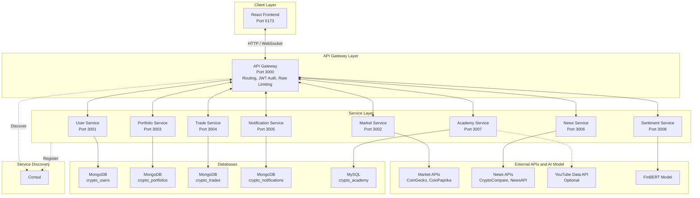
```mermaid
flowchart TB
    subgraph Client["Client Layer"]
        FE["React Frontend<br/>Port 5173"]
    end

    subgraph Gateway["API Gateway Layer"]
        GW["API Gateway<br/>Port 3000<br/>Routing, JWT Auth, Rate Limiting"]
    end

    subgraph Services["Service Layer"]
        US["User Service<br/>Port 3001"]
        MS["Market Service<br/>Port 3002"]
        PS["Portfolio Service<br/>Port 3003"]
        TS["Trade Service<br/>Port 3004"]
        NS["Notification Service<br/>Port 3005"]
        NEWS["News Service<br/>Port 3006"]
        AC["Academy Service<br/>Port 3007"]
        SENT["Sentiment Service<br/>Port 3008"]
    end

    subgraph External["External APIs and AI Model"]
        MARKETAPI["Market APIs<br/>CoinGecko, CoinPaprika"]
        NEWSAPI["News APIs<br/>CryptoCompare, NewsAPI"]
        YT["YouTube Data API<br/>Optional"]
        AI["FinBERT Model"]
    end

    subgraph Data["Databases"]
        DB1["MongoDB<br/>crypto_users"]
        DB2["MongoDB<br/>crypto_portfolios"]
        DB3["MongoDB<br/>crypto_trades"]
        DB4["MongoDB<br/>crypto_notifications"]
        DB5["MySQL<br/>crypto_academy"]
    end

    subgraph Discovery["Service Discovery"]
        CS["Consul"]
    end

    FE <-->|HTTP / WebSocket| GW

    GW <--> US
    GW <--> MS
    GW <--> PS
    GW <--> TS
    GW <--> NS
    GW <--> NEWS
    GW <--> AC
    GW <--> SENT

    MS --> MARKETAPI
    NEWS --> NEWSAPI
    AC -.-> YT
    SENT --> AI

    US --> DB1
    PS --> DB2
    TS --> DB3
    NS --> DB4
    AC --> DB5

    Services -.->|Register| CS
    GW -.->|Discover| CS
```

*Hình 3.8: Sơ đồ kiến trúc SOA tổng thể của hệ thống CryptoTrading.*

Trong sơ đồ trên, Frontend không gọi trực tiếp từng service mà đi qua API Gateway. Gateway đảm nhiệm routing, xác thực JWT, kiểm tra quyền admin, rate limit và orchestration. API Gateway, các service Node.js, hai service Spring Boot và Sentiment Service đều đăng ký với Consul để Gateway có thể discover service đang healthy khi chạy local.

Service Layer gồm tám service nghiệp vụ: User, Market, Portfolio, Trade, Notification, News, Academy và Sentiment. Các service không gọi thẳng endpoint nội bộ của nhau; khi cần phối hợp dữ liệu, request đi qua API Gateway. Ví dụ, News Service phân tích sentiment thông qua endpoint `/api/sentiment/analyze` của Gateway kèm `X-Internal-Service-Key`; Sentiment Service cũng lấy dữ liệu market/news cho AI Suggestion thông qua Gateway.

Phần `Databases` chỉ thể hiện các kho dữ liệu lâu dài. Các cache runtime của Market Service, News Service và Academy Service không đưa vào sơ đồ tổng thể để tránh làm hình rối; chúng được xem là tối ưu triển khai, không phải database chính. Chi tiết từng service được trình bày trong bảng phân rã service bên dưới.

### 3.2.2. Phân rã service

| Service | Trách nhiệm chính | Database |
|---|---|---|
| API Gateway | Xác thực, phân quyền, rate limit, proxy, orchestration. | Không |
| User Service | User, profile, role, balance, admin user. | MongoDB `users` |
| Market Service | Giá coin, giá một coin, chart data, cache, fallback API. | Không |
| Portfolio Service | Holding, giá trị danh mục, lãi/lỗ. | MongoDB `portfolios` |
| Trade Service | Lưu trade record và lịch sử giao dịch. | MongoDB `trades` |
| Notification Service | Notification, price alert, realtime event. | MongoDB `notifications`, `pricealerts` |
| News Service | Tin tức crypto, cache, filter, trending, sentiment badge. | Không |
| Academy Service | Course, learning path, progress, admin CRUD course. | MySQL `crypto_academy` |
| Sentiment Service | FinBERT inference, batch analyze, AI suggestion. | Không |

## 3.3. Thiết kế luồng xử lý

### 3.3.1. Luồng mua coin

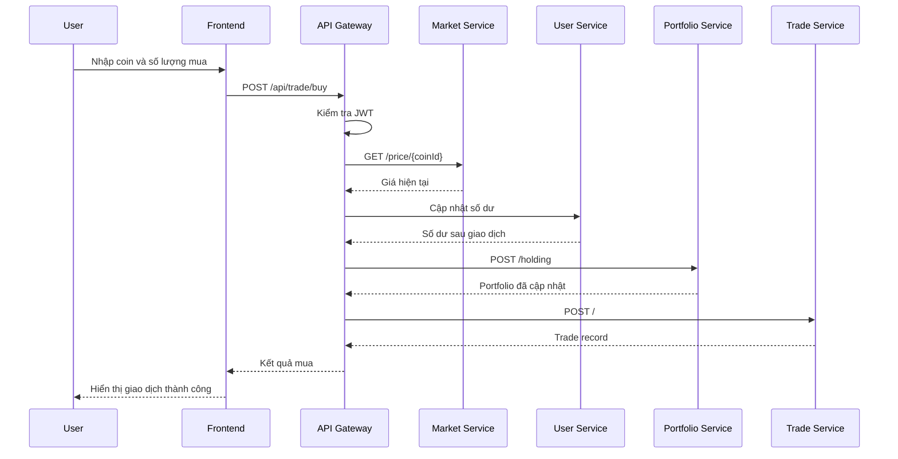
```mermaid
sequenceDiagram
    participant U as User
    participant FE as Frontend
    participant GW as API Gateway
    participant M as Market Service
    participant US as User Service
    participant P as Portfolio Service
    participant T as Trade Service

    U->>FE: Nhập coin và số lượng mua
    FE->>GW: POST /api/trade/buy
    GW->>GW: Kiểm tra JWT
    GW->>M: GET /price/{coinId}
    M-->>GW: Giá hiện tại
    GW->>US: Cập nhật số dư
    US-->>GW: Số dư sau giao dịch
    GW->>P: POST /holding
    P-->>GW: Portfolio đã cập nhật
    GW->>T: POST /
    T-->>GW: Trade record
    GW-->>FE: Kết quả mua
    FE-->>U: Hiển thị giao dịch thành công
```

*Hình 3.9: Sequence Diagram luồng mua coin ảo.*

### 3.3.2. Luồng đọc tin tức và gắn sentiment

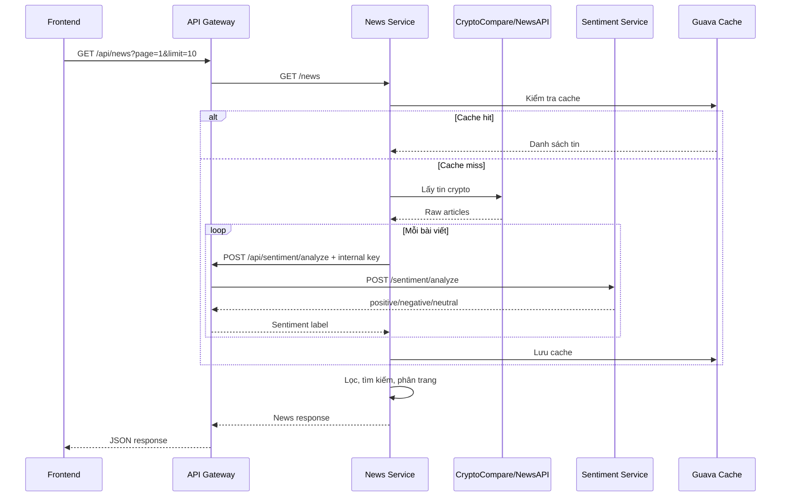
```mermaid
sequenceDiagram
    participant FE as Frontend
    participant GW as API Gateway
    participant N as News Service
    participant API as CryptoCompare/NewsAPI
    participant S as Sentiment Service
    participant C as Guava Cache

    FE->>GW: GET /api/news?page=1&limit=10
    GW->>N: GET /news
    N->>C: Kiểm tra cache
    alt Cache hit
        C-->>N: Danh sách tin
    else Cache miss
        N->>API: Lấy tin crypto
        API-->>N: Raw articles
        loop Mỗi bài viết
            N->>GW: POST /api/sentiment/analyze + internal key
            GW->>S: POST /sentiment/analyze
            S-->>GW: positive/negative/neutral
            GW-->>N: Sentiment label
        end
        N->>C: Lưu cache
    end
    N->>N: Lọc, tìm kiếm, phân trang
    N-->>GW: News response
    GW-->>FE: JSON response
```

*Hình 3.10: Sequence Diagram luồng lấy tin tức và gắn sentiment.*

### 3.3.3. Luồng AI Trade Suggestion

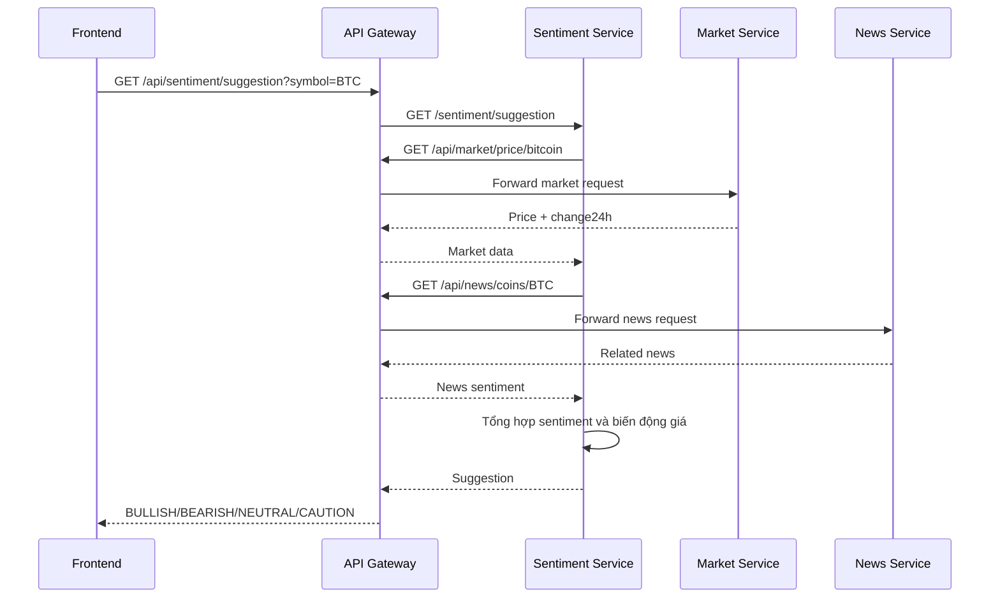
```mermaid
sequenceDiagram
    participant FE as Frontend
    participant GW as API Gateway
    participant S as Sentiment Service
    participant M as Market Service
    participant N as News Service

    FE->>GW: GET /api/sentiment/suggestion?symbol=BTC
    GW->>S: GET /sentiment/suggestion
    S->>GW: GET /api/market/price/bitcoin
    GW->>M: Forward market request
    M-->>GW: Price + change24h
    GW-->>S: Market data
    S->>GW: GET /api/news/coins/BTC
    GW->>N: Forward news request
    N-->>GW: Related news
    GW-->>S: News sentiment
    S->>S: Tổng hợp sentiment và biến động giá
    S-->>GW: Suggestion
    GW-->>FE: BULLISH/BEARISH/NEUTRAL/CAUTION
```

*Hình 3.11: Sequence Diagram luồng AI Trade Suggestion.*

### 3.3.4. Luồng học Academy và lưu tiến độ

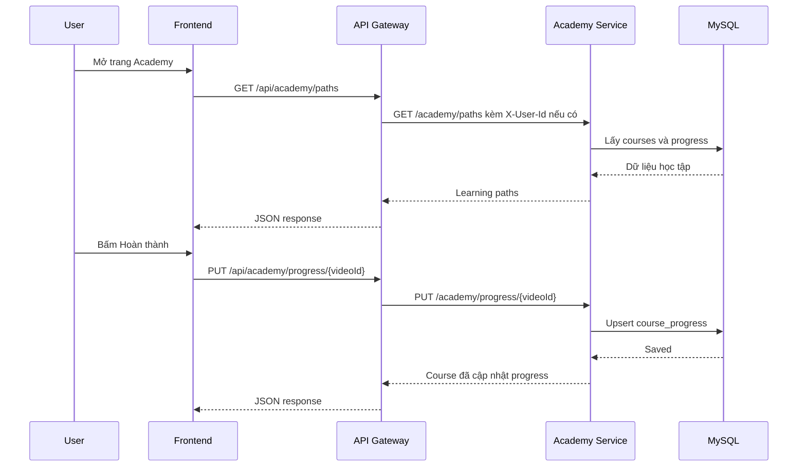
```mermaid
sequenceDiagram
    participant U as User
    participant FE as Frontend
    participant GW as API Gateway
    participant A as Academy Service
    participant DB as MySQL

    U->>FE: Mở trang Academy
    FE->>GW: GET /api/academy/paths
    GW->>A: GET /academy/paths kèm X-User-Id nếu có
    A->>DB: Lấy courses và progress
    DB-->>A: Dữ liệu học tập
    A-->>GW: Learning paths
    GW-->>FE: JSON response
    U->>FE: Bấm Hoàn thành
    FE->>GW: PUT /api/academy/progress/{videoId}
    GW->>A: PUT /academy/progress/{videoId}
    A->>DB: Upsert course_progress
    DB-->>A: Saved
    A-->>GW: Course đã cập nhật progress
    GW-->>FE: JSON response
```

*Hình 3.12: Sequence Diagram luồng học Academy và lưu tiến độ.*

### 3.3.5. Luồng admin thêm khóa học

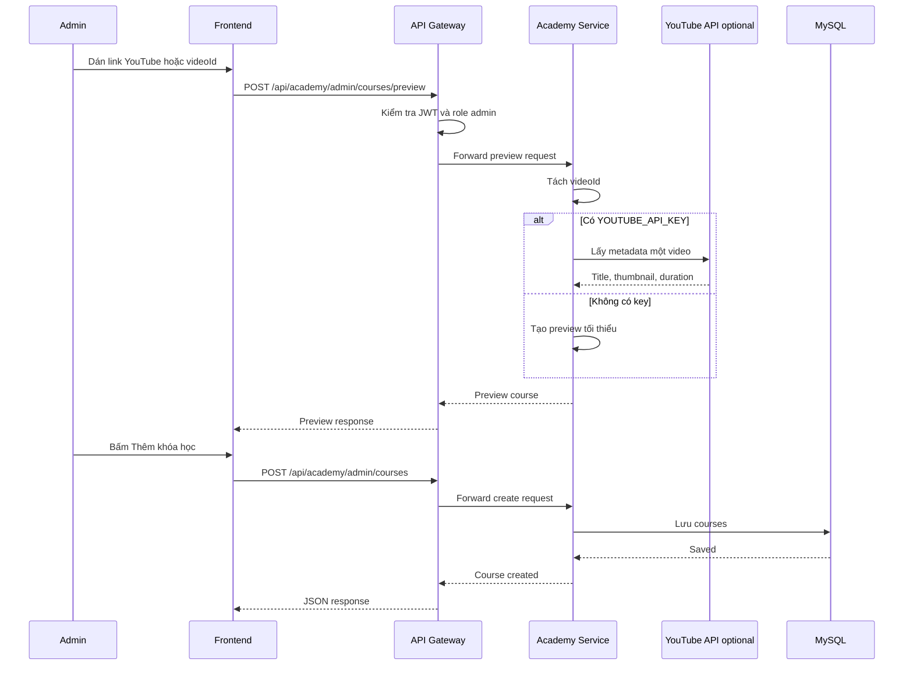
```mermaid
sequenceDiagram
    participant Admin as Admin
    participant FE as Frontend
    participant GW as API Gateway
    participant A as Academy Service
    participant YT as YouTube API optional
    participant DB as MySQL

    Admin->>FE: Dán link YouTube hoặc videoId
    FE->>GW: POST /api/academy/admin/courses/preview
    GW->>GW: Kiểm tra JWT và role admin
    GW->>A: Forward preview request
    A->>A: Tách videoId
    alt Có YOUTUBE_API_KEY
        A->>YT: Lấy metadata một video
        YT-->>A: Title, thumbnail, duration
    else Không có key
        A->>A: Tạo preview tối thiểu
    end
    A-->>GW: Preview course
    GW-->>FE: Preview response
    Admin->>FE: Bấm Thêm khóa học
    FE->>GW: POST /api/academy/admin/courses
    GW->>A: Forward create request
    A->>DB: Lưu courses
    DB-->>A: Saved
    A-->>GW: Course created
    GW-->>FE: JSON response
```

*Hình 3.13: Sequence Diagram luồng admin thêm khóa học Academy.*

### 3.3.6. Activity Diagram các luồng chính

Activity Diagram giúp mô tả luồng xử lý ở mức nghiệp vụ, không đi quá sâu vào chi tiết gọi hàm hay class. Trong báo cáo này, các Activity Diagram được chọn ở mức vừa đủ: đăng nhập, giao dịch, đọc tin tức và học Academy. Đây là các luồng đại diện cho bốn nhóm chức năng lớn của hệ thống.

#### Activity 1: Đăng nhập hệ thống

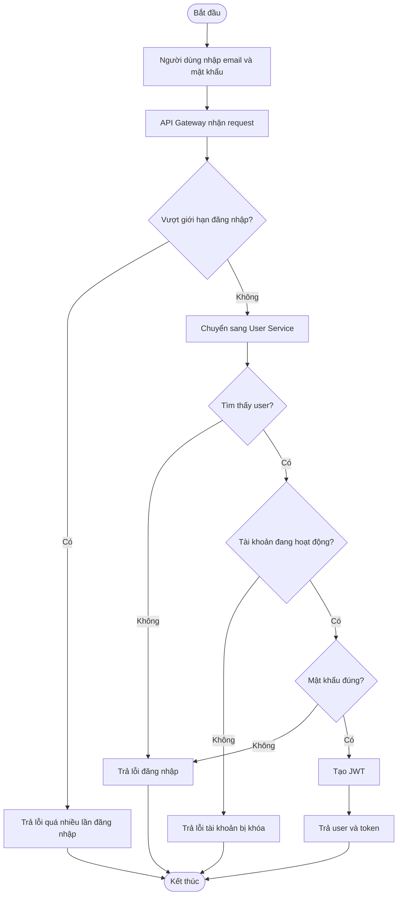
```mermaid
flowchart TD
    Start([Bắt đầu]) --> Input[Người dùng nhập email và mật khẩu]
    Input --> Gateway[API Gateway nhận request]
    Gateway --> RateLimit{Vượt giới hạn đăng nhập?}
    RateLimit -->|Có| TooMany[Trả lỗi quá nhiều lần đăng nhập]
    RateLimit -->|Không| UserService[Chuyển sang User Service]
    UserService --> FindUser{Tìm thấy user?}
    FindUser -->|Không| LoginFail[Trả lỗi đăng nhập]
    FindUser -->|Có| CheckActive{Tài khoản đang hoạt động?}
    CheckActive -->|Không| Blocked[Trả lỗi tài khoản bị khóa]
    CheckActive -->|Có| CheckPass{Mật khẩu đúng?}
    CheckPass -->|Không| LoginFail
    CheckPass -->|Có| Token[Tạo JWT]
    Token --> Success[Trả user và token]
    Success --> End([Kết thúc])
    LoginFail --> End
    TooMany --> End
    Blocked --> End
```

*Hình 3.14: Activity Diagram luồng đăng nhập hệ thống.*

#### Activity 2: Thực hiện giao dịch mua coin

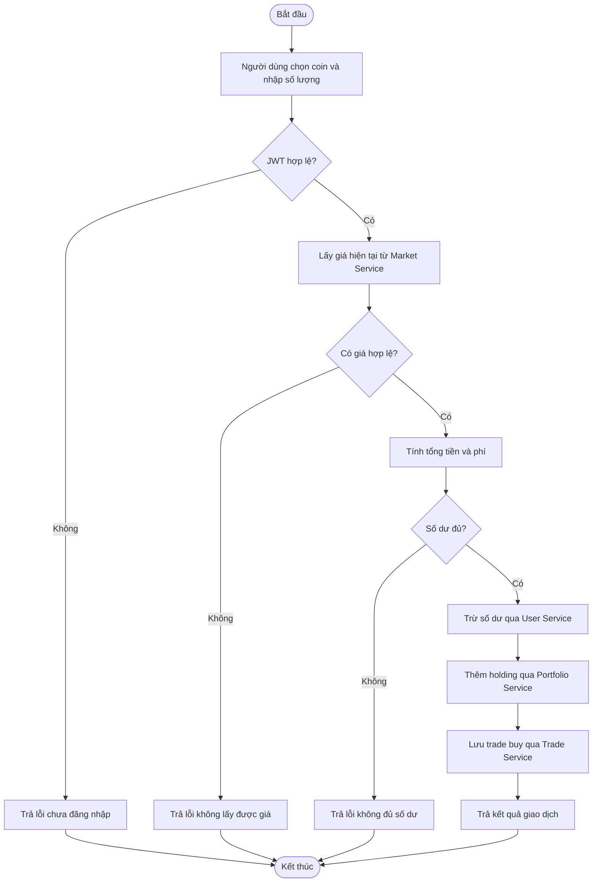
```mermaid
flowchart TD
    Start([Bắt đầu]) --> Input[Người dùng chọn coin và nhập số lượng]
    Input --> Auth{JWT hợp lệ?}
    Auth -->|Không| Unauthorized[Trả lỗi chưa đăng nhập]
    Auth -->|Có| GetPrice[Lấy giá hiện tại từ Market Service]
    GetPrice --> PriceOk{Có giá hợp lệ?}
    PriceOk -->|Không| PriceError[Trả lỗi không lấy được giá]
    PriceOk -->|Có| Calc[Tính tổng tiền và phí]
    Calc --> Balance{Số dư đủ?}
    Balance -->|Không| BalanceError[Trả lỗi không đủ số dư]
    Balance -->|Có| UpdateBalance[Trừ số dư qua User Service]
    UpdateBalance --> UpdatePortfolio[Thêm holding qua Portfolio Service]
    UpdatePortfolio --> SaveTrade[Lưu trade buy qua Trade Service]
    SaveTrade --> Success[Trả kết quả giao dịch]
    Success --> End([Kết thúc])
    Unauthorized --> End
    PriceError --> End
    BalanceError --> End
```

*Hình 3.15: Activity Diagram luồng giao dịch mua coin.*

#### Activity 3: Tải tin tức và xử lý sentiment

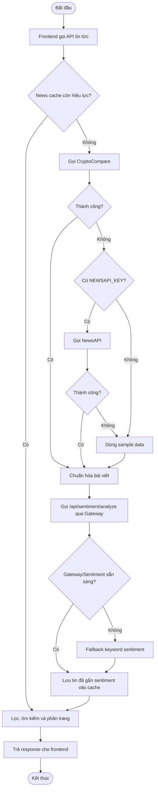
```mermaid
flowchart TD
    Start([Bắt đầu]) --> Request[Frontend gọi API tin tức]
    Request --> Cache{News cache còn hiệu lực?}
    Cache -->|Có| Filter[Lọc, tìm kiếm và phân trang]
    Cache -->|Không| CryptoCompare[Gọi CryptoCompare]
    CryptoCompare --> CCOk{Thành công?}
    CCOk -->|Có| Normalize[Chuẩn hóa bài viết]
    CCOk -->|Không| NewsApi{Có NEWSAPI_KEY?}
    NewsApi -->|Có| FetchNewsApi[Gọi NewsAPI]
    NewsApi -->|Không| Sample[Dùng sample data]
    FetchNewsApi --> NewsApiOk{Thành công?}
    NewsApiOk -->|Có| Normalize
    NewsApiOk -->|Không| Sample
    Sample --> Normalize
    Normalize --> Sentiment[Gọi /api/sentiment/analyze qua Gateway]
    Sentiment --> SentimentOk{Gateway/Sentiment sẵn sàng?}
    SentimentOk -->|Có| SaveCache[Lưu tin đã gắn sentiment vào cache]
    SentimentOk -->|Không| Keyword[Fallback keyword sentiment]
    Keyword --> SaveCache
    SaveCache --> Filter
    Filter --> Response[Trả response cho frontend]
    Response --> End([Kết thúc])
```

*Hình 3.16: Activity Diagram luồng tải tin tức và xử lý sentiment.*

#### Activity 4: Học Academy và lưu tiến độ

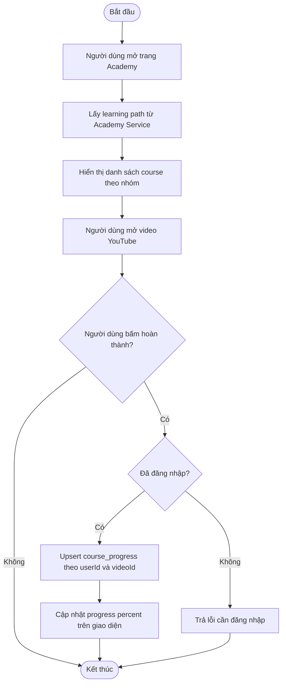
```mermaid
flowchart TD
    Start([Bắt đầu]) --> Open[Người dùng mở trang Academy]
    Open --> LoadPath[Lấy learning path từ Academy Service]
    LoadPath --> Show[Hiển thị danh sách course theo nhóm]
    Show --> Watch[Người dùng mở video YouTube]
    Watch --> Mark{Người dùng bấm hoàn thành?}
    Mark -->|Không| End([Kết thúc])
    Mark -->|Có| Auth{Đã đăng nhập?}
    Auth -->|Không| LoginRequired[Trả lỗi cần đăng nhập]
    Auth -->|Có| Save[Upsert course_progress theo userId và videoId]
    Save --> Refresh[Cập nhật progress percent trên giao diện]
    Refresh --> End
    LoginRequired --> End
```

*Hình 3.17: Activity Diagram luồng học Academy và lưu tiến độ.*

## 3.4. Thiết kế dữ liệu

### 3.4.1. Tổng quan database

Hệ thống dùng dữ liệu theo ranh giới service:

- User Service dùng MongoDB collection `users`.
- Portfolio Service dùng MongoDB collection `portfolios`.
- Trade Service dùng MongoDB collection `trades`.
- Notification Service dùng MongoDB collections `notifications` và `pricealerts`.
- Academy Service dùng MySQL database `crypto_academy`.
- Market Service không có database, dữ liệu lấy từ API ngoài và cache.
- News Service không có database, dữ liệu lấy từ API ngoài và cache trong RAM.
- Sentiment Service không có database, chỉ load model và xử lý inference.

### 3.4.2. ERD tổng quan

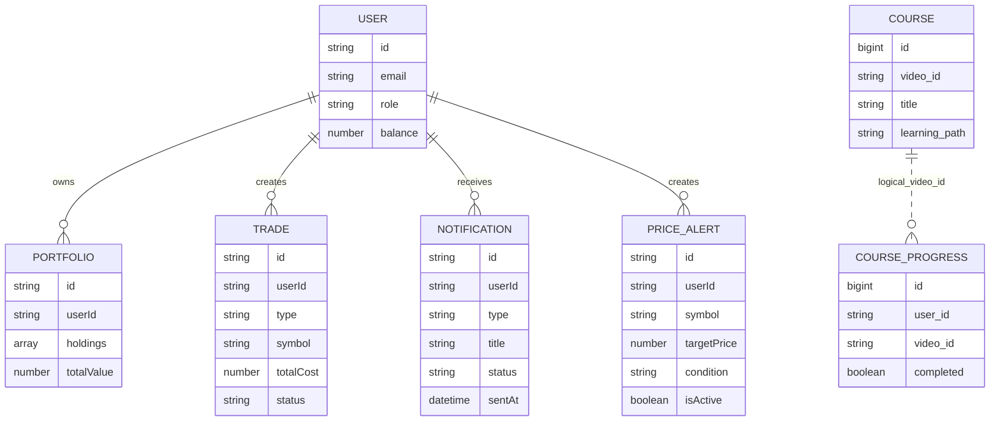
```mermaid
erDiagram
    USER {
        string id
        string email
        string role
        number balance
    }

    PORTFOLIO {
        string id
        string userId
        array holdings
        number totalValue
    }

    TRADE {
        string id
        string userId
        string type
        string symbol
        number totalCost
        string status
    }

    NOTIFICATION {
        string id
        string userId
        string type
        string title
        string status
        datetime sentAt
    }

    PRICE_ALERT {
        string id
        string userId
        string symbol
        number targetPrice
        string condition
        boolean isActive
    }

    COURSE {
        bigint id
        string video_id
        string title
        string learning_path
    }

    COURSE_PROGRESS {
        bigint id
        string user_id
        string video_id
        boolean completed
    }

    USER ||--o{ PORTFOLIO : owns
    USER ||--o{ TRADE : creates
    USER ||--o{ NOTIFICATION : receives
    USER ||--o{ PRICE_ALERT : creates
    COURSE ||..o{ COURSE_PROGRESS : logical_video_id
```

*Hình 3.18: ERD tổng quan dữ liệu của hệ thống CryptoTrading SOA.*

Ghi chú: `COURSE` và `COURSE_PROGRESS` có quan hệ logic qua `video_id`. Database hiện tại không khai báo foreign key vật lý giữa hai bảng này và code JPA không dùng `@ManyToOne`.

### 3.4.3. Bảng MongoDB của các service Node.js

| Collection | Service sở hữu | Trường chính trong code |
|---|---|---|
| `users` | User Service | `email`, `password`, `fullName`, `role`, `balance`, `isActive`, `balanceHistory`, `createdAt`, `updatedAt` |
| `portfolios` | Portfolio Service | `userId`, `holdings`, `totalValue`, `totalInvested`, `totalProfit`, `profitPercentage`, `lastCalculated`, `createdAt`, `updatedAt` |
| `trades` | Trade Service | `userId`, `type`, `symbol`, `coinId`, `coinName`, `amount`, `price`, `totalCost`, `fee`, `feePercentage`, `status`, `balanceBefore`, `balanceAfter`, `notes`, `errorMessage`, `executedAt`, `createdAt`, `updatedAt` |
| `notifications` | Notification Service | `userId`, `type`, `title`, `message`, `data`, `status`, `priority`, `channel`, `sentAt`, `readAt`, `createdAt`, `updatedAt` |
| `pricealerts` | Notification Service | `userId`, `symbol`, `coinId`, `targetPrice`, `condition`, `isActive`, `triggered`, `triggeredAt`, `lastChecked`, `createdAt`, `updatedAt` |

### 3.4.4. Bảng MySQL của Academy Service

| Bảng | Vai trò | Trường chính |
|---|---|---|
| `courses` | Lưu nội dung khóa học/video | `id`, `video_id`, `title`, `difficulty`, `category`, `learning_path`, `description`, `sort_order`, `created_at`, `updated_at` |
| `course_progress` | Lưu tiến độ học theo user | `id`, `user_id`, `video_id`, `completed`, `completed_at`, `updated_at` |

Trong `course_progress`, cặp `user_id + video_id` là unique để mỗi user chỉ có một trạng thái tiến độ cho một video.

## 3.5. Thiết kế API

### 3.5.1. Core API qua Gateway

| Method | Endpoint | Mô tả |
|---|---|---|
| POST | `/api/users/register` | Đăng ký tài khoản. |
| POST | `/api/users/login` | Đăng nhập, trả JWT. |
| GET | `/api/users/profile` | Lấy profile. |
| PUT | `/api/users/profile` | Cập nhật profile. |
| GET | `/api/users/balance` | Lấy số dư. |
| PUT | `/api/users/balance` | Cập nhật số dư qua User Service, chủ yếu dùng trong orchestration/internal flow. |
| GET | `/api/users/admin/users` | Admin xem danh sách user. |
| GET | `/api/users/admin/stats` | Admin xem thống kê. |
| PUT | `/api/users/admin/users/{userId}/toggle` | Admin khóa/mở user. |
| PUT | `/api/users/admin/users/{userId}/balance` | Admin cập nhật số dư. |
| DELETE | `/api/users/admin/users/{userId}` | Admin xóa user. |
| GET | `/api/market/prices` | Lấy danh sách giá coin. |
| GET | `/api/market/price/{coinId}` | Lấy giá một coin. |
| GET | `/api/market/chart/{coinId}` | Lấy dữ liệu biểu đồ. |
| GET | `/api/portfolio` | Lấy portfolio đã enrich giá hiện tại. |
| POST | `/api/trade/buy` | Mua coin ảo. |
| POST | `/api/trade/sell` | Bán coin ảo. |
| GET | `/api/trade/history` | Xem lịch sử giao dịch. |
| GET | `/api/health/circuit-breakers` | Xem trạng thái circuit breaker của trade orchestration. |
| GET | `/api/notifications` | Xem thông báo. |
| GET | `/api/notifications/unread-count` | Đếm thông báo chưa đọc. |
| PUT | `/api/notifications/read-all` | Đánh dấu tất cả đã đọc. |
| PUT | `/api/notifications/{id}/read` | Đánh dấu một thông báo đã đọc. |
| DELETE | `/api/notifications/{id}` | Xóa thông báo. |
| POST | `/api/notifications/alert` | Tạo price alert. |
| GET | `/api/notifications/alerts` | Xem price alert. |
| DELETE | `/api/notifications/alert/{id}` | Xóa price alert. |

### 3.5.2. News API

| Method | Endpoint | Mô tả |
|---|---|---|
| GET | `/api/news` | Lấy tin tức, hỗ trợ `page`, `limit`, `coin`, `sentiment`, `search`. |
| GET | `/api/news/trending` | Lấy tin trending theo lượt xem mô phỏng. |
| GET | `/api/news/coins/{coin}` | Lấy tin theo coin cụ thể. |
| GET | `/api/news/{id}` | Lấy chi tiết bài tin. |
| GET | `/api/news/health` | Health check và cache stats. |

### 3.5.3. Sentiment API

| Method | Endpoint | Mô tả |
|---|---|---|
| GET | `/api/sentiment/health` | Kiểm tra trạng thái service và model. |
| POST | `/api/sentiment/analyze` | Phân tích sentiment một đoạn text. |
| POST | `/api/sentiment/analyze-batch` | Phân tích nhiều đoạn text. |
| GET | `/api/sentiment/suggestion?symbol=BTC` | Gợi ý xu hướng coin. |

### 3.5.4. Academy API

| Method | Endpoint | Mô tả |
|---|---|---|
| GET | `/api/academy/health` | Health check. |
| GET | `/api/academy/courses` | Lấy danh sách course, hỗ trợ `category`, `difficulty`, `page`, `size`. |
| GET | `/api/academy/courses/{videoId}` | Lấy chi tiết course. |
| GET | `/api/academy/paths` | Lấy learning path kèm progress nếu có user. |
| PUT | `/api/academy/progress/{videoId}` | Lưu trạng thái hoàn thành/chưa hoàn thành. |
| POST | `/api/academy/admin/courses/preview` | Admin preview course từ YouTube URL/videoId. |
| POST | `/api/academy/admin/courses` | Admin thêm course. |
| PUT | `/api/academy/admin/courses/{id}` | Admin sửa course. |
| DELETE | `/api/academy/admin/courses/{id}` | Admin xóa course. |

### 3.5.5. Endpoint proxy/nội bộ phục vụ orchestration

Ngoài các endpoint người dùng thao tác trực tiếp, source code còn có một số endpoint proxy được dùng bởi API Gateway orchestration hoặc phục vụ nghiệp vụ nội bộ. Các endpoint này vẫn đi qua Gateway hoặc được chính Gateway gọi đến service đích, không phải service tự ý truy cập database của service khác.

| Method | Endpoint | Vai trò |
|---|---|---|
| PUT | `/api/users/balance` | Cập nhật balance của user trong luồng mua/bán hoặc thao tác nội bộ có kiểm soát. |
| POST | `/api/portfolio/holding` | Thêm/cập nhật holding khi mua coin. |
| PUT | `/api/portfolio/holding` | Giảm holding khi bán coin hoặc rollback. |
| POST | `/api/trade` | Lưu trade record sau khi Gateway đã xử lý nghiệp vụ mua/bán. |
| POST | `/api/notifications/send` | Tạo notification từ các luồng nghiệp vụ như giao dịch hoặc price alert. |

### 3.5.6. Chuẩn API response

Các API trong hệ thống trả dữ liệu theo JSON. Tùy service, response có thể khác nhau đôi chút, nhưng nhìn chung đều xoay quanh các trường chính:

- `success`: cho biết request thành công hay thất bại.
- `message`: thông báo ngắn gọn cho client.
- `data`: dữ liệu nghiệp vụ trả về.
- `error`: thông tin lỗi nếu request thất bại.
- `pagination`: thông tin phân trang nếu endpoint trả danh sách.

Ví dụ response đăng nhập thành công:

```json
{
  "success": true,
  "message": "Login successful",
  "data": {
    "user": {
      "_id": "user-id",
      "email": "admin@example.com",
      "fullName": "System Administrator",
      "role": "admin",
      "balance": 1000
    },
    "token": "jwt-token"
  }
}
```

Ví dụ response danh sách tin tức:

```json
{
  "success": true,
  "data": {
    "news": [
      {
        "id": "news-id",
        "title": "Bitcoin market update",
        "summary": "Article summary",
        "source": "CryptoCompare",
        "sentiment": "positive",
        "coins": ["BTC"]
      }
    ],
    "pagination": {
      "page": 1,
      "limit": 10,
      "total": 50,
      "pages": 5,
      "hasNext": true,
      "hasPrev": false
    }
  }
}
```

Ví dụ response Academy learning path:

```json
{
  "success": true,
  "message": "Learning paths fetched successfully",
  "data": [
    {
      "id": "FOUNDATIONS",
      "title": "Crypto Foundations",
      "totalCourses": 4,
      "completedCourses": 1,
      "progressPercent": 25,
      "courses": []
    }
  ]
}
```

### 3.5.7. Quy tắc xác thực API

API Gateway chia route thành bốn nhóm bảo vệ:

| Nhóm route | Middleware | Ý nghĩa |
|---|---|---|
| Public auth | Login/register rate limiter | Đăng ký và đăng nhập không cần JWT nhưng bị giới hạn số lần gọi. |
| Protected route | `authMiddleware` | Bắt buộc có JWT hợp lệ. |
| Admin route | `authMiddleware` + `adminMiddleware` | Bắt buộc đăng nhập và user phải có role `admin`. |
| Optional auth | `optionalAuth` | Có token thì lấy user context, không có token vẫn cho xem dữ liệu public. |
| Internal or auth | `internalOrAuth` | Chấp nhận JWT hoặc `X-Internal-Service-Key`. |

Các route News hiện tại được public vì tin tức có thể xem mà không cần đăng nhập. Các route Academy xem course/learning path dùng `optionalAuth`; nếu user đã đăng nhập thì service có thêm `X-User-Id` để trả progress, nếu chưa đăng nhập thì vẫn xem được danh sách khóa học nhưng không có progress cá nhân. Route `/api/academy/progress` bắt buộc đăng nhập vì tiến độ học thuộc về từng user. Route `/api/academy/admin` bắt buộc quyền admin. Riêng `/api/sentiment/health` public để kiểm tra trạng thái service, còn các route sentiment phân tích/gợi ý dùng `internalOrAuth`, nghĩa là chấp nhận JWT của user hoặc `X-Internal-Service-Key` cho request nội bộ qua Gateway.

### 3.5.8. Giao tiếp nội bộ qua API Gateway

Một số chức năng không chỉ gọi một service đơn lẻ mà cần phối hợp nhiều service:

- Mua/bán coin: Gateway gọi Market, User, Portfolio và Trade.
- Xem portfolio: Gateway gọi Portfolio, sau đó lấy giá hiện tại từ Market để enrich dữ liệu.
- Price alert checker: Notification Service gọi API Gateway để lấy giá từ Market Service bằng internal service key.
- News sentiment: News Service gọi API Gateway endpoint `/api/sentiment/analyze` bằng internal service key; Gateway discover Sentiment Service qua Consul rồi proxy request.
- AI Suggestion: Sentiment Service gọi API Gateway để lấy dữ liệu giá và tin tức liên quan.

Trong thiết kế này, service không tùy tiện truy cập database của service khác và không gọi thẳng endpoint nội bộ của service khác. Khi cần dữ liệu thuộc service khác, request đi qua API Gateway. Cách này giúp hệ thống đồng bộ hơn với nguyên tắc loose coupling của SOA: service chỉ biết contract qua Gateway, còn địa chỉ service thật được Gateway xử lý bằng Consul service discovery. Các lời gọi trực tiếp còn lại là hợp lệ vì thuộc một trong ba nhóm: API Gateway proxy/orchestration đến service đích, service gọi API bên ngoài như CoinGecko/CryptoCompare/NewsAPI/YouTube, hoặc service dùng tài nguyên nội bộ của chính nó như cache/model FinBERT/self warm cache.

### 3.5.9. Mapping route qua API Gateway

API Gateway có hai kiểu rewrite path:

- Với các service Node.js/Express, Gateway bỏ prefix `/api/{service}`. Ví dụ `/api/users/profile` được chuyển thành `/profile` ở User Service.
- Với News, Academy và Sentiment, controller đã có prefix `/news`, `/academy`, `/sentiment`, nên Gateway chỉ bỏ `/api`. Ví dụ `/api/news/health` được chuyển thành `/news/health`.

Một số mapping quan trọng:

| Frontend gọi | Gateway chuyển đến |
|---|---|
| `/api/users/login` | User Service `/login` |
| `/api/market/prices` | Market Service `/prices` |
| `/api/portfolio` | Portfolio orchestration hoặc Portfolio Service `/` |
| `/api/trade/buy` | Trade orchestration tại Gateway |
| `/api/notifications/alert` | Notification Service `/alert` |
| `/api/news` | News Service `/news` |
| `/api/academy/paths` | Academy Service `/academy/paths` |
| `/api/sentiment/suggestion` | Sentiment Service `/sentiment/suggestion` |

## 3.6. Thiết kế chi tiết các service

### 3.6.1. API Gateway

API Gateway là lớp trung gian giữa frontend và toàn bộ backend service. Frontend chỉ cần gọi một base URL duy nhất là `http://localhost:3000/api`, sau đó Gateway sẽ định tuyến request đến service tương ứng. Gateway được xây dựng bằng Node.js/Express, dùng `http-proxy-middleware` để proxy request và dùng Consul để discover địa chỉ service khi chạy local.

Khi khởi động, API Gateway cũng tự đăng ký chính nó vào Consul với service name `api-gateway`. Điều này giúp màn hình Consul thể hiện đầy đủ các thành phần đang chạy, đồng thời giữ cách vận hành nhất quán với các service nghiệp vụ phía sau Gateway.

Các trách nhiệm chính của API Gateway:

- Áp dụng middleware bảo mật như `helmet`, CORS và logging bằng `morgan`.
- Áp dụng global rate limit cho toàn bộ route `/api`.
- Áp dụng rate limit riêng cho đăng nhập và đăng ký.
- Kiểm tra JWT với các route cần xác thực.
- Kiểm tra role admin với các route quản trị.
- Forward `X-User-Id` sang service cần biết user hiện tại.
- Hỗ trợ `X-Internal-Service-Key` cho các request nội bộ như News Service gọi Sentiment hoặc Sentiment Service gọi Market/News qua Gateway.
- Thực hiện orchestration cho luồng mua/bán coin.
- Thực hiện enrich portfolio bằng cách kết hợp Portfolio Service và Market Service.

Gateway có hai loại route:

- Route proxy thông thường: ví dụ `/api/users`, `/api/market`, `/api/news`, `/api/academy`.
- Route orchestration: ví dụ `/api/trade/buy`, `/api/trade/sell`, `/api/portfolio`.

Điểm quan trọng trong thiết kế là Gateway không lưu dữ liệu nghiệp vụ. Nó chỉ điều phối, kiểm tra quyền và chuyển request. Nhờ vậy, logic dữ liệu vẫn nằm trong service sở hữu dữ liệu.

### 3.6.2. User Service

User Service chạy ở port `3001`, được xây dựng bằng Node.js/Express và sử dụng MongoDB thông qua Mongoose. Service này quản lý tài khoản người dùng, thông tin profile, role, trạng thái tài khoản và ví ảo USDT.

Schema `User` gồm các nhóm trường chính:

- `email`: định danh đăng nhập, unique.
- `password`: mật khẩu đã hash bằng bcrypt.
- `fullName`: họ tên người dùng.
- `role`: `user` hoặc `admin`.
- `balance`: số dư ví ảo, mặc định lấy từ biến môi trường `INITIAL_BALANCE` hoặc 1000.
- `isActive`: trạng thái tài khoản.
- `balanceHistory`: lịch sử thay đổi số dư.

Các API chính:

- `POST /register`: tạo tài khoản mới.
- `POST /login`: đăng nhập.
- `GET /profile`: lấy thông tin user.
- `PUT /profile`: cập nhật thông tin cá nhân.
- `GET /balance`: lấy số dư.
- `PUT /balance`: cập nhật số dư nội bộ khi giao dịch.
- Các route `/admin/...`: phục vụ quản lý user.

User Service là service sở hữu dữ liệu người dùng. Các service khác không truy cập trực tiếp collection `users`; nếu cần nghiệp vụ liên quan user thì request đi qua API Gateway hoặc do chính API Gateway orchestration/admin middleware gọi User Service.

### 3.6.3. Market Service

Market Service chạy ở port `3002`, chịu trách nhiệm cung cấp dữ liệu thị trường cho Dashboard, Trade, Coin Detail, Portfolio và AI Suggestion. Các màn hình/service khác lấy dữ liệu Market thông qua API Gateway. Service không có database riêng vì dữ liệu giá được lấy từ API ngoài và cache trong bộ nhớ.

Các coin được hỗ trợ trong cấu hình hiện tại gồm:

- BTC - bitcoin.
- ETH - ethereum.
- BNB - binancecoin.
- SOL - solana.
- XRP - ripple.
- ADA - cardano.
- DOGE - dogecoin.
- DOT - polkadot.

Market Service có ba endpoint chính:

- `GET /prices`: lấy giá hiện tại của tất cả coin được hỗ trợ.
- `GET /price/:coinId`: lấy giá một coin.
- `GET /chart/:coinId`: lấy dữ liệu biểu đồ theo số ngày.

Cơ chế cache:

- Dữ liệu giá được lưu trong NodeCache.
- `getCoinPrice` ưu tiên đọc từ cache của `/prices` trước để giảm số lần gọi API ngoài.
- Nếu API ngoài lỗi, service ưu tiên trả dữ liệu cache nếu còn.

Cơ chế fallback:

- Dữ liệu giá chính lấy từ CoinGecko.
- Dữ liệu chart ưu tiên CoinGecko, fallback sang CoinPaprika khi CoinGecko lỗi.

### 3.6.4. Portfolio Service

Portfolio Service chạy ở port `3003`, quản lý danh mục coin đang nắm giữ của từng user. Service dùng MongoDB collection `portfolios`. Mỗi user có một portfolio, trong portfolio có mảng `holdings`.

Mỗi holding gồm:

- `symbol`: ký hiệu coin như BTC, ETH.
- `coinId`: định danh coin theo API thị trường.
- `name`: tên coin.
- `amount`: số lượng đang nắm giữ.
- `averageBuyPrice`: giá mua trung bình.
- `totalInvested`: tổng vốn đã đầu tư vào coin đó.
- `lastUpdated`: thời điểm cập nhật gần nhất.

Các API chính:

- `GET /`: lấy portfolio của user.
- `POST /holding`: thêm hoặc cập nhật holding, được Gateway gọi trong luồng mua.
- `PUT /holding`: giảm holding, được Gateway gọi trong luồng bán.

Portfolio Service có các method nghiệp vụ như `addOrUpdateHolding`, `reduceHolding`, `calculateValue`. Khi frontend gọi `/api/portfolio`, Gateway không chỉ lấy dữ liệu portfolio mà còn lấy giá hiện tại từ Market Service để tính tổng giá trị, tổng vốn, lãi/lỗ và phần trăm lợi nhuận.

### 3.6.5. Trade Service

Trade Service chạy ở port `3004`, quản lý lịch sử giao dịch. Trong thiết kế hiện tại, Trade Service không tự quyết định giao dịch có hợp lệ hay không; phần nghiệp vụ mua/bán được Gateway orchestration xử lý. Trade Service tập trung vào lưu record và trả lịch sử giao dịch.

Schema `Trade` gồm:

- `userId`: user thực hiện giao dịch.
- `type`: `buy` hoặc `sell`.
- `symbol`, `coinId`, `coinName`.
- `amount`, `price`, `totalCost`.
- `fee`, `feePercentage`.
- `status`: `pending`, `completed`, `failed`, `cancelled`.
- `balanceBefore`, `balanceAfter`.
- `executedAt`.

Các API chính:

- `POST /`: tạo trade record, thường do Gateway gọi nội bộ.
- `GET /history`: lấy lịch sử giao dịch của user.

Việc tách Trade Service như vậy giúp lịch sử giao dịch có ranh giới riêng, không bị trộn với portfolio hoặc user balance.

### 3.6.6. Notification Service

Notification Service chạy ở port `3005`, quản lý thông báo và cảnh báo giá. Service dùng MongoDB collections `notifications` và `pricealerts`.

Notification có các trường chính:

- `userId`: user nhận thông báo.
- `type`: `trade`, `price_alert`, `system`, `warning`.
- `title`, `message`.
- `status`: `unread`, `read`, `archived`.
- `priority`: `low`, `medium`, `high`, `urgent`.
- `channel`: hiện tại là `app`.

Price Alert có các trường chính:

- `userId`.
- `symbol`, `coinId`.
- `targetPrice`.
- `condition`: `above` hoặc `below`.
- `isActive`, `triggered`, `triggeredAt`, `lastChecked`.

Các API chính:

- `GET /`: lấy danh sách thông báo.
- `GET /unread-count`: đếm thông báo chưa đọc.
- `PUT /read-all`: đánh dấu tất cả đã đọc.
- `PUT /:id/read`: đánh dấu một thông báo đã đọc.
- `DELETE /:id`: xóa thông báo.
- `POST /alert`: tạo price alert.
- `GET /alerts`: lấy danh sách price alert.
- `DELETE /alert/:id`: xóa price alert.

Notification Service có tiến trình kiểm tra price alert định kỳ. Khi alert đạt điều kiện, service tạo notification và gửi realtime event qua Socket.IO để frontend có thể hiển thị ngay.

### 3.6.7. News Service

News Service là service Spring Boot chạy ở port `3006`. Service có nhiệm vụ lấy tin tức crypto, chuẩn hóa dữ liệu về model `News`, gắn sentiment, cache và cung cấp API cho frontend.

Luồng xử lý:

1. Gọi CryptoCompare để lấy tin.
2. Nếu CryptoCompare lỗi, thử NewsAPI nếu có `NEWSAPI_KEY`.
3. Nếu vẫn lỗi, trả dữ liệu mẫu để demo.
4. Trích xuất coin liên quan từ title/summary.
5. Gọi API Gateway endpoint `/api/sentiment/analyze` để phân tích sentiment bằng Sentiment Service.
6. Nếu Sentiment Service chưa chạy, dùng keyword fallback.
7. Lưu dữ liệu vào Guava Cache.
8. API trả dữ liệu có filter, search và pagination.

News Service không có database riêng vì dữ liệu tin tức là dữ liệu động từ nguồn ngoài và được cache trong bộ nhớ.

### 3.6.8. Sentiment Service

Sentiment Service là FastAPI service chạy ở port `3008`. Service load model `ProsusAI/finbert` khi khởi động. Model được giữ trong memory để các request sau xử lý nhanh hơn.

Khi khởi động, Sentiment Service dùng `consul_registry.py` để đăng ký service name `sentiment-service` vào Consul, health check tại `/sentiment/health`. API Gateway có thể discover Sentiment Service qua Consul khi proxy các endpoint `/api/sentiment/...`.

Service có hai nhóm nhiệm vụ:

- Phân tích sentiment văn bản: trả `label`, `score`, `scores`.
- Xây dựng AI Trade Suggestion: lấy giá từ Market Service và tin từ News Service thông qua API Gateway, tổng hợp sentiment và biến động giá 24h để trả tín hiệu.

Các tín hiệu gồm:

- `BULLISH`: sentiment/giá có xu hướng tích cực.
- `BEARISH`: sentiment/giá có xu hướng tiêu cực.
- `CAUTION`: dữ liệu mâu thuẫn hoặc cần thận trọng.
- `NEUTRAL`: chưa có xu hướng rõ.

Service không train model trong project. Đây là inference từ model pretrained và không phải lời khuyên đầu tư.

### 3.6.9. Academy Service

Academy Service là Spring Boot service chạy ở port `3007`, dùng MySQL database `crypto_academy`. Service quản lý khóa học/video và tiến độ học của user.

Chức năng chính:

- Lấy danh sách course có phân trang/lọc.
- Lấy learning path.
- Lấy chi tiết course theo `videoId`.
- Lưu tiến độ học theo `userId` và `videoId`.
- Cho admin thêm/sửa/xóa course.
- Preview metadata của một video YouTube nếu có `YOUTUBE_API_KEY`.

Hệ thống không import playlist YouTube. Admin quản lý khóa học bằng cách dán URL YouTube hoặc nhập trực tiếp `videoId`. YouTube API chỉ là phần bổ trợ để lấy metadata cho một video; nếu không có API key thì service vẫn hoạt động bằng dữ liệu admin nhập và dữ liệu seed.

## 3.7. Bảo mật và phân quyền

Các cơ chế bảo mật chính:

- Password được hash bằng bcrypt trong User Service.
- JWT được API Gateway kiểm tra trước khi forward request.
- Route admin bắt buộc qua `authMiddleware` và `adminMiddleware`.
- Request nội bộ qua Gateway có thể dùng `X-Internal-Service-Key`.
- Frontend Axios tự gắn token từ localStorage.
- Khi token hết hạn hoặc không hợp lệ, frontend chuyển về trang đăng nhập.

## 3.8. Các pattern kỹ thuật

| Pattern/Kỹ thuật | Vị trí áp dụng | Mục đích |
|---|---|---|
| API Gateway | `backend/api-gateway` | Điểm vào duy nhất, auth, proxy. |
| Service Discovery | Consul | Tìm service đang healthy. |
| Orchestration | Gateway trade/portfolio | Điều phối nhiều service trong một nghiệp vụ. |
| Circuit Breaker | Trade/Portfolio orchestration | Giảm lỗi dây chuyền khi service phụ lỗi. |
| Cache | Market, News, YouTubeProvider | Giảm gọi API ngoài, tăng tốc response. |
| Scheduler | News, Notification | Refresh tin tức, kiểm tra price alert. |
| Fallback | Market, News, SentimentAnalyzer | Demo ổn định khi nguồn ngoài lỗi. |
| WebSocket | API Gateway + Notification | Thông báo realtime. |

## 3.9. Đánh giá ranh giới SOA trong hệ thống

Một điểm quan trọng của kiến trúc hướng dịch vụ là mỗi service cần có trách nhiệm rõ ràng và tránh can thiệp trực tiếp vào dữ liệu nội bộ của service khác. Hệ thống CryptoTrading SOA đáp ứng nguyên tắc này theo các hướng sau:

- User Service sở hữu dữ liệu tài khoản, mật khẩu, role và balance.
- Portfolio Service sở hữu dữ liệu danh mục coin của từng user.
- Trade Service sở hữu lịch sử giao dịch.
- Notification Service sở hữu thông báo và cảnh báo giá.
- Academy Service sở hữu dữ liệu khóa học và tiến độ học.
- Market Service, News Service và Sentiment Service không cần database lâu dài vì dữ liệu chính của chúng đến từ API ngoài, cache hoặc model inference.

Khi một nghiệp vụ cần nhiều loại dữ liệu, hệ thống không cho service này đọc database của service khác. Ví dụ, khi mua coin, Gateway không truy cập trực tiếp MongoDB của User Service, Portfolio Service hay Trade Service. Gateway gọi API của từng service theo thứ tự nghiệp vụ. Điều này giúp mỗi service vẫn giữ được quyền sở hữu dữ liệu của mình.

### 3.9.1. Vì sao Academy có hai bảng nhưng không vi phạm SOA

Trong MySQL `crypto_academy`, Academy Service có hai bảng `courses` và `course_progress`. Điều này không vi phạm nguyên tắc SOA vì cả hai bảng đều thuộc cùng một ranh giới nghiệp vụ học tập:

- `courses` lưu nội dung bài học/video.
- `course_progress` lưu tiến độ học của user đối với từng video.

Nếu tách mỗi bảng thành một database hoặc một service riêng thì hệ thống sẽ phức tạp không cần thiết. Trong SOA, đơn vị phân tách chính là ranh giới nghiệp vụ, không phải bắt buộc mỗi bảng phải thành một service. Vì course và progress đều phục vụ Academy nên để chung trong một database của Academy Service là hợp lý.

### 3.9.2. Vì sao News Service không có database riêng

News Service lấy dữ liệu từ CryptoCompare, fallback sang NewsAPI và cuối cùng fallback bằng sample data. Dữ liệu tin tức được chuẩn hóa, gắn sentiment và lưu trong Guava Cache. Service không lưu database vì yêu cầu hiện tại là hiển thị tin mới cho giao diện, lọc/tìm kiếm/phân trang và phục vụ demo ổn định.

Nếu hệ thống phát triển thành bản production cần phân tích lịch sử tin tức dài hạn, lúc đó có thể bổ sung database riêng cho News Service. Tuy nhiên ở phạm vi hiện tại, việc chỉ dùng cache giúp code gọn hơn, giảm công việc vận hành database và vẫn đáp ứng đúng chức năng.

### 3.9.3. Vì sao Sentiment Service tách riêng bằng Python

Sentiment Service dùng FastAPI và HuggingFace Transformers để chạy model `ProsusAI/finbert`. Việc tách service này khỏi các service Node.js/Spring Boot giúp:

- Không làm nặng API Gateway hoặc News Service.
- Dễ quản lý dependency Python như `torch`, `transformers`, `fastapi`.
- Có thể thay model AI độc lập mà không ảnh hưởng service giao dịch.
- Có thể mở rộng riêng tài nguyên CPU/RAM cho service AI nếu cần.

Service này không train model trong project. Khi chạy, service load model pretrained và dùng model đó để inference văn bản. Vì vậy chức năng sentiment thuộc nhóm ứng dụng AI có sẵn, không phải huấn luyện dữ liệu từ đầu.

### 3.9.4. Vai trò của API Gateway trong việc giữ ranh giới

API Gateway là điểm vào chính của frontend. Gateway giúp frontend không cần biết địa chỉ từng service và cũng giúp gom các quy tắc chung:

- Kiểm tra JWT trước khi cho user truy cập route cần đăng nhập.
- Kiểm tra role admin trước các route quản trị.
- Áp dụng rate limit cho toàn bộ API và riêng login/register.
- Proxy request đến service phù hợp.
- Orchestrate các luồng nhiều service như mua/bán coin và enrich portfolio.

Nhờ Gateway, frontend chỉ cần gọi các endpoint dạng `/api/...`. Bên trong, Gateway quyết định route đó chuyển đến service nào và có cần kiểm tra quyền hay không.

## 3.10. Kịch bản kiểm tra chức năng

Các kịch bản kiểm tra dưới đây được dùng để xác nhận hệ thống chạy đúng khi demo local. Đây không phải test tự động toàn diện, nhưng là các bước smoke test quan trọng để kiểm tra luồng chính của từng service.

### 3.10.1. Kiểm tra hạ tầng chạy local

Trước khi kiểm tra chức năng, cần đảm bảo các thành phần nền đã chạy:

1. MySQL/XAMPP đang bật và có database `crypto_academy`.
2. MongoDB Atlas hoặc MongoDB local kết nối được theo biến môi trường.
3. Consul chạy tại `localhost:8500`.
4. API Gateway và các service backend chạy đúng port.
5. Frontend Vite chạy tại `localhost:5173`.

Các endpoint health check quan trọng:

```powershell
Invoke-WebRequest http://localhost:3000/health
Invoke-WebRequest http://localhost:3000/api/news/health
Invoke-WebRequest http://localhost:3000/api/academy/health
Invoke-WebRequest http://localhost:3000/api/sentiment/health
```

### 3.10.2. Kiểm tra nhóm tài khoản và phân quyền

Kịch bản kiểm tra:

1. Đăng nhập bằng tài khoản user thường.
2. Mở Dashboard, Trade, Portfolio, History.
3. Thử truy cập Admin Panel bằng user thường.
4. Đăng nhập bằng tài khoản admin.
5. Mở Admin Panel và kiểm tra danh sách user.

Kết quả mong đợi:

- User thường không được phép gọi API admin.
- Admin có thể xem danh sách user, thống kê và thao tác quản trị.
- JWT được frontend gắn vào request sau khi đăng nhập.

### 3.10.3. Kiểm tra nhóm giao dịch

Kịch bản kiểm tra:

1. Vào màn hình Trade.
2. Chọn một coin được hỗ trợ, ví dụ BTC hoặc ETH.
3. Nhập số lượng hợp lệ và bấm mua.
4. Kiểm tra balance giảm, portfolio tăng holding.
5. Vào History để kiểm tra giao dịch được lưu.
6. Thử bán một phần coin đã mua.

Kết quả mong đợi:

- Gateway lấy giá hiện tại từ Market Service.
- User Service cập nhật số dư.
- Portfolio Service cập nhật holding.
- Trade Service lưu lịch sử giao dịch.
- Nếu số dư không đủ hoặc số lượng bán vượt holding, hệ thống trả lỗi phù hợp.

### 3.10.4. Kiểm tra nhóm tin tức và sentiment

Kịch bản kiểm tra:

1. Mở trang Tin tức.
2. Xem danh sách tin mới nhất.
3. Chuyển sang tab trending.
4. Tìm kiếm theo từ khóa.
5. Lọc theo coin hoặc sentiment.
6. Mở chi tiết một bài viết.

Kết quả mong đợi:

- News Service trả danh sách bài viết có phân trang.
- Bài viết có nhãn sentiment nếu Sentiment Service khả dụng.
- Nếu API ngoài lỗi hoặc thiếu key, service vẫn có dữ liệu fallback để demo.
- Bộ lọc trên frontend không làm vỡ layout và không che chữ.

### 3.10.5. Kiểm tra AI Suggestion

Kịch bản kiểm tra:

1. Vào màn hình AI Suggestion.
2. Chọn symbol như BTC, ETH hoặc SOL.
3. Gọi API suggestion.
4. Đọc kết quả signal, reason, detail và disclaimer.

Kết quả mong đợi:

- Sentiment Service lấy dữ liệu giá từ Market Service thông qua Gateway.
- Sentiment Service lấy tin liên quan từ News Service thông qua Gateway.
- Kết quả trả về một trong các tín hiệu `BULLISH`, `BEARISH`, `CAUTION`, `NEUTRAL`.
- Giao diện hiển thị rõ đây chỉ là tín hiệu tham khảo, không phải lời khuyên đầu tư.

### 3.10.6. Kiểm tra Academy và Admin quản lý khóa học

Kịch bản kiểm tra user:

1. Mở trang Academy.
2. Chọn một learning path.
3. Mở video trong modal.
4. Bấm hoàn thành.
5. Tải lại trang và kiểm tra tiến độ vẫn còn.

Kịch bản kiểm tra admin:

1. Đăng nhập admin và mở Admin Panel.
2. Chọn tab Khóa học.
3. Dán link YouTube hoặc nhập `videoId`.
4. Bấm Preview.
5. Nhập hoặc chỉnh title, description, difficulty, category, learning path và sort order.
6. Thêm course.
7. Sửa course vừa thêm.
8. Xóa course nếu cần.

Kết quả mong đợi:

- Danh sách course lấy từ MySQL `crypto_academy`.
- Progress lưu theo `userId + videoId`.
- Admin CRUD course qua route `/api/academy/admin/...` và bắt buộc role admin.
- Nếu không có YouTube API key, preview có thể không đủ metadata phụ nhưng hệ thống vẫn thêm course được khi admin nhập thông tin chính.

---

# CHƯƠNG 4. GIAO DIỆN CHƯƠNG TRÌNH

## 4.1. Kiến trúc frontend

Frontend được xây dựng bằng React/Vite. Ứng dụng dùng React Router để điều hướng, Axios để gọi API Gateway, Socket.IO client để nhận thông báo realtime và Recharts để hiển thị biểu đồ.

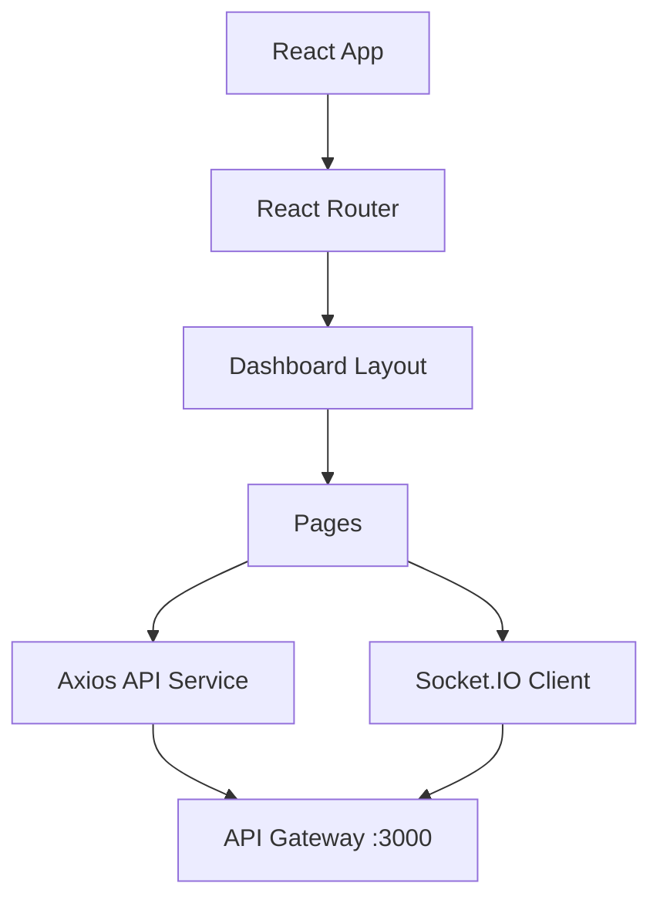
```mermaid
flowchart TB
    App[React App]
    Router[React Router]
    Layout[Dashboard Layout]
    Pages[Pages]
    API[Axios API Service]
    Socket[Socket.IO Client]
    Gateway[API Gateway :3000]

    App --> Router
    Router --> Layout
    Layout --> Pages
    Pages --> API
    Pages --> Socket
    API --> Gateway
    Socket --> Gateway
```

*Hình 4.1: Sơ đồ kiến trúc frontend React của hệ thống.*

## 4.2. Danh sách màn hình

| Màn hình | Chức năng |
|---|---|
| Auth | Đăng ký, đăng nhập. |
| Dashboard | Tổng quan tài khoản, giá coin, portfolio, tin tức nổi bật. |
| Trade | Chọn coin, nhập số lượng, mua/bán coin ảo. |
| Coin Detail | Xem thông tin và biểu đồ chi tiết của coin. |
| Portfolio | Xem holdings, tổng giá trị, lãi/lỗ và phân bổ. |
| History | Xem lịch sử giao dịch. |
| Notifications | Xem, đánh dấu đã đọc, xóa thông báo. |
| Tin tức | Xem tin crypto, lọc theo coin/sentiment, tìm kiếm, xem trending. |
| Academy | Xem learning path, video YouTube, đánh dấu hoàn thành. |
| AI Suggestion | Chọn coin và xem gợi ý xu hướng. |
| Settings | Cập nhật thông tin cá nhân, quản lý cảnh báo giá. |
| Admin Panel | Quản lý user và khóa học. |

## 4.3. Màn hình Dashboard

Dashboard là màn hình tổng quan sau khi đăng nhập. Màn hình hiển thị thông tin tài khoản, số dư, giá trị portfolio, một số coin nổi bật và các lối tắt đến chức năng chính như Trade, Portfolio, News và Academy.

Các thành phần chính của Dashboard:

- Khu vực thống kê nhanh gồm số dư, giá trị portfolio và tình trạng tài khoản.
- Danh sách giá coin nổi bật được lấy từ Market Service.
- Khu vực hiển thị tổng quan portfolio để người dùng thấy nhanh tài sản ảo đang nắm giữ.
- Khu vực tin tức nổi bật/trending để người dùng nắm bối cảnh thị trường.
- Lối tắt sang các màn hình Trade, Portfolio, News, Academy và AI Suggestion.

API thường được sử dụng:

- `GET /api/users/balance`.
- `GET /api/market/prices`.
- `GET /api/portfolio`.
- `GET /api/news/trending`.

Mục tiêu của Dashboard là cung cấp cái nhìn tổng quan, không thay thế các màn hình chi tiết. Người dùng có thể từ Dashboard chuyển nhanh sang Trade để giao dịch, Portfolio để xem danh mục, News để đọc tin hoặc Academy để học kiến thức nền.

## 4.4. Màn hình Trade

Màn hình Trade cho phép user chọn coin, xem giá hiện tại, nhập số lượng và chọn mua hoặc bán. Khi thực hiện giao dịch, frontend gọi:

- `POST /api/trade/buy`
- `POST /api/trade/sell`

Gateway xử lý orchestration, đảm bảo giao dịch cập nhật đồng bộ balance, portfolio và trade history.

Các thành phần chính của màn hình Trade:

- Danh sách coin được hỗ trợ.
- Thông tin giá hiện tại, biến động 24h và tên coin.
- Form nhập số lượng coin muốn mua hoặc bán.
- Chế độ giao dịch `buy` và `sell`.
- Khu vực hiển thị tổng tiền ước tính.
- Nút xác nhận giao dịch.

Frontend chỉ đóng vai trò nhập lệnh và hiển thị kết quả. Logic kiểm tra giao dịch không đặt ở frontend, vì frontend có thể bị người dùng chỉnh sửa. API Gateway mới là nơi lấy giá mới nhất, kiểm tra số dư hoặc holding và điều phối các service liên quan. Thiết kế này giúp giao dịch mô phỏng nhất quán hơn.

## 4.5. Màn hình Portfolio

Portfolio hiển thị danh sách coin đang nắm giữ, số lượng, giá mua trung bình, giá trị hiện tại và lãi/lỗ. API Gateway gọi Portfolio Service và Market Service để enrich dữ liệu bằng giá hiện tại.

Các thông tin chính trên màn hình Portfolio:

- Tổng giá trị danh mục hiện tại.
- Tổng vốn đã đầu tư.
- Lãi/lỗ tuyệt đối.
- Tỷ lệ lãi/lỗ.
- Danh sách holding theo từng coin.
- Giá mua trung bình và giá trị hiện tại của từng holding.
- Biểu đồ hoặc tỷ trọng phân bổ danh mục nếu dữ liệu đủ để hiển thị.

API sử dụng:

- `GET /api/portfolio`.

Điểm đáng chú ý là `/api/portfolio` không chỉ là route proxy đơn giản. Gateway lấy portfolio từ Portfolio Service, sau đó lấy giá hiện tại từ Market Service để tính toán thêm. Đây là ví dụ rõ ràng của orchestration trong hệ thống.

## 4.6. Màn hình Tin tức

Màn hình Tin tức hiển thị danh sách bài viết crypto. Người dùng có thể:

- Xem tin mới nhất.
- Xem tin trending.
- Tìm kiếm theo tiêu đề, tóm tắt hoặc nguồn.
- Lọc theo coin.
- Lọc theo sentiment.
- Mở chi tiết bài viết.

Sentiment được hiển thị dưới dạng nhãn tích cực, tiêu cực hoặc trung lập.

Các bộ lọc và thao tác chính:

- Tab tin mới nhất và tin trending.
- Ô tìm kiếm theo tiêu đề, tóm tắt hoặc nguồn tin.
- Bộ lọc coin như BTC, ETH, BNB, SOL, XRP, ADA, DOGE, DOT.
- Bộ lọc sentiment gồm `positive`, `negative`, `neutral`.
- Phân trang danh sách bài viết.
- Modal hoặc khu vực chi tiết để đọc thêm thông tin bài viết.

API sử dụng:

- `GET /api/news`.
- `GET /api/news/trending`.
- `GET /api/news/coins/{coin}`.
- `GET /api/news/{id}`.

Màn hình Tin tức giúp người dùng không chỉ nhìn giá mà còn nắm bối cảnh thị trường. Vì News Service có fallback qua NewsAPI và sample data, trang tin tức vẫn có thể phục vụ demo ngay cả khi API chính lỗi hoặc thiếu API key.

## 4.7. Màn hình AI Suggestion

Màn hình AI Suggestion cho phép người dùng chọn symbol như BTC, ETH, BNB, SOL, XRP, ADA, DOGE hoặc DOT. Frontend gọi Sentiment Service qua Gateway để lấy:

- Giá hiện tại.
- Biến động 24h.
- Sentiment tổng hợp từ tin tức liên quan.
- Tín hiệu tham khảo.
- Disclaimer không phải lời khuyên đầu tư.

API sử dụng:

- `GET /api/sentiment/suggestion?symbol=BTC`.

Kết quả hiển thị gồm:

- Symbol và coinId.
- Giá hiện tại và biến động 24h.
- Số lượng tin tức được dùng để tổng hợp sentiment.
- Phân phối sentiment theo positive, neutral, negative.
- Tín hiệu gợi ý như BULLISH, BEARISH, CAUTION hoặc NEUTRAL.
- Lý do ngắn gọn và phần giải thích chi tiết.
- Disclaimer để nhấn mạnh đây không phải lời khuyên đầu tư.

Chức năng này không tự động mua/bán coin và không dự đoán giá tương lai. Nó chỉ tổng hợp dữ liệu hiện có để người dùng tham khảo trước khi tự quyết định thao tác trong màn hình Trade.

## 4.8. Màn hình Academy

Academy hiển thị các learning path, mỗi path gồm nhiều video YouTube. Người dùng có thể mở video trong modal và tự đánh dấu hoàn thành. Progress được lưu theo từng user, giúp khi quay lại hệ thống vẫn biết bài nào đã học.

Các learning path hiện tại gồm:

- Crypto Foundations.
- Wallet & Security.
- DeFi & Altcoins.
- Trading Basics.
- Risk Control.

API sử dụng:

- `GET /api/academy/paths`.
- `GET /api/academy/courses`.
- `GET /api/academy/courses/{videoId}`.
- `PUT /api/academy/progress/{videoId}`.

Các thành phần giao diện chính:

- Danh sách learning path để người dùng chọn nhóm kiến thức.
- Danh sách video theo learning path.
- Thumbnail, title, difficulty, category và mô tả ngắn của course.
- Modal xem video YouTube.
- Nút đánh dấu hoàn thành/chưa hoàn thành.
- Thanh tiến độ tổng số bài đã hoàn thành.

Nếu người dùng chưa đăng nhập, hệ thống vẫn có thể hiển thị danh sách course public. Tuy nhiên, chức năng lưu progress cần JWT vì tiến độ học thuộc về từng user cụ thể.

## 4.9. Admin Panel

Admin Panel có hai nhóm chính:

- Quản lý người dùng: xem danh sách, xem thống kê, khóa/mở tài khoản, cập nhật số dư, xóa user.
- Quản lý khóa học: preview video YouTube, thêm course, sửa course, xóa course, lọc theo category/difficulty.

Admin thêm course bằng link YouTube hoặc `videoId`, sau đó nhập title, description, difficulty, category, learning path và sort order.

### 4.9.1. Tab quản lý người dùng

Tab quản lý người dùng phục vụ các thao tác admin liên quan đến tài khoản. Frontend gọi các endpoint admin của User Service thông qua API Gateway. Các route này bắt buộc có JWT hợp lệ và role `admin`.

Các thông tin hiển thị thường gồm:

- Danh sách user.
- Email và họ tên.
- Role của tài khoản.
- Trạng thái active/inactive.
- Balance hiện tại.
- Ngày tạo hoặc ngày cập nhật nếu API trả về.

Các thao tác chính:

- Tải lại danh sách user.
- Khóa hoặc mở khóa tài khoản.
- Cập nhật số dư ảo của user.
- Xóa tài khoản khi cần demo quản trị.

Khi user thường cố gọi route admin, API Gateway chặn bằng `adminMiddleware`. Vì vậy quyền quản trị không chỉ được ẩn trên giao diện mà còn được kiểm soát ở backend.

### 4.9.2. Tab quản lý khóa học Academy

Tab Khóa học là phần quản trị nội dung cho Academy Service. Mục tiêu của chức năng này là giúp admin không phải sửa code hoặc seed lại database mỗi khi muốn thêm video học mới. Admin chỉ cần dán link YouTube hoặc nhập `videoId`, sau đó điền thông tin course và lưu vào MySQL.

Form thêm/sửa khóa học gồm các trường chính:

- Link YouTube hoặc `videoId`.
- Tên khóa học.
- Cấp độ: `BEGINNER`, `INTERMEDIATE`, `ADVANCED`.
- Category, ví dụ `BLOCKCHAIN`, `SECURITY`, `DEFI`, `TRADING`.
- Learning path, ví dụ `FOUNDATIONS`, `SECURITY_BASICS`, `DEFI_ALTCOINS`, `TRADING_BASICS`.
- Sort order để sắp xếp thứ tự hiển thị trong learning path.
- Mô tả ngắn.

Danh sách course bên phải hiển thị:

- Thumbnail video.
- Title và description.
- Category, difficulty và learning path.
- `videoId` và `sort` để admin kiểm tra nhanh.
- Nút mở video YouTube.
- Nút sửa course.
- Nút xóa course.

### 4.9.3. Preview YouTube trong Admin

Nút Preview giúp admin kiểm tra nhanh link/videoId trước khi thêm course. Luồng xử lý hiện tại:

1. Admin dán link YouTube hoặc nhập `videoId`.
2. Frontend gọi `POST /api/academy/admin/courses/preview`.
3. Gateway kiểm tra JWT và role admin.
4. Academy Service tách `videoId` từ URL hoặc dùng trực tiếp `videoId`.
5. Nếu có `YOUTUBE_API_KEY`, `YouTubeProvider` gọi YouTube Data API để lấy metadata một video.
6. Nếu không có key hoặc API lỗi, service vẫn trả DTO tối thiểu dựa trên `videoId`.

Điểm quan trọng là preview không còn xử lý playlist. Hệ thống không import playlist YouTube hàng loạt. Cách hiện tại gọn hơn và phù hợp với phạm vi đề tài vì admin quản lý trực tiếp từng course trong MySQL.

### 4.9.4. Lý do bố cục Admin Panel

Giao diện Admin Panel được chia thành form bên trái và danh sách bên phải. Form bên trái phục vụ nhập dữ liệu; danh sách bên phải giúp admin nhìn ngay kết quả đang có trong database. Nếu danh sách course dài, khu vực bên phải có phân trang để tránh trang quá dài và giúp admin thao tác nhanh hơn.

Khoảng trống dưới form thêm course không phải lỗi chức năng. Đây là hệ quả của bố cục hai cột: danh sách course thường dài hơn form nhập. Khi cần làm giao diện cân bằng hơn, có thể bổ sung thêm một khối thống kê nhỏ ở dưới form, ví dụ tổng số course, số learning path hoặc ghi chú quản trị. Tuy nhiên bản hiện tại ưu tiên giữ giao diện gọn, dễ đọc code và không thêm thành phần trang trí không phục vụ nghiệp vụ.

## 4.10. Kịch bản demo giao diện

Khi trình bày hệ thống, nên demo theo thứ tự từ chức năng nền đến chức năng nâng cao để người xem dễ hiểu.

### 4.10.1. Demo nhóm chức năng giao dịch

1. Đăng nhập vào hệ thống.
2. Mở Dashboard để giới thiệu tổng quan tài khoản.
3. Mở Trade, chọn coin và thực hiện mua coin ảo.
4. Mở Portfolio để xem holding vừa được cập nhật.
5. Mở History để chứng minh giao dịch đã được lưu.
6. Mở Notifications hoặc Settings để giới thiệu cảnh báo giá.

Thứ tự này cho thấy rõ luồng chính: user có số dư ảo, mua coin, danh mục thay đổi và lịch sử giao dịch được lưu lại.

### 4.10.2. Demo nhóm tin tức và AI

1. Mở trang Tin tức.
2. Lọc theo coin hoặc sentiment.
3. Chuyển tab mới nhất/trending.
4. Mở AI Suggestion.
5. Chọn một symbol, ví dụ BTC.
6. Giải thích kết quả gồm giá hiện tại, sentiment tin tức, signal và disclaimer.

Khi demo phần này cần nhấn mạnh rằng AI Suggestion không phải bot giao dịch và không phải lời khuyên đầu tư. Chức năng này chỉ tổng hợp tin tức và giá để hỗ trợ người dùng tham khảo.

### 4.10.3. Demo Academy và quản trị khóa học

1. Mở Academy bằng user thường.
2. Chọn learning path và mở một video.
3. Đánh dấu hoàn thành để thấy progress thay đổi.
4. Đăng nhập admin.
5. Vào Admin Panel, tab Khóa học.
6. Dán link YouTube hoặc `videoId`, bấm Preview.
7. Thêm một course mới.
8. Quay lại Academy để thấy course mới xuất hiện.

Đây là phần thể hiện rõ Academy Service dùng MySQL và có CRUD quản trị. Nếu không cấu hình YouTube API key, vẫn có thể demo bằng cách nhập title/description thủ công.

## 4.11. Hướng dẫn chạy local

Trình tự chạy đề xuất:

1. Mở XAMPP và chạy MySQL.
2. Đảm bảo database MySQL `crypto_academy` tồn tại.
3. Bật Consul tại `localhost:8500`.
4. Mở VS Code tại thư mục project.
5. Chạy backend:

```powershell
cd backend
.\start-all-services.ps1
```

6. Chọn `Y` để script mở các cửa sổ service.
7. Chờ toàn bộ service khởi động.
8. Chạy frontend:

```powershell
cd frontend
npm run dev
```

9. Mở trình duyệt:

```text
http://localhost:5173
```

Consul nên được bật trước khi chạy backend vì API Gateway dùng Consul để tìm các service đang healthy. API Gateway, News Service, Academy Service, Sentiment Service và các service Node.js đều đăng ký Consul. Gateway vẫn có fallback local khi Consul chưa sẵn sàng, nhưng khi demo đầy đủ nên bật Consul trước.

Health check nhanh:

```powershell
Invoke-WebRequest http://localhost:3000/health
Invoke-WebRequest http://localhost:3000/api/news/health
Invoke-WebRequest http://localhost:3000/api/academy/health
Invoke-WebRequest http://localhost:3000/api/sentiment/health
```

---

# KẾT LUẬN

## Kết quả đạt được

Đề tài đã xây dựng được hệ thống CryptoTrading SOA với đầy đủ các nhóm chức năng chính của một ứng dụng giao dịch crypto mô phỏng:

- Có frontend web trực quan.
- Có API Gateway làm điểm vào duy nhất.
- Có nhiều service độc lập theo đúng ranh giới nghiệp vụ.
- Có xác thực JWT và phân quyền admin.
- Có dữ liệu giá thị trường, giao dịch ảo, portfolio, lịch sử và thông báo.
- Có tin tức crypto, sentiment AI và AI Trade Suggestion.
- Có Academy Service dùng MySQL để quản lý course và progress.
- Có cơ chế cache, scheduler, fallback và service discovery.

Về mặt kiến trúc, hệ thống thể hiện được khả năng mở rộng của SOA. Các service không bị gộp chung thành một khối lớn mà được tách theo trách nhiệm. Việc bổ sung News, Sentiment và Academy không làm thay đổi cấu trúc chính của các service giao dịch.

## Hạn chế

Một số hạn chế hiện tại:

- Hệ thống chủ yếu phục vụ demo local, chưa có pipeline deploy production hoàn chỉnh.
- Dữ liệu trading là mô phỏng, chưa kết nối sàn thật.
- News Service cache dữ liệu trong RAM, chưa có cơ chế lưu lịch sử tin dài hạn.
- Sentiment Service phụ thuộc model FinBERT, cần thời gian load model và tài nguyên CPU/RAM.
- AI Suggestion chỉ là tín hiệu tham khảo dựa trên rule, chưa phải mô hình dự đoán giá.
- Academy dùng video YouTube bên ngoài nên phụ thuộc quyền nhúng và trạng thái video của YouTube.

## Hướng phát triển

Các hướng phát triển tiếp theo:

- Docker hóa toàn bộ service để chạy đồng nhất hơn.
- Thêm API documentation bằng Swagger/OpenAPI cho toàn hệ thống.
- Bổ sung test tự động cho các luồng mua/bán, news, sentiment và academy.
- Lưu lịch sử tin tức vào database riêng nếu cần phân tích dài hạn.
- Thêm dashboard admin giám sát trạng thái service.
- Bổ sung recommendation học tập dựa trên tiến độ Academy.
- Nâng cấp AI Suggestion bằng cách kết hợp thêm chỉ báo kỹ thuật, khối lượng giao dịch và dữ liệu on-chain.
- Cấu hình deploy cloud, domain, HTTPS và monitoring.

## Bài học kinh nghiệm

Qua quá trình thực hiện đề tài, em rút ra một số bài học:

- Cần phân rã service theo trách nhiệm nghiệp vụ rõ ràng để tránh code phình và khó bảo trì.
- API Gateway giúp frontend đơn giản hơn, nhưng cần thiết kế route và auth middleware cẩn thận.
- Giao tiếp nội bộ giữa các service nên đi qua API Gateway để tránh phụ thuộc trực tiếp.
- Cache và fallback rất quan trọng khi hệ thống phụ thuộc API ngoài.
- Với AI service, nên tách riêng bằng Python để tận dụng hệ sinh thái machine learning.
- Tài liệu kỹ thuật cần bám sát code hiện tại, đặc biệt là endpoint, database và luồng xử lý.

---

# TÀI LIỆU THAM KHẢO

OASIS. (2006). Reference Model for Service Oriented Architecture 1.0.  
https://docs.oasis-open.org/soa-rm/v1.0/soa-rm.html

OASIS. (2012). Reference Architecture Foundation for Service Oriented Architecture Version 1.0.  
https://www.oasis-open.org/standard/soa-ra/

Newman, S. (2021). Building Microservices: Designing Fine-Grained Systems (2nd ed.). O'Reilly Media.  
https://www.oreilly.com/library/view/building-microservices-2nd/9781492034018/

Fowler, M., & Lewis, J. (2014). Microservices.  
https://martinfowler.com/articles/microservices.html

Node.js. (2026). Node.js Documentation.  
https://nodejs.org/docs/latest/api/

Express.js. (2026). Express.js Documentation.  
https://expressjs.com/en/

React. (2026). React Documentation.  
https://react.dev/

Vite. (2026). Vite Documentation.  
https://vite.dev/

MongoDB. (2026). MongoDB Documentation.  
https://www.mongodb.com/docs/

Mongoose. (2026). Mongoose Documentation.  
https://mongoosejs.com/docs/

MySQL. (2026). MySQL Documentation.  
https://dev.mysql.com/doc/

Spring. (2026). Spring Boot Reference Documentation.  
https://docs.spring.io/spring-boot/index.html

Spring Cloud. (2026). Spring Cloud Consul Reference Documentation.  
https://docs.spring.io/spring-cloud-consul/docs/current/reference/html/

HashiCorp. (2026). Consul Documentation.  
https://developer.hashicorp.com/consul/docs

FastAPI. (2026). FastAPI Documentation.  
https://fastapi.tiangolo.com/

Pydantic. (2026). Pydantic Documentation.  
https://pydantic.dev/docs/

Hugging Face. (2026). Transformers Documentation.  
https://huggingface.co/docs/transformers/en/index

ProsusAI. (n.d.). FinBERT model card. Hugging Face.  
https://huggingface.co/ProsusAI/finbert

CoinGecko. (2026). CoinGecko API Documentation.  
https://docs.coingecko.com/

CoinPaprika. (2026). CoinPaprika API Documentation.  
https://docs.coinpaprika.com/

CryptoCompare. (2026). How to use the CryptoCompare API.  
https://www.cryptocompare.com/coins/guides/how-to-use-our-api/

News API. (2026). News API Documentation.  
https://newsapi.org/docs

Google Developers. (2026). YouTube Data API v3 Documentation.  
https://developers.google.com/youtube/v3/docs

Socket.IO. (2026). Socket.IO Documentation.  
https://socket.io/docs/v4/

Grand View Research. (2026). Cryptocurrency Market Size & Share Report.  
https://www.grandviewresearch.com/industry-analysis/cryptocurrency-market-report
