# BÁO CÁO MÔN HỌC
# KIẾN TRÚC HƯỚNG DỊCH VỤ (SOA)

## ĐỀ TÀI: HỆ THỐNG GIAO DỊCH TIỀN ĐIỆN TỬ (CryptoTrading)

---

**Sinh viên thực hiện:** [Họ tên sinh viên]  
**MSSV:** [Mã số sinh viên]  
**Lớp:** [Tên lớp]  
**Giảng viên hướng dẫn:** [Tên giảng viên]

---

# MỤC LỤC

I. [Bài toán](#i-bài-toán)
II. [Phân tích chức năng của hệ thống](#ii-phân-tích-chức-năng-của-hệ-thống)
III. [Phân tích và thiết kế dữ liệu](#iii-phân-tích-và-thiết-kế-dữ-liệu)
IV. [Giao diện của hệ thống](#iv-giao-diện-của-hệ-thống)
  - IV.1. Giao diện API
  - IV.2. Giao diện người dùng
  - IV.3. Công nghệ Frontend *(MỚI)*
V. [Kết luận](#v-kết-luận)

---

# I. BÀI TOÁN

## I.1. Phát biểu bài toán

Trong bối cảnh thị trường tiền điện tử (cryptocurrency) ngày càng phát triển mạnh mẽ trên toàn cầu, nhu cầu về các nền tảng giao dịch tiền điện tử an toàn, nhanh chóng và dễ sử dụng ngày càng tăng cao. Tuy nhiên, các nền tảng giao dịch hiện tại gặp phải một số vấn đề:

**Các vấn đề hiện tại:**

1. **Hệ thống monolithic khó mở rộng:** Các hệ thống giao dịch truyền thống thường được xây dựng theo kiến trúc monolithic, khiến việc mở rộng quy mô khi lượng người dùng tăng cao trở nên khó khăn và tốn kém.

2. **Khó khăn trong bảo trì và cập nhật:** Khi toàn bộ logic nghiệp vụ nằm trong một ứng dụng duy nhất, việc sửa lỗi hoặc thêm tính năng mới có thể ảnh hưởng đến toàn bộ hệ thống.

3. **Single point of failure:** Nếu một phần của hệ thống gặp sự cố, toàn bộ ứng dụng có thể ngừng hoạt động.

4. **Khó tích hợp với các dịch vụ bên thứ ba:** Việc kết nối với các API cung cấp giá coin, dịch vụ thanh toán, hoặc hệ thống thông báo trở nên phức tạp.

**Giải pháp đề xuất:**

Xây dựng một hệ thống giao dịch tiền điện tử mô phỏng (paper trading) theo **kiến trúc hướng dịch vụ (SOA - Service-Oriented Architecture)**, trong đó:

- Hệ thống được chia thành các dịch vụ độc lập (services), mỗi dịch vụ đảm nhiệm một chức năng nghiệp vụ cụ thể.
- Các dịch vụ giao tiếp với nhau thông qua API Gateway.
- Hệ thống có khả năng mở rộng linh hoạt, dễ bảo trì và có tính sẵn sàng cao.

**Phạm vi bài toán:**

- Hệ thống cho phép người dùng đăng ký, đăng nhập và quản lý tài khoản.
- Người dùng được cấp số dư ảo (1000 USDT) để thực hiện giao dịch mua/bán coin.
- Hệ thống hiển thị giá coin real-time từ API bên ngoài (CoinGecko).
- Người dùng có thể xem danh mục đầu tư, lịch sử giao dịch và lãi/lỗ.
- Hệ thống hỗ trợ thông báo và cảnh báo giá.
- Có chức năng quản trị viên (Admin) để quản lý người dùng.

---

# II. PHÂN TÍCH CHỨC NĂNG CỦA HỆ THỐNG

## II.1. Xác định mục tiêu của hệ thống

### Mục tiêu tổng quát:

Xây dựng một nền tảng giao dịch tiền điện tử mô phỏng theo kiến trúc hướng dịch vụ, cho phép người dùng trải nghiệm việc mua bán coin mà không cần sử dụng tiền thật.

### Mục tiêu cụ thể:

| STT | Mục tiêu | Mô tả |
|-----|----------|-------|
| 1 | **Quản lý người dùng** | Cho phép đăng ký, đăng nhập, quản lý profile và số dư ảo |
| 2 | **Cung cấp dữ liệu thị trường** | Hiển thị giá coin real-time, biểu đồ lịch sử giá |
| 3 | **Thực hiện giao dịch** | Cho phép mua/bán coin với giá thực tế từ thị trường |
| 4 | **Quản lý danh mục đầu tư** | Theo dõi holdings, tính toán lãi/lỗ theo thời gian thực |
| 5 | **Ghi nhận lịch sử** | Lưu trữ và hiển thị lịch sử tất cả giao dịch |
| 6 | **Thông báo người dùng** | Gửi thông báo giao dịch, cảnh báo giá |
| 7 | **Quản trị hệ thống** | Cho phép admin quản lý users, xem thống kê |

## II.2. Yêu cầu chức năng và phi chức năng

### II.2.1. Yêu cầu chức năng (Functional Requirements)

**A. Chức năng xác thực và người dùng:**

| ID | Chức năng | Mô tả chi tiết |
|----|-----------|----------------|
| FR01 | Đăng ký tài khoản | Người dùng có thể tạo tài khoản với email, mật khẩu và họ tên |
| FR02 | Đăng nhập | Xác thực bằng email và mật khẩu, nhận JWT token |
| FR03 | Xem profile | Hiển thị thông tin cá nhân và số dư hiện tại |
| FR04 | Cập nhật profile | Cho phép thay đổi họ tên |
| FR05 | Xem lịch sử số dư | Hiển thị biến động số dư theo thời gian |

**B. Chức năng thị trường:**

| ID | Chức năng | Mô tả chi tiết |
|----|-----------|----------------|
| FR06 | Xem giá tất cả coins | Hiển thị danh sách coin với giá hiện tại và biến động 24h |
| FR07 | Xem chi tiết coin | Hiển thị thông tin chi tiết và biểu đồ giá của một coin |
| FR08 | Xem biểu đồ lịch sử | Hiển thị chart giá 7 ngày gần nhất |

**C. Chức năng giao dịch:**

| ID | Chức năng | Mô tả chi tiết |
|----|-----------|----------------|
| FR09 | Mua coin | Mua coin với số lượng chỉ định, trừ số dư, cộng holdings |
| FR10 | Bán coin | Bán coin đang sở hữu, cộng số dư, giảm holdings |
| FR11 | Xem lịch sử giao dịch | Hiển thị danh sách giao dịch với bộ lọc và phân trang |

**D. Chức năng danh mục đầu tư:**

| ID | Chức năng | Mô tả chi tiết |
|----|-----------|----------------|
| FR12 | Xem portfolio | Hiển thị holdings với giá hiện tại và P&L |
| FR13 | Tính toán lãi/lỗ | Tự động tính profit dựa trên giá mua trung bình và giá hiện tại |

**E. Chức năng thông báo:**

| ID | Chức năng | Mô tả chi tiết |
|----|-----------|----------------|
| FR14 | Xem thông báo | Hiển thị danh sách thông báo |
| FR15 | Đánh dấu đã đọc | Đánh dấu một hoặc tất cả thông báo đã đọc |
| FR16 | Xóa thông báo | Xóa thông báo không cần thiết |
| FR17 | Tạo cảnh báo giá | Đặt alert khi coin đạt giá mục tiêu |
| FR18 | Quản lý cảnh báo | Xem và xóa các cảnh báo giá đã tạo |

**F. Chức năng quản trị:**

| ID | Chức năng | Mô tả chi tiết |
|----|-----------|----------------|
| FR19 | Xem danh sách user | Admin xem tất cả người dùng |
| FR20 | Khóa/Mở khóa user | Toggle trạng thái active của user |
| FR21 | Cập nhật số dư user | Điều chỉnh số dư (+ hoặc -) của user |
| FR22 | Xóa user | Xóa tài khoản người dùng |
| FR23 | Xem thống kê hệ thống | Xem tổng user, tổng số dư, v.v. |

### II.2.2. Yêu cầu phi chức năng (Non-Functional Requirements)

| ID | Loại | Yêu cầu | Mô tả |
|----|------|---------|-------|
| NFR01 | **Hiệu năng** | Response time < 2s | Thời gian phản hồi API dưới 2 giây |
| NFR02 | **Hiệu năng** | Concurrent users | Hỗ trợ tối thiểu 100 người dùng đồng thời |
| NFR03 | **Bảo mật** | JWT Authentication | Xác thực người dùng bằng JSON Web Token |
| NFR04 | **Bảo mật** | Password hashing | Mã hóa mật khẩu bằng bcrypt |
| NFR05 | **Bảo mật** | Rate limiting | Giới hạn request để chống DDoS |
| NFR06 | **Khả dụng** | 99% uptime | Hệ thống hoạt động ổn định |
| NFR07 | **Khả dụng** | Circuit Breaker | Tự động ngắt kết nối khi service lỗi |
| NFR08 | **Mở rộng** | Horizontal scaling | Có thể mở rộng từng service độc lập |
| NFR09 | **Bảo trì** | Loose coupling | Các service ít phụ thuộc lẫn nhau |
| NFR10 | **Real-time** | WebSocket | Cập nhật dữ liệu real-time |

## II.3. Biểu đồ chức năng

**Biểu đồ Use Case tổng quan hệ thống:**

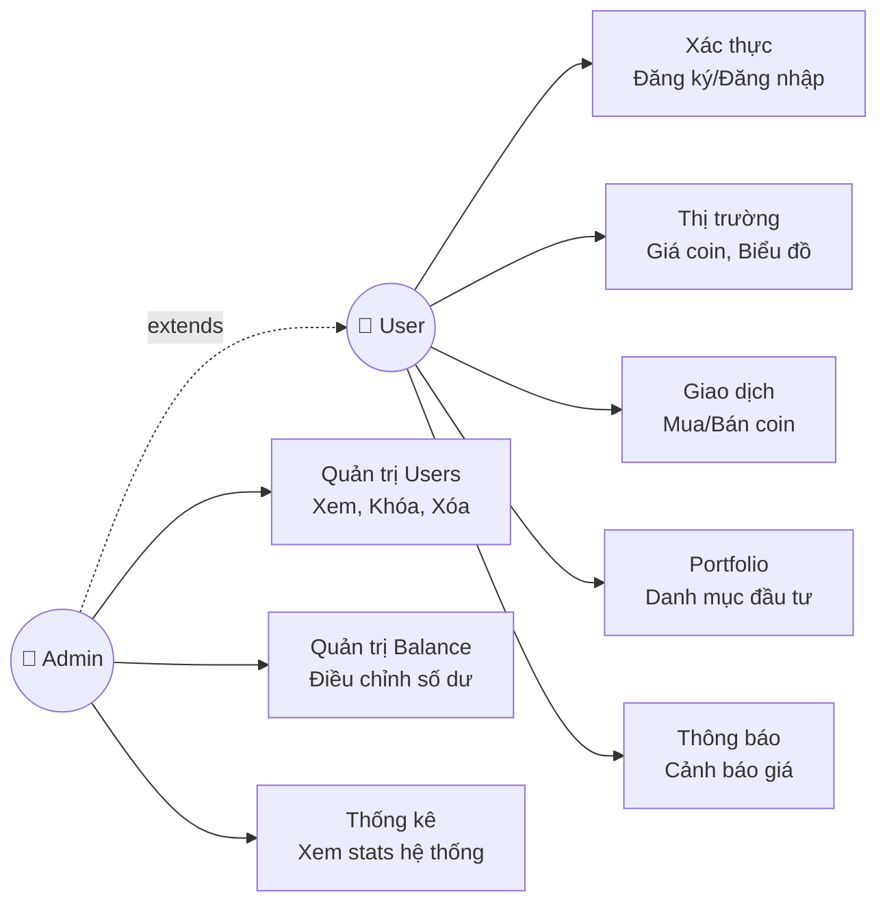
```mermaid
flowchart LR
    User((👤 User))
    Admin((👑 Admin))

    User --> A[Xác thực<br/>Đăng ký/Đăng nhập]
    User --> B[Thị trường<br/>Giá coin, Biểu đồ]
    User --> C[Giao dịch<br/>Mua/Bán coin]
    User --> D[Portfolio<br/>Danh mục đầu tư]
    User --> E[Thông báo<br/>Cảnh báo giá]

    Admin -.->|extends| User
    Admin --> F[Quản trị Users<br/>Xem, Khóa, Xóa]
    Admin --> G[Quản trị Balance<br/>Điều chỉnh số dư]
    Admin --> H[Thống kê<br/>Xem stats hệ thống]
```

**Chú thích:**
- **User**: Người dùng thông thường
- **Admin**: Kế thừa tất cả quyền của User (mũi tên đứt `extends`) + có thêm các chức năng quản trị
- Admin có thể: trade, xem portfolio, thông báo... như User + quản lý users, điều chỉnh balance

**Chi tiết các nhóm Use Case:**

| Nhóm | Use Cases | Service | Actor |
|------|-----------|---------|-------|
| **Xác thực** | Đăng ký, Đăng nhập, Profile, Số dư | User Service | User, Admin |
| **Thị trường** | Giá coins, Chi tiết coin, Biểu đồ | Market Service | User, Admin |
| **Giao dịch** | Mua coin, Bán coin, Lịch sử | Trade Orchestration | User, Admin |
| **Portfolio** | Xem holdings, Tính P&L | Portfolio Service | User, Admin |
| **Thông báo** | Xem/Xóa thông báo, Cảnh báo giá | Notification Service | User, Admin |
| **Quản trị Users** | Xem danh sách, Khóa/Mở khóa, Xóa | User Service | **Admin only** |
| **Quản trị Balance** | Điều chỉnh số dư user | User Service | **Admin only** |
| **Thống kê** | Xem thống kê hệ thống | User Service | **Admin only** |

---

## II.4. Phân rã chức năng con (dịch vụ)

### II.4.1. Nguyên tắc phân rã

Hệ thống được phân rã theo nguyên tắc **Single Responsibility Principle (SRP)** - mỗi dịch vụ chỉ đảm nhiệm một trách nhiệm nghiệp vụ duy nhất.

**Các dịch vụ được phân rã:**

| STT | Dịch vụ | Port | Trách nhiệm chính |
|-----|---------|------|-------------------|
| 0 | **API Gateway** | 3000 | Định tuyến, xác thực, orchestration |
| 1 | **User Service** | 3001 | Xác thực, quản lý người dùng, số dư |
| 2 | **Market Service** | 3002 | Dữ liệu giá coin từ API bên ngoài |
| 3 | **Portfolio Service** | 3003 | Quản lý danh mục đầu tư |
| 4 | **Trade Service** | 3004 | Ghi nhận lịch sử giao dịch |
| 5 | **Notification Service** | 3005 | Thông báo và cảnh báo giá |

**Sơ đồ kiến trúc hệ thống SOA:**

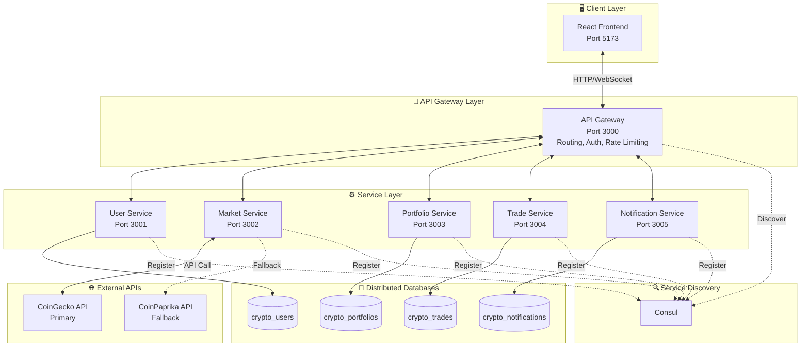
```mermaid
flowchart TB
    subgraph Client["🖥️ Client Layer"]
        FE[React Frontend<br/>Port 5173]
    end

    subgraph Gateway["🚪 API Gateway Layer"]
        GW[API Gateway<br/>Port 3000<br/>Routing, Auth, Rate Limiting]
    end

    subgraph Services["⚙️ Service Layer"]
        US[User Service<br/>Port 3001]
        MS[Market Service<br/>Port 3002]
        PS[Portfolio Service<br/>Port 3003]
        TS[Trade Service<br/>Port 3004]
        NS[Notification Service<br/>Port 3005]
    end

    subgraph External["🌐 External APIs"]
        CG[CoinGecko API<br/>Primary]
        CP[CoinPaprika API<br/>Fallback]
    end

    subgraph Data["💾 Distributed Databases"]
        DB1[(crypto_users)]
        DB2[(crypto_portfolios)]
        DB3[(crypto_trades)]
        DB4[(crypto_notifications)]
    end

    subgraph Discovery["🔍 Service Discovery"]
        CS[Consul]
    end

    FE <-->|HTTP/WebSocket| GW
    GW <--> US
    GW <--> MS
    GW <--> PS
    GW <--> TS
    GW <--> NS
    
    MS <-->|API Call| CG
    MS -.->|Fallback| CP
    
    US --> DB1
    PS --> DB2
    TS --> DB3
    NS --> DB4

    US -.->|Register| CS
    MS -.->|Register| CS
    PS -.->|Register| CS
    TS -.->|Register| CS
    NS -.->|Register| CS
    GW -.->|Discover| CS
```

**Đặc điểm kiến trúc SOA:**

| Đặc điểm | Mô tả |
|----------|-------|
| **Database per Service** | Mỗi service có database riêng để đảm bảo loose coupling |
| **Service Discovery** | Consul quản lý đăng ký và khám phá services |
| **API Gateway** | Single entry point, xử lý routing và authentication |
| **Loose Coupling** | Services giao tiếp qua HTTP REST APIs |
| **Orchestration** | API Gateway điều phối giao dịch Buy/Sell |

### II.4.2. Mô tả chi tiết từng dịch vụ

#### II.4.2.1. API Gateway

**Mục đích:** Là điểm vào duy nhất (single entry point) cho tất cả các request từ client.

**Chức năng chính:**

| Chức năng | Mô tả |
|-----------|-------|
| **Routing** | Định tuyến request đến đúng service |
| **Authentication** | Xác thực JWT token |
| **Rate Limiting** | Giới hạn số request (1000/15 phút) |
| **Orchestration** | Điều phối các service cho giao dịch buy/sell và portfolio |
| **WebSocket** | Quản lý kết nối real-time |

**Công nghệ:** Express.js, http-proxy-middleware, Socket.IO

---

#### II.4.2.2. User Service

**Mục đích:** Quản lý toàn bộ thông tin người dùng và xác thực.

**Endpoints:**

| Method | Endpoint | Mô tả |
|--------|----------|-------|
| POST | /register | Đăng ký tài khoản mới |
| POST | /login | Đăng nhập, nhận JWT token |
| GET | /profile | Lấy thông tin profile |
| PUT | /profile | Cập nhật profile |
| GET | /balance | Lấy số dư hiện tại |
| PUT | /balance | Cập nhật số dư (internal) |
| GET | /admin/users | [Admin] Danh sách users |
| GET | /admin/stats | [Admin] Thống kê hệ thống |
| PUT | /admin/users/:id/toggle | [Admin] Khóa/Mở khóa user |
| PUT | /admin/users/:id/balance | [Admin] Cập nhật số dư |
| DELETE | /admin/users/:id | [Admin] Xóa user |

**Database:** MongoDB - Database `crypto_users`, Collection `users`

**Công nghệ:** Express.js, bcryptjs, jsonwebtoken, Mongoose

---

#### II.4.2.3. Market Service

**Mục đích:** Cung cấp dữ liệu giá coin real-time từ API bên ngoài.

**Endpoints:**

| Method | Endpoint | Mô tả |
|--------|----------|-------|
| GET | /prices | Giá tất cả coins hỗ trợ |
| GET | /price/:coinId | Giá chi tiết một coin |
| GET | /chart/:coinId | Dữ liệu biểu đồ 7 ngày |

**Nguồn dữ liệu:** CoinGecko API (Primary), CoinPaprika API (Fallback)

**Caching:** NodeCache với TTL 2 phút để giảm API calls

**Công nghệ:** Express.js, axios, node-cache

---

#### II.4.2.4. Portfolio Service

**Mục đích:** Quản lý danh mục đầu tư của người dùng.

**Endpoints:**

| Method | Endpoint | Mô tả |
|--------|----------|-------|
| GET | / | Lấy portfolio của user |
| POST | /holding | Thêm coin vào portfolio (internal) |
| PUT | /holding | Giảm/Xóa coin khỏi portfolio (internal) |

**Logic nghiệp vụ:**

- **DCA (Dollar Cost Averaging):** Khi mua thêm coin đã có, tính lại giá mua trung bình
  ```
  averageBuyPrice = totalInvested / totalAmount
  ```

- **Profit Calculation:**
  ```
  profit = currentValue - totalInvested
  profitPercentage = (profit / totalInvested) × 100
  ```

**Database:** MongoDB - Database `crypto_portfolios`, Collection `portfolios`

**Công nghệ:** Express.js, Mongoose

---

#### II.4.2.5. Trade Service

**Mục đích:** Ghi nhận lịch sử tất cả giao dịch.

**Endpoints:**

| Method | Endpoint | Mô tả |
|--------|----------|-------|
| POST | / | Tạo record giao dịch mới |
| GET | /history | Lịch sử giao dịch với filter |

**Lưu ý:** Trade Service KHÔNG thực hiện logic mua/bán. Logic đó được xử lý bởi **Trade Orchestration** ở API Gateway.

**Database:** MongoDB - Database `crypto_trades`, Collection `trades`

**Công nghệ:** Express.js, Mongoose

---

#### II.4.2.6. Notification Service

**Mục đích:** Quản lý thông báo và cảnh báo giá.

**Endpoints:**

| Method | Endpoint | Mô tả |
|--------|----------|-------|
| GET | / | Danh sách thông báo |
| GET | /unread-count | Số thông báo chưa đọc |
| POST | /send | Gửi thông báo (internal) |
| PUT | /:id/read | Đánh dấu đã đọc |
| PUT | /read-all | Đánh dấu tất cả đã đọc |
| DELETE | /:id | Xóa thông báo |
| POST | /alert | Tạo cảnh báo giá |
| GET | /alerts | Danh sách cảnh báo |
| DELETE | /alert/:id | Xóa cảnh báo |

**Cron Job:** Kiểm tra giá mỗi 1 phút, trigger alert khi đạt điều kiện

**Database:** MongoDB - Database `crypto_notifications`, Collections `notifications`, `pricealerts`

**Công nghệ:** Express.js, Mongoose, node-cron

---

### II.4.3. Trade Orchestration (Chi tiết)

**Mục đích:** Điều phối nhiều services để thực hiện một giao dịch hoàn chỉnh.

#### II.4.3.1. Luồng mua coin (Buy Flow)

```
BƯỚC 1: Lấy giá hiện tại từ Market Service
        → Tính toán: totalCost = amount × price
        → Tính phí: fee = totalCost × 0.1%
        → finalCost = totalCost + fee

BƯỚC 2: Kiểm tra số dư từ User Service
        → Nếu balance < finalCost → Báo lỗi

BƯỚC 3: Trừ số dư (User Service)
        → balance = balance - finalCost
        → Lưu transactionState.balanceDeducted = true

BƯỚC 4: Thêm vào portfolio (Portfolio Service)
        → Nếu đã có coin: tính DCA
        → Nếu chưa có: tạo mới
        → Lưu transactionState.holdingAdded = true

BƯỚC 5: Ghi lịch sử (Trade Service)
        → Tạo trade record

BƯỚC 6: Gửi thông báo (Notification Service)
        → Tạo notification "Mua thành công"

BƯỚC 7: Phát WebSocket event
        → Emit 'trade_confirmation' cho user

NẾU LỖI: ROLLBACK
        → Nếu holdingAdded: Xóa holding
        → Nếu balanceDeducted: Hoàn tiền
```

**Sequence Diagram - Buy Flow:**

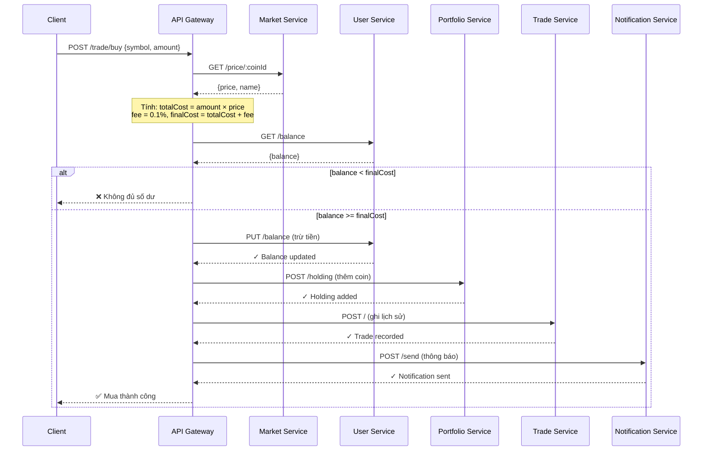
```mermaid
sequenceDiagram
    participant C as Client
    participant GW as API Gateway
    participant MS as Market Service
    participant US as User Service
    participant PS as Portfolio Service
    participant TS as Trade Service
    participant NS as Notification Service

    C->>GW: POST /trade/buy {symbol, amount}
    GW->>MS: GET /price/:coinId
    MS-->>GW: {price, name}
    
    Note over GW: Tính: totalCost = amount × price<br/>fee = 0.1%, finalCost = totalCost + fee

    GW->>US: GET /balance
    US-->>GW: {balance}
    
    alt balance < finalCost
        GW-->>C: ❌ Không đủ số dư
    else balance >= finalCost
        GW->>US: PUT /balance (trừ tiền)
        US-->>GW: ✓ Balance updated
        
        GW->>PS: POST /holding (thêm coin)
        PS-->>GW: ✓ Holding added
        
        GW->>TS: POST / (ghi lịch sử)
        TS-->>GW: ✓ Trade recorded
        
        GW->>NS: POST /send (thông báo)
        NS-->>GW: ✓ Notification sent
        
        GW-->>C: ✅ Mua thành công
    end
```

#### II.4.3.2. Luồng bán coin (Sell Flow)

```
BƯỚC 1: Kiểm tra portfolio (Portfolio Service)
        → Nếu không đủ coin → Báo lỗi

BƯỚC 2: Lấy giá hiện tại từ Market Service
        → Tính toán: totalValue = amount × price
        → Tính phí: fee = totalValue × 0.1%
        → finalProceeds = totalValue - fee

BƯỚC 3: Lấy số dư hiện tại (User Service)

BƯỚC 4: Cộng số dư (User Service)
        → balance = balance + finalProceeds
        → Lưu transactionState.balanceAdded = true

BƯỚC 5: Giảm holdings (Portfolio Service)
        → Nếu bán hết: xóa holding
        → Nếu bán một phần: giảm amount
        → Lưu transactionState.holdingReduced = true

BƯỚC 6: Ghi lịch sử (Trade Service)

BƯỚC 7: Gửi thông báo + WebSocket

NẾU LỖI: ROLLBACK
        → Nếu holdingReduced: Hoàn lại holding
        → Nếu balanceAdded: Trừ số dư
```

**Sequence Diagram - Sell Flow:**

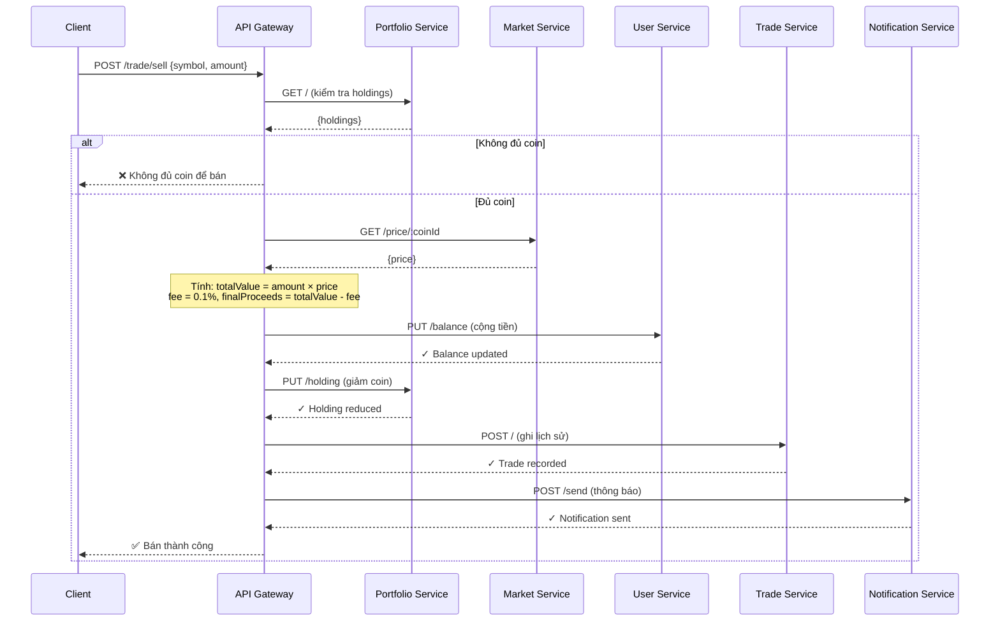
```mermaid
sequenceDiagram
    participant C as Client
    participant GW as API Gateway
    participant PS as Portfolio Service
    participant MS as Market Service
    participant US as User Service
    participant TS as Trade Service
    participant NS as Notification Service

    C->>GW: POST /trade/sell {symbol, amount}
    GW->>PS: GET / (kiểm tra holdings)
    PS-->>GW: {holdings}
    
    alt Không đủ coin
        GW-->>C: ❌ Không đủ coin để bán
    else Đủ coin
        GW->>MS: GET /price/:coinId
        MS-->>GW: {price}
        
        Note over GW: Tính: totalValue = amount × price<br/>fee = 0.1%, finalProceeds = totalValue - fee

        GW->>US: PUT /balance (cộng tiền)
        US-->>GW: ✓ Balance updated
        
        GW->>PS: PUT /holding (giảm coin)
        PS-->>GW: ✓ Holding reduced
        
        GW->>TS: POST / (ghi lịch sử)
        TS-->>GW: ✓ Trade recorded
        
        GW->>NS: POST /send (thông báo)
        NS-->>GW: ✓ Notification sent
        
        GW-->>C: ✅ Bán thành công
    end
```

---

### II.5. Biểu đồ luồng dữ liệu

#### II.5.1. Luồng xác thực (Authentication Flow)

**Mô tả:** User gửi thông tin đăng nhập, hệ thống xác thực và trả về JWT token để sử dụng cho các request tiếp theo.

**Sequence Diagram - Authentication:**

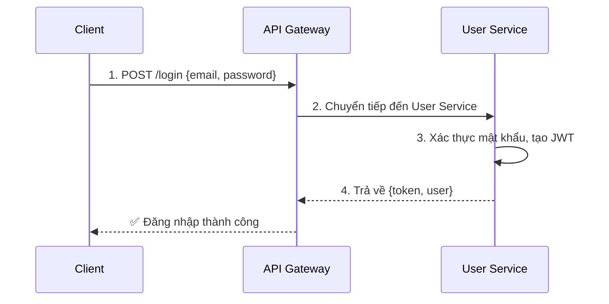
```mermaid
sequenceDiagram
    participant C as Client
    participant GW as API Gateway
    participant US as User Service

    C->>GW: 1. POST /login {email, password}
    GW->>US: 2. Chuyển tiếp đến User Service
    US->>US: 3. Xác thực mật khẩu, tạo JWT
    US-->>GW: 4. Trả về {token, user}
    GW-->>C: ✅ Đăng nhập thành công
```

**Các bước:**
1. Client gửi email và password đến API Gateway
2. API Gateway chuyển tiếp request đến User Service
3. User Service xác thực mật khẩu (bcrypt) và tạo JWT token (7 ngày)
4. Trả về token và thông tin user cho client

**DFD Level 0 - Authentication:**

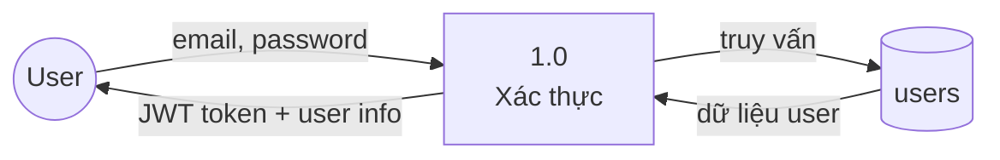
```mermaid
flowchart LR
    U((User)) -->|email, password| P1[1.0<br/>Xác thực]
    P1 -->|truy vấn| D1[(users)]
    D1 -->|dữ liệu user| P1
    P1 -->|JWT token + user info| U
```

#### II.5.2. Luồng xem portfolio (Portfolio Flow)

**Mô tả:** API Gateway điều phối 2 services (Portfolio + Market) để trả về danh mục đầu tư với giá hiện tại và lãi/lỗ.

**Sequence Diagram - Portfolio:**

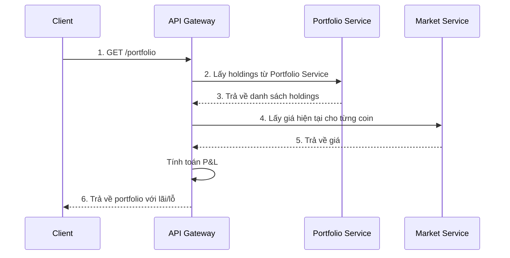
```mermaid
sequenceDiagram
    participant C as Client
    participant GW as API Gateway
    participant PS as Portfolio Service
    participant MS as Market Service

    C->>GW: 1. GET /portfolio
    GW->>PS: 2. Lấy holdings từ Portfolio Service
    PS-->>GW: 3. Trả về danh sách holdings
    GW->>MS: 4. Lấy giá hiện tại cho từng coin
    MS-->>GW: 5. Trả về giá
    GW->>GW: Tính toán P&L
    GW-->>C: 6. Trả về portfolio với lãi/lỗ
```

**Các bước:**
1. Client gửi request lấy portfolio
2. API Gateway gọi Portfolio Service để lấy danh sách holdings
3. Portfolio Service trả về holdings (coin, số lượng, giá mua trung bình)
4. API Gateway gọi Market Service để lấy giá hiện tại cho từng coin
5. Market Service trả về giá từ CoinGecko/CoinPaprika
6. API Gateway tính toán P&L và trả về portfolio đã được làm giàu (enriched)

**DFD Level 0 - Portfolio:**

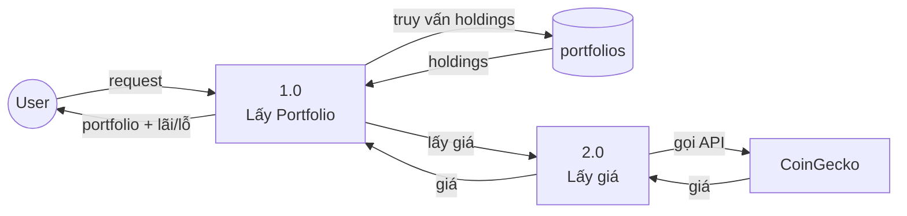
```mermaid
flowchart LR
    U((User)) -->|request| P1[1.0<br/>Lấy Portfolio]
    P1 -->|truy vấn holdings| D1[(portfolios)]
    D1 -->|holdings| P1
    P1 -->|lấy giá| P2[2.0<br/>Lấy giá]
    P2 -->|gọi API| E1[CoinGecko]
    E1 -->|giá| P2
    P2 -->|giá| P1
    P1 -->|portfolio + lãi/lỗ| U
```

#### II.5.3. Luồng giao dịch (Trade Flow)

**Mô tả:** Giao dịch mua coin đi qua 6 bước xử lý với nhiều services tham gia, có cơ chế rollback khi lỗi.

**DFD Level 1 - Trade Flow (Buy):**

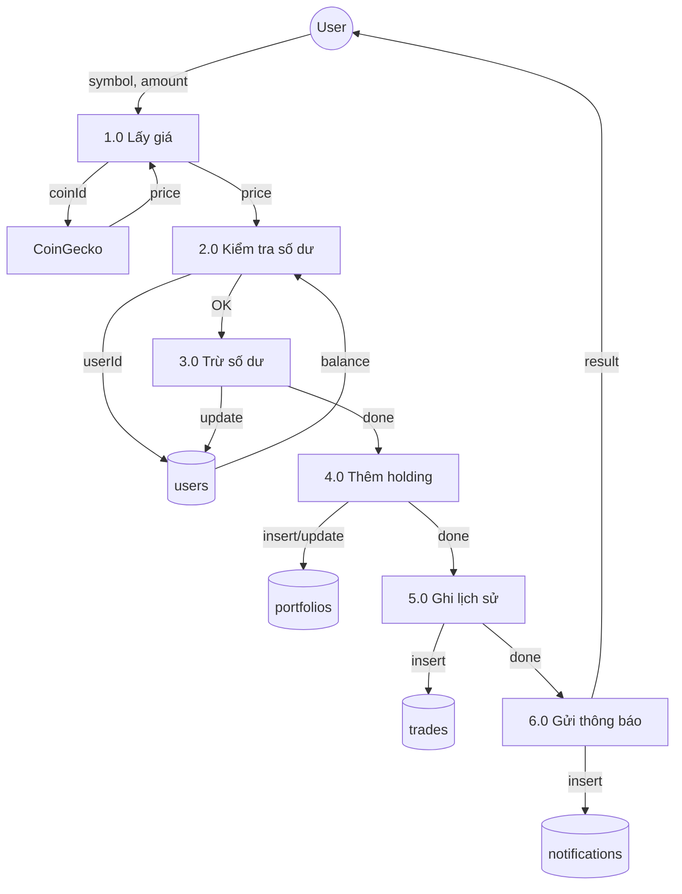
```mermaid
flowchart TB
    U((User)) -->|symbol, amount| P1[1.0 Lấy giá]
    P1 -->|coinId| E1[CoinGecko]
    E1 -->|price| P1
    P1 -->|price| P2[2.0 Kiểm tra số dư]
    P2 -->|userId| D1[(users)]
    D1 -->|balance| P2
    P2 -->|OK| P3[3.0 Trừ số dư]
    P3 -->|update| D1
    P3 -->|done| P4[4.0 Thêm holding]
    P4 -->|insert/update| D2[(portfolios)]
    P4 -->|done| P5[5.0 Ghi lịch sử]
    P5 -->|insert| D3[(trades)]
    P5 -->|done| P6[6.0 Gửi thông báo]
    P6 -->|insert| D4[(notifications)]
    P6 -->|result| U
```

---

#### II.5.4. Luồng cảnh báo giá (Price Alert Trigger Flow)

**Mô tả:** Hệ thống tự động kiểm tra giá coin mỗi phút và gửi thông báo khi giá đạt mục tiêu user đã đặt.

**Sequence Diagram - Price Alert Check (Cron Job):**

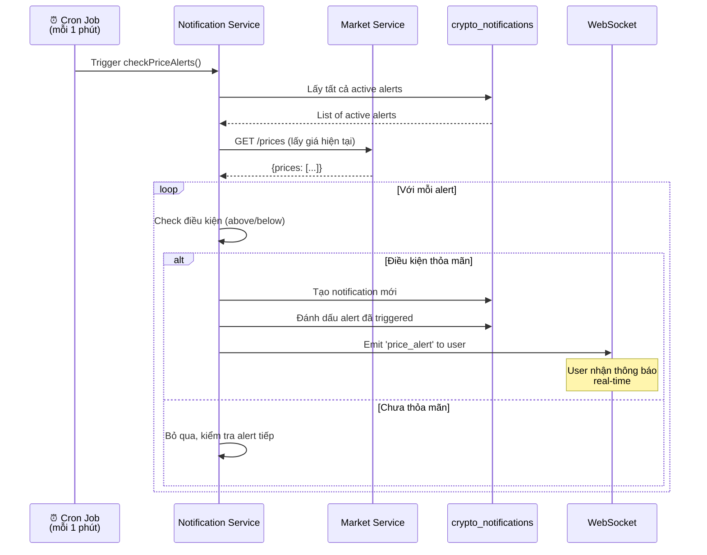
```mermaid
sequenceDiagram
    participant CRON as ⏰ Cron Job<br/>(mỗi 1 phút)
    participant NS as Notification Service
    participant MS as Market Service
    participant DB as crypto_notifications
    participant WS as WebSocket

    CRON->>NS: Trigger checkPriceAlerts()
    NS->>DB: Lấy tất cả active alerts
    DB-->>NS: List of active alerts
    
    NS->>MS: GET /prices (lấy giá hiện tại)
    MS-->>NS: {prices: [...]}
    
    loop Với mỗi alert
        NS->>NS: Check điều kiện (above/below)
        alt Điều kiện thỏa mãn
            NS->>DB: Tạo notification mới
            NS->>DB: Đánh dấu alert đã triggered
            NS->>WS: Emit 'price_alert' to user
            Note over WS: User nhận thông báo<br/>real-time
        else Chưa thỏa mãn
            NS->>NS: Bỏ qua, kiểm tra alert tiếp
        end
    end
```

**DFD Level 0 - Price Alert:**

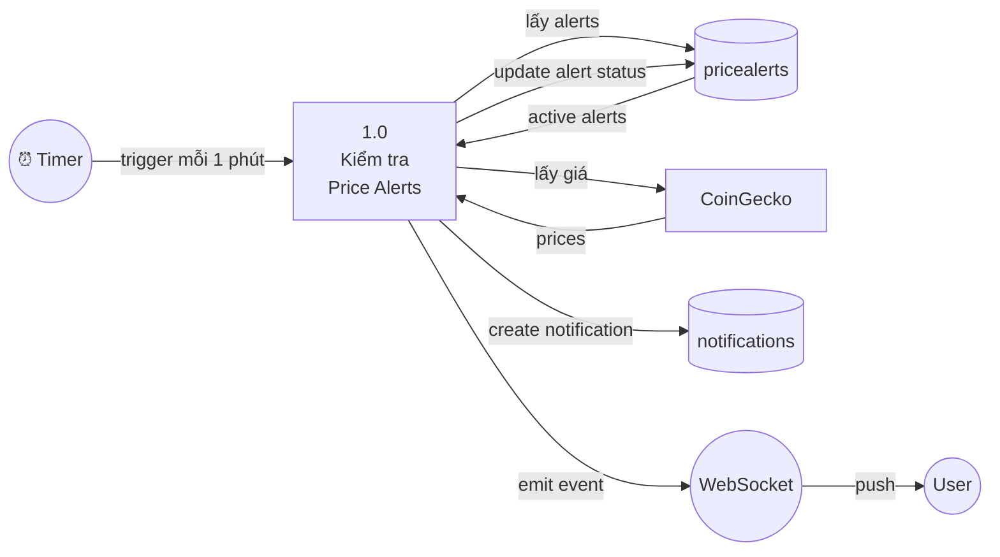
```mermaid
flowchart LR
    T((⏰ Timer)) -->|trigger mỗi 1 phút| P1[1.0<br/>Kiểm tra<br/>Price Alerts]
    P1 -->|lấy alerts| D1[(pricealerts)]
    D1 -->|active alerts| P1
    P1 -->|lấy giá| E1[CoinGecko]
    E1 -->|prices| P1
    P1 -->|create notification| D2[(notifications)]
    P1 -->|update alert status| D1
    P1 -->|emit event| WS((WebSocket))
    WS -->|push| U((User))
```

**Các bước:**
1. **Cron Job** chạy mỗi 1 phút, gọi hàm `checkPriceAlerts()`
2. Lấy tất cả **active alerts** từ database
3. Gọi **Market Service** để lấy giá hiện tại của các coins
4. So sánh giá với điều kiện:
   - `above`: Giá hiện tại >= Target Price
   - `below`: Giá hiện tại <= Target Price
5. Nếu thỏa mãn:
   - Tạo **Notification** mới
   - Đánh dấu alert `triggered = true`, `isActive = false`
   - Emit **WebSocket event** `price_alert` đến user

---

#### II.5.5. Luồng Admin cập nhật số dư (Admin Update Balance Flow)

**Mô tả:** Admin có thể điều chỉnh số dư (cộng/trừ) của bất kỳ user nào trong hệ thống.

**Sequence Diagram - Admin Update Balance:**

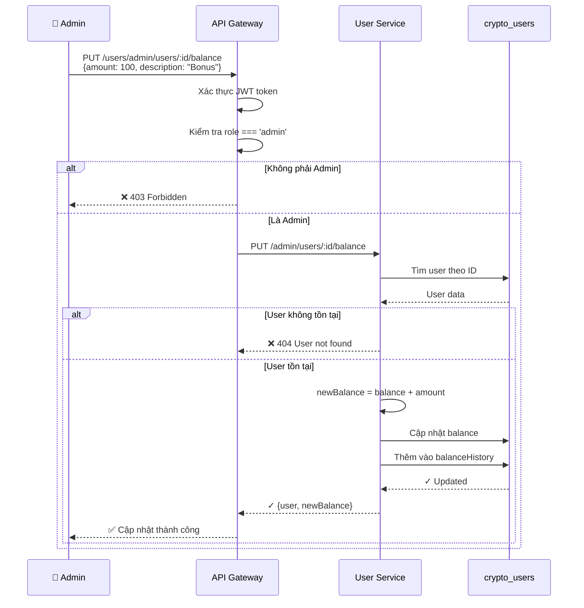
```mermaid
sequenceDiagram
    participant A as 👑 Admin
    participant GW as API Gateway
    participant US as User Service
    participant DB as crypto_users

    A->>GW: PUT /users/admin/users/:id/balance<br/>{amount: 100, description: "Bonus"}
    GW->>GW: Xác thực JWT token
    GW->>GW: Kiểm tra role === 'admin'
    
    alt Không phải Admin
        GW-->>A: ❌ 403 Forbidden
    else Là Admin
        GW->>US: PUT /admin/users/:id/balance
        US->>DB: Tìm user theo ID
        DB-->>US: User data
        
        alt User không tồn tại
            US-->>GW: ❌ 404 User not found
        else User tồn tại
            US->>US: newBalance = balance + amount
            US->>DB: Cập nhật balance
            US->>DB: Thêm vào balanceHistory
            DB-->>US: ✓ Updated
            US-->>GW: ✓ {user, newBalance}
            GW-->>A: ✅ Cập nhật thành công
        end
    end
```

**DFD Level 0 - Admin Update Balance:**

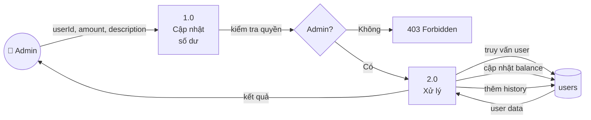
```mermaid
flowchart LR
    A((👑 Admin)) -->|userId, amount, description| P1[1.0<br/>Cập nhật<br/>số dư]
    P1 -->|kiểm tra quyền| AUTH{Admin?}
    AUTH -->|Không| E1[403 Forbidden]
    AUTH -->|Có| P2[2.0<br/>Xử lý]
    P2 -->|truy vấn user| D1[(users)]
    D1 -->|user data| P2
    P2 -->|cập nhật balance| D1
    P2 -->|thêm history| D1
    P2 -->|kết quả| A
```

**Các bước:**
1. Admin gửi request với `userId`, `amount` (có thể âm/dương), `description`
2. API Gateway **xác thực JWT** và **kiểm tra role = admin**
3. Nếu không phải admin → Trả về **403 Forbidden**
4. User Service tìm user theo ID
5. Cập nhật: `newBalance = currentBalance + amount`
6. Ghi vào **balanceHistory** để audit:
   ```json
   {
     "amount": 100,
     "type": "admin",
     "description": "Bonus cho user tích cực",
     "timestamp": "2024-01-05T10:30:00Z"
   }
   ```
7. Trả về kết quả với balance mới

---


### II.6. Các patterns và kỹ thuật nâng cao

Hệ thống áp dụng nhiều patterns và kỹ thuật nâng cao để đảm bảo tính ổn định, bảo mật và hiệu năng. Các kỹ thuật này giúp hệ thống có khả năng chịu lỗi cao, bảo vệ khỏi các cuộc tấn công, và cung cấp trải nghiệm người dùng tốt hơn.

#### II.6.1. Rate Limiting

**Mục đích:** Bảo vệ hệ thống khỏi DDoS (Distributed Denial of Service) và abuse từ các client gửi quá nhiều requests trong thời gian ngắn.

**Vấn đề cần giải quyết:** Trong môi trường production, các API có thể bị tấn công bởi các bot hoặc người dùng độc hại gửi hàng nghìn requests trong thời gian ngắn, gây quá tải server và ảnh hưởng đến người dùng hợp lệ.

**Giải pháp:** Áp dụng Rate Limiting tại API Gateway để giới hạn số lượng requests từ mỗi IP address trong một khoảng thời gian nhất định.

**Cấu hình trong hệ thống:**
- **Giới hạn:** 1000 requests / 15 phút cho mỗi IP
- **Phản hồi khi vượt giới hạn:** HTTP 429 (Too Many Requests)
- **Headers trả về:** `X-RateLimit-Limit`, `X-RateLimit-Remaining`, `X-RateLimit-Reset`

**Công nghệ:** express-rate-limit

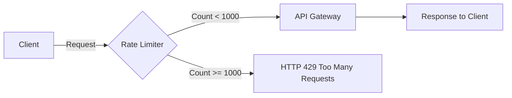
```mermaid
flowchart LR
    Client -->|Request| RL{Rate Limiter}
    RL -->|"Count < 1000"| API[API Gateway]
    RL -->|"Count >= 1000"| Error[HTTP 429 Too Many Requests]
    API --> Response[Response to Client]
```

**Ưu điểm:**
- Bảo vệ server khỏi quá tải
- Ngăn chặn brute-force attacks vào login API
- Đảm bảo công bằng cho tất cả người dùng

---

#### II.6.2. Circuit Breaker Pattern

**Mục đích:** Ngăn chặn cascading failures (lỗi dây chuyền) khi một service gặp sự cố, tránh làm sập toàn bộ hệ thống.

**Vấn đề cần giải quyết:** Trong kiến trúc SOA, khi một service (ví dụ: Market Service) gặp sự cố, các service phụ thuộc vào nó sẽ liên tục gửi requests và chờ đợi, dẫn đến timeout và tiêu tốn tài nguyên. Điều này có thể lan truyền và làm sập các service khác.

**Giải pháp:** Áp dụng Circuit Breaker pattern - một "cầu dao" tự động ngắt khi phát hiện service lỗi quá nhiều.

**Cơ chế hoạt động (3 trạng thái):**

| Trạng thái | Mô tả | Hành vi |
|------------|-------|---------|
| **Closed** | Bình thường | Requests đi qua, đếm số lỗi |
| **Open** | Phát hiện quá nhiều lỗi | Từ chối tất cả requests ngay lập tức, không gọi service |
| **Half-Open** | Sau timeout, thử lại | Cho phép 1 request thử, nếu thành công → Closed, nếu lỗi → Open |

**Cấu hình trong hệ thống:**
- **Timeout:** 5 giây cho mỗi request
- **Error threshold:** 50% requests thất bại
- **Reset timeout:** 30 giây trước khi thử lại
- **Volume threshold:** Ít nhất 5 requests trước khi đánh giá

**Công nghệ:** Opossum (thư viện Circuit Breaker cho Node.js)

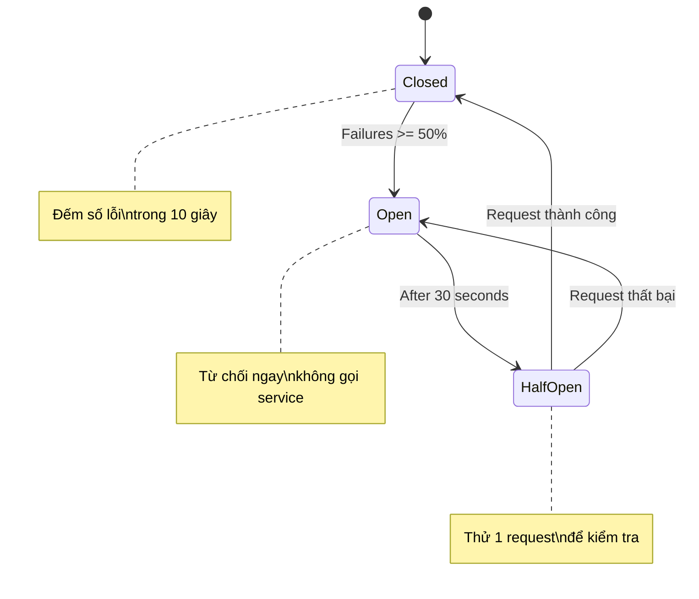
```mermaid
stateDiagram-v2
    [*] --> Closed
    Closed --> Open : Failures >= 50%
    Open --> HalfOpen : After 30 seconds
    HalfOpen --> Closed : Request thành công
    HalfOpen --> Open : Request thất bại
    
    note right of Closed : Đếm số lỗi\ntrong 10 giây
    note right of Open : Từ chối ngay\nkhông gọi service
    note right of HalfOpen : Thử 1 request\nđể kiểm tra
```

**Ưu điểm:**
- Fail-fast: Trả lỗi ngay thay vì chờ timeout
- Giảm tải cho service đang lỗi
- Tự động phục hồi khi service hoạt động trở lại

---

#### II.6.3. Orchestration Pattern

**Mục đích:** Điều phối nhiều services để hoàn thành một giao dịch phức tạp, đảm bảo tính toàn vẹn dữ liệu và có khả năng rollback khi lỗi.

**Vấn đề cần giải quyết:** Một giao dịch mua coin cần thao tác trên nhiều services:
1. Market Service: Lấy giá
2. User Service: Kiểm tra và trừ số dư
3. Portfolio Service: Thêm coin vào danh mục
4. Trade Service: Ghi lịch sử
5. Notification Service: Gửi thông báo

Nếu bước 4 thất bại, cần rollback bước 2 và 3 để đảm bảo dữ liệu nhất quán.

**Giải pháp:** API Gateway đóng vai trò **Orchestrator** - điều phối tuần tự các bước và quản lý rollback.

**Đặc điểm triển khai:**
- Giao dịch Buy/Sell có **7 bước** tuần tự
- Mỗi bước thành công được ghi nhận vào **transactionState**
- Nếu lỗi xảy ra, rollback các bước đã hoàn thành theo thứ tự ngược

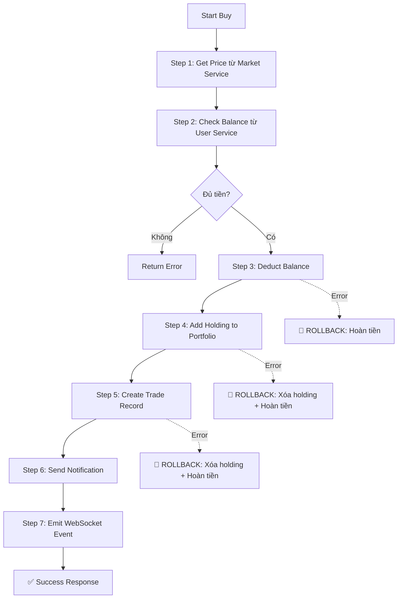
```mermaid
flowchart TD
    A[Start Buy] --> B[Step 1: Get Price từ Market Service]
    B --> C[Step 2: Check Balance từ User Service]
    C --> D{Đủ tiền?}
    D -->|Không| E[Return Error]
    D -->|Có| F[Step 3: Deduct Balance]
    F --> G[Step 4: Add Holding to Portfolio]
    G --> H[Step 5: Create Trade Record]
    H --> I[Step 6: Send Notification]
    I --> J[Step 7: Emit WebSocket Event]
    J --> K[✅ Success Response]
    
    F -.->|Error| R1[🔄 ROLLBACK: Hoàn tiền]
    G -.->|Error| R2[🔄 ROLLBACK: Xóa holding + Hoàn tiền]
    H -.->|Error| R3[🔄 ROLLBACK: Xóa holding + Hoàn tiền]
```

**Ưu điểm:**
- Đảm bảo ACID-like properties cho distributed transactions
- Dễ debug: log từng bước tuần tự
- Rollback tự động khi có lỗi

---

#### II.6.4. WebSocket Real-time Communication

**Mục đích:** Push notifications và updates đến client ngay lập tức mà không cần client liên tục gửi requests (polling).

**Vấn đề cần giải quyết:** Với HTTP truyền thống, client phải liên tục gửi requests để kiểm tra có thông báo mới không (polling), gây lãng phí bandwidth và làm chậm thông báo.

**Giải pháp:** Sử dụng WebSocket để duy trì kết nối 2 chiều giữa server và client, cho phép server push data bất cứ khi nào có events.

**Events được hỗ trợ trong hệ thống:**

| Event | Trigger khi | Dữ liệu gửi |
|-------|------------|-------------|
| `trade_confirmation` | Giao dịch buy/sell thành công | Trade details, new balance |
| `price_alert` | Giá coin đạt mục tiêu đã đặt | Coin symbol, current price, target price |
| `notification` | Có thông báo hệ thống mới | Notification object |

**Cách hoạt động:**

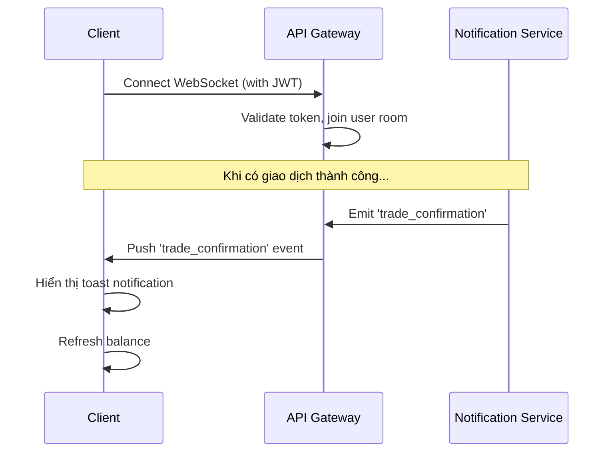
```mermaid
sequenceDiagram
    participant C as Client
    participant GW as API Gateway
    participant NS as Notification Service
    
    C->>GW: Connect WebSocket (with JWT)
    GW->>GW: Validate token, join user room
    
    Note over C,NS: Khi có giao dịch thành công...
    NS->>GW: Emit 'trade_confirmation'
    GW->>C: Push 'trade_confirmation' event
    C->>C: Hiển thị toast notification
    C->>C: Refresh balance
```

**Công nghệ:** Socket.IO (hỗ trợ fallback cho các browser cũ)

**Ưu điểm:**
- Real-time: Thông báo đến ngay lập tức (< 100ms)
- Tiết kiệm bandwidth: Không cần polling
- Bi-directional: Client cũng có thể gửi events (nếu cần)

---

#### II.6.5. Fallback API Pattern

**Mục đích:** Đảm bảo hệ thống vẫn hoạt động khi API chính gặp sự cố bằng cách tự động chuyển sang API dự phòng.

**Vấn đề cần giải quyết:** Hệ thống phụ thuộc vào CoinGecko API để lấy giá coin. Nếu CoinGecko bị down hoặc rate limit, toàn bộ tính năng giao dịch sẽ không hoạt động.

**Giải pháp:** Cấu hình nhiều API providers với thứ tự ưu tiên, tự động fallback khi API trước đó thất bại.

**Cấu hình trong hệ thống:**

| Priority | Provider | Rate Limit | Đặc điểm |
|----------|----------|------------|----------|
| Primary | CoinGecko API | 30 calls/min | Dữ liệu đầy đủ, phổ biến |
| Fallback | CoinPaprika API | 100 calls/min | Rate limit cao hơn |

**Luồng xử lý:**

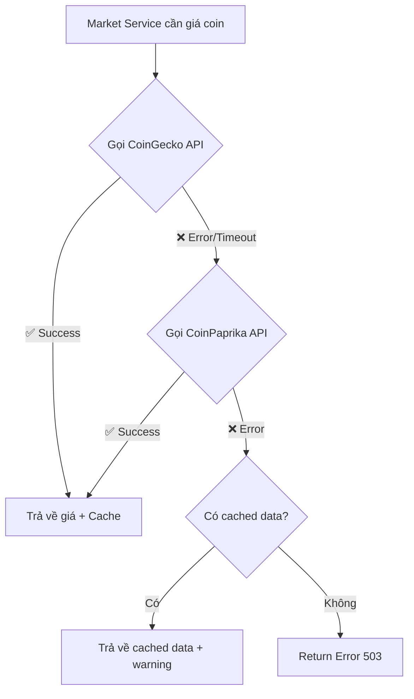
```mermaid
flowchart TD
    A[Market Service cần giá coin] --> B{Gọi CoinGecko API}
    B -->|✅ Success| C[Trả về giá + Cache]
    B -->|❌ Error/Timeout| D{Gọi CoinPaprika API}
    D -->|✅ Success| C
    D -->|❌ Error| E{Có cached data?}
    E -->|Có| F[Trả về cached data + warning]
    E -->|Không| G[Return Error 503]
```

**Ưu điểm:**
- High availability: Hệ thống vẫn hoạt động khi 1 API down
- Transparent: Client không biết đang dùng API nào
- Graceful degradation: Trả về cached data nếu cả 2 đều lỗi

---

#### II.6.6. DCA Calculation (Dollar Cost Averaging)

**Mục đích:** Tính giá mua trung bình chính xác khi user mua cùng một coin nhiều lần với các mức giá khác nhau.

**Vấn đề cần giải quyết:** User mua 0.001 BTC giá $70,000, sau đó mua thêm 0.002 BTC giá $80,000. Giá mua trung bình không phải là ($70,000 + $80,000) / 2 = $75,000 vì số lượng mỗi lần khác nhau.

**Giải pháp:** Áp dụng công thức DCA (Dollar Cost Averaging):

```
newTotalInvested = oldTotalInvested + (newAmount × newPrice)
newTotalAmount = oldAmount + newAmount
newAverageBuyPrice = newTotalInvested / newTotalAmount
```

**Ví dụ tính toán:**

| Lần mua | Amount | Price | Total Invested | Avg Buy Price |
|---------|--------|-------|----------------|---------------|
| Lần 1 | 0.001 BTC | $70,000 | $70 | $70,000 |
| Lần 2 | 0.002 BTC | $80,000 | $70 + $160 = $230 | $230 / 0.003 = **$76,667** |

**Profit Calculation:**
```
currentValue = totalAmount × currentPrice
profit = currentValue - totalInvested
profitPercentage = (profit / totalInvested) × 100
```

**Ưu điểm:**
- Tính chính xác P&L cho mỗi coin
- Phản ánh đúng chiến lược đầu tư của user
- Cập nhật tự động sau mỗi giao dịch

---

#### II.6.7. Caching với NodeCache

**Mục đích:** Giảm số lượng API calls đến external services và cải thiện response time.

**Vấn đề cần giải quyết:** 
- CoinGecko API có rate limit (30 calls/phút cho free tier)
- Mỗi user xem giá coin đều gọi API → nhanh chóng hết quota
- Response time chậm do network latency đến external API

**Giải pháp:** Cache kết quả API trong memory với TTL (Time To Live) phù hợp.

**Cấu hình trong hệ thống:**

| Data Type | TTL | Lý do |
|-----------|-----|-------|
| Giá coin (prices) | 2 phút | Giá thay đổi thường xuyên nhưng không cần real-time tuyệt đối |
| Chart data | 5 phút | Dữ liệu lịch sử ít thay đổi |

**Cách hoạt động:**

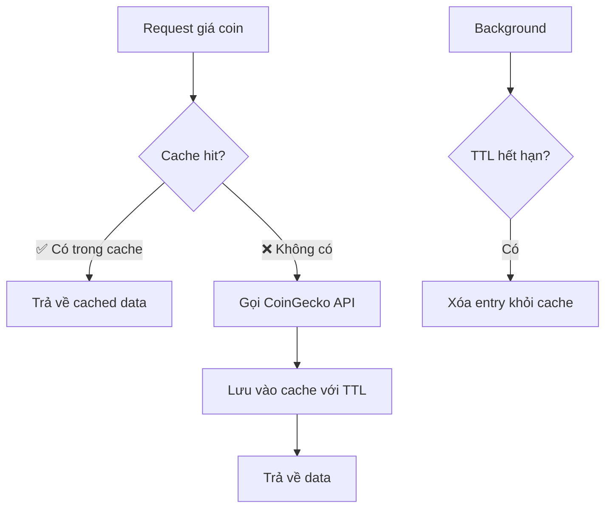
```mermaid
flowchart TD
    A[Request giá coin] --> B{Cache hit?}
    B -->|✅ Có trong cache| C[Trả về cached data]
    B -->|❌ Không có| D[Gọi CoinGecko API]
    D --> E[Lưu vào cache với TTL]
    E --> F[Trả về data]
    
    G[Background] --> H{TTL hết hạn?}
    H -->|Có| I[Xóa entry khỏi cache]
```

**Công nghệ:** node-cache

**Metrics cải thiện:**
- Giảm ~90% API calls đến CoinGecko
- Response time: 5-10ms (cache hit) vs 200-500ms (API call)
- Không bị rate limit trong điều kiện bình thường

---

#### II.6.8. Cron Job Scheduling

**Mục đích:** Thực hiện các tác vụ định kỳ tự động mà không cần user trigger.

**Vấn đề cần giải quyết:** User đặt price alert "Thông báo khi BTC >= $80,000". Hệ thống cần liên tục kiểm tra giá để trigger alert đúng thời điểm.

**Giải pháp:** Sử dụng Cron Job để chạy background tasks theo lịch định sẵn.

**Cron Jobs trong hệ thống:**

| Job Name | Schedule | Chức năng |
|----------|----------|-----------|
| Price Alert Checker | Mỗi 1 phút | Kiểm tra giá hiện tại với các alerts đang active |
| Alert Cleanup | Mỗi 1 giờ | Xóa các alerts đã triggered quá 30 ngày |

**Luồng Price Alert Check:**

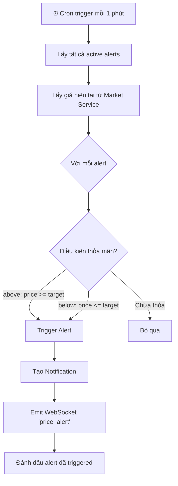
```mermaid
flowchart TD
    A[⏰ Cron trigger mỗi 1 phút] --> B[Lấy tất cả active alerts]
    B --> C[Lấy giá hiện tại từ Market Service]
    C --> D{Với mỗi alert}
    D --> E{Điều kiện thỏa mãn?}
    E -->|"above: price >= target"| F[Trigger Alert]
    E -->|"below: price <= target"| F
    E -->|Chưa thỏa| G[Bỏ qua]
    F --> H[Tạo Notification]
    H --> I[Emit WebSocket 'price_alert']
    I --> J[Đánh dấu alert đã triggered]
```

**Công nghệ:** node-cron

**Cron Expression Example:**
```javascript
// Chạy mỗi phút
cron.schedule('* * * * *', checkPriceAlerts);

// Chạy mỗi giờ vào phút 0
cron.schedule('0 * * * *', cleanupOldAlerts);
```

**Ưu điểm:**
- Tự động: Không cần user action
- Reliable: Chạy đúng lịch kể cả khi không có user online
- Scalable: Có thể xử lý hàng nghìn alerts

---


# III. PHÂN TÍCH VÀ THIẾT KẾ DỮ LIỆU

## III.1. Mô hình thực thể liên kết (ERD)

#### III.1.1. Database: crypto_users - Entity: User

```mermaid
erDiagram
    USER {
        ObjectId _id PK
        String email UK
        String password
        String fullName
        Enum role
        Number balance
        Boolean isActive
        Array balanceHistory
        Date createdAt
        Date updatedAt
    }
```

**Thuộc tính:**

| Thuộc tính | Kiểu | Ràng buộc | Mô tả |
|------------|------|-----------|-------|
| _id | ObjectId | PK | Khóa chính |
| email | String | Unique, Required | Email đăng nhập |
| password | String | Required | Mật khẩu đã mã hóa |
| fullName | String | Required | Họ tên đầy đủ |
| role | Enum | Default: 'user' | Vai trò: user/admin |
| balance | Number | Default: 1000 | Số dư USDT |
| isActive | Boolean | Default: true | Trạng thái tài khoản |
| balanceHistory | Array | - | Lịch sử biến động số dư |
| createdAt | Date | Auto | Ngày tạo |
| updatedAt | Date | Auto | Ngày cập nhật |

---

#### III.1.2. Database: crypto_portfolios - Entity: Portfolio

```mermaid
erDiagram
    PORTFOLIO {
        ObjectId _id PK
        ObjectId userId FK
        Array holdings
        Number totalValue
        Number totalInvested
        Number totalProfit
        Number profitPercentage
        Date lastCalculated
    }
    HOLDING {
        String symbol
        String coinId
        String name
        Number amount
        Number averageBuyPrice
        Number totalInvested
        Date lastUpdated
    }
    PORTFOLIO ||--o{ HOLDING : contains
```

**Thuộc tính:**

| Thuộc tính | Kiểu | Ràng buộc | Mô tả |
|------------|------|-----------|-------|
| _id | ObjectId | PK | Khóa chính |
| userId | ObjectId | FK, Unique | Liên kết đến User |
| holdings | Array | - | Danh sách coin sở hữu |
| totalValue | Number | Default: 0 | Tổng giá trị portfolio |
| totalInvested | Number | Default: 0 | Tổng chi phí đầu tư |
| totalProfit | Number | Default: 0 | Tổng lãi/lỗ |
| profitPercentage | Number | Default: 0 | Phần trăm lãi/lỗ |
| lastCalculated | Date | Default: now | Thời điểm tính toán cuối |

**Cấu trúc Holding:**

| Thuộc tính | Kiểu | Mô tả |
|------------|------|-------|
| symbol | String | Ký hiệu coin (BTC, ETH) |
| coinId | String | ID coin (bitcoin, ethereum) |
| name | String | Tên đầy đủ |
| amount | Number | Số lượng coin |
| averageBuyPrice | Number | Giá mua trung bình |
| totalInvested | Number | Tổng chi phí |
| lastUpdated | Date | Thời điểm cập nhật cuối |

---

#### III.1.3. Database: crypto_trades - Entity: Trade

```mermaid
erDiagram
    TRADE {
        ObjectId _id PK
        ObjectId userId FK
        Enum type
        String symbol
        String coinId
        String coinName
        Number amount
        Number price
        Number totalCost
        Number fee
        Number feePercentage
        Enum status
        Number balanceBefore
        Number balanceAfter
        String notes
        String errorMessage
        Date executedAt
    }
```

**Thuộc tính:**

| Thuộc tính | Kiểu | Ràng buộc | Mô tả |
|------------|------|-----------|-------|
| _id | ObjectId | PK | Khóa chính |
| userId | ObjectId | FK, Required | Liên kết đến User |
| type | Enum | Required | Loại: buy/sell |
| symbol | String | Required | Ký hiệu coin |
| coinId | String | Required | ID coin |
| coinName | String | Required | Tên coin |
| amount | Number | Required | Số lượng |
| price | Number | Required | Giá tại thời điểm giao dịch |
| totalCost | Number | Required | Tổng giá trị |
| fee | Number | Default: 0 | Phí giao dịch |
| feePercentage | Number | Default: 0.1 | Phần trăm phí |
| status | Enum | Default: 'completed' | Trạng thái |
| balanceBefore | Number | Required | Số dư trước giao dịch |
| balanceAfter | Number | Required | Số dư sau giao dịch |
| notes | String | maxlength: 500 | Ghi chú (optional) |
| errorMessage | String | - | Thông báo lỗi (cho giao dịch failed) |
| executedAt | Date | Default: now | Thời điểm thực hiện |

---

#### III.1.4. Database: crypto_notifications - Entities: Notification, PriceAlert

```mermaid
erDiagram
    NOTIFICATION {
        ObjectId _id PK
        ObjectId userId FK
        Enum type
        String title
        String message
        Enum status
        Enum priority
        Enum channel
        Object data
        Date sentAt
        Date readAt
    }
    PRICEALERT {
        ObjectId _id PK
        ObjectId userId FK
        String symbol
        String coinId
        Number targetPrice
        Enum condition
        Boolean isActive
        Boolean triggered
        Date triggeredAt
        Date lastChecked
    }
```

**Entity 1: Notification**

| Thuộc tính | Kiểu | Mô tả |
|------------|------|-------|
| _id | ObjectId | Khóa chính |
| userId | ObjectId | Liên kết đến User |
| type | Enum | trade/price_alert/system/warning |
| title | String | Tiêu đề thông báo |
| message | String | Nội dung |
| status | Enum | unread/read/archived |
| priority | Enum | low/medium/high/urgent |
| channel | Enum | app (chỉ thông báo trong app) |
| data | Object | Dữ liệu bổ sung |
| sentAt | Date | Thời điểm gửi |
| readAt | Date | Thời điểm đọc |

**Entity 2: PriceAlert**

| Thuộc tính | Kiểu | Mô tả |
|------------|------|-------|
| _id | ObjectId | Khóa chính |
| userId | ObjectId | Liên kết đến User |
| symbol | String | Ký hiệu coin |
| coinId | String | ID coin |
| targetPrice | Number | Giá mục tiêu |
| condition | Enum | above/below |
| isActive | Boolean | Còn hoạt động không |
| triggered | Boolean | Đã trigger chưa |
| triggeredAt | Date | Thời điểm trigger |
| lastChecked | Date | Lần kiểm tra cuối |

---

## III.2. Mô hình quan hệ (Distributed Databases)

> **Lưu ý:** Với kiến trúc Database per Service, mỗi entity thuộc database độc lập. Quan hệ được duy trì qua `userId` (lưu dưới dạng ObjectId string) và giao tiếp qua HTTP API, không phải Foreign Key trực tiếp.

**Sơ đồ quan hệ giữa các collections:**

```mermaid
erDiagram
    %% Database: crypto_users
    USER {
        ObjectId _id PK
        String email
        Number balance
    }
    
    %% Database: crypto_portfolios
    PORTFOLIO {
        ObjectId _id PK
        String userId "ref via API"
    }
    HOLDING {
        String symbol
        String coinId
        Number amount
    }
    
    %% Database: crypto_trades
    TRADE {
        ObjectId _id PK
        String userId "ref via API"
    }
    
    %% Database: crypto_notifications
    NOTIFICATION {
        ObjectId _id PK
        String userId "ref via API"
    }
    PRICEALERT {
        ObjectId _id PK
        String userId "ref via API"
    }
    
    USER ||--|| PORTFOLIO : "1:1 (via HTTP)"
    USER ||--o{ TRADE : "1:N (via HTTP)"
    USER ||--o{ NOTIFICATION : "1:N (via HTTP)"
    USER ||--o{ PRICEALERT : "1:N (via HTTP)"
    PORTFOLIO ||--o{ HOLDING : contains
```

**Mô tả quan hệ:**

| Quan hệ | Database A | Database B | Mô tả |
|---------|------------|------------|-------|
| 1:1 | crypto_users.users | crypto_portfolios.portfolios | Mỗi user có đúng 1 portfolio |
| 1:N | crypto_users.users | crypto_trades.trades | Mỗi user có nhiều giao dịch |
| 1:N | crypto_users.users | crypto_notifications.notifications | Mỗi user có nhiều thông báo |
| 1:N | crypto_users.users | crypto_notifications.pricealerts | Mỗi user có nhiều cảnh báo |

> **Ghi chú SOA:** Các services không query trực tiếp database của nhau. `userId` được truyền từ API Gateway qua header `X-User-Id` và chỉ lưu trữ để reference.

---

## III.3. Bảng dữ liệu (Sample Data)

### Bảng users

| _id | email | fullName | role | balance | isActive |
|-----|-------|----------|------|---------|----------|
| 64a1b2c3d4e5f6a7b8c9d0e1 | user@example.com | Nguyễn Văn A | user | 850.50 | true |
| 64a1b2c3d4e5f6a7b8c9d0e2 | admin@example.com | Admin | admin | 1000.00 | true |

### Bảng portfolios

| _id | userId | holdings | totalValue | totalInvested | totalProfit |
|-----|--------|----------|------------|---------------|-------------|
| 64a... | 64a1b2...d0e1 | [{symbol: "BTC", amount: 0.001, averageBuyPrice: 75000}] | 76.50 | 75.00 | 1.50 |

### Bảng trades

| _id | userId | type | symbol | amount | price | totalCost | executedAt |
|-----|--------|------|--------|--------|-------|-----------|------------|
| 64a... | 64a1b2...d0e1 | buy | BTC | 0.001 | 75000 | 75.075 | 2024-01-01 10:30:00 |
| 64a... | 64a1b2...d0e1 | sell | ETH | 0.5 | 4200 | 2100 | 2024-01-02 14:15:00 |

### Bảng notifications

| _id | userId | type | title | message | status | sentAt |
|-----|--------|------|-------|---------|--------|--------|
| 64a... | 64a1b2...d0e1 | trade | Mua BTC thành công | Bạn đã mua 0.001 BTC với giá $75,000 | unread | 2024-01-01 10:30:00 |
| 64a... | 64a1b2...d0e1 | price_alert | Cảnh báo giá BTC | BTC đã đạt giá mục tiêu $80,000 | read | 2024-01-02 12:00:00 |

### Bảng pricealerts

| _id | userId | symbol | coinId | targetPrice | condition | isActive | triggered |
|-----|--------|--------|--------|-------------|-----------|----------|-----------|
| 64a... | 64a1b2...d0e1 | BTC | bitcoin | 80000 | above | false | true |
| 64a... | 64a1b2...d0e1 | ETH | ethereum | 4000 | below | true | false |

---

# IV. GIAO DIỆN CỦA HỆ THỐNG

## IV.1. Giao diện API cho từng dịch vụ

### IV.1.0. Giới thiệu Framework và Công nghệ Backend

#### A. Express.js Framework

**Express.js** là một web framework nhẹ và linh hoạt cho Node.js, được sử dụng để xây dựng tất cả các services trong hệ thống CryptoTrading SOA.

**Đặc điểm chính của Express.js:**

| Đặc điểm | Mô tả |
|----------|-------|
| **Minimalist** | Core nhỏ gọn, dễ mở rộng qua middleware |
| **Middleware Pipeline** | Xử lý request theo chuỗi các hàm middleware |
| **Routing** | Router mạnh mẽ hỗ trợ RESTful APIs |
| **Non-blocking I/O** | Xử lý nhiều requests đồng thời hiệu quả |

**Middleware Pipeline - Cách Express xử lý Request:**

Mỗi request đi qua một chuỗi các middleware functions trước khi đến route handler:

```mermaid
flowchart LR
    A[Request] --> B[CORS Middleware]
    B --> C[Helmet - Security Headers]
    C --> D[Morgan - Logging]
    D --> E[Rate Limiter]
    E --> F[Body Parser]
    F --> G[Auth Middleware]
    G --> H[Route Handler]
    H --> I[Response]
```

**Request-Response Cycle trong Express:**

```javascript
// Ví dụ cấu trúc một Express service
const express = require('express');
const app = express();

// 1. Middleware cấp ứng dụng
app.use(express.json());        // Parse JSON body
app.use(cors());                // Enable CORS
app.use(helmet());              // Security headers

// 2. Middleware xác thực
app.use('/api', authMiddleware);

// 3. Route handlers
app.get('/api/users/profile', (req, res) => {
  // req.userId được set bởi authMiddleware
  const user = await User.findById(req.userId);
  res.json({ success: true, data: user });
});

// 4. Error handling middleware (cuối cùng)
app.use(errorHandler);
```

**Routing trong Express:**

Express sử dụng Router để tổ chức các endpoints theo nhóm:

```javascript
// routes/userRoutes.js
const router = express.Router();

router.post('/register', userController.register);
router.post('/login', userController.login);
router.get('/profile', userController.getProfile);

module.exports = router;

// server.js - Mount router
app.use('/api/users', userRoutes);
```

---

#### B. Kiến trúc và Luồng Xử lý API

**Sơ đồ luồng xử lý request từ Client đến Database:**

```mermaid
flowchart TB
    subgraph Client["🖥️ Client (React)"]
        A[User Action] --> B[Axios Request]
    end
    
    subgraph Gateway["🚪 API Gateway :3000"]
        C[Receive Request]
        D[CORS Check]
        E[Rate Limiting]
        F[JWT Auth Middleware]
        G{Route Type?}
    end
    
    subgraph Services["⚙️ Microservices"]
        H[User Service :3001]
        I[Market Service :3002]
        J[Portfolio Service :3003]
        K[Trade Service :3004]
        L[Notification Service :3005]
    end
    
    subgraph Database["💾 Distributed Databases"]
        M[(crypto_users.users)]
        N[(crypto_portfolios.portfolios)]
        O[(crypto_trades.trades)]
        P[(crypto_notifications.notifications)]
    end
    
    B --> C
    C --> D --> E --> F --> G
    G -->|/users/*| H
    G -->|/market/*| I
    G -->|/portfolio/*| J
    G -->|/trade/*| K
    G -->|/notifications/*| L
    
    H --> M
    J --> N
    K --> O
    L --> P
    
    I -->|External API| Q[CoinGecko]
```

**Chi tiết các bước xử lý một API Request:**

| Bước | Component | Chức năng |
|------|-----------|-----------|
| 1 | **Client** | Gửi HTTP request với JWT token trong header |
| 2 | **CORS Middleware** | Kiểm tra origin được phép |
| 3 | **Rate Limiter** | Đếm requests, block nếu vượt giới hạn |
| 4 | **Auth Middleware** | Verify JWT, extract userId, attach vào req |
| 5 | **Proxy/Router** | Chuyển request đến service tương ứng |
| 6 | **Service Controller** | Xử lý business logic |
| 7 | **Mongoose ODM** | Query/Update database |
| 8 | **Response** | Trả JSON response về client |

**Ví dụ luồng xử lý Buy Coin:**

```mermaid
sequenceDiagram
    participant C as Client
    participant GW as API Gateway
    participant Auth as Auth Middleware
    participant Orch as Trade Orchestrator
    participant US as User Service
    participant MS as Market Service
    participant PS as Portfolio Service
    participant DB as Databases
    
    C->>GW: POST /api/trade/buy {symbol, amount}
    GW->>Auth: Verify JWT Token
    Auth-->>GW: userId = "abc123"
    GW->>Orch: Forward to Orchestrator
    
    Orch->>MS: GET /price/bitcoin
    MS-->>Orch: price = 75000
    
    Orch->>US: GET /balance
    US->>DB: findById(userId)
    DB-->>US: balance = 1000
    US-->>Orch: balance = 1000
    
    Orch->>US: PUT /balance (deduct)
    US->>DB: updateOne({balance: 925})
    DB-->>US: OK
    
    Orch->>PS: POST /holding
    PS->>DB: updateOne(portfolio)
    DB-->>PS: OK
    
    Orch-->>GW: Trade Success
    GW-->>C: {success: true, trade: {...}}
```

---

#### C. Kết nối CSDL với Mongoose ODM

**Mongoose** là Object Document Mapper (ODM) cho MongoDB và Node.js, cung cấp:
- Schema-based modeling cho dữ liệu
- Built-in type casting và validation
- Query building và middleware hooks

**Cấu hình kết nối Database (mỗi service có DB riêng):**

```javascript
// shared/config/db.js - Hàm dùng chung
const mongoose = require('mongoose');

const connectDB = async (dbUri) => {
  const conn = await mongoose.connect(dbUri, {
    // Connection pooling - tối ưu hiệu năng
    maxPoolSize: 10,      // Tối đa 10 connections đồng thời
    serverSelectionTimeoutMS: 30000,
    socketTimeoutMS: 45000,
  });
  
  console.log(`MongoDB Connected: ${conn.connection.host}`);
};

module.exports = connectDB;

// Mỗi service sử dụng DB_URI riêng:
// user-service:         process.env.USER_DB_URI         → crypto_users
// portfolio-service:    process.env.PORTFOLIO_DB_URI    → crypto_portfolios
// trade-service:        process.env.TRADE_DB_URI        → crypto_trades
// notification-service: process.env.NOTIFICATION_DB_URI → crypto_notifications
```

**Connection Pooling - Tối ưu hiệu năng:**

```mermaid
flowchart LR
    subgraph Services["Microservices"]
        S1[User Service]
        S2[Portfolio Service]
        S3[Trade Service]
    end
    
    subgraph Pool["Connection Pools (maxPoolSize: 10 per service)"]
        C1[Pool 1]
        C2[Pool 2]
        C3[Pool 3]
    end
    
    subgraph MongoDB["MongoDB Server - Distributed DBs"]
        DB1[(crypto_users)]
        DB2[(crypto_portfolios)]
        DB3[(crypto_trades)]
    end
    
    S1 --> C1 --> DB1
    S2 --> C2 --> DB2
    S3 --> C3 --> DB3
```

**Định nghĩa Schema với Mongoose:**

```javascript
// models/User.js
const userSchema = new mongoose.Schema({
  email: {
    type: String,
    required: [true, 'Email is required'],
    unique: true,
    lowercase: true,
  },
  password: {
    type: String,
    required: true,
    select: false,  // Không trả về password trong queries
  },
  balance: {
    type: Number,
    default: 1000,
    min: [0, 'Balance cannot be negative'],
  },
}, {
  timestamps: true,  // Tự động thêm createdAt, updatedAt
});

// Middleware: Hash password trước khi save
userSchema.pre('save', async function(next) {
  if (this.isModified('password')) {
    this.password = await bcrypt.hash(this.password, 10);
  }
  next();
});

// Instance method
userSchema.methods.comparePassword = async function(candidate) {
  return await bcrypt.compare(candidate, this.password);
};

module.exports = mongoose.model('User', userSchema);
```

**Mongoose Query trong Controller:**

```javascript
// controllers/userController.js
exports.getProfile = async (req, res) => {
  try {
    // Mongoose tự động sử dụng connection từ pool
    const user = await User.findById(req.userId)
      .select('-password -__v');  // Loại bỏ fields không cần
    
    res.json({ success: true, data: user });
  } catch (error) {
    res.status(500).json({ success: false, message: error.message });
  }
};
```

---

### IV.1.1. Chuẩn API Response

**Success Response:**
```json
{
  "success": true,
  "data": { ... },
  "message": "Thao tác thành công"
}
```

**Error Response:**
```json
{
  "success": false,
  "message": "Mô tả lỗi",
  "error": "Chi tiết lỗi (nếu có)"
}
```

### IV.1.2. Authentication Header

```
Authorization: Bearer <JWT_TOKEN>
```

### IV.1.3. Danh sách API Endpoints

**BASE URL:** `http://localhost:3000/api`

**Tổng cộng: 30 REST API Endpoints (25 Client-facing + 5 Internal)**

#### Client-facing APIs (25 endpoints)

| Service | Method | Endpoint | Auth | Mô tả |
|---------|--------|----------|------|-------|
| **User** | POST | /users/register | ❌ | Đăng ký |
| | POST | /users/login | ❌ | Đăng nhập |
| | GET | /users/profile | ✅ | Lấy profile |
| | PUT | /users/profile | ✅ | Cập nhật profile |
| | GET | /users/balance | ✅ | Lấy số dư |
| **Market** | GET | /market/prices | ✅ | Giá tất cả coins |
| | GET | /market/price/:coinId | ✅ | Giá một coin |
| | GET | /market/chart/:coinId | ✅ | Dữ liệu chart |
| **Trade** | POST | /trade/buy | ✅ | Mua coin (Orchestration) |
| | POST | /trade/sell | ✅ | Bán coin (Orchestration) |
| | GET | /trade/history | ✅ | Lịch sử giao dịch |
| **Portfolio** | GET | /portfolio | ✅ | Xem portfolio |
| **Notification** | GET | /notifications | ✅ | Danh sách thông báo |
| | GET | /notifications/unread-count | ✅ | Số thông báo chưa đọc |
| | PUT | /notifications/:id/read | ✅ | Đánh dấu đã đọc |
| | PUT | /notifications/read-all | ✅ | Đánh dấu tất cả đã đọc |
| | DELETE | /notifications/:id | ✅ | Xóa thông báo |
| | POST | /notifications/alert | ✅ | Tạo cảnh báo giá |
| | GET | /notifications/alerts | ✅ | Danh sách alerts |
| | DELETE | /notifications/alert/:id | ✅ | Xóa alert |
| **Admin** | GET | /users/admin/users | ✅ Admin | Danh sách users |
| | GET | /users/admin/stats | ✅ Admin | Thống kê hệ thống |
| | PUT | /users/admin/users/:id/toggle | ✅ Admin | Khóa/Mở user |
| | PUT | /users/admin/users/:id/balance | ✅ Admin | Cập nhật số dư |
| | DELETE | /users/admin/users/:id | ✅ Admin | Xóa user |

#### Internal APIs (5 endpoints - Service-to-service)

| Service | Method | Endpoint | Mục đích |
|---------|--------|----------|----------|
| User | PUT | /users/balance | Cập nhật số dư từ orchestration |
| Portfolio | POST | /portfolio/holding | Thêm coin khi mua |
| Portfolio | PUT | /portfolio/holding | Giảm coin khi bán |
| Trade | POST | /trade | Tạo trade record |
| Notification | POST | /notifications/send | Gửi notification |

### IV.1.4. Chi tiết API Request/Response

**POST /users/login**

Request:
```json
{
  "email": "user@example.com",
  "password": "123456"
}
```

Response (200):
```json
{
  "success": true,
  "message": "Login successful",
  "data": {
    "user": {
      "id": "64a1b2c3d4e5f6a7b8c9d0e1",
      "email": "user@example.com",
      "fullName": "Nguyễn Văn A",
      "balance": 1000,
      "role": "user"
    },
    "token": "eyJhbGciOiJIUzI1NiIsInR5cCI6IkpXVCJ9..."
  }
}
```

**POST /trade/buy**

Request:
```json
{
  "symbol": "BTC",
  "coinId": "bitcoin",
  "amount": 0.001
}
```

Response (200):
```json
{
  "success": true,
  "data": {
    "trade": {
      "_id": "64a...",
      "type": "buy",
      "symbol": "BTC",
      "amount": 0.001,
      "price": 75000,
      "totalCost": 75.075,
      "fee": 0.075,
      "status": "completed"
    },
    "newBalance": 924.925
  },
  "message": "Mua BTC thành công"
}
```

---

## IV.2. Giao diện người dùng (Web)

**Công nghệ sử dụng:**
- **Framework:** React 18 + Vite
- **Styling:** TailwindCSS
- **Charts:** Recharts
- **Icons:** Lucide React
- **HTTP Client:** Axios
- **Real-time:** Socket.IO Client

### IV.2.1. Danh sách màn hình

| STT | Trang | Route | Mô tả |
|-----|-------|-------|-------|
| 1 | Đăng nhập/Đăng ký | /auth | Form login/register |
| 2 | Dashboard | /dashboard | Tổng quan, giá coins |
| 3 | Giao dịch | /trade | Form mua/bán coin |
| 4 | Chi tiết Coin | /coin/:id | Thông tin và chart |
| 5 | Portfolio | /portfolio | Danh mục đầu tư |
| 6 | Lịch sử | /history | Lịch sử giao dịch |
| 7 | Thông báo | /notifications | Danh sách thông báo |
| 8 | Cài đặt | /settings | Profile, cảnh báo giá |
| 9 | Admin | /admin | Quản lý users (Admin) |

### IV.2.2. Wireframe/Mockup

**[CHỪA TRỐNG - Chèn screenshot hoặc mockup các màn hình]**

**1. Màn hình Auth (Đăng nhập/Đăng ký):**
- Form đăng ký với email, password, fullName
- Form đăng nhập với email, password
- Chuyển đổi giữa Login/Register
- Validation lỗi hiển thị rõ ràng

**2. Màn hình Dashboard:**
- Hiển thị số dư hiện tại
- Bảng giá coins real-time
- Tóm tắt portfolio (tổng giá trị, lãi/lỗ)
- Chart so sánh giá top 5 coins

**3. Màn hình Trade:**
- Danh sách coins có tìm kiếm
- Tab Buy/Sell chuyển đổi
- Nhập số tiền USDT hoặc số lượng coin
- Preview tổng chi phí, phí (0.1%), số dư sau giao dịch

**4. Màn hình Chi tiết Coin:**
- Thông tin coin (tên, symbol, giá, market cap)
- Biểu đồ giá 7 ngày
- Biến động 24h (tăng/giảm %)
- Nút Trade nhanh

**5. Màn hình Portfolio:**
- Biểu đồ tròn phân bổ holdings
- Bảng holdings với giá hiện tại, P&L
- Tổng lãi/lỗ, % lãi/lỗ

**6. Màn hình History (Lịch sử):**
- Bảng lịch sử giao dịch (Buy/Sell)
- Filter theo loại, symbol, thời gian
- Phân trang
- Chi tiết: amount, price, fee, status

**7. Màn hình Notifications:**
- Danh sách thông báo
- Badge số chưa đọc
- Đánh dấu đã đọc (1 hoặc tất cả)
- Xóa thông báo

**8. Màn hình Settings:**
- Thông tin profile (email, fullName)
- Quản lý cảnh báo giá (tạo, xem, xóa)
- Lịch sử số dư (balanceHistory)

**9. Màn hình Admin:**
- Danh sách users với tìm kiếm
- Thống kê hệ thống (tổng users, tổng balance)
- Khóa/Mở khóa user
- Điều chỉnh số dư user
- Xóa user

---

## IV.3. Công nghệ Frontend

### IV.3.1. Kiến trúc ứng dụng React

Ứng dụng frontend được xây dựng theo kiến trúc **Component-Based** với React 18 và Vite.

**Sơ đồ kiến trúc Frontend:**

```mermaid
flowchart TB
    subgraph App["🖥️ React Application"]
        subgraph Pages["📄 Pages (9 trang)"]
            Auth[Auth]
            Dashboard[Dashboard]
            Trade[Trade]
            CoinDetail[CoinDetail]
            Portfolio[Portfolio]
            History[History]
            Notifications[Notifications]
            Settings[Settings]
            Admin[Admin]
        end
        
        subgraph Components["🧩 Reusable Components"]
            Navbar[Navbar]
            Sidebar[Sidebar]
            Layout[Layout]
            Charts[Charts]
        end
        
        subgraph Context["🔄 Context"]
            AuthContext[AuthContext]
        end
        
        subgraph Services["📡 Services"]
            API[API Service]
            WS[WebSocket Service]
        end
    end
    
    Pages --> Components
    Pages --> Context
    Pages --> Services
    Services --> Backend[API Gateway]
```

**Công nghệ sử dụng:**

| Công nghệ | Phiên bản | Mục đích |
|-----------|-----------|----------|
| React | 18.x | UI Library |
| Vite | 5.x | Build tool, Dev server |
| React Router | 6.x | Client-side routing |
| TailwindCSS | 3.x | Utility-first CSS |
| Recharts | 2.x | Charts và biểu đồ |
| Axios | 1.x | HTTP client |
| Socket.IO Client | 4.x | WebSocket |
| Lucide React | - | Icon library |

---

### IV.3.2. React Hooks sử dụng

| Hook | Mục đích | Ví dụ sử dụng |
|------|----------|---------------|
| `useState` | Quản lý state component | `const [coins, setCoins] = useState([])` |
| `useEffect` | Side effects, fetch data | Gọi API khi component mount |
| `useContext` | Global state (Auth) | Lấy user info từ AuthContext |
| `useCallback` | Memoize functions | Tối ưu re-renders |
| `useMemo` | Memoize computed values | Tính toán P&L |
| `useNavigate` | Điều hướng programmatic | Redirect sau login |
| `useParams` | Lấy URL params | `/coin/:coinId` |

**Ví dụ Custom Hook - useAuth:**

```javascript
// hooks/useAuth.js
export function useAuth() {
  const context = useContext(AuthContext);
  if (!context) {
    throw new Error('useAuth must be used within AuthProvider');
  }
  return context;
}

// Sử dụng trong component
function Dashboard() {
  const { user, logout } = useAuth();
  return <div>Welcome, {user.fullName}</div>;
}
```

---

### IV.3.3. Component Structure

**Cấu trúc thư mục:**

```
frontend/src/
├── components/           # Reusable components
│   ├── Layout.jsx       # Main layout wrapper
│   ├── Navbar.jsx       # Top navigation bar
│   └── Sidebar.jsx      # Side navigation
├── context/             # React Context
│   └── AuthContext.jsx  # Authentication state
├── hooks/               # Custom hooks
│   └── useAuth.js       # Auth hook
├── pages/               # Page components (9 trang)
│   ├── Auth.jsx
│   ├── Dashboard.jsx
│   ├── Trade.jsx
│   ├── CoinDetail.jsx
│   ├── Portfolio.jsx
│   ├── History.jsx
│   ├── Notifications.jsx
│   ├── Settings.jsx
│   └── Admin.jsx
├── services/            # API và WebSocket
│   ├── api.js          # Axios instance + API calls
│   └── socket.js       # Socket.IO client
└── App.jsx              # Root component + Router
```

**Component Types:**

| Type | Mô tả | Ví dụ |
|------|-------|-------|
| **Page Components** | Đại diện cho một route | Dashboard, Trade, Portfolio |
| **Layout Components** | Cấu trúc chung | Layout, Navbar, Sidebar |
| **UI Components** | Tái sử dụng | Button, Card, Modal |

---

### IV.3.4. Responsive Design

**TailwindCSS Breakpoints:**

| Breakpoint | Min-width | Thiết bị |
|------------|-----------|----------|
| `sm` | 640px | Mobile landscape |
| `md` | 768px | Tablet |
| `lg` | 1024px | Desktop |
| `xl` | 1280px | Large desktop |
| `2xl` | 1536px | Extra large |

**Mobile-first Approach:**

```html
<!-- Ví dụ: Grid responsive -->
<div class="grid grid-cols-1 md:grid-cols-2 lg:grid-cols-3 gap-4">
  <CoinCard />
  <CoinCard />
  <CoinCard />
</div>

<!-- Sidebar ẩn trên mobile -->
<aside class="hidden md:block w-64">
  <Sidebar />
</aside>
```

**Các kỹ thuật Responsive:**
- **Flexbox & Grid:** Layout linh hoạt
- **Hidden/Block classes:** Ẩn/hiện theo breakpoint
- **Typography responsive:** Text size thay đổi theo màn hình

---

### IV.3.5. State Management

**AuthContext - Global State:**

```javascript
// context/AuthContext.jsx
export const AuthContext = createContext(null);

export function AuthProvider({ children }) {
  const [user, setUser] = useState(null);
  const [token, setToken] = useState(localStorage.getItem('token'));

  const login = async (credentials) => {
    const response = await api.post('/users/login', credentials);
    setUser(response.data.user);
    setToken(response.data.token);
    localStorage.setItem('token', response.data.token);
  };

  const logout = () => {
    setUser(null);
    setToken(null);
    localStorage.removeItem('token');
  };

  return (
    <AuthContext.Provider value={{ user, token, login, logout }}>
      {children}
    </AuthContext.Provider>
  );
}
```

**Data Flow:**

```mermaid
flowchart LR
    subgraph Frontend
        A[User Action] --> B[API Call]
        B --> C[Update State]
        C --> D[Re-render UI]
    end
    
    B <--> E[Backend API]
```

---

### IV.3.6. API Service

**Axios Instance với Interceptors:**

```javascript
// services/api.js
import axios from 'axios';

const api = axios.create({
  baseURL: 'http://localhost:3000/api',
  timeout: 10000,
});

// Request interceptor - thêm JWT token
api.interceptors.request.use((config) => {
  const token = localStorage.getItem('token');
  if (token) {
    config.headers.Authorization = `Bearer ${token}`;
  }
  return config;
});

// Response interceptor - xử lý lỗi
api.interceptors.response.use(
  (response) => response.data,
  (error) => {
    if (error.response?.status === 401) {
      // Token hết hạn, logout
      localStorage.removeItem('token');
      window.location.href = '/auth';
    }
    return Promise.reject(error);
  }
);
```

**API Functions:**

```javascript
export const userAPI = {
  login: (data) => api.post('/users/login', data),
  register: (data) => api.post('/users/register', data),
  getProfile: () => api.get('/users/profile'),
};

export const tradeAPI = {
  buy: (data) => api.post('/trade/buy', data),
  sell: (data) => api.post('/trade/sell', data),
  getHistory: () => api.get('/trade/history'),
};
```

---

### IV.3.7. WebSocket Real-time

**Socket.IO Client:**

```javascript
// services/socket.js
import { io } from 'socket.io-client';

const socket = io('http://localhost:3000', {
  autoConnect: false,
  auth: { token: localStorage.getItem('token') }
});

// Kết nối khi login
export const connectSocket = (userId) => {
  socket.connect();
  socket.emit('join', userId);
};

// Lắng nghe events
export const onTradeConfirmation = (callback) => {
  socket.on('trade_confirmation', callback);
};

export const onPriceAlert = (callback) => {
  socket.on('price_alert', callback);
};

// Ngắt kết nối khi logout
export const disconnectSocket = () => {
  socket.disconnect();
};
```

**Sử dụng trong Component:**

```javascript
function Dashboard() {
  useEffect(() => {
    connectSocket(user.id);
    
    onTradeConfirmation((data) => {
      toast.success(`Giao dịch thành công: ${data.message}`);
      refetchBalance();
    });
    
    return () => disconnectSocket();
  }, [user.id]);
}
```

---

### IV.3.8. Charts với Recharts

**Line Chart - Biểu đồ giá:**

```javascript
import { LineChart, Line, XAxis, YAxis, Tooltip } from 'recharts';

function PriceChart({ data }) {
  return (
    <LineChart width={600} height={300} data={data}>
      <XAxis dataKey="date" />
      <YAxis />
      <Tooltip />
      <Line 
        type="monotone" 
        dataKey="price" 
        stroke="#00d4aa" 
        strokeWidth={2}
      />
    </LineChart>
  );
}
```

**Pie Chart - Phân bổ Portfolio:**

```javascript
import { PieChart, Pie, Cell, Legend } from 'recharts';

function PortfolioChart({ holdings }) {
  const COLORS = ['#00d4aa', '#8b5cf6', '#f59e0b', '#ef4444'];
  
  return (
    <PieChart width={400} height={400}>
      <Pie
        data={holdings}
        dataKey="value"
        nameKey="symbol"
        cx="50%"
        cy="50%"
        outerRadius={120}
      >
        {holdings.map((_, index) => (
          <Cell key={index} fill={COLORS[index % COLORS.length]} />
        ))}
      </Pie>
      <Legend />
    </PieChart>
  );
}
```

---

# V. KẾT LUẬN

## V.1. Kết quả đạt được

### Về mặt kiến trúc:

1. **Áp dụng thành công kiến trúc SOA:** Hệ thống được chia thành 5 services độc lập với database riêng cho từng service, mỗi service có trách nhiệm rõ ràng và có thể phát triển, triển khai riêng biệt.

2. **API Gateway Pattern:** Triển khai một điểm vào duy nhất giúp đơn giản hóa việc giao tiếp giữa client và các services, đồng thời tập trung xử lý cross-cutting concerns (authentication, rate limiting).

3. **Orchestration Pattern:** Sử dụng orchestrator tại API Gateway để điều phối các giao dịch phức tạp cần nhiều services, đảm bảo tính toàn vẹn dữ liệu.

4. **Circuit Breaker Pattern:** Tích hợp Opossum để ngăn chặn cascading failures khi một service gặp sự cố.

5. **Service Discovery:** Sử dụng Consul cho việc đăng ký và khám phá services động.

### Về mặt chức năng:

1. **Hoàn thành 30 REST API endpoints** phục vụ đầy đủ các chức năng nghiệp vụ.

2. **Real-time communication** với 3 WebSocket events cho giao dịch và thông báo.

3. **Giao diện người dùng** trực quan với 9 trang chức năng.

4. **Hệ thống Admin** cho phép quản lý người dùng.

## V.2. Ưu điểm của kiến trúc SOA áp dụng

| Ưu điểm | Mô tả |
|---------|-------|
| **Loose Coupling** | Các services độc lập, thay đổi một service không ảnh hưởng đến service khác |
| **Scalability** | Có thể scale từng service riêng biệt theo nhu cầu |
| **Fault Isolation** | Lỗi ở một service không làm sập toàn hệ thống |
| **Technology Diversity** | Mỗi service có thể sử dụng công nghệ phù hợp |
| **Team Independence** | Các team có thể phát triển song song |
| **Reusability** | Services có thể tái sử dụng cho các ứng dụng khác |

## V.3. Hạn chế và hướng phát triển

### Hạn chế:

1. **Complexity:** Kiến trúc SOA phức tạp hơn monolithic, đòi hỏi kiến thức về distributed systems.

2. **Network Latency:** Giao tiếp giữa các services qua HTTP có độ trễ cao hơn in-process calls.

3. **Data Consistency:** Với các services có database riêng biệt, việc đảm bảo tính nhất quán dữ liệu đòi hỏi cơ chế orchestration và rollback chặt chẽ.

4. **Monitoring:** Cần công cụ logging và monitoring tập trung để theo dõi hệ thống.

### Hướng phát triển:

1. **Event-Driven Architecture:** Sử dụng message queue (RabbitMQ, Kafka) thay vì HTTP calls để tăng tính resilience.

2. **Kubernetes Deployment:** Containerize services với Docker và orchestrate bằng Kubernetes.

3. **Centralized Logging:** Tích hợp ELK Stack (Elasticsearch, Logstash, Kibana) cho logging.

4. **API Documentation:** Sử dụng Swagger/OpenAPI cho documentation tự động.

5. **Testing:** Bổ sung unit tests, integration tests và contract tests.

6. **Security:** Implement OAuth 2.0, HTTPS, và API key management.

## V.4. Bài học kinh nghiệm

1. **Design API trước:** Thiết kế API contract trước khi implement giúp các services phát triển song song.

2. **Circuit Breaker là bắt buộc:** Trong distributed system, phải có cơ chế xử lý khi service downstream fail.

3. **Logging là quan trọng:** Không có logs tập trung, debug các services rất khó khăn.

4. **Rollback mechanism:** Với các transaction liên quan nhiều services, cần có chiến lược rollback rõ ràng.

5. **Cache giúp giảm tải:** Caching ở Market Service giúp giảm đáng kể API calls đến CoinGecko.

---

# PHỤ LỤC

## A. Công nghệ sử dụng

| Layer | Công nghệ |
|-------|-----------|
| **Frontend** | React 18, Vite, TailwindCSS, Recharts, Axios, Socket.IO Client |
| **API Gateway** | Express.js, http-proxy-middleware, Socket.IO |
| **Backend Services** | Node.js, Express.js, Mongoose |
| **Database** | MongoDB |
| **Authentication** | JWT, bcryptjs |
| **External APIs** | CoinGecko, CoinPaprika |
| **Patterns** | Circuit Breaker (Opossum), Service Discovery (Consul) |

## B. Cấu trúc thư mục

```
CryptoTradingSOA/
├── frontend/
│   └── src/
│       ├── pages/          # 9 trang
│       ├── components/     # UI components
│       ├── services/       # API, WebSocket
│       └── context/        # Auth context
│
└── backend/
    ├── api-gateway/
    │   ├── server.js
    │   └── orchestration/
    ├── services/
    │   ├── user-service/
    │   ├── market-service/
    │   ├── portfolio-service/
    │   ├── trade-service/
    │   └── notification-service/
    └── shared/
        ├── config/
        ├── middleware/
        └── utils/
```

## C. Hướng dẫn cài đặt và chạy

```bash
# 1. Clone repository
git clone <repo-url>

# 2. Cài đặt dependencies
cd backend && npm install
cd ../frontend && npm install

# 3. Tạo file .env (copy từ .env.example)

# 4. Chạy MongoDB và Consul

# 5. Chạy backend
cd backend
.\start-all-services.ps1

# 6. Chạy frontend
cd frontend
npm run dev
```

---