# CHƯƠNG 3: PHÂN TÍCH VÀ THIẾT KẾ HỆ THỐNG

## 3.1. Phân tích hệ thống

### 3.1.1. Use Case Diagram

**Sơ đồ tổng quan (Overview)**

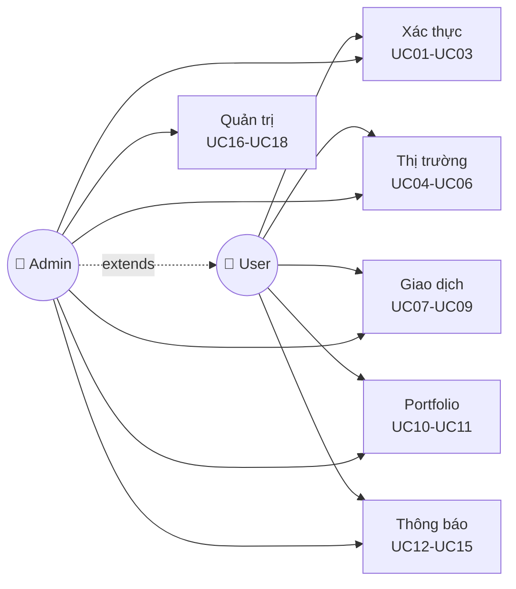
```mermaid
flowchart LR
    User((👤 User))
    Admin((👑 Admin))

    User --> A[Xác thực<br/>UC01-UC03]
    User --> B[Thị trường<br/>UC04-UC06]
    User --> C[Giao dịch<br/>UC07-UC09]
    User --> D[Portfolio<br/>UC10-UC11]
    User --> E[Thông báo<br/>UC12-UC15]

    Admin -.->|extends| User
    Admin --> A
    Admin --> B
    Admin --> C
    Admin --> D
    Admin --> E
    Admin --> F[Quản trị<br/>UC16-UC18]
```

**Chú thích:**
- **User**: Người dùng thông thường - có quyền sử dụng UC01-UC15
- **Admin**: Kế thừa (extends) tất cả quyền của User + có thêm UC16-UC18
- Trong hệ thống, Admin có `role='admin'` và có thể trade, xem portfolio, tạo alerts... giống User

**Sơ đồ 1: Authentication (Xác thực)** – UC01, UC02, UC03

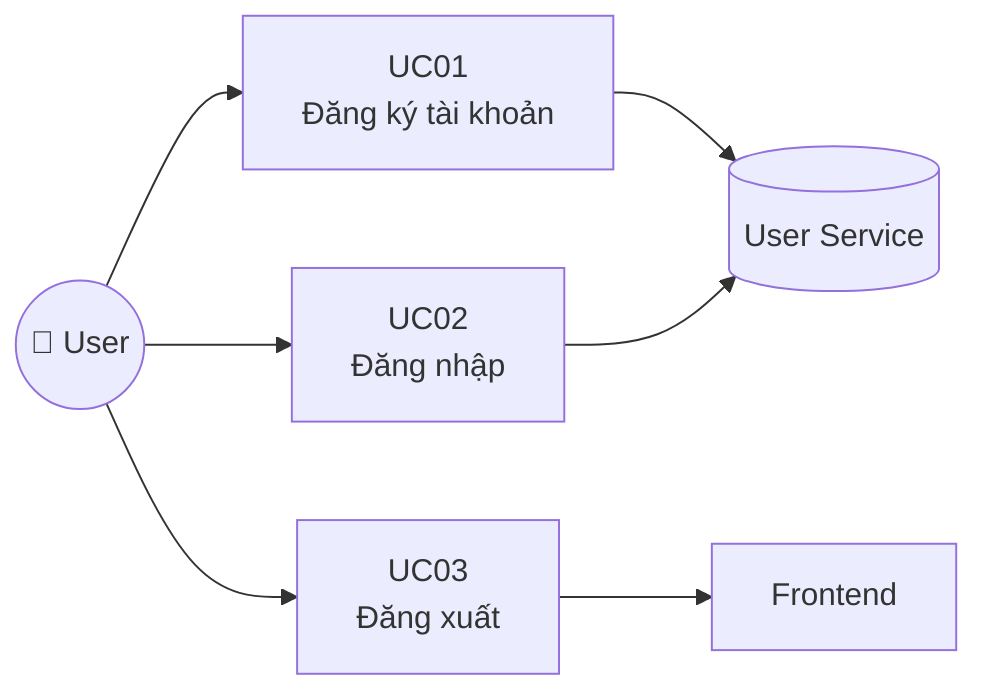
```mermaid
flowchart LR
    User((👤 User))
    
    User --> UC01[UC01<br/>Đăng ký tài khoản]
    User --> UC02[UC02<br/>Đăng nhập]
    User --> UC03[UC03<br/>Đăng xuất]

    UC01 --> US[(User Service)]
    UC02 --> US
    UC03 --> FE[Frontend]
```

**Sơ đồ 2: Market (Thị trường)** – UC04, UC05, UC06

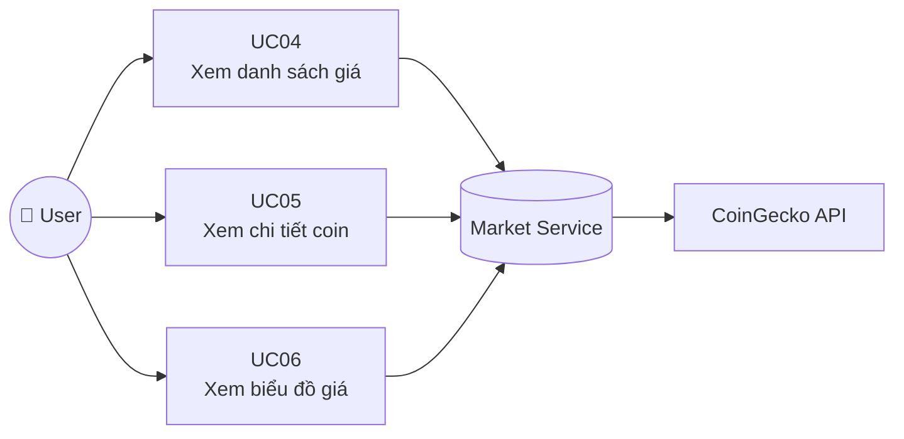
```mermaid
flowchart LR
    User((👤 User))
    
    User --> UC04[UC04<br/>Xem danh sách giá]
    User --> UC05[UC05<br/>Xem chi tiết coin]
    User --> UC06[UC06<br/>Xem biểu đồ giá]

    UC04 --> MS[(Market Service)]
    UC05 --> MS
    UC06 --> MS
    MS --> CG[CoinGecko API]
```

**Sơ đồ 3: Trading (Giao dịch)** – UC07, UC08, UC09

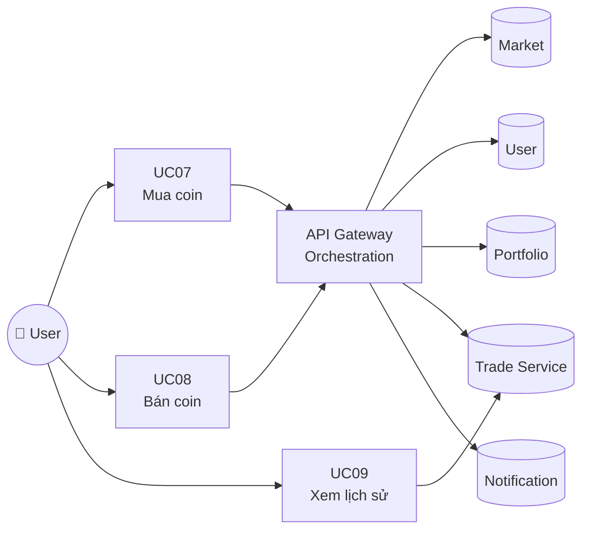
```mermaid
flowchart LR
    User((👤 User))
    
    User --> UC07[UC07<br/>Mua coin]
    User --> UC08[UC08<br/>Bán coin]
    User --> UC09[UC09<br/>Xem lịch sử]

    UC07 --> GW[API Gateway<br/>Orchestration]
    UC08 --> GW
    UC09 --> TS[(Trade Service)]
    
    GW --> MS[(Market)]
    GW --> US[(User)]
    GW --> PS[(Portfolio)]
    GW --> TS
    GW --> NS[(Notification)]
```

**Sơ đồ 4: Portfolio (Danh mục)** – UC10, UC11

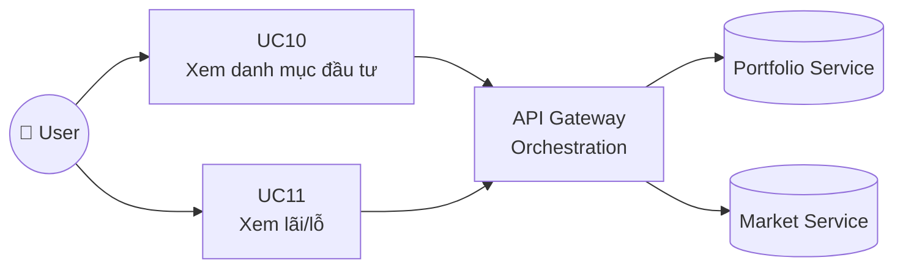
```mermaid
flowchart LR
    User((👤 User))
    
    User --> UC10[UC10<br/>Xem danh mục đầu tư]
    User --> UC11[UC11<br/>Xem lãi/lỗ]

    UC10 --> GW[API Gateway<br/>Orchestration]
    UC11 --> GW
    
    GW --> PS[(Portfolio Service)]
    GW --> MS[(Market Service)]
```

**Sơ đồ 5: Notification (Thông báo)** – UC12, UC13, UC14, UC15

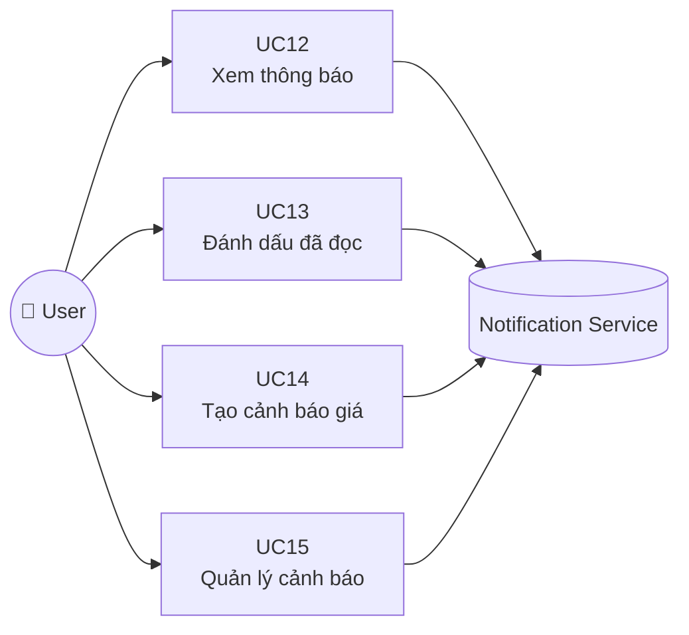
```mermaid
flowchart LR
    User((👤 User))
    
    User --> UC12[UC12<br/>Xem thông báo]
    User --> UC13[UC13<br/>Đánh dấu đã đọc]
    User --> UC14[UC14<br/>Tạo cảnh báo giá]
    User --> UC15[UC15<br/>Quản lý cảnh báo]

    UC12 --> NS[(Notification Service)]
    UC13 --> NS
    UC14 --> NS
    UC15 --> NS
```

**Sơ đồ 6: Admin (Quản trị)** – UC16, UC17, UC18

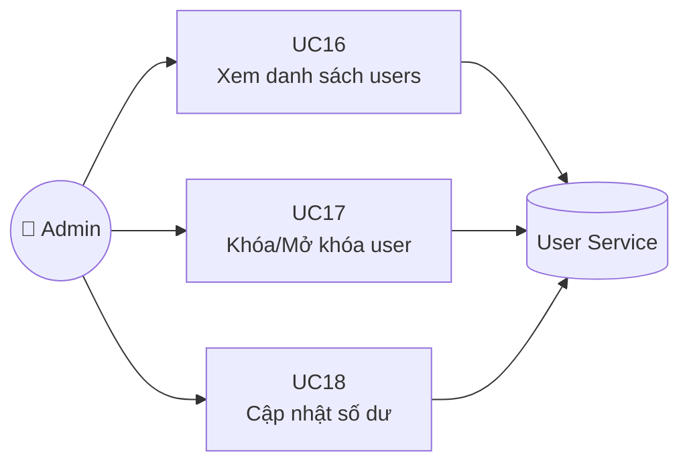
```mermaid
flowchart LR
    Admin((👑 Admin))
    
    Admin --> UC16[UC16<br/>Xem danh sách users]
    Admin --> UC17[UC17<br/>Khóa/Mở khóa user]
    Admin --> UC18[UC18<br/>Cập nhật số dư]

    UC16 --> US[(User Service)]
    UC17 --> US
    UC18 --> US
```

---

### 3.1.2. Đặc tả Use Case chi tiết

#### UC01: Đăng ký tài khoản

| Thuộc tính | Mô tả |
|------------|-------|
| Use Case ID | UC01 |
| Tên | Đăng ký tài khoản |
| Actor | User |
| Mô tả | Người dùng tạo tài khoản mới để sử dụng hệ thống giao dịch crypto ảo |
| Tiền điều kiện | - Người dùng chưa có tài khoản<br>- Email chưa được đăng ký |
| Hậu điều kiện | - Tài khoản được tạo với số dư 1000 USDT<br>- Người dùng được đăng nhập tự động |

**Luồng chính:**

| Bước | Actor | Hệ thống |
|------|-------|----------|
| 1 | Nhập email, password (≥6 ký tự), họ tên | |
| 2 | Nhấn nút "Đăng ký" | |
| 3 | | Kiểm tra rate limit (3 lần/60 phút) |
| 4 | | Validate dữ liệu đầu vào |
| 5 | | Kiểm tra email đã tồn tại chưa |
| 6 | | Hash password với bcrypt |
| 7 | | Tạo user với balance = 1000 USDT |
| 8 | | Tạo JWT token (7 ngày) |
| 9 | | Trả về thông tin user + token |
| 10 | Lưu token, chuyển đến Dashboard | |

**Luồng thay thế:**

| Bước | Điều kiện | Xử lý |
|------|-----------|-------|
| 3a | Vượt rate limit | Hiển thị "Quá nhiều lần đăng ký, thử lại sau 1 giờ" |
| 4a | Dữ liệu không hợp lệ | Hiển thị thông báo lỗi cụ thể |
| 5a | Email đã tồn tại | Hiển thị "Email đã được đăng ký" |

---

#### UC02: Đăng nhập

| Thuộc tính | Mô tả |
|------------|-------|
| Use Case ID | UC02 |
| Tên | Đăng nhập |
| Actor | User, Admin |
| Mô tả | Người dùng xác thực để truy cập hệ thống |
| Tiền điều kiện | Người dùng đã có tài khoản |
| Hậu điều kiện | Người dùng được xác thực và có JWT token |

**Luồng chính:**

| Bước | Actor | Hệ thống |
|------|-------|----------|
| 1 | Nhập email và password | |
| 2 | Nhấn nút "Đăng nhập" | |
| 3 | | Kiểm tra rate limit (5 lần/15 phút) |
| 4 | | Tìm user theo email |
| 5 | | So sánh password với bcrypt |
| 6 | | Kiểm tra tài khoản active |
| 7 | | Tạo JWT token (7 ngày) |
| 8 | | Trả về user info + token |
| 9 | Lưu token, kết nối WebSocket | |
| 10 | Chuyển đến Dashboard | |

**Luồng thay thế:**

| Bước | Điều kiện | Xử lý |
|------|-----------|-------|
| 3a | Vượt rate limit | Hiển thị "Quá nhiều lần đăng nhập, thử lại sau 15 phút" |
| 4a | Email không tồn tại | Hiển thị "Email hoặc mật khẩu không đúng" |
| 5a | Password sai | Hiển thị "Email hoặc mật khẩu không đúng" |
| 6a | Tài khoản bị khóa | Hiển thị "Tài khoản đã bị vô hiệu hóa" |

---

#### UC03: Đăng xuất

| Thuộc tính | Mô tả |
|------------|-------|
| Use Case ID | UC03 |
| Tên | Đăng xuất |
| Actor | User |
| Mô tả | Kết thúc phiên làm việc |
| Tiền điều kiện | Đã đăng nhập |
| Hậu điều kiện | Token bị xóa, ngắt WebSocket |

**Luồng chính:**

| Bước | Actor | Hệ thống |
|------|-------|----------|
| 1 | Nhấn nút "Đăng xuất" | |
| 2 | | Xóa token khỏi localStorage |
| 3 | | Ngắt kết nối WebSocket |
| 4 | | Chuyển về trang đăng nhập |

---

#### UC04: Xem danh sách giá coin

| Thuộc tính | Mô tả |
|------------|-------|
| Use Case ID | UC04 |
| Tên | Xem danh sách giá coin |
| Actor | User |
| Mô tả | Xem giá real-time của 8 loại coin được hỗ trợ |
| Tiền điều kiện | Đã đăng nhập |
| Hậu điều kiện | Hiển thị bảng giá coin |

**Luồng chính:**

| Bước | Actor | Hệ thống |
|------|-------|----------|
| 1 | Truy cập Dashboard hoặc Trade | |
| 2 | | Gọi Market Service /prices |
| 3 | | Kiểm tra cache (TTL 2 phút) |
| 4 | | Nếu cache miss → gọi CoinGecko API |
| 5 | | Trả về danh sách: symbol, price, change24h, volume, marketCap |
| 6 | Xem bảng giá 8 coins (BTC, ETH, BNB, SOL, XRP, ADA, DOGE, DOT) | |

**Luồng thay thế:**

| Bước | Điều kiện | Xử lý |
|------|-----------|-------|
| 4a | CoinGecko API lỗi | Trả về dữ liệu cache (nếu có) |
| 4b | CoinGecko rate limit | Dùng CoinPaprika làm fallback |

---

#### UC05: Xem chi tiết coin

| Thuộc tính | Mô tả |
|------------|-------|
| Use Case ID | UC05 |
| Tên | Xem chi tiết coin |
| Actor | User |
| Mô tả | Xem thông tin chi tiết của một coin cụ thể |
| Tiền điều kiện | Đã đăng nhập |
| Hậu điều kiện | Hiển thị trang chi tiết coin |

**Luồng chính:**

| Bước | Actor | Hệ thống |
|------|-------|----------|
| 1 | Click vào coin trong danh sách | |
| 2 | | Gọi Market Service /price/{coinId} |
| 3 | | Trả về: name, symbol, price, change24h, volume24h, marketCap |
| 4 | Xem thông tin chi tiết | |

**Luồng thay thế:**

| Bước | Điều kiện | Xử lý |
|------|-----------|-------|
| 2a | Coin không được hỗ trợ | Hiển thị "Coin này không được hỗ trợ" |

---

#### UC06: Xem biểu đồ giá

| Thuộc tính | Mô tả |
|------------|-------|
| Use Case ID | UC06 |
| Tên | Xem biểu đồ giá |
| Actor | User |
| Mô tả | Xem line chart lịch sử giá coin |
| Tiền điều kiện | Đã đăng nhập, đang xem chi tiết coin |
| Hậu điều kiện | Hiển thị biểu đồ giá |

**Luồng chính:**

| Bước | Actor | Hệ thống |
|------|-------|----------|
| 1 | Chọn khoảng thời gian (7/14/30 ngày) | |
| 2 | | Gọi Market Service /chart/{coinId}?days=7 |
| 3 | | Gọi CoinGecko /coins/{id}/market_chart |
| 4 | | Trả về mảng [timestamp, price] |
| 5 | Xem line chart với Recharts | |

**Luồng thay thế:**

| Bước | Điều kiện | Xử lý |
|------|-----------|-------|
| 3a | CoinGecko API lỗi | Hiển thị "Không thể tải biểu đồ" |

---

#### UC07: Mua coin

| Thuộc tính | Mô tả |
|------------|-------|
| Use Case ID | UC07 |
| Tên | Mua coin |
| Actor | User |
| Mô tả | Mua crypto bằng số dư USDT |
| Tiền điều kiện | - Đã đăng nhập<br>- Có đủ số dư USDT<br>- Số tiền mua ≥ $5 |
| Hậu điều kiện | - Số dư USDT giảm<br>- Portfolio được cập nhật<br>- Trade được ghi lại<br>- Nhận thông báo |

**Luồng chính:**

| Bước | Actor | Hệ thống |
|------|-------|----------|
| 1 | Chọn coin muốn mua | |
| 2 | Nhập số lượng coin hoặc số tiền USD | |
| 3 | Xem preview: số lượng, giá, phí (0.1%), tổng | |
| 4 | Nhấn "Mua" | |
| 5 | | Step 1: Lấy giá hiện tại từ Market Service |
| 6 | | Step 2: Kiểm tra số dư từ User Service |
| 7 | | Step 3: Trừ tiền (totalCost + fee) |
| 8 | | Step 4: Thêm holding vào Portfolio |
| 9 | | Step 5: Tạo Trade record |
| 10 | | Step 6: Gửi notification (async) |
| 11 | | Step 7: Gửi WebSocket event |
| 12 | Nhận thông báo thành công, số dư cập nhật | |

**Luồng thay thế:**

| Bước | Điều kiện | Xử lý |
|------|-----------|-------|
| 5a | Market Service lỗi | Hiển thị "Không thể lấy giá, thử lại sau" |
| 6a | Số dư không đủ | Hiển thị "Số dư không đủ. Cần X USDT, có Y USDT" |
| 6b | Số tiền < $5 | Hiển thị "Số tiền tối thiểu là $5" |
| 7-9a | Bất kỳ step nào lỗi | Rollback: hoàn tiền + xóa holding |

---

#### UC08: Bán coin

| Thuộc tính | Mô tả |
|------------|-------|
| Use Case ID | UC08 |
| Tên | Bán coin |
| Actor | User |
| Mô tả | Bán crypto để nhận USDT |
| Tiền điều kiện | - Đã đăng nhập<br>- Có coin trong portfolio<br>- Số lượng bán ≤ số lượng sở hữu |
| Hậu điều kiện | - Số dư USDT tăng<br>- Portfolio được cập nhật<br>- Trade được ghi lại |

**Luồng chính:**

| Bước | Actor | Hệ thống |
|------|-------|----------|
| 1 | Chọn coin muốn bán | |
| 2 | Nhập số lượng | |
| 3 | Xem preview: số lượng, giá, phí, tổng nhận | |
| 4 | Nhấn "Bán" | |
| 5 | | Step 1: Kiểm tra holding từ Portfolio |
| 6 | | Step 2: Lấy giá hiện tại từ Market |
| 7 | | Step 3: Lấy balance hiện tại |
| 8 | | Step 4: Cộng tiền (proceeds - fee) vào User balance |
| 9 | | Step 5: Giảm holding trong Portfolio |
| 10 | | Step 6: Tạo Trade record |
| 11 | | Step 7: Gửi notification + WebSocket |
| 12 | Nhận thông báo thành công | |

**Luồng thay thế:**

| Bước | Điều kiện | Xử lý |
|------|-----------|-------|
| 6a | Không có coin này | Hiển thị "Bạn không sở hữu coin này" |
| 6b | Số lượng > holding | Hiển thị "Số lượng vượt quá số coin đang có" |

---

#### UC09: Xem lịch sử giao dịch

| Thuộc tính | Mô tả |
|------------|-------|
| Use Case ID | UC09 |
| Tên | Xem lịch sử giao dịch |
| Actor | User |
| Mô tả | Xem danh sách các giao dịch đã thực hiện |
| Tiền điều kiện | Đã đăng nhập |
| Hậu điều kiện | Hiển thị danh sách trades |

**Luồng chính:**

| Bước | Actor | Hệ thống |
|------|-------|----------|
| 1 | Truy cập trang History | |
| 2 | | Gọi Trade Service /history |
| 3 | | Trả về danh sách trades (giới hạn 100) |
| 4 | Xem: loại (buy/sell), coin, số lượng, giá, phí, thời gian | |
| 5 | (Optional) Lọc theo loại hoặc coin | |

---

#### UC10: Xem danh mục đầu tư

| Thuộc tính | Mô tả |
|------------|-------|
| Use Case ID | UC10 |
| Tên | Xem danh mục đầu tư |
| Actor | User |
| Mô tả | Xem portfolio holdings và phân bổ |
| Tiền điều kiện | Đã đăng nhập |
| Hậu điều kiện | Hiển thị portfolio với pie chart |

**Luồng chính:**

| Bước | Actor | Hệ thống |
|------|-------|----------|
| 1 | Truy cập trang Portfolio | |
| 2 | | Gọi Portfolio Service / |
| 3 | | Trả về: holdings[], totalValue, totalInvested, totalProfit |
| 4 | Xem danh sách holdings (coin, số lượng, giá TB) | |
| 5 | Xem Pie Chart phân bổ danh mục | |

---

#### UC11: Xem lãi/lỗ

| Thuộc tính | Mô tả |
|------------|-------|
| Use Case ID | UC11 |
| Tên | Xem lãi/lỗ |
| Actor | User |
| Mô tả | Xem profit/loss của portfolio |
| Tiền điều kiện | Đã đăng nhập, có holdings |
| Hậu điều kiện | Hiển thị lãi/lỗ |

**Luồng chính:**

| Bước | Actor | Hệ thống |
|------|-------|----------|
| 1 | Xem trang Portfolio hoặc Dashboard | |
| 2 | | Lấy giá hiện tại từ Market Service |
| 3 | | Tính: currentValue = Σ(amount × currentPrice) |
| 4 | | Tính: profit = currentValue - totalInvested |
| 5 | | Tính: profitPercentage = (profit / totalInvested) × 100 |
| 6 | Xem tổng lãi/lỗ và % | |

---

#### UC12: Tạo cảnh báo giá

| Thuộc tính | Mô tả |
|------------|-------|
| Use Case ID | UC12 |
| Tên | Tạo cảnh báo giá |
| Actor | User |
| Mô tả | Đặt alert khi giá coin đạt ngưỡng |
| Tiền điều kiện | Đã đăng nhập |
| Hậu điều kiện | Price alert được tạo và active |

**Luồng chính:**

| Bước | Actor | Hệ thống |
|------|-------|----------|
| 1 | Truy cập trang Settings | |
| 2 | Chọn coin (BTC, ETH,...) | |
| 3 | Chọn điều kiện (above/below) | |
| 4 | Nhập giá mục tiêu | |
| 5 | Nhấn "Tạo Alert" | |
| 6 | | Validate dữ liệu |
| 7 | | Tạo PriceAlert {symbol, targetPrice, condition, isActive: true} |
| 8 | Nhận thông báo tạo thành công | |

---

#### UC13: Xem thông báo

| Thuộc tính | Mô tả |
|------------|-------|
| Use Case ID | UC13 |
| Tên | Xem thông báo |
| Actor | User |
| Mô tả | Xem danh sách notifications |
| Tiền điều kiện | Đã đăng nhập |
| Hậu điều kiện | Hiển thị danh sách thông báo |

**Luồng chính:**

| Bước | Actor | Hệ thống |
|------|-------|----------|
| 1 | Truy cập trang Notifications | |
| 2 | | Gọi Notification Service / |
| 3 | | Trả về: notifications[], unreadCount |
| 4 | Xem danh sách: type, title, message, time, status | |

---

#### UC14: Đánh dấu đã đọc

| Thuộc tính | Mô tả |
|------------|-------|
| Use Case ID | UC14 |
| Tên | Đánh dấu đã đọc |
| Actor | User |
| Mô tả | Mark notification as read |
| Tiền điều kiện | Có notification chưa đọc |
| Hậu điều kiện | Notification status = 'read' |

**Luồng chính:**

| Bước | Actor | Hệ thống |
|------|-------|----------|
| 1a | Click vào notification | |
| 1b | Hoặc click "Đánh dấu tất cả đã đọc" | |
| 2 | | Cập nhật status = 'read', readAt = now |
| 3 | | Giảm unreadCount |
| 4 | UI cập nhật badge | |

---

#### UC15: Kiểm tra và gửi cảnh báo giá (System)

| Thuộc tính | Mô tả |
|------------|-------|
| Use Case ID | UC15 |
| Tên | Kiểm tra và gửi cảnh báo giá |
| Actor | System (Cron Job) |
| Mô tả | Tự động kiểm tra price alerts và gửi thông báo |
| Tiền điều kiện | ENABLE_PRICE_ALERTS = true |
| Hậu điều kiện | Alerts được trigger gửi notification |

**Luồng chính:**

| Bước | Hệ thống |
|------|----------|
| 1 | Cron job chạy mỗi phút |
| 2 | Lấy tất cả PriceAlerts có isActive = true |
| 3 | Gọi API Gateway lấy giá hiện tại |
| 4 | Với mỗi alert, so sánh currentPrice với targetPrice |
| 5 | Nếu điều kiện thỏa mãn (above/below): |
| 6 | → Mark alert: triggered = true, isActive = false |
| 7 | → Tạo Notification (type: 'price_alert', priority: 'high') |
| 8 | → Gửi WebSocket event đến user |
| 9 | → (Optional) Gửi email nếu enabled |

---

#### UC16: Xem danh sách users (Admin)

| Thuộc tính | Mô tả |
|------------|-------|
| Use Case ID | UC16 |
| Tên | Xem danh sách users |
| Actor | Admin |
| Mô tả | Quản trị viên xem tất cả users |
| Tiền điều kiện | Đăng nhập với role = 'admin' |
| Hậu điều kiện | Hiển thị danh sách users |

**Luồng chính:**

| Bước | Actor | Hệ thống |
|------|-------|----------|
| 1 | Truy cập trang Admin | |
| 2 | | Kiểm tra role = 'admin' |
| 3 | | Gọi User Service /admin/users |
| 4 | | Trả về: users[], stats |
| 5 | Xem danh sách: email, fullName, balance, role, isActive, createdAt | |

---

#### UC17: Khóa/Mở khóa tài khoản (Admin)

| Thuộc tính | Mô tả |
|------------|-------|
| Use Case ID | UC17 |
| Tên | Khóa/Mở khóa tài khoản |
| Actor | Admin |
| Mô tả | Vô hiệu hóa hoặc kích hoạt lại user |
| Tiền điều kiện | Đăng nhập với role = 'admin' |
| Hậu điều kiện | User.isActive được toggle |

**Luồng chính:**

| Bước | Actor | Hệ thống |
|------|-------|----------|
| 1 | Click nút Khóa/Mở khóa trên user | |
| 2 | | Gọi User Service /admin/users/:id/toggle |
| 3 | | Toggle isActive (true ↔ false) |
| 4 | | Trả về user updated |
| 5 | Xem trạng thái mới | |

---

#### UC18: Cập nhật số dư user (Admin)

| Thuộc tính | Mô tả |
|------------|-------|
| Use Case ID | UC18 |
| Tên | Cập nhật số dư user |
| Actor | Admin |
| Mô tả | Thêm hoặc trừ số dư USDT của user |
| Tiền điều kiện | Đăng nhập với role = 'admin' |
| Hậu điều kiện | User.balance được cập nhật, ghi log vào balanceHistory |

**Luồng chính:**

| Bước | Actor | Hệ thống |
|------|-------|----------|
| 1 | Click nút Update Balance (biểu tượng $) trên user | |
| 2 | Nhập số tiền (+ cộng, - trừ) và mô tả | |
| 3 | Nhấn "Cập nhật" | |
| 4 | | Gọi User Service /admin/users/:id/balance |
| 5 | | Cộng/trừ balance, ghi vào balanceHistory (type: 'admin') |
| 6 | | Trả về user updated |
| 7 | Xem số dư mới | |

---

### 3.1.3. Activity Diagram

**Đăng ký tài khoản**

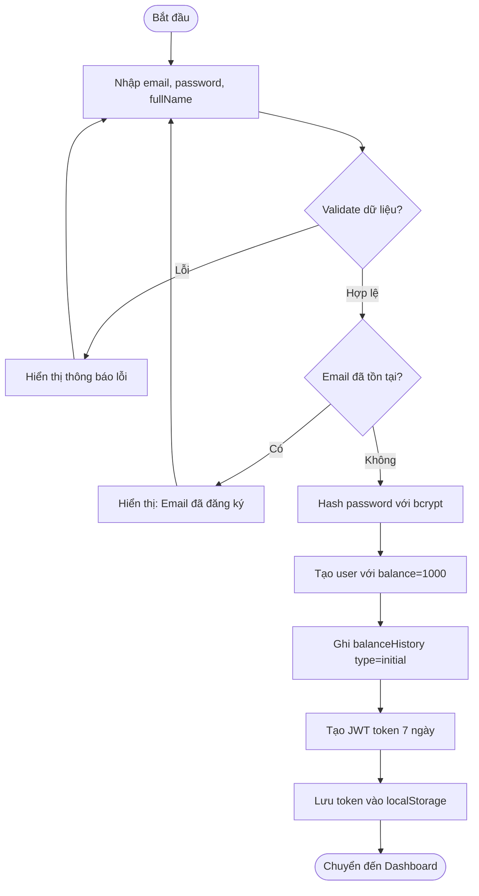
```mermaid
flowchart TD
    A([Bắt đầu]) --> B[Nhập email, password, fullName]
    B --> C{Validate dữ liệu?}
    C -->|Lỗi| D[Hiển thị thông báo lỗi]
    D --> B
    C -->|Hợp lệ| E{Email đã tồn tại?}
    E -->|Có| F[Hiển thị: Email đã đăng ký]
    F --> B
    E -->|Không| G[Hash password với bcrypt]
    G --> H[Tạo user với balance=1000]
    H --> I[Ghi balanceHistory type=initial]
    I --> J[Tạo JWT token 7 ngày]
    J --> K[Lưu token vào localStorage]
    K --> L([Chuyển đến Dashboard])
```

**Đăng nhập**

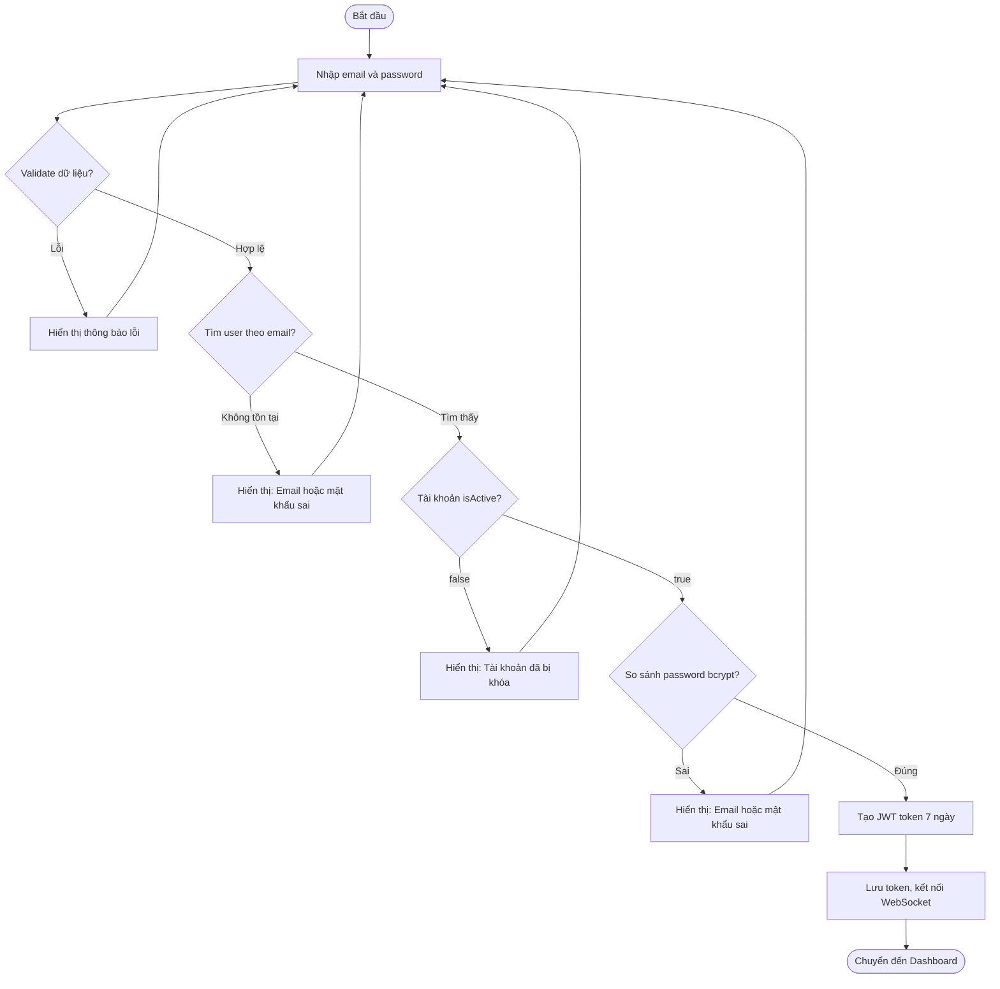
```mermaid
flowchart TD
    A([Bắt đầu]) --> B[Nhập email và password]
    B --> C{Validate dữ liệu?}
    C -->|Lỗi| D[Hiển thị thông báo lỗi]
    D --> B
    C -->|Hợp lệ| E{Tìm user theo email?}
    E -->|Không tồn tại| F[Hiển thị: Email hoặc mật khẩu sai]
    F --> B
    E -->|Tìm thấy| G{Tài khoản isActive?}
    G -->|false| H[Hiển thị: Tài khoản đã bị khóa]
    H --> B
    G -->|true| I{So sánh password bcrypt?}
    I -->|Sai| J[Hiển thị: Email hoặc mật khẩu sai]
    J --> B
    I -->|Đúng| K[Tạo JWT token 7 ngày]
    K --> L[Lưu token, kết nối WebSocket]
    L --> M([Chuyển đến Dashboard])
```

**Mua coin**

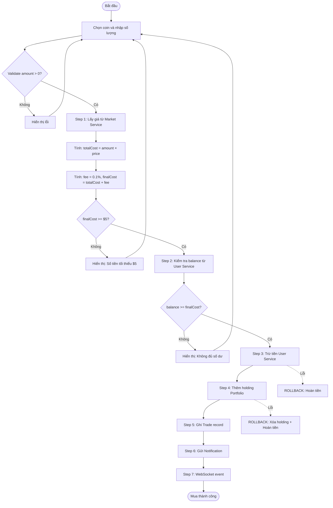
```mermaid
flowchart TD
    A([Bắt đầu]) --> B[Chọn coin và nhập số lượng]
    B --> C{Validate amount > 0?}
    C -->|Không| D[Hiển thị lỗi]
    D --> B
    C -->|Có| E[Step 1: Lấy giá từ Market Service]
    E --> F[Tính: totalCost = amount × price]
    F --> G[Tính: fee = 0.1%, finalCost = totalCost + fee]
    G --> H{finalCost >= $5?}
    H -->|Không| I[Hiển thị: Số tiền tối thiểu $5]
    I --> B
    H -->|Có| J[Step 2: Kiểm tra balance từ User Service]
    J --> K{balance >= finalCost?}
    K -->|Không| L[Hiển thị: Không đủ số dư]
    L --> B
    K -->|Có| M[Step 3: Trừ tiền User Service]
    M --> N[Step 4: Thêm holding Portfolio]
    N --> O[Step 5: Ghi Trade record]
    O --> P[Step 6: Gửi Notification]
    P --> Q[Step 7: WebSocket event]
    Q --> R([Mua thành công])
    
    M -.->|Lỗi| S[ROLLBACK: Hoàn tiền]
    N -.->|Lỗi| T[ROLLBACK: Xóa holding + Hoàn tiền]
```

**Bán coin**

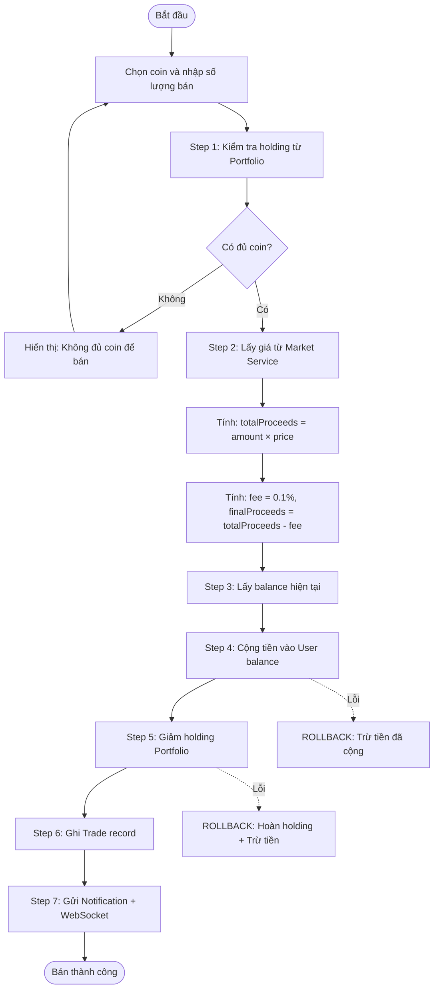
```mermaid
flowchart TD
    A([Bắt đầu]) --> B[Chọn coin và nhập số lượng bán]
    B --> C[Step 1: Kiểm tra holding từ Portfolio]
    C --> D{Có đủ coin?}
    D -->|Không| E[Hiển thị: Không đủ coin để bán]
    E --> B
    D -->|Có| F[Step 2: Lấy giá từ Market Service]
    F --> G[Tính: totalProceeds = amount × price]
    G --> H[Tính: fee = 0.1%, finalProceeds = totalProceeds - fee]
    H --> I[Step 3: Lấy balance hiện tại]
    I --> J[Step 4: Cộng tiền vào User balance]
    J --> K[Step 5: Giảm holding Portfolio]
    K --> L[Step 6: Ghi Trade record]
    L --> M[Step 7: Gửi Notification + WebSocket]
    M --> N([Bán thành công])
    
    J -.->|Lỗi| O[ROLLBACK: Trừ tiền đã cộng]
    K -.->|Lỗi| P[ROLLBACK: Hoàn holding + Trừ tiền]
```

**Tạo cảnh báo giá**

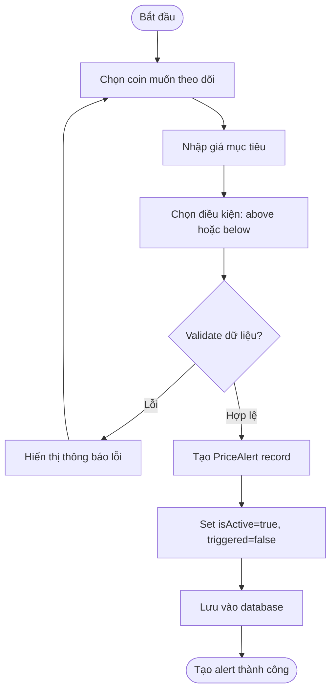
```mermaid
flowchart TD
    A([Bắt đầu]) --> B[Chọn coin muốn theo dõi]
    B --> C[Nhập giá mục tiêu]
    C --> D[Chọn điều kiện: above hoặc below]
    D --> E{Validate dữ liệu?}
    E -->|Lỗi| F[Hiển thị thông báo lỗi]
    F --> B
    E -->|Hợp lệ| G[Tạo PriceAlert record]
    G --> H[Set isActive=true, triggered=false]
    H --> I[Lưu vào database]
    I --> J([Tạo alert thành công])
```

**Kiểm tra và gửi cảnh báo giá (System)**

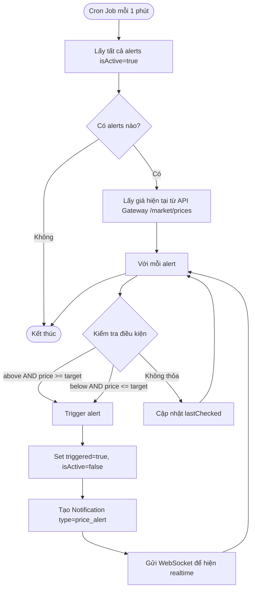
```mermaid
flowchart TD
    A([Cron Job mỗi 1 phút]) --> B[Lấy tất cả alerts isActive=true]
    B --> C{Có alerts nào?}
    C -->|Không| D([Kết thúc])
    C -->|Có| E[Lấy giá hiện tại từ API Gateway /market/prices]
    E --> F[Với mỗi alert]
    F --> G{Kiểm tra điều kiện}
    G -->|above AND price >= target| H[Trigger alert]
    G -->|below AND price <= target| H
    G -->|Không thỏa| I[Cập nhật lastChecked]
    I --> F
    H --> J[Set triggered=true, isActive=false]
    J --> K[Tạo Notification type=price_alert]
    K --> L[Gửi WebSocket để hiện realtime]
    L --> F
    F --> D
```

**Xem danh mục đầu tư**

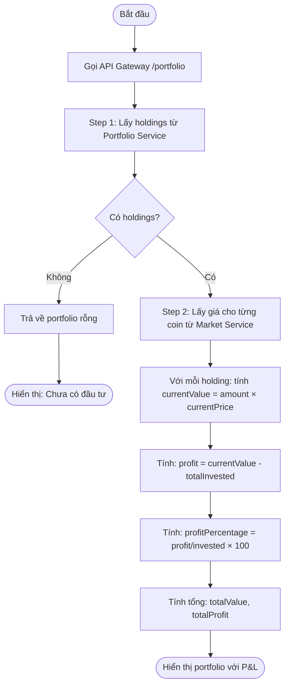
```mermaid
flowchart TD
    A([Bắt đầu]) --> B[Gọi API Gateway /portfolio]
    B --> C[Step 1: Lấy holdings từ Portfolio Service]
    C --> D{Có holdings?}
    D -->|Không| E[Trả về portfolio rỗng]
    E --> F([Hiển thị: Chưa có đầu tư])
    D -->|Có| G[Step 2: Lấy giá cho từng coin từ Market Service]
    G --> H[Với mỗi holding: tính currentValue = amount × currentPrice]
    H --> I[Tính: profit = currentValue - totalInvested]
    I --> J[Tính: profitPercentage = profit/invested × 100]
    J --> K[Tính tổng: totalValue, totalProfit]
    K --> L([Hiển thị portfolio với P&L])
```

---

## 3.2. Thiết kế hệ thống

### 3.2.1. Thiết kế kiến trúc

**Sơ đồ kiến trúc SOA**

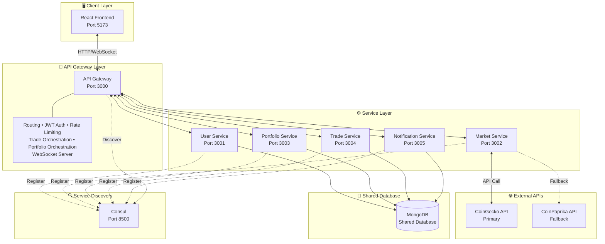
```mermaid
flowchart TB
    subgraph Client["🖥️ Client Layer"]
        FE[React Frontend<br/>Port 5173]
    end

    subgraph Gateway["🚪 API Gateway Layer"]
        GW[API Gateway<br/>Port 3000]
        GW_FEATURES[Routing • JWT Auth • Rate Limiting<br/>Trade Orchestration • Portfolio Orchestration<br/>WebSocket Server]
    end

    subgraph Services["⚙️ Service Layer"]
        US[User Service<br/>Port 3001]
        MS[Market Service<br/>Port 3002]
        PS[Portfolio Service<br/>Port 3003]
        TS[Trade Service<br/>Port 3004]
        NS[Notification Service<br/>Port 3005]
    end

    subgraph External["🌐 External APIs"]
        CG[CoinGecko API<br/>Primary]
        CP[CoinPaprika API<br/>Fallback]
    end

    subgraph Data["💾 Shared Database"]
        DB[(MongoDB<br/>Shared Database)]
    end

    subgraph Discovery["🔍 Service Discovery"]
        CS[Consul<br/>Port 8500]
    end

    FE <-->|HTTP/WebSocket| GW
    GW --- GW_FEATURES
    GW <--> US
    GW <--> MS
    GW <--> PS
    GW <--> TS
    GW <--> NS
    
    MS <-->|API Call| CG
    MS -.->|Fallback| CP
    
    US --> DB
    PS --> DB
    TS --> DB
    NS --> DB

    US -.->|Register| CS
    MS -.->|Register| CS
    PS -.->|Register| CS
    TS -.->|Register| CS
    NS -.->|Register| CS
    GW -.->|Discover| CS
```

**Mô tả các services:**

| Service | Port | Chức năng | Database | External API |
|---------|------|-----------|----------|--------------|
| API Gateway | 3000 | - Điểm vào duy nhất cho client<br>- Xác thực JWT<br>- Rate limiting<br>- Proxy requests<br>- Trade orchestration (Buy/Sell)<br>- Portfolio orchestration (enrich với giá)<br>- WebSocket server | - | - |
| User Service | 3001 | - Đăng ký/Đăng nhập<br>- Quản lý profile<br>- Quản lý ví USDT<br>- Admin functions | MongoDB: users | - |
| Market Service | 3002 | - Lấy giá coin real-time<br>- Lấy chart data<br>- Cache giá (2 phút) | - | CoinGecko, CoinPaprika |
| Portfolio Service | 3003 | - Quản lý holdings (add/reduce)<br>- Lưu trữ portfolio data | MongoDB: portfolios | - |
| Trade Service | 3004 | - Lưu lịch sử giao dịch | MongoDB: trades | - |
| Notification Service | 3005 | - Quản lý thông báo<br>- Price alerts<br>- Cron job kiểm tra giá | MongoDB: notifications, pricealerts | - |

**Các thành phần hỗ trợ:**

| Thành phần | Mô tả |
|------------|-------|
| Consul | Service Discovery - Đăng ký và tìm kiếm services động |
| Circuit Breaker | Opossum library - Ngăn cascading failures |
| JWT | JSON Web Token - Xác thực stateless |
| WebSocket | Socket.IO - Real-time notifications |
| Cache | NodeCache - In-memory cache cho giá coin |

---

### 3.2.2. Thiết kế chi tiết

#### Sequence Diagram (5 luồng chính)

**Sequence Diagram Luồng 1 – Đăng ký và đăng nhập**

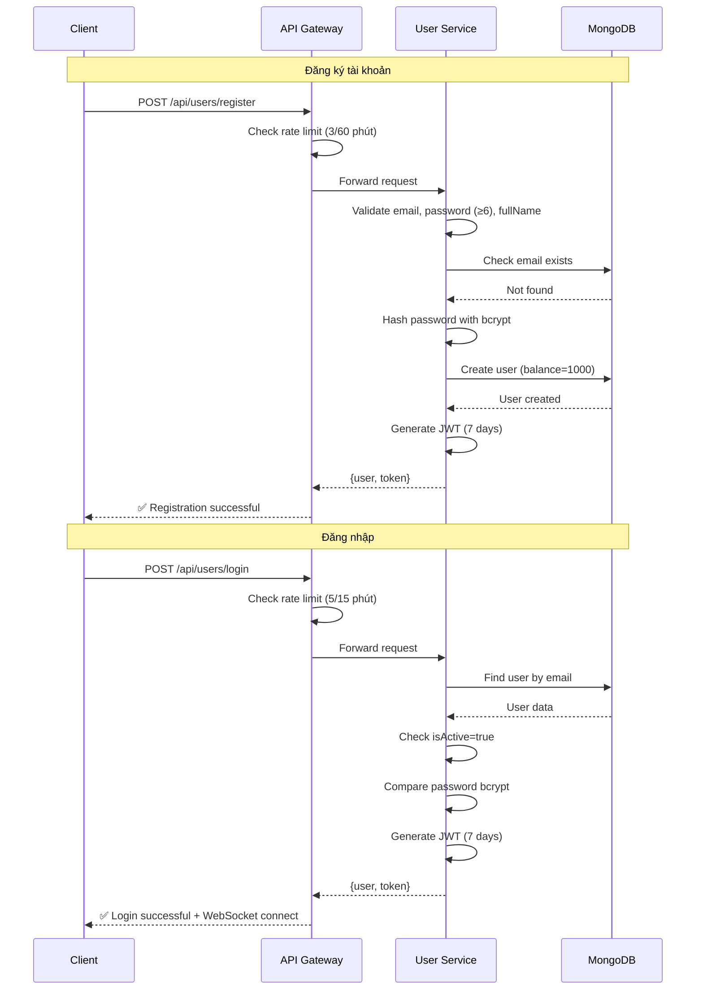
```mermaid
sequenceDiagram
    participant C as Client
    participant GW as API Gateway
    participant US as User Service
    participant DB as MongoDB

    Note over C,DB: Đăng ký tài khoản
    C->>GW: POST /api/users/register
    GW->>GW: Check rate limit (3/60 phút)
    GW->>US: Forward request
    US->>US: Validate email, password (≥6), fullName
    US->>DB: Check email exists
    DB-->>US: Not found
    US->>US: Hash password with bcrypt
    US->>DB: Create user (balance=1000)
    DB-->>US: User created
    US->>US: Generate JWT (7 days)
    US-->>GW: {user, token}
    GW-->>C: ✅ Registration successful

    Note over C,DB: Đăng nhập
    C->>GW: POST /api/users/login
    GW->>GW: Check rate limit (5/15 phút)
    GW->>US: Forward request
    US->>DB: Find user by email
    DB-->>US: User data
    US->>US: Check isActive=true
    US->>US: Compare password bcrypt
    US->>US: Generate JWT (7 days)
    US-->>GW: {user, token}
    GW-->>C: ✅ Login successful + WebSocket connect
```

**Sequence Diagram Luồng 2 – Thực hiện giao dịch mua coin**

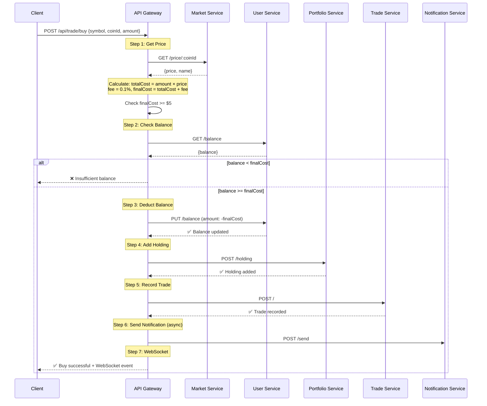
```mermaid
sequenceDiagram
    participant C as Client
    participant GW as API Gateway
    participant MS as Market Service
    participant US as User Service
    participant PS as Portfolio Service
    participant TS as Trade Service
    participant NS as Notification Service

    C->>GW: POST /api/trade/buy {symbol, coinId, amount}
    
    Note over GW: Step 1: Get Price
    GW->>MS: GET /price/:coinId
    MS-->>GW: {price, name}
    
    Note over GW: Calculate: totalCost = amount × price<br/>fee = 0.1%, finalCost = totalCost + fee
    
    GW->>GW: Check finalCost >= $5
    
    Note over GW: Step 2: Check Balance
    GW->>US: GET /balance
    US-->>GW: {balance}
    
    alt balance < finalCost
        GW-->>C: ❌ Insufficient balance
    else balance >= finalCost
        Note over GW: Step 3: Deduct Balance
        GW->>US: PUT /balance (amount: -finalCost)
        US-->>GW: ✅ Balance updated
        
        Note over GW: Step 4: Add Holding
        GW->>PS: POST /holding
        PS-->>GW: ✅ Holding added
        
        Note over GW: Step 5: Record Trade
        GW->>TS: POST /
        TS-->>GW: ✅ Trade recorded
        
        Note over GW: Step 6: Send Notification (async)
        GW->>NS: POST /send
        
        Note over GW: Step 7: WebSocket
        GW-->>C: ✅ Buy successful + WebSocket event
    end
```

**Sequence Diagram Luồng 3 – Thực hiện giao dịch bán coin**

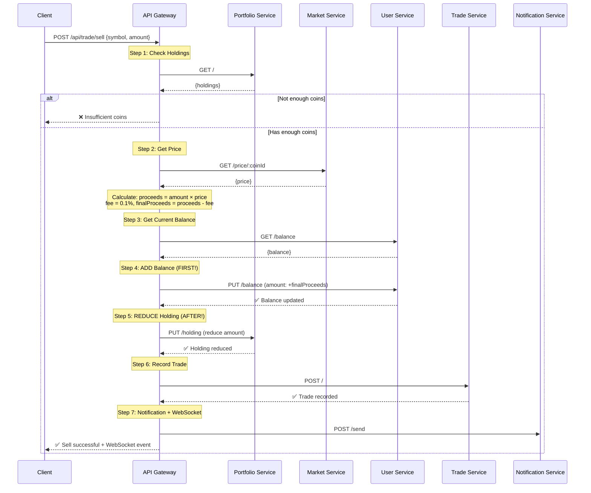
```mermaid
sequenceDiagram
    participant C as Client
    participant GW as API Gateway
    participant PS as Portfolio Service
    participant MS as Market Service
    participant US as User Service
    participant TS as Trade Service
    participant NS as Notification Service

    C->>GW: POST /api/trade/sell {symbol, amount}
    
    Note over GW: Step 1: Check Holdings
    GW->>PS: GET /
    PS-->>GW: {holdings}
    
    alt Not enough coins
        GW-->>C: ❌ Insufficient coins
    else Has enough coins
        Note over GW: Step 2: Get Price
        GW->>MS: GET /price/:coinId
        MS-->>GW: {price}
        
        Note over GW: Calculate: proceeds = amount × price<br/>fee = 0.1%, finalProceeds = proceeds - fee
        
        Note over GW: Step 3: Get Current Balance
        GW->>US: GET /balance
        US-->>GW: {balance}
        
        Note over GW: Step 4: ADD Balance (FIRST!)
        GW->>US: PUT /balance (amount: +finalProceeds)
        US-->>GW: ✅ Balance updated
        
        Note over GW: Step 5: REDUCE Holding (AFTER!)
        GW->>PS: PUT /holding (reduce amount)
        PS-->>GW: ✅ Holding reduced
        
        Note over GW: Step 6: Record Trade
        GW->>TS: POST /
        TS-->>GW: ✅ Trade recorded
        
        Note over GW: Step 7: Notification + WebSocket
        GW->>NS: POST /send
        GW-->>C: ✅ Sell successful + WebSocket event
    end
```

**Sequence Diagram Luồng 4 – Cập nhật và hiển thị danh mục**

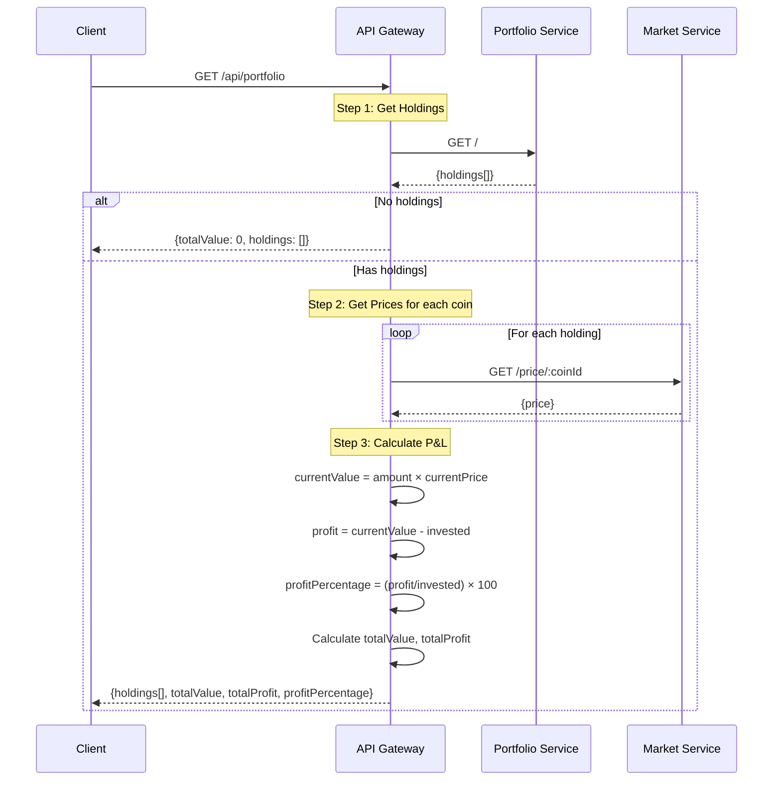
```mermaid
sequenceDiagram
    participant C as Client
    participant GW as API Gateway
    participant PS as Portfolio Service
    participant MS as Market Service

    C->>GW: GET /api/portfolio
    
    Note over GW: Step 1: Get Holdings
    GW->>PS: GET /
    PS-->>GW: {holdings[]}
    
    alt No holdings
        GW-->>C: {totalValue: 0, holdings: []}
    else Has holdings
        Note over GW: Step 2: Get Prices for each coin
        loop For each holding
            GW->>MS: GET /price/:coinId
            MS-->>GW: {price}
        end
        
        Note over GW: Step 3: Calculate P&L
        GW->>GW: currentValue = amount × currentPrice
        GW->>GW: profit = currentValue - invested
        GW->>GW: profitPercentage = (profit/invested) × 100
        GW->>GW: Calculate totalValue, totalProfit
        
        GW-->>C: {holdings[], totalValue, totalProfit, profitPercentage}
    end
```

**Sequence Diagram Luồng 5 – Gửi thông báo giá vượt ngưỡng**

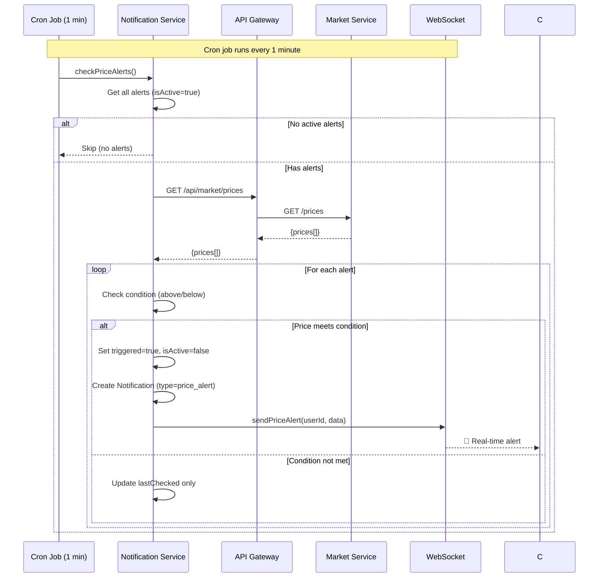
```mermaid
sequenceDiagram
    participant CRON as Cron Job (1 min)
    participant NS as Notification Service
    participant GW as API Gateway
    participant MS as Market Service
    participant WS as WebSocket

    Note over CRON,WS: Cron job runs every 1 minute
    
    CRON->>NS: checkPriceAlerts()
    NS->>NS: Get all alerts (isActive=true)
    
    alt No active alerts
        NS-->>CRON: Skip (no alerts)
    else Has alerts
        NS->>GW: GET /api/market/prices
        GW->>MS: GET /prices
        MS-->>GW: {prices[]}
        GW-->>NS: {prices[]}
        
        loop For each alert
            NS->>NS: Check condition (above/below)
            
            alt Price meets condition
                NS->>NS: Set triggered=true, isActive=false
                NS->>NS: Create Notification (type=price_alert)
                NS->>WS: sendPriceAlert(userId, data)
                WS-->>C: 🔔 Real-time alert
            else Condition not met
                NS->>NS: Update lastChecked only
            end
        end
    end
```

---

#### Class Diagram

```mermaid
erDiagram
    USER {
        ObjectId _id PK
        String email UK
        String password
        String fullName
        Enum role
        Number balance
        Boolean isActive
        Array balanceHistory
        Date createdAt
        Date updatedAt
    }
    
    BALANCE_HISTORY {
        Number amount
        Enum type
        String description
        Date timestamp
    }
    
    PORTFOLIO {
        ObjectId _id PK
        ObjectId userId FK
        Array holdings
        Number totalValue
        Number totalInvested
        Number totalProfit
        Number profitPercentage
        Date lastCalculated
    }
    
    HOLDING {
        String symbol
        String coinId
        String name
        Number amount
        Number averageBuyPrice
        Number totalInvested
        Date lastUpdated
    }
    
    TRADE {
        ObjectId _id PK
        ObjectId userId FK
        Enum type
        String symbol
        String coinId
        String coinName
        Number amount
        Number price
        Number totalCost
        Number fee
        Number feePercentage
        Enum status
        Number balanceBefore
        Number balanceAfter
        String notes
        String errorMessage
        Date executedAt
    }
    
    NOTIFICATION {
        ObjectId _id PK
        ObjectId userId FK
        Enum type
        String title
        String message
        Object data
        Enum status
        Enum priority
        Enum channel
        Date sentAt
        Date readAt
    }
    
    PRICEALERT {
        ObjectId _id PK
        ObjectId userId FK
        String symbol
        String coinId
        Number targetPrice
        Enum condition
        Boolean isActive
        Boolean triggered
        Date triggeredAt
        Date lastChecked
    }

    USER ||--o{ BALANCE_HISTORY : contains
    USER ||--|| PORTFOLIO : owns
    PORTFOLIO ||--o{ HOLDING : contains
    USER ||--o{ TRADE : makes
    USER ||--o{ NOTIFICATION : receives
    USER ||--o{ PRICEALERT : creates
```

**Bảng mô tả:**

**User:**

| Thuộc tính | Kiểu | Mô tả |
|------------|------|-------|
| _id | ObjectId | ID tự động |
| email | String | Email đăng nhập (unique) |
| password | String | Mật khẩu đã hash |
| fullName | String | Họ tên |
| role | String | user / admin |
| balance | Number | Số dư USDT (default: 1000) |
| isActive | Boolean | Trạng thái tài khoản |
| balanceHistory | Array | Lịch sử thay đổi số dư |

**BalanceHistory (nested trong User):**

| Thuộc tính | Kiểu | Mô tả |
|------------|------|-------|
| amount | Number | Số tiền thay đổi (+/-) |
| type | String | deposit / withdraw / trade / initial / admin |
| description | String | Mô tả giao dịch |
| timestamp | Date | Thời điểm thay đổi |

**Portfolio:**

| Thuộc tính | Kiểu | Mô tả |
|------------|------|-------|
| _id | ObjectId | ID tự động |
| userId | ObjectId | Ref đến User (unique) |
| holdings | Array | Danh sách coin đang nắm giữ |
| totalValue | Number | Tổng giá trị hiện tại |
| totalInvested | Number | Tổng tiền đã đầu tư |
| totalProfit | Number | Lãi/lỗ |
| profitPercentage | Number | % lãi/lỗ |
| lastCalculated | Date | Lần tính toán cuối |

**Holdings (nested trong Portfolio):**

| Thuộc tính | Kiểu | Mô tả |
|------------|------|-------|
| symbol | String | VD: BTC, ETH (uppercase) |
| coinId | String | VD: bitcoin (lowercase) |
| name | String | Tên coin |
| amount | Number | Số lượng đang nắm giữ |
| averageBuyPrice | Number | Giá mua trung bình |
| totalInvested | Number | Tổng tiền đã đầu tư vào coin này |
| lastUpdated | Date | Lần cập nhật cuối |

**Trade:**

| Thuộc tính | Kiểu | Mô tả |
|------------|------|-------|
| _id | ObjectId | ID tự động |
| userId | ObjectId | Ref đến User |
| type | String | buy / sell |
| symbol | String | VD: BTC, ETH (uppercase) |
| coinId | String | VD: bitcoin (lowercase) |
| coinName | String | Tên coin |
| amount | Number | Số lượng coin |
| price | Number | Giá tại thời điểm giao dịch |
| totalCost | Number | Tổng giá trị |
| fee | Number | Phí giao dịch |
| feePercentage | Number | % phí (default: 0.1) |
| status | String | pending / completed / failed / cancelled |
| balanceBefore | Number | Số dư trước giao dịch |
| balanceAfter | Number | Số dư sau giao dịch |
| notes | String | Ghi chú (optional, max 500 ký tự) |
| errorMessage | String | Thông báo lỗi (cho giao dịch failed) |
| executedAt | Date | Thời điểm thực hiện |

**Notification:**

| Thuộc tính | Kiểu | Mô tả |
|------------|------|-------|
| _id | ObjectId | ID tự động |
| userId | ObjectId | Ref đến User |
| type | String | trade / price_alert / system / warning |
| title | String | Tiêu đề |
| message | String | Nội dung |
| data | Object | Dữ liệu bổ sung (flexible) |
| status | String | unread / read / archived |
| priority | String | low / medium / high / urgent |
| channel | String | app (chỉ thông báo trong app) |
| sentAt | Date | Thời điểm gửi |
| readAt | Date | Thời điểm đọc |

**PriceAlert:**

| Thuộc tính | Kiểu | Mô tả |
|------------|------|-------|
| _id | ObjectId | ID tự động |
| userId | ObjectId | Ref đến User |
| symbol | String | VD: BTC (uppercase) |
| coinId | String | VD: bitcoin (lowercase) |
| targetPrice | Number | Giá mục tiêu |
| condition | String | above / below |
| isActive | Boolean | Đang hoạt động? |
| triggered | Boolean | Đã kích hoạt? |
| triggeredAt | Date | Thời điểm kích hoạt |
| lastChecked | Date | Lần kiểm tra cuối |

---

### 3.2.3. Thiết kế cơ sở dữ liệu

#### Schema Design (MongoDB)

```javascript
// Collection: users
{
  _id: ObjectId,
  email: String,           // unique, required
  password: String,        // hashed, required
  fullName: String,        // required
  role: "user" | "admin",  // default: "user"
  balance: Number,         // default: 1000
  isActive: Boolean,       // default: true
  balanceHistory: [{
    amount: Number,
    type: "deposit" | "withdraw" | "trade" | "initial" | "admin",
    description: String,
    timestamp: Date
  }],
  createdAt: Date,
  updatedAt: Date
}

// Collection: portfolios
{
  _id: ObjectId,
  userId: ObjectId,        // ref: users, unique
  holdings: [{
    symbol: String,        // uppercase
    coinId: String,        // lowercase
    name: String,
    amount: Number,
    averageBuyPrice: Number,
    totalInvested: Number,
    lastUpdated: Date
  }],
  totalValue: Number,
  totalInvested: Number,
  totalProfit: Number,
  profitPercentage: Number,
  lastCalculated: Date,
  createdAt: Date,
  updatedAt: Date
}

// Collection: trades
{
  _id: ObjectId,
  userId: ObjectId,        // ref: users
  type: "buy" | "sell",
  symbol: String,
  coinId: String,
  coinName: String,
  amount: Number,
  price: Number,
  totalCost: Number,
  fee: Number,
  feePercentage: Number,   // default: 0.1
  status: "pending" | "completed" | "failed" | "cancelled",
  balanceBefore: Number,
  balanceAfter: Number,
  notes: String,           // optional, max 500 chars
  errorMessage: String,    // optional, for failed trades
  executedAt: Date,
  createdAt: Date,
  updatedAt: Date
}

// Collection: notifications
{
  _id: ObjectId,
  userId: ObjectId,        // ref: users
  type: "trade" | "price_alert" | "system" | "warning",
  title: String,
  message: String,
  data: Object,            // flexible data
  status: "unread" | "read" | "archived",
  priority: "low" | "medium" | "high" | "urgent",
  channel: "app",             // only app notifications
  sentAt: Date,
  readAt: Date,
  createdAt: Date,
  updatedAt: Date
}

// Collection: pricealerts
{
  _id: ObjectId,
  userId: ObjectId,        // ref: users
  symbol: String,
  coinId: String,
  targetPrice: Number,
  condition: "above" | "below",
  isActive: Boolean,       // default: true
  triggered: Boolean,      // default: false
  triggeredAt: Date,
  lastChecked: Date,
  createdAt: Date,
  updatedAt: Date
}
```

**Mô tả collections:**

| Collection | Mô tả | Indexes |
|------------|-------|---------|
| users | Lưu thông tin người dùng và ví USDT | email (unique) |
| portfolios | Lưu danh mục đầu tư của user | userId (unique), holdings.symbol |
| trades | Lưu lịch sử giao dịch mua/bán | userId + createdAt, type, symbol, status |
| notifications | Lưu thông báo cho user | userId + createdAt, status, type |
| pricealerts | Lưu cảnh báo giá | userId + isActive, symbol + isActive |

**Quan hệ giữa các Collections:**

```mermaid
erDiagram
    users ||--|| portfolios : "1:1 owns"
    users ||--o{ trades : "1:N makes"
    users ||--o{ notifications : "1:N receives"
    users ||--o{ pricealerts : "1:N creates"
    
    users {
        ObjectId _id PK
        String email UK
        String role
        Number balance
    }
    
    portfolios {
        ObjectId _id PK
        ObjectId userId FK
        Array holdings
    }
    
    trades {
        ObjectId _id PK
        ObjectId userId FK
        String type
        String symbol
    }
    
    notifications {
        ObjectId _id PK
        ObjectId userId FK
        String type
        String status
    }
    
    pricealerts {
        ObjectId _id PK
        ObjectId userId FK
        String symbol
        Boolean isActive
    }
```

**Giải thích quan hệ:**

| Quan hệ | Từ | Đến | Mô tả |
|---------|----|----|-------|
| **1:1** | users | portfolios | Mỗi user có đúng 1 portfolio (userId unique trong portfolios) |
| **1:N** | users | trades | Mỗi user có nhiều giao dịch |
| **1:N** | users | notifications | Mỗi user có nhiều thông báo |
| **1:N** | users | pricealerts | Mỗi user có nhiều cảnh báo giá |

---

### 3.2.4. Thiết kế API

#### Bảng danh sách API endpoints

**Authentication APIs (2 endpoints)**

| Method | Endpoint | Mô tả | Auth |
|--------|----------|-------|------|
| POST | /api/users/register | Đăng ký tài khoản | ❌ |
| POST | /api/users/login | Đăng nhập | ❌ |

**User APIs (3 endpoints)**

| Method | Endpoint | Mô tả | Auth |
|--------|----------|-------|------|
| GET | /api/users/profile | Lấy thông tin profile | ✅ |
| PUT | /api/users/profile | Cập nhật profile | ✅ |
| GET | /api/users/balance | Lấy số dư | ✅ |

**Market APIs (3 endpoints)**

| Method | Endpoint | Mô tả | Auth |
|--------|----------|-------|------|
| GET | /api/market/prices | Lấy giá tất cả coins | ✅ |
| GET | /api/market/price/:coinId | Lấy giá 1 coin | ✅ |
| GET | /api/market/chart/:coinId | Lấy chart data | ✅ |

**Trade APIs (3 endpoints)**

| Method | Endpoint | Mô tả | Auth | Ghi chú |
|--------|----------|-------|------|---------|
| POST | /api/trade/buy | Mua coin | ✅ | API Gateway Orchestration |
| POST | /api/trade/sell | Bán coin | ✅ | API Gateway Orchestration |
| GET | /api/trade/history | Lấy lịch sử giao dịch | ✅ | Trade Service |

**Portfolio APIs (1 endpoint)**

| Method | Endpoint | Mô tả | Auth |
|--------|----------|-------|------|
| GET | /api/portfolio | Lấy danh mục (enriched với giá hiện tại) | ✅ |

**Notification APIs (8 endpoints)**

| Method | Endpoint | Mô tả | Auth |
|--------|----------|-------|------|
| GET | /api/notifications | Lấy danh sách thông báo | ✅ |
| GET | /api/notifications/unread-count | Lấy số thông báo chưa đọc | ✅ |
| PUT | /api/notifications/:id/read | Đánh dấu đã đọc | ✅ |
| PUT | /api/notifications/read-all | Đánh dấu tất cả đã đọc | ✅ |
| DELETE | /api/notifications/:id | Xóa thông báo | ✅ |
| POST | /api/notifications/alert | Tạo price alert | ✅ |
| GET | /api/notifications/alerts | Lấy danh sách alerts | ✅ |
| DELETE | /api/notifications/alert/:id | Xóa alert | ✅ |

**Admin APIs (5 endpoints)**

| Method | Endpoint | Mô tả | Auth |
|--------|----------|-------|------|
| GET | /api/users/admin/users | Lấy danh sách users | ✅ Admin |
| GET | /api/users/admin/stats | Lấy thống kê hệ thống | ✅ Admin |
| PUT | /api/users/admin/users/:id/toggle | Khóa/Mở khóa user | ✅ Admin |
| PUT | /api/users/admin/users/:id/balance | Cập nhật số dư | ✅ Admin |
| DELETE | /api/users/admin/users/:id | Xóa user | ✅ Admin |

---

**Tổng cộng: 30 REST API Endpoints**

| Loại | Client-facing | Internal |
|------|---------------|----------|
| Authentication | 2 | - |
| User | 3 | 1 |
| Market | 3 | - |
| Trade | 3 | 1 |
| Portfolio | 1 | 2 |
| Notification | 8 | 1 |
| Admin | 5 | - |
| **TỔNG** | **25** | **5** |

*Ghi chú: 5 Internal APIs dùng cho giao tiếp giữa các services (PUT /users/balance, POST /portfolio/holding, PUT /portfolio/holding, POST /trade, POST /notifications/send)*
