# Sơ Đồ Mermaid Đồ Án 2 - CryptoTrading SOA

Tài liệu này gồm các mã Mermaid mới để vẽ lại sơ đồ cho báo cáo Đồ án 2. File này chỉ dùng để cập nhật sơ đồ, không thay thế nội dung giải thích trong hai file cũ:

- `docs/BAO_CAO_KIEN_TRUC_HUONG_DICH_VU.md`
- `docs/CHUONG_3_DA_SUA.md`

Kiến trúc hiện tại có 8 service chính:

- API Gateway: port 3000
- User Service: port 3001
- Market Service: port 3002
- Trade Service: port 3003
- Portfolio Service: port 3004
- Notification Service: port 3005
- News Service: port 3006
- Academy Service: port 3007
- Sentiment Service: port 3008

## 1. Sơ Đồ Use Case

### 1.1. Use Case Tổng Quan Hệ Thống

```mermaid
flowchart TB
    User[Trader / User]
    Admin[System Administrator]

    subgraph Auth[Authentication]
        UC01[Đăng ký tài khoản]
        UC02[Đăng nhập]
        UC03[Quản lý thông tin cá nhân]
    end

    subgraph Market[Market Data]
        UC04[Xem giá coin]
        UC05[Xem biểu đồ và chi tiết coin]
        UC06[Tìm kiếm và lọc coin]
    end

    subgraph Trading[Trading]
        UC07[Mua coin bằng số dư ảo]
        UC08[Bán coin]
        UC09[Xem lịch sử giao dịch]
    end

    subgraph Portfolio[Portfolio]
        UC10[Xem danh mục đầu tư]
        UC11[Theo dõi lời lỗ]
    end

    subgraph Notify[Notification]
        UC12[Tạo cảnh báo giá]
        UC13[Nhận thông báo realtime]
        UC14[Xem danh sách thông báo]
        UC15[Đánh dấu đã đọc]
    end

    subgraph News[News Service]
        UC19[Xem tin tức crypto]
        UC20[Lọc tin theo coin và sentiment]
        UC21[Xem tin trending]
        UC22[Làm mới tin tức]
    end

    subgraph AI[Sentiment and AI Suggestion]
        UC23[Hỏi gợi ý xu hướng coin]
        UC24[Phân tích cảm xúc tin tức]
    end

    subgraph Academy[Academy Service]
        UC25[Xem lộ trình học crypto]
        UC26[Xem video YouTube]
        UC27[Đánh dấu bài học đã hoàn thành]
    end

    subgraph AdminPanel[Admin Panel]
        UC16[Quản lý người dùng]
        UC17[Cập nhật số dư người dùng]
        UC18[Xóa người dùng]
        UC28[Thêm khóa học bằng link YouTube]
        UC29[Sửa khóa học]
        UC30[Xóa khóa học]
    end

    User --> UC01
    User --> UC02
    User --> UC03
    User --> UC04
    User --> UC05
    User --> UC06
    User --> UC07
    User --> UC08
    User --> UC09
    User --> UC10
    User --> UC11
    User --> UC12
    User --> UC13
    User --> UC14
    User --> UC15
    User --> UC19
    User --> UC20
    User --> UC21
    User --> UC22
    User --> UC23
    User --> UC25
    User --> UC26
    User --> UC27

    UC19 --> UC24
    UC23 --> UC24

    Admin --> UC16
    Admin --> UC17
    Admin --> UC18
    Admin --> UC28
    Admin --> UC29
    Admin --> UC30
```

### 1.2. Use Case Xác Thực

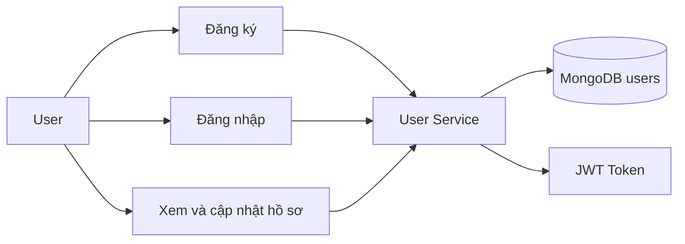

### 1.3. Use Case Thị Trường

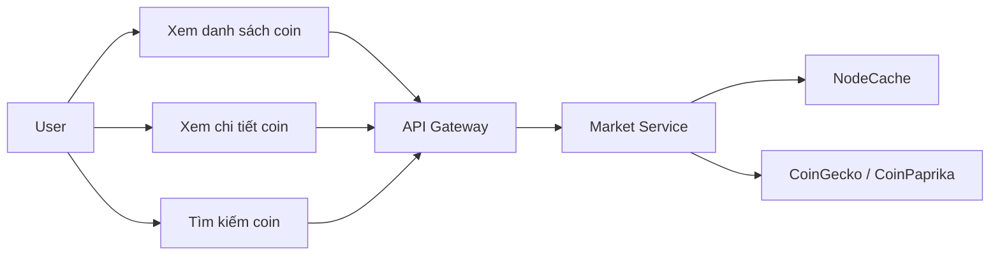

### 1.4. Use Case Giao Dịch

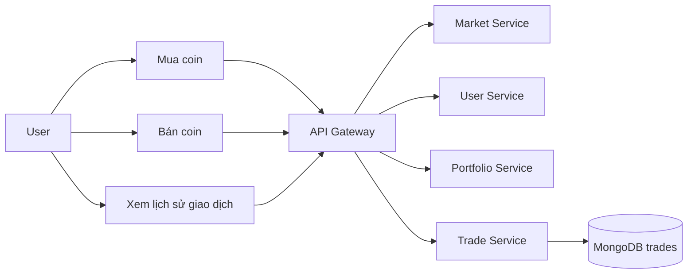

### 1.5. Use Case Portfolio

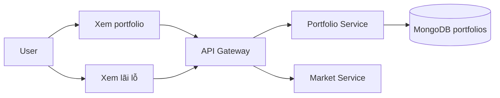

### 1.6. Use Case Thông Báo

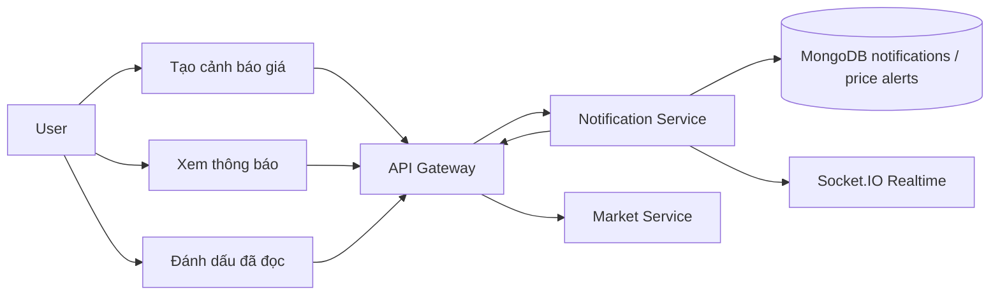

### 1.7. Use Case Tin Tức

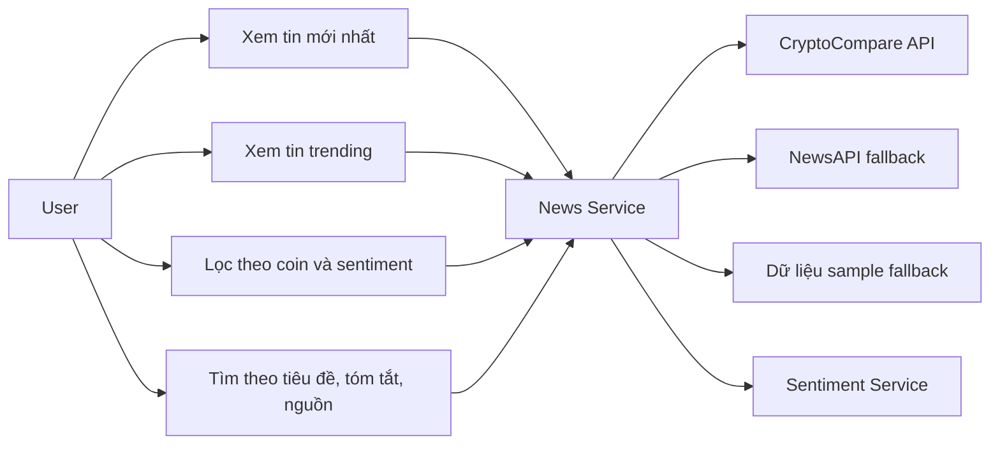

### 1.8. Use Case Sentiment Và Gợi Ý AI

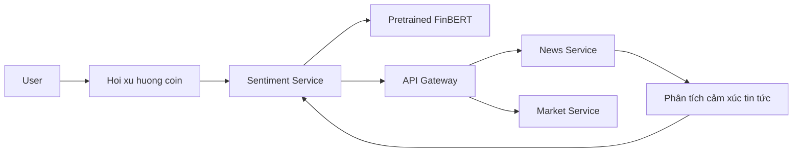

### 1.9. Use Case Academy

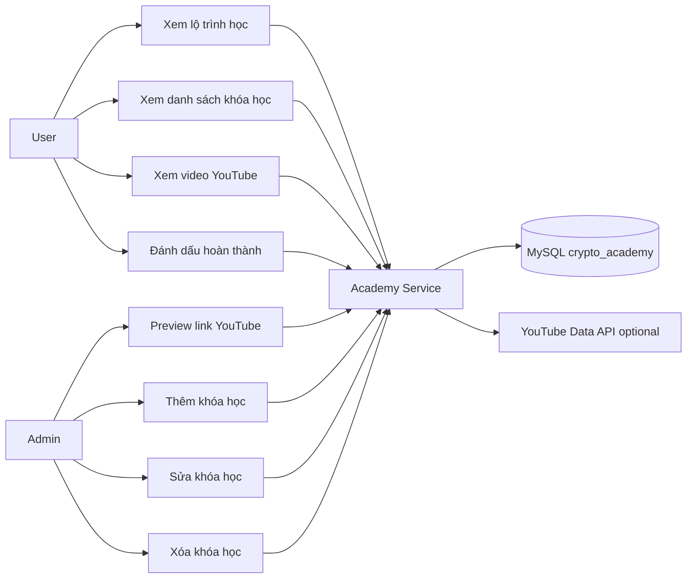

## 2. Sơ Đồ Hoạt Động

### 2.1. Đăng Ký Và Đăng Nhập

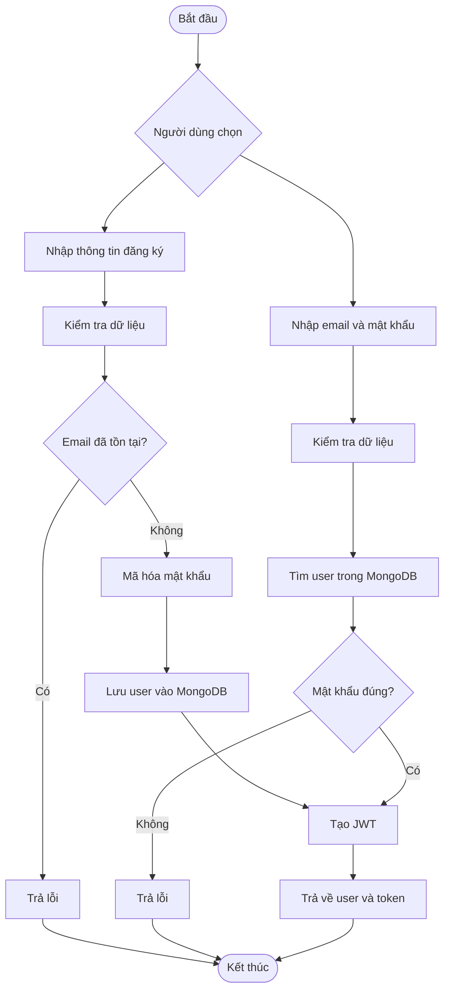

### 2.2. Mua Coin

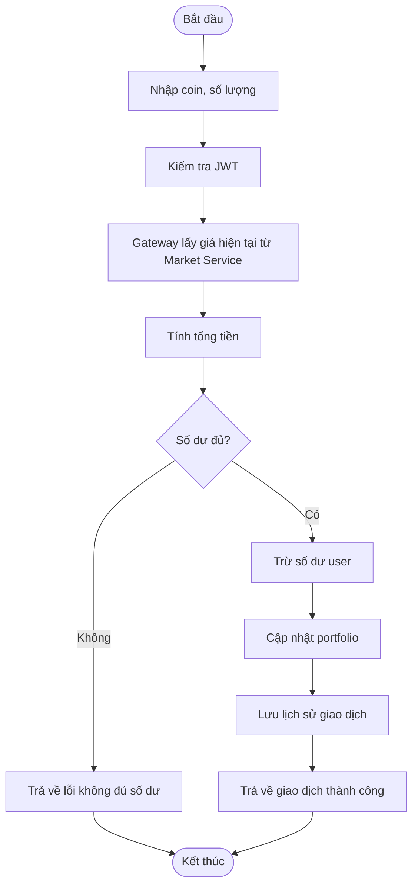

### 2.3. Bán Coin

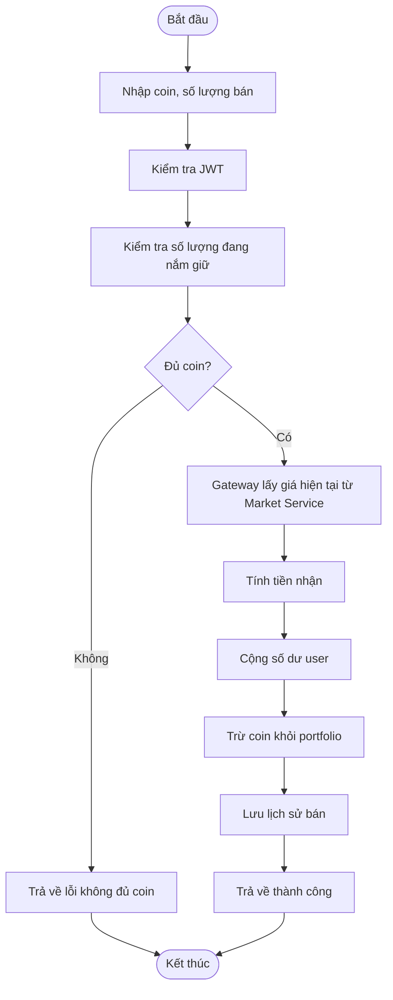

### 2.4. Xem Portfolio

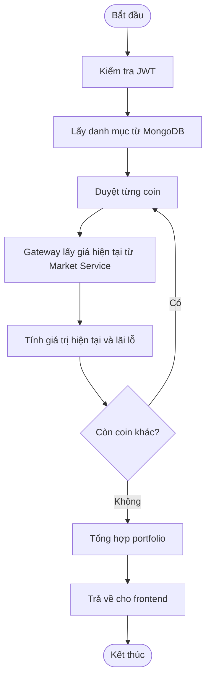

### 2.5. Cảnh Báo Giá

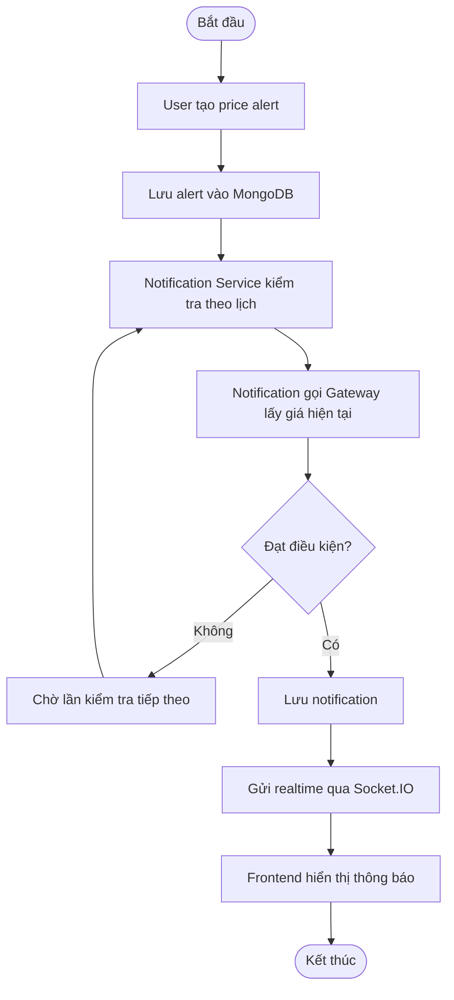

### 2.6. Tải Và Lọc Tin Tức

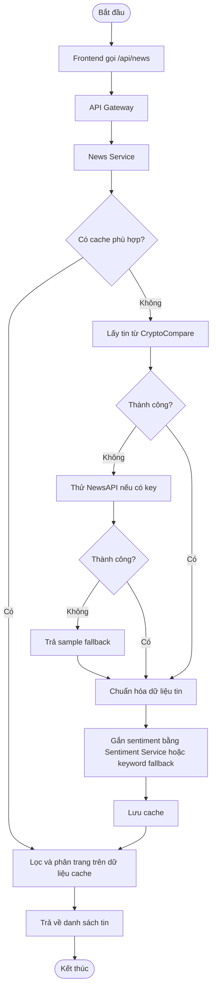

### 2.7. Gợi Ý Xu Hướng Coin

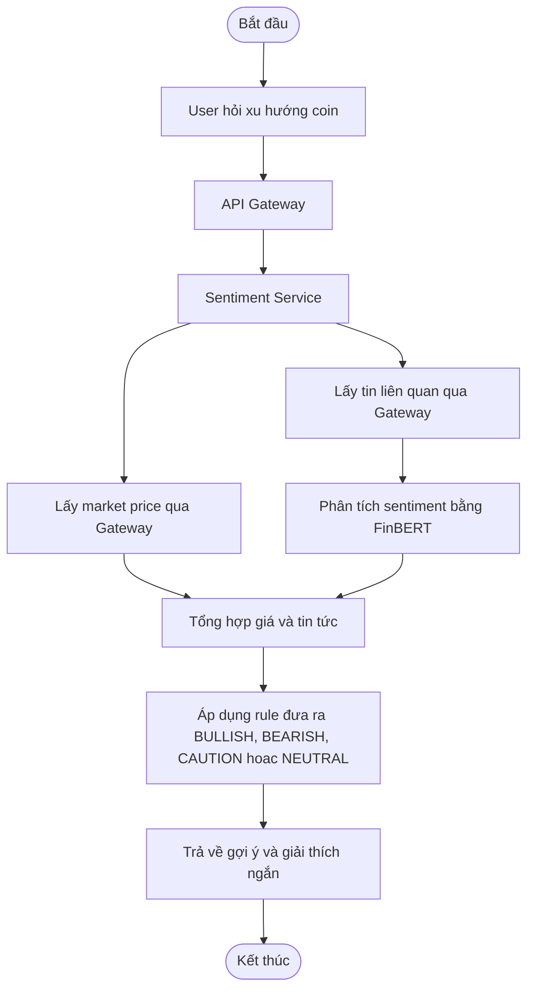

### 2.8. Học Academy Và Cập Nhật Tiến Độ

```mermaid
flowchart TD
    Start([Bắt đầu]) --> Load[Frontend gọi /api/academy/courses]
    Load --> AcademyService[Academy Service]
    AcademyService --> MySQL[(MySQL courses)]
    MySQL --> Group[Trả về khóa học theo learning path]
    Group --> Show[Frontend hiển thị lộ trình học]
    Show --> Watch[User mở video YouTube]
    Watch --> Complete{User bấm hoàn thành?}
    Complete -->|Không| End([Kết thúc])
    Complete -->|Có| UpdateProgress[PUT /api/academy/progress/{videoId}]
    UpdateProgress --> ProgressTable[(MySQL course_progress)]
    ProgressTable --> Refresh[Cập nhật tỷ lệ hoàn thành]
    Refresh --> End
```

### 2.9. Admin Quản Lý Khóa Học

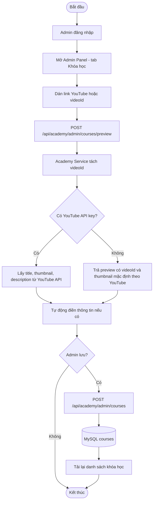

## 3. Sơ Đồ Kiến Trúc SOA

### 3.1. Kiến Trúc Tổng Thể Đồ Án 2

```mermaid
flowchart TB
    Client[React Frontend - Vite :5173]
    Gateway[API Gateway - Express :3000]
    Consul[Consul Service Discovery]

    Client --> Gateway
    Gateway --> Consul

    subgraph CoreServices[Core Services - Đồ án 1]
        UserService[User Service :3001]
        MarketService[Market Service :3002]
        PortfolioService[Portfolio Service :3003]
        TradeService[Trade Service :3004]
        NotificationService[Notification Service :3005]
    end

    subgraph NewServices[New Services - Đồ án 2]
        NewsService[News Service :3006]
        AcademyService[Academy Service :3007]
        SentimentService[Sentiment Service :3008]
    end

    Gateway --> UserService
    Gateway --> MarketService
    Gateway --> TradeService
    Gateway --> PortfolioService
    Gateway --> NotificationService
    Gateway --> NewsService
    Gateway --> AcademyService
    Gateway --> SentimentService

    UserService --> UserDB[(MongoDB users)]
    MarketService --> MarketCache[(NodeCache)]
    TradeService --> TradeDB[(MongoDB trades)]
    PortfolioService --> PortfolioDB[(MongoDB portfolios)]
    NotificationService --> NotificationDB[(MongoDB notifications)]
    NewsService --> NewsCache[(Guava Cache)]
    AcademyService --> AcademyDB[(MySQL crypto_academy)]
    SentimentService --> FinBERT[Pretrained FinBERT]

    MarketService --> CoinGecko[CoinGecko API]
    MarketService --> CoinPaprika[CoinPaprika API]
    NewsService --> CryptoCompare[CryptoCompare API]
    NewsService --> NewsAPI[NewsAPI fallback]
    AcademyService --> YouTubeAPI[YouTube Data API optional]
```

### 3.2. Routing Qua API Gateway

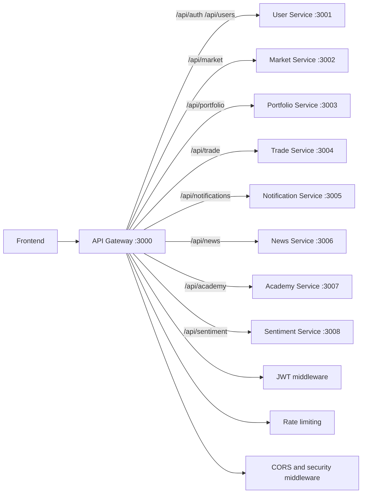

### 3.3. Luồng Kết Hợp News - Sentiment - Academy

```mermaid
flowchart TB
    Frontend[Frontend]
    Gateway[API Gateway]
    News[News Service]
    Sentiment[Sentiment Service]
    Academy[Academy Service]
    Market[Market Service]

    Frontend -->|Xem tin tuc| Gateway
    Gateway -->|/api/news| News
    News -->|POST /sentiment/analyze| Sentiment
    News -->|Tin tức ngoài| CryptoCompare[CryptoCompare / NewsAPI / Sample]

    Frontend -->|Hoi goi y coin| Gateway
    Gateway -->|/api/sentiment/suggestion| Sentiment
    Sentiment -->|Lấy gia| Gateway
    Sentiment -->|Lấy tin| Gateway
    Gateway --> Market
    Gateway --> News

    Frontend -->|Học crypto| Gateway
    Gateway -->|/api/academy| Academy
    Academy --> MySQL[(MySQL courses / progress)]
    Academy --> YouTube[YouTube embed / optional metadata]
```

## 4. Sơ Đồ Sequence

### 4.1. Đăng Nhập

```mermaid
sequenceDiagram
    participant U as User
    participant FE as React Frontend
    participant GW as API Gateway
    participant US as User Service
    participant DB as MongoDB

    U->>FE: Nhập email và mật khẩu
    FE->>GW: POST /api/auth/login
    GW->>US: Forward request
    US->>DB: Tìm user theo email
    DB-->>US: User document
    US->>US: Kiểm tra password và tạo JWT
    US-->>GW: User + token
    GW-->>FE: Response
    FE-->>U: Đăng nhập thanh cong
```

### 4.2. Mua Coin

```mermaid
sequenceDiagram
    participant U as User
    participant FE as React Frontend
    participant GW as API Gateway
    participant MS as Market Service
    participant US as User Service
    participant PS as Portfolio Service
    participant TS as Trade Service
    participant DB as MongoDB

    U->>FE: Đặt lệnh mua coin
    FE->>GW: POST /api/trade/buy
    GW->>MS: Lấy giá coin hiện tại
    MS-->>GW: Giá hiện tại
    GW->>US: Kiểm tra và trừ số dư
    US-->>GW: Số dư đã cập nhật
    GW->>PS: Cập nhật portfolio
    PS-->>GW: Portfolio đã cập nhật
    GW->>TS: Lưu trade BUY
    TS->>DB: Lưu trade document
    DB-->>TS: Saved
    TS-->>GW: Trade result
    GW-->>FE: Response
    FE-->>U: Hiển thị thành công
```

### 4.3. Bán Coin

```mermaid
sequenceDiagram
    participant U as User
    participant FE as React Frontend
    participant GW as API Gateway
    participant PS as Portfolio Service
    participant MS as Market Service
    participant US as User Service
    participant TS as Trade Service
    participant DB as MongoDB

    U->>FE: Đặt lệnh bán coin
    FE->>GW: POST /api/trade/sell
    GW->>PS: Kiểm tra số lượng coin
    PS-->>GW: Holding data
    GW->>MS: Lấy giá coin hiện tại
    MS-->>GW: Giá hiện tại
    GW->>US: Cộng số dư user
    US-->>GW: Số dư đã cập nhật
    GW->>PS: Trừ coin trong portfolio
    PS-->>GW: Portfolio đã cập nhật
    GW->>TS: Lưu trade SELL
    TS->>DB: Lưu trade document
    DB-->>TS: Saved
    TS-->>GW: Trade result
    GW-->>FE: Response
    FE-->>U: Hiển thị thành công
```

### 4.4. Xem Portfolio

```mermaid
sequenceDiagram
    participant U as User
    participant FE as React Frontend
    participant GW as API Gateway
    participant PS as Portfolio Service
    participant MS as Market Service
    participant DB as MongoDB

    U->>FE: Mở trang Portfolio
    FE->>GW: GET /api/portfolio
    GW->>PS: Lấy portfolio theo userId
    PS->>DB: Lấy holdings của user
    DB-->>PS: Portfolio documents
    PS-->>GW: Holdings
    GW->>MS: Lấy giá hiện tại của các coin
    MS-->>GW: Market prices
    GW->>GW: Enrich giá trị hiện tại và lãi lỗ
    GW-->>FE: Response
    FE-->>U: Hiển thị danh mục
```

### 4.5. Cảnh Báo Giá Realtime

```mermaid
sequenceDiagram
    participant U as User
    participant FE as React Frontend
    participant GW as API Gateway
    participant NS as Notification Service
    participant MS as Market Service
    participant DB as MongoDB
    participant WS as Socket.IO

    U->>FE: Tao price alert
    FE->>GW: POST /api/notifications/alert
    GW->>NS: Forward request
    NS->>DB: Lưu alert
    DB-->>NS: Saved
    NS-->>GW: Alert created
    GW-->>FE: Response

    loop Kiểm tra định kỳ
        NS->>GW: GET /api/market/price/{coinId} + internal key
        GW->>MS: Forward request
        MS-->>GW: Giá hiện tại
        GW-->>NS: Giá hiện tại
        NS->>NS: So sánh với điều kiện alert
    end

    NS->>DB: Lưu notification khi dat dieu kien
    NS->>WS: Emit notification tới user
    WS-->>FE: Realtime notification
    FE-->>U: Hiển thị thong bao
```

### 4.6. Tải Tin Tức Và Gắn Sentiment

```mermaid
sequenceDiagram
    participant U as User
    participant FE as React Frontend
    participant GW as API Gateway
    participant NEWS as News Service
    participant EXT as CryptoCompare / NewsAPI
    participant AI as Sentiment Service
    participant CACHE as Guava Cache

    U->>FE: Mở trang Tin tức
    FE->>GW: GET /api/news?page=1&limit=10
    GW->>NEWS: GET /news?page=1&limit=10
    NEWS->>CACHE: Kiểm tra cache

    alt Cache hit
        CACHE-->>NEWS: Cached articles
    else Cache miss
        NEWS->>EXT: Lấy tin crypto
        EXT-->>NEWS: Raw articles
        NEWS->>NEWS: Chuẩn hóa title, summary, source, coins
        loop Mỗi bài viết
            NEWS->>AI: POST /sentiment/analyze
            AI-->>NEWS: POSITIVE / NEGATIVE / NEUTRAL
        end
        NEWS->>CACHE: Lưu tin da xu ly
    end

    NEWS->>NEWS: Lọc theo coin, sentiment, search và phân trang
    NEWS-->>GW: News response
    GW-->>FE: Response
    FE-->>U: Hiển thị danh sách tin
```

### 4.7. Hỏi Gợi Ý Xu Hướng Coin

```mermaid
sequenceDiagram
    participant U as User
    participant FE as React Frontend
    participant GW as API Gateway
    participant AI as Sentiment Service
    participant MS as Market Service
    participant NEWS as News Service
    participant MODEL as FinBERT

    U->>FE: Hoi xu huong BTC
    FE->>GW: GET /api/sentiment/suggestion?symbol=BTC
    GW->>AI: Forward request
    AI->>GW: GET /api/market/price/bitcoin
    GW->>MS: Forward market request
    MS-->>GW: Price data
    GW-->>AI: Price data
    AI->>GW: GET /api/news/coins/BTC?limit=5&page=1
    GW->>NEWS: Forward news request
    NEWS-->>GW: Related news
    GW-->>AI: Related news
    AI->>MODEL: Phân tích sentiment tiêu đề và tóm tắt
    MODEL-->>AI: Sentiment scores
    AI->>AI: Tổng hợp thành gợi ý
    AI-->>GW: Suggestion response
    GW-->>FE: Response
    FE-->>U: Hiển thị BULLISH / BEARISH / CAUTION / NEUTRAL
```

### 4.8. Học Academy

```mermaid
sequenceDiagram
    participant U as User
    participant FE as React Frontend
    participant GW as API Gateway
    participant AC as Academy Service
    participant DB as MySQL
    participant YT as YouTube Embed

    U->>FE: Mở trang Academy
    FE->>GW: GET /api/academy/courses
    GW->>AC: GET /academy/courses with optional X-User-Id
    AC->>DB: Lấy courses và progress nếu có userId
    DB-->>AC: Course list + progress
    AC-->>GW: Courses grouped by learning path
    GW-->>FE: Response
    FE-->>U: Hiển thị lộ trình học

    U->>FE: Bấm xem video
    FE->>YT: Mở YouTube embed bằng videoId
    YT-->>FE: Video player
```

### 4.9. Cập Nhật Tiến Độ Academy

```mermaid
sequenceDiagram
    participant U as User
    participant FE as React Frontend
    participant GW as API Gateway
    participant AC as Academy Service
    participant DB as MySQL

    U->>FE: Bấm Hoàn thành bài học
    FE->>GW: PUT /api/academy/progress/{videoId}
    GW->>AC: PUT /academy/progress/{videoId} with X-User-Id
    AC->>DB: Upsert course_progress theo user_id và video_id
    DB-->>AC: Progress saved
    AC->>DB: Tính lại tổng số bài đã hoàn thành
    DB-->>AC: Progress summary
    AC-->>GW: Updated progress
    GW-->>FE: Response
    FE-->>U: Cập nhật phần trăm hoàn thành
```

### 4.10. Admin Thêm Khóa Học

```mermaid
sequenceDiagram
    participant A as Admin
    participant FE as React Frontend
    participant GW as API Gateway
    participant AC as Academy Service
    participant YT as YouTube Data API optional
    participant DB as MySQL

    A->>FE: Dán link YouTube vào form
    FE->>GW: POST /api/academy/admin/courses/preview
    GW->>GW: Kiểm tra JWT và role admin
    GW->>AC: POST /academy/admin/courses/preview
    AC->>AC: Tách videoId từ URL

    alt Có YOUTUBE_API_KEY
        AC->>YT: Lấy metadata video
        YT-->>AC: Title, description, thumbnail
    else Không có key
        AC->>AC: Tạo preview có videoId và thumbnail mặc định
    end

    AC-->>GW: Preview response
    GW-->>FE: Response
    FE-->>A: Điền thông tin vào form
    A->>FE: Bấm Thêm khóa học
    FE->>GW: POST /api/academy/admin/courses
    GW->>AC: Forward request
    AC->>DB: Lưu course vào bảng courses
    DB-->>AC: Saved course
    AC-->>GW: Course response
    GW-->>FE: Response
    FE-->>A: Tải lại danh sách khóa học
```

## 5. Sơ Đồ Cơ Sở Dữ Liệu

### 5.1. Tổng Quan Cơ Sở Dữ Liệu Phân Tán

```mermaid
flowchart TB
    subgraph MongoDB[MongoDB - Các service Đồ án 1]
        Users[(users)]
        Trades[(trades)]
        Portfolios[(portfolios)]
        Notifications[(notifications)]
        PriceAlerts[(price_alerts)]
    end

    subgraph MySQL[MySQL - Academy Service]
        Courses[(courses)]
        CourseProgress[(course_progress)]
    end

    UserService[User Service] --> Users
    TradeService[Trade Service] --> Trades
    PortfolioService[Portfolio Service] --> Portfolios
    NotificationService[Notification Service] --> Notifications
    NotificationService --> PriceAlerts
    AcademyService[Academy Service] --> Courses
    AcademyService --> CourseProgress

    Gateway[API Gateway] --> TradeService
    Gateway --> UserService
    Gateway --> PortfolioService
    Gateway --> MarketService[Market Service]
    NotificationService --> Gateway
    NewsService[News Service] --> NewsCache[(Guava Cache trong bộ nhớ)]
    SentimentService[Sentiment Service] --> Model[(Mô hình FinBERT đã huấn luyện sẵn)]
```

### 5.2. ERD MongoDB Chính

```mermaid
erDiagram
    USER {
        string _id
        string username
        string email
        string password
        string role
        number balance
        date createdAt
        date updatedAt
    }

    TRADE {
        string _id
        string userId
        string coinId
        string coinSymbol
        string type
        number quantity
        number price
        number total
        date createdAt
    }

    PORTFOLIO {
        string _id
        string userId
        string coinId
        string coinSymbol
        number quantity
        number averageBuyPrice
        date createdAt
        date updatedAt
    }

    NOTIFICATION {
        string _id
        string userId
        string type
        string title
        string message
        boolean read
        date createdAt
    }

    PRICE_ALERT {
        string _id
        string userId
        string coinId
        number targetPrice
        string condition
        boolean isActive
        date createdAt
    }

    USER ||--o{ TRADE : creates
    USER ||--o{ PORTFOLIO : owns
    USER ||--o{ NOTIFICATION : receives
    USER ||--o{ PRICE_ALERT : creates
```

### 5.3. ERD MySQL Academy

```mermaid
erDiagram
    COURSES {
        bigint id PK
        varchar video_id UK
        varchar title
        text description
        varchar category
        enum difficulty
        int sort_order
        varchar learning_path
        datetime created_at
        datetime updated_at
    }

    COURSE_PROGRESS {
        bigint id PK
        varchar user_id
        varchar video_id
        bit completed
        datetime completed_at
        datetime updated_at
    }

    COURSES ||..o{ COURSE_PROGRESS : "logical link by video_id"
```

Ghi chú cho sơ đồ Academy: trong code hiện tại `courses.video_id` và `course_progress.video_id` có quan hệ logic để tính tiến độ học. Database không khai báo khóa ngoại vật lý và entity JPA không dùng `@ManyToOne`.

### 5.4. Bảng Courses

```mermaid
classDiagram
    class Course {
        +Long id
        +String videoId
        +String title
        +String description
        +String category
        +Difficulty difficulty
        +Integer sortOrder
        +String learningPath
        +LọcalDateTime createdAt
        +LọcalDateTime updatedAt
    }

    class Difficulty {
        <<enumeration>>
        BEGINNER
        INTERMEDIATE
        ADVANCED
    }

    Course --> Difficulty
```

### 5.5. Bảng Course Progress

```mermaid
classDiagram
    class CourseProgress {
        +Long id
        +String userId
        +String videoId
        +Boolean completed
        +LọcalDateTime completedAt
        +LọcalDateTime updatedAt
    }

    note for CourseProgress "Unique constraint: user_id + video_id"
```

## 6. Sơ Đồ Pattern Và Xử Lý Kỹ Thuật

### 6.1. Rate Limiting Tại API Gateway

```mermaid
flowchart TD
    Request[Client Request] --> Gateway[API Gateway]
    Gateway --> RateLimiter{Vượt giới hạn request?}
    RateLimiter -->|Có| Reject[Trả về 429 Too Many Requests]
    RateLimiter -->|Không| Auth{Cần xác thực?}
    Auth -->|Có| JWT[Kiểm tra JWT]
    Auth -->|Không| Proxy[Proxy đến service]
    JWT --> Valid{Token hợp lệ?}
    Valid -->|Không| Unauthorized[Trả về 401]
    Valid -->|Có| Proxy
    Proxy --> Service[Backend Service]
```

### 6.2. Circuit Breaker Và Fallback Khi Gọi API Ngoài

```mermaid
flowchart TD
    Service[Backend Service] --> ExternalCall[Gọi API ngoài]
    ExternalCall --> Success{Thành công?}
    Success -->|Có| Cache[Lưu cache và trả dữ liệu]
    Success -->|Không| Retry{Còn retry?}
    Retry -->|Có| ExternalCall
    Retry -->|Không| Circuit{Circuit open?}
    Circuit -->|Có| Fallback[Trả fallback data]
    Circuit -->|Không| MarkFailure[Ghi nhận lỗi]
    MarkFailure --> Fallback
```

### 6.3. Fallback Data Cho Market Và News

```mermaid
flowchart LR
    subgraph MarketFallback[Market Service]
        MarketReq[Request market data] --> CoinGecko[CoinGecko]
        CoinGecko --> MarketOk{OK?}
        MarketOk -->|Có| MarketResponse[Trả dữ liệu]
        MarketOk -->|Không| CoinPaprika[CoinPaprika fallback]
        CoinPaprika --> MarketResponse
    end

    subgraph NewsFallback[News Service]
        NewsReq[Request news] --> CryptoCompare[CryptoCompare]
        CryptoCompare --> NewsOk{OK?}
        NewsOk -->|Có| NewsResponse[Trả tin tức]
        NewsOk -->|Không| NewsAPI[NewsAPI nếu có key]
        NewsAPI --> NewsApiOk{OK?}
        NewsApiOk -->|Có| NewsResponse
        NewsApiOk -->|Không| SampleNews[Dữ liệu sample fallback]
        SampleNews --> NewsResponse
    end
```

### 6.4. Cache Và Scheduling

```mermaid
flowchart TB
    subgraph MarketCache[Market Service]
        MarketRequest[Market request] --> NodeCache{NodeCache hit?}
        NodeCache -->|Có| MarketCached[Trả market data từ cache]
        NodeCache -->|Không| MarketExternal[Gọi API ngoài]
        MarketExternal --> NodeCache
    end

    subgraph NewsCache[News Service]
        NewsRequest[News request] --> GuavaCache{Guava Cache hit?}
        GuavaCache -->|Có| NewsCached[Trả news từ cache]
        GuavaCache -->|Không| NewsExternal[Gọi API tin tức ngoài]
        NewsExternal --> SentimentAnalyze[Phân tích sentiment]
        SentimentAnalyze --> GuavaCache
        Scheduler[@Scheduled refresh] --> NewsExternal
    end

    subgraph NotificationCron[Notification Service]
        Cron[Cron job] --> CheckAlerts[Kiểm tra price alert đang bật]
        CheckAlerts --> Emit[Emit Socket.IO notification]
    end
```

### 6.5. WebSocket Realtime Notification

```mermaid
sequenceDiagram
    participant FE as React Frontend
    participant GW as API Gateway
    participant NS as Notification Service
    participant WS as Socket.IO

    FE->>WS: Kết nối bằng user token
    WS-->>FE: Connected
    NS->>NS: Price alert được kích hoạt
    NS->>WS: Emit notification tới user room
    WS-->>FE: notification event
    FE->>GW: GET /api/notifications
    GW->>NS: Forward request
    NS-->>GW: Notification list
    GW-->>FE: Response
```

### 6.6. Kiến Trúc Frontend React

```mermaid
flowchart TB
    App[React App]
    Router[React Router]
    Lấyout[Dashboard Lấyout]
    AuthContext[Auth Context]
    ApiClient[Axios API Client]

    App --> Router
    App --> AuthContext
    Router --> Lấyout
    Lấyout --> Pages[Pages]
    Pages --> ApiClient
    ApiClient --> Gateway[API Gateway :3000]

    subgraph FrontendPages[Frontend Pages]
        Login[Login / Register]
        Dashboard[Dashboard]
        Trade[Trade]
        CoinDetail[Coin Detail]
        Portfolio[Portfolio]
        History[History]
        Notifications[Notifications]
        NewsPage[News]
        AcademyPage[Academy]
        Suggestion[AI Suggestion]
        Settings[Settings]
        Admin[Admin Panel]
    end
```

### 6.7. State Management Và API Flow

```mermaid
flowchart LR
    Component[React Component] --> LọcalState[Lọcal state / hooks]
    Component --> AuthContext[Auth Context]
    Component --> ServiceLấyer[Frontend service functions]
    ServiceLấyer --> Axios[Axios client]
    Axios --> Interceptor[Gắn JWT token]
    Interceptor --> Gateway[API Gateway]
    Gateway --> Backend[Backend service]
    Backend --> Response[JSON response]
    Response --> Component
    Component --> UI[Render UI]
```

## 7. Sơ Đồ Endpoint Đồ Án 2

### 7.1. News Service Endpoints

```mermaid
flowchart TB
    Gateway[/api/news] --> NewsService[News Service /news]
    NewsService --> E1[GET /news]
    NewsService --> E2[GET /news/trending]
    NewsService --> E3[GET /news/coins/{coin}]
    NewsService --> E4[GET /news/{id}]
    NewsService --> E5[GET /news/health]

    E1 --> Params[Query: page, limit, coin, sentiment, search]
    E2 --> Trending[Sort by trending score]
    E3 --> CoinFilter[Filter by coin symbol]
    E4 --> Detail[Find article by id]
    E5 --> Health[Health check]
```

### 7.2. Sentiment Service Endpoints

```mermaid
flowchart TB
    Gateway[/api/sentiment] --> SentimentService[Sentiment Service /sentiment]
    SentimentService --> E1[GET /sentiment/health]
    SentimentService --> E2[POST /sentiment/analyze]
    SentimentService --> E3[POST /sentiment/analyze-batch]
    SentimentService --> E4[GET /sentiment/suggestion]

    E2 --> Single[Analyze one text]
    E3 --> Batch[Analyze list of texts]
    E4 --> Suggestion[Combine market data and related news]
```

### 7.3. Academy Service Endpoints

```mermaid
flowchart TB
    Gateway[/api/academy] --> AcademyService[Academy Service /academy]
    AcademyService --> E1[GET /academy/health]
    AcademyService --> E2[GET /academy/courses]
    AcademyService --> E3[GET /academy/courses/{videoId}]
    AcademyService --> E4[GET /academy/paths]
    AcademyService --> E5[PUT /academy/progress/{videoId}]
    AcademyService --> E6[POST /academy/admin/courses/preview]
    AcademyService --> E7[POST /academy/admin/courses]
    AcademyService --> E8[PUT /academy/admin/courses/{id}]
    AcademyService --> E9[DELETE /academy/admin/courses/{id}]

    E2 --> Courses[Return course list with optional progress]
    E5 --> Progress[Upsert user progress]
    E6 --> Preview[Extract videoId and optional YouTube metadata]
    E7 --> Create[Create course]
    E8 --> Update[Update course]
    E9 --> Delete[Delete course]
```


